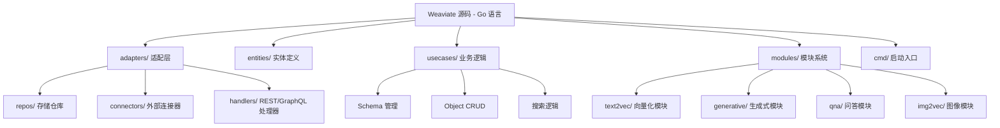
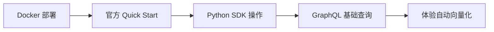
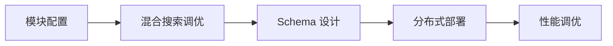

# Weaviate 学习资源

## 学习目标

- 获取 Weaviate 的优质学习资源
- 掌握源码研读路径
- 建立从入门到深入的学习路径

## 官方资源

### 官方文档与社区

- **文档**：[https://weaviate.io/developers/weaviate](https://weaviate.io/developers/weaviate)
- **GitHub**：[https://github.com/weaviate/weaviate](https://github.com/weaviate/weaviate)
- **技术博客**：[https://weaviate.io/blog](https://weaviate.io/blog)
- **Slack 社区**：[https://weaviate.io/slack](https://weaviate.io/slack)
- **论坛**：[https://forum.weaviate.io](https://forum.weaviate.io)

### 权威参考

| 资源 | 说明 | 链接 |
|------|------|------|
| Quick Start | 5 分钟快速上手 | [链接](https://weaviate.io/developers/weaviate/quickstart) |
| REST API 参考 | 全部 API 定义 | [链接](https://weaviate.io/developers/weaviate/api/rest) |
| GraphQL 参考 | GraphQL 查询语法 | [链接](https://weaviate.io/developers/weaviate/api/graphql) |
| 模块参考 | 所有模块配置 | [链接](https://weaviate.io/developers/weaviate/modules) |
| 架构文档 | 系统设计文档 | [链接](https://weaviate.io/developers/weaviate/more-resources/architecture) |

## GraphQL 学习资源

### 推荐学习路径

1. **GraphQL 基础**：官方教程 [graphql.org/learn](https://graphql.org/learn/)
2. **Weaviate GraphQL 语法**：官方 GraphQL 参考文档
3. **实践练习**：使用 Weaviate 的 GraphQL playground 交互式学习

### GraphQL Playground

```bash
# 启动 Weaviate 后，浏览器访问
# http://localhost:8080/v1/graphql
```

```graphql
# 在 playground 中探索 Schema
{
  __schema {
    queryType {
      fields {
        name
        description
        args {
          name
          type {
            name
            kind
          }
        }
      }
    }
  }
}
```

## 源码研读路径

### 核心模块结构



### 推荐研读顺序

| 步骤 | 模块 | 文件/目录 | 学习重点 |
|------|------|-----------|---------|
| 1 | 启动入口 | `cmd/weaviate-server/main.go` | 依赖注入、模块注册 |
| 2 | GraphQL 处理器 | `adapters/handlers/graphql/` | GraphQL Schema 生成 |
| 3 | Object 管理 | `usecases/objects/` | CRUD 核心逻辑 |
| 4 | 搜索逻辑 | `usecases/traverser/` | 搜索路由和混合搜索 |
| 5 | 模块系统 | `modules/` | 插件化架构 |
| 6 | 存储引擎 | `adapters/repos/db/` | LSM Tree + HNSW |

### 关键源码文件

| 文件路径 | 说明 | 阅读难度 |
|---------|------|---------|
| `adapters/handlers/graphql/` | GraphQL Schema 和 Resolver 生成 | 中 |
| `usecases/objects/add.go` | 对象创建，含自动向量化调用 | 低 |
| `usecases/traverser/` | 搜索路由和混合搜索实现 | 高 |
| `modules/text2vec/` | 向量化模块接口和实现 | 中 |
| `adapters/repos/db/` | 存储引擎核心（LSM + HNSW） | 高 |
| `adapters/repos/db/shard.go` | 分片管理 | 中 |

## 学习路径

### 阶段一：入门（1-2 天）



- 目标：能独立部署 Weaviate 并完成基本 CRUD
- 资源：官方 Quick Start + Python 客户端文档

### 阶段二：进阶（3-5 天）



- 目标：掌握模块配置和混合搜索的调优方法
- 资源：官方模块参考 + 架构文档

### 阶段三：深入（1-2 周）

- 目标：理解 Weaviate 的核心架构设计
- 资源：源码阅读（重点在 `usecases/` 和 `adapters/repos/db/`）
- 实践：尝试自定义模块

### 阶段四：项目启发

- 目标：将 Weaviate 的设计理念应用到项目中
- 重点：模块化架构、混合搜索、自动向量化

## 项目启发

### 1. 模块化设计

Weaviate 的模块化架构对项目 `storage_engine_t` 接口设计有重要参考价值：

```c
// 项目现有: 多模态引擎接口
// 借鉴 Weaviate: 模块化+配置化
typedef struct EngineConfig {
    engine_type_t type;       // 引擎类型
    char *module_name;        // 模块名称（如 "text2vec-openai"）
    void *module_config;      // 模块配置
    bool auto_vectorize;      // 是否自动向量化
} EngineConfig;
```

### 2. 混合搜索

Weaviate 的 BM25 + 向量融合算法可直接用于项目中的搜索模块：
- BM25 实现可作为项目中全文搜索的参考
- alpha 参数设计可移植到项目的双通道搜索

### 3. GraphQL API

Weaviate 的 GraphQL 层设计对项目中的 SQL 执行器扩展有启发：
- 通过 Schema 自动生成查询接口
- 支持嵌套查询和关联查询

## 要点总结

- 官方文档和 Quick Start 是最好的入门资源
- 源码核心在 `usecases/`（业务逻辑）和 `adapters/repos/db/`（存储引擎）
- 模块化架构和混合搜索是最值得项目借鉴的设计
- GraphQL 学习资源对理解 Weaviate 的查询能力至关重要