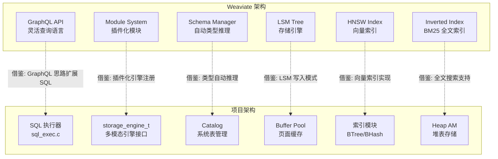
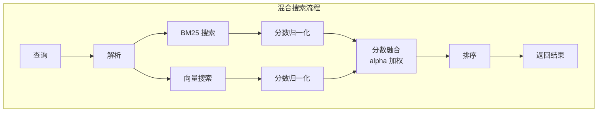

# Weaviate 与项目关联

## 学习目标

- 分析 Weaviate 设计对项目存储引擎的启发性
- 找出项目中可借鉴的关键技术点
- 建立从理论到实践的映射关系

## 架构对比



## Weaviate 模块化设计与项目 storage_engine_t 接口的对比

### Weaviate 模块架构

```go
// Weaviate 的模块接口（Go 语言）
type Module interface {
    Name() string
    Init(params moduletools.InitParams) error
    Type() ModuleType
    Vectorizer() Vectorizer  // 向量化接口
    MetaInfo() map[string]interface{}
}
```

### 项目 storage_engine_t 接口

```c
// 项目现有: 多模态引擎接口
typedef struct storage_engine_t {
    engine_type_t type;                           // 引擎类型
    char *name;                                   // 引擎名称
    void *(*create)(const char *path);            // 创建引擎实例
    int (*insert)(void *engine, void *key, void *value);  // 插入数据
    void *(*query)(void *engine, void *key);      // 查询数据
    int (*delete)(void *engine, void *key);       // 删除数据
    int (*close)(void *engine);                   // 关闭引擎
    void *private_data;                           // 私有数据
} storage_engine_t;
```

### 借鉴方向

| Weaviate 设计 | 项目借鉴方式 | 优先级 |
|--------------|-------------|-------|
| 模块注册表 | 引擎注册函数 `register_engine()` | ⭐⭐⭐ |
| 配置驱动 | 支持 JSON/TOML 配置文件初始化引擎 | ⭐⭐ |
| 自动向量化 | 在 `insert()` 中自动调用向量化回调 | ⭐⭐⭐ |
| 模块生命周期 | 增加引擎 `init/start/stop` 生命周期 | ⭐ |

### 代码示例：借鉴模块化设计

```c
// 借鉴 Weaviate 的模块注册表设计
typedef struct engine_registry_t {
    char name[64];                     // 引擎名称
    storage_engine_t *(*create)(void); // 创建函数
    int (*auto_vectorize)(void *data); // 自动向量化回调（可选）
} engine_registry_t;

// 全局引擎注册表
static engine_registry_t g_engines[MAX_ENGINES];
static int g_engine_count = 0;

// 注册引擎（借鉴 Weaviate 的模块注册）
int register_engine(const char *name,
                    storage_engine_t *(*create)(void),
                    int (*auto_vectorize)(void *)) {
    if (g_engine_count >= MAX_ENGINES) return -1;

    strncpy(g_engines[g_engine_count].name, name, 63);
    g_engines[g_engine_count].create = create;
    g_engines[g_engine_count].auto_vectorize = auto_vectorize;
    g_engine_count++;
    return 0;
}

// 查找引擎
storage_engine_t *create_engine_by_name(const char *name) {
    for (int i = 0; i < g_engine_count; i++) {
        if (strcmp(g_engines[i].name, name) == 0) {
            return g_engines[i].create();
        }
    }
    return NULL;
}
```

## GraphQL API 对项目 SQL 扩展的启发

### Weaviate GraphQL 查询特点

```graphql
# 嵌套查询 + 条件过滤 + 分页
{
  Get {
    Article(
      nearText: {concepts: ["AI"]}
      where: {path: ["category"], operator: Equal, valueString: "Tech"}
      limit: 10
    ) {
      title
      content
      _additional {
        certainty
      }
    }
  }
}
```

### 项目 SQL 扩展借鉴

```sql
-- 借鉴 GraphQL 的 nearText 语法
-- 扩展 SQL 支持 NEAR_TEXT 关键字
SELECT title, content, certainty()
FROM Article
WHERE NEAR_TEXT('AI') AND category = 'Tech'
ORDER BY certainty DESC
LIMIT 10;

-- 或者使用函数式语法
SELECT title, content, vector_search('AI', 10) AS results
FROM Article
WHERE category = 'Tech';
```

### 实现：扩展 SQL 解析器

```c
// 借鉴 Weaviate 的查询语法扩展 SQL
// 在 sql_parser.y 中增加语法规则

// 新增语法规则
near_text_expr:
    NEAR_TEXT '(' STRING_LITERAL ')' {
        $$ = create_near_text_expr($3);
    }
    | NEAR_TEXT '(' STRING_LITERAL ',' limit_clause ')' {
        $$ = create_near_text_expr_with_limit($3, $5);
    }
    ;

where_clause:
    WHERE expr
    | WHERE near_text_expr      // 支持向量搜索条件
    | WHERE expr AND near_text_expr  // 混合条件
    ;
```

## 混合搜索 BM25+向量在项目中的实现借鉴

### Weaviate 混合搜索算法

```python
# Weaviate 的混合搜索核心算法
def hybrid_search(bm25_score, vector_score, alpha):
    """
    alpha=0: 纯 BM25
    alpha=1: 纯向量
    0<alpha<1: 加权融合
    """
    return (1 - alpha) * bm25_score + alpha * vector_score
```

### 项目实现借鉴

```c
// 项目中实现混合搜索

// BM25 计算函数
float calculate_bm25(const char *query, const char *document,
                     int doc_length, float avg_doc_length,
                     int total_docs, int doc_freq) {
    float k1 = 1.2;
    float b = 0.75;

    float idf = logf((total_docs - doc_freq + 0.5) / (doc_freq + 0.5));
    float tf = 0;  // 计算词频

    float numerator = tf * (k1 + 1);
    float denominator = tf + k1 * (1 - b + b * (doc_length / avg_doc_length));

    return idf * (numerator / denominator);
}

// 混合搜索结构
typedef struct hybrid_search_result_t {
    long object_id;
    float bm25_score;
    float vector_score;
    float combined_score;
} hybrid_search_result_t;

// 混合搜索排序
int compare_hybrid_results(const void *a, const void *b, void *alpha_ptr) {
    hybrid_search_result_t *ra = (hybrid_search_result_t *)a;
    hybrid_search_result_t *rb = (hybrid_search_result_t *)b;
    float alpha = *(float *)alpha_ptr;

    float score_a = (1 - alpha) * ra->bm25_score + alpha * ra->vector_score;
    float score_b = (1 - alpha) * rb->bm25_score + alpha * rb->vector_score;

    if (score_a > score_b) return -1;
    if (score_a < score_b) return 1;
    return 0;
}

// 执行混合搜索
hybrid_search_result_t *execute_hybrid_search(
    const char *query_text,
    const float *query_vector,
    int vector_dim,
    float alpha,
    int limit,
    int *result_count
) {
    // 1. 执行 BM25 搜索
    bm25_result_t *bm25_results = execute_bm25_search(query_text, limit * 2);

    // 2. 执行向量搜索
    vector_result_t *vector_results = execute_vector_search(query_vector, limit * 2);

    // 3. 合并结果
    hybrid_search_result_t *results = merge_results(bm25_results, vector_results);

    // 4. 按融合分数排序
    qsort_r(results, *result_count, sizeof(hybrid_search_result_t),
            compare_hybrid_results, &alpha);

    // 5. 截取 top-k
    *result_count = limit;
    return results;
}
```

### 架构设计



## 可借鉴程度评估

| 设计点 | 借鉴程度 | 说明 |
|-------|---------|------|
| 模块化引擎架构 | ⭐⭐⭐ | 可直接用于 storage_engine_t 接口扩展 |
| 混合搜索 BM25+向量 | ⭐⭐⭐ | 项目搜索模块的核心功能 |
| GraphQL 查询能力 | ⭐⭐ | 可作为 SQL 扩展的参考，优先级较低 |
| Schema 自动推理 | ⭐⭐ | 对 Catalog 模块有启发 |
| 自动向量化 | ⭐⭐ | 需要外部模型支持，实现难度较高 |

## 要点总结

- Weaviate 的模块化架构对项目 storage_engine_t 接口的扩展有直接参考价值
- 混合搜索算法（BM25 + 向量融合）可直接用于项目搜索模块
- GraphQL 查询语法可启发项目 SQL 执行器的扩展设计
- 自动向量化功能需要外部模型支持，可作为二期规划

## 思考题

1. 项目中如果实现类似 Weaviate 的模块注册表，是否需要支持动态加载模块（运行时注册）？
2. 混合搜索中 alpha 参数是否应该存储在 Catalog 中，让每个表有不同的默认 alpha？
3. SQL 扩展中如何平衡新语法与标准 SQL 的兼容性？
4. 自动向量化功能是否应该在存储引擎层实现，还是在应用层实现？