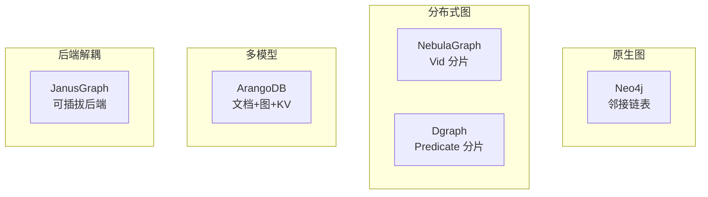

# 图数据库对比与选型

## 学习目标

- 理解五大图数据库的架构差异
- 掌握图数据库选型策略

## 架构对比

## 功能对比

| 特性 | Neo4j | Nebula | ArangoDB | Dgraph | JanusGraph |
|------|-------|--------|----------|--------|------------|
| 部署模式 | 单机/集群 | 分布式 | 集群 | 分布式 | 分布式 |
| 查询语言 | Cypher | nGQL | AQL | DQL | Gremlin |
| 事务 | ACID | 单分区 | 单集合 | 乐观 | 后端依赖 |
| 存储 | 原生 | RocksDB | MMFiles/RocksDB | Badger | 可插拔 |
| 许可证 | GPL/商业 | Apache | Apache | Apache | Apache |

## 选型建议

| 场景 | 推荐 | 原因 |
|------|------|------|
| 小规模原型 | Neo4j | 部署简单，功能完整 |
| 大规模生产 | Nebula/Dgraph | 分布式高性能 |
| 多模型需求 | ArangoDB | 文档+图统一 |
| 后端灵活性 | JanusGraph | 可选存储后端 |
| 图计算集成 | JanusGraph | Spark/Flink 支持 |

## 要点总结

- 原生图存储适合小规模高性能场景
- 分布式图适合大规模生产环境
- 多模型减少系统复杂度
- 查询语言影响开发体验