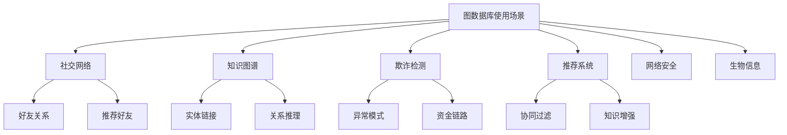

# 图数据库使用场景与实验

## 使用场景总览



## 场景 1：社交网络好友推荐

```cypher
// Neo4j 实现
// 查找朋友的朋友（可能认识的人）
MATCH (me:Person {name: 'Alice'})-[:FRIEND]->(friend)-[:FRIEND]->(fof)
WHERE NOT (me)-[:FRIEND]->(fof) AND fof <> me
RETURN fof.name, count(friend) AS mutual_friends
ORDER BY mutual_friends DESC
LIMIT 10;
```

## 场景 2：金融欺诈检测

```ngql
-- NebulaGraph 实现
-- 检测资金闭环
GO FROM "suspect_account" OVER transfer REVERSELY
YIELD dst(edge) AS src, "suspect_account" AS dst, properties(edge).amount AS amt
| GO FROM $-.dst OVER transfer
YIELD dst(edge) AS dst2, $-.src AS src2, $-.amt AS amt2
WHERE dst2 == "suspect_account"
RETURN "发现资金闭环", src2, dst2, amt2;
```

## 实验：Neo4j 部署

```bash
# Docker 部署
docker run -d --name neo4j \
  -p 7474:7474 -p 7687:7687 \
  -e NEO4J_AUTH=neo4j/password \
  neo4j:5

# 访问 http://localhost:7474
# 用户名: neo4j
# 密码: password

# Cypher Shell
docker exec neo4j cypher-shell -u neo4j -p password
```

## 实验：NebulaGraph 部署

```bash
# Docker Compose 部署集群
# 创建 docker-compose.yml
version: '3'
services:
  metad:
    image: vesoft/nebula-metad:v3.6
    ...
  storaged:
    image: vesoft/nebula-storaged:v3.6
    ...
  graphd:
    image: vesoft/nebula-graphd:v3.6
    ...

# 启动
docker-compose up -d

# 连接
docker run --rm -it --network host \
  vesoft/nebula-console:v3.6 \
  -addr localhost -port 9669
```

## 要点总结

- 图数据库擅长关联数据分析
- 好友推荐是典型应用
- 欺诈检测利用路径分析
- Docker 简化部署