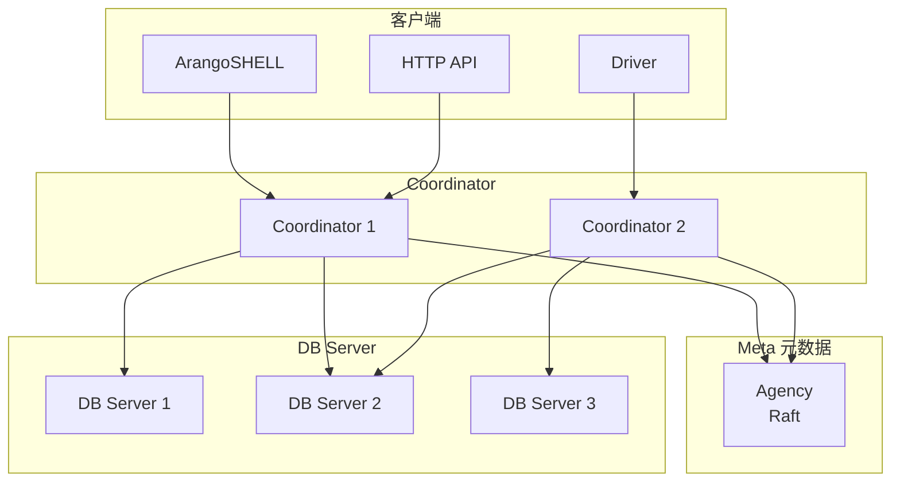
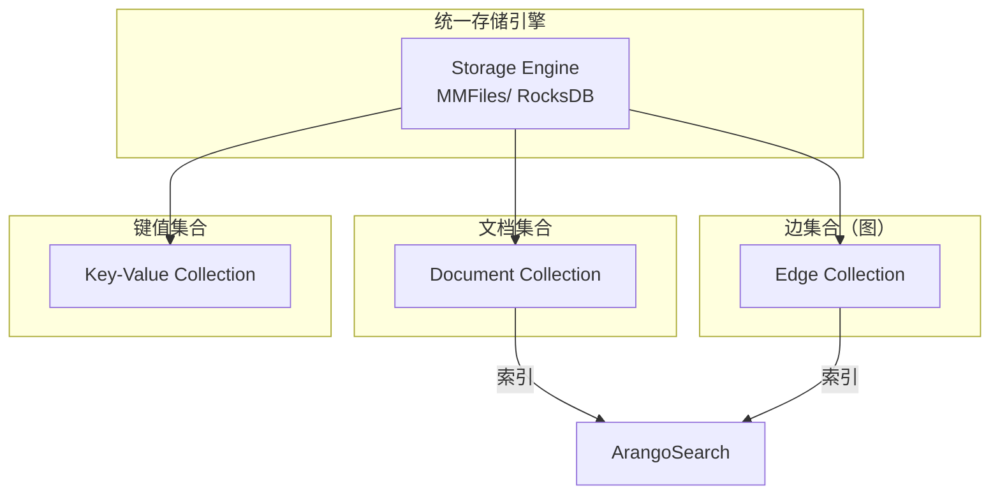

# ArangoDB 架构设计

## 学习目标

- 理解 ArangoDB 的多模型存储引擎
- 掌握 ArangoDB 的集群分片策略

## 整体架构



## 多模型存储



## 集合与分片

```aql
// 创建分片集合
// 默认 hash 分片，按 _key 分片
CREATE COLLECTION users SHARDNUM 3;

// 自定义分片键
CREATE COLLECTION orders SHARDING ATTRIBUTES (user_id);

// 创建边集合
CREATE GRAPH social {
  edgeCollections: {
    knows: {
      from: [users],
      to: [users]
    }
  }
}
```

## Agency（协调服务）

```go
// Agency 使用 Raft 实现
// 存储集群元数据

// 元数据内容
// - 集合 Schema
// - 分片分布
// - Coordinator 列表
// - DB Server 列表
// - 备份信息

// 特性
// - 强一致性
// - 小数据量（配置为主）
// - 3 节点推荐
```

## 要点总结

- Coordinator 无状态，水平扩展
- Agency 使用 Raft 存储元数据
- 集合可配置分片键
- MMFiles 和 RocksDB 两种引擎

## 思考题

1. ArangoDB 的多模型如何统一存储引擎？
2. 边集合的 from/to 约束在存储层如何实现？
3. Agency 与 DB Server 的关系是什么？