# ArangoDB 索引机制

## 学习目标

- 掌握 ArangoDB 的索引类型及其适用场景
- 理解索引的实现原理（倒排索引、B+Tree、LSM-Tree）
- 能够根据查询模式选择合适的索引策略
- 对比 ArangoDB 索引与项目 `index/` 模块的异同

## 核心概念

### 为什么图数据库需要索引？

ArangoDB 作为多模型数据库，索引在以下场景中至关重要：

```aql
// 场景 1：基于属性条件查找顶点
FOR u IN users
    FILTER u.age > 30 AND u.city == "Beijing"
    RETURN u

// 场景 2：图遍历中的边过滤
FOR v, e, p IN 1..3 OUTBOUND "users/alice" knows
    FILTER e.since > 2020
    RETURN v

// 场景 3：全文搜索
FOR doc IN articles_view
    SEARCH ANALYZER(doc.content IN TOKENS("database", "text_en"), "text_en")
    RETURN doc
```

如果没有索引，这些查询需要进行**全集合扫描**，效率极低。索引的作用是建立**属性值到文档 `_key` 的映射**，实现快速定位。

### 索引的基本原理

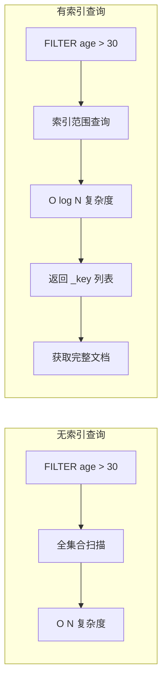

**核心思想**：索引是**属性值 → 文档句柄（`_key` 或 `_id`）** 的映射表，通过属性值快速定位文档，再进行后续操作。

## 索引类型详解

### 1. 持久化索引（Persistent Index）

持久化索引是 ArangoDB 最常用的索引类型，底层基于 RocksDB 的 LSM-Tree 实现，逻辑上是 B+Tree 结构。

```aql
// 创建单属性索引
CREATE INDEX idx_user_age ON users (age) TYPE persistent

// 创建复合索引
CREATE INDEX idx_user_city_age ON users (city, age) TYPE persistent

// 创建唯一索引
CREATE INDEX idx_user_email ON users (email) TYPE persistent OPTIONS { unique: true }

// 查询示例
FOR u IN users
    FILTER u.age == 30
    RETURN u  -- 使用 idx_user_age

FOR u IN users
    FILTER u.city == "Beijing" AND u.age > 25
    RETURN u  -- 使用 idx_user_city_age
```

**索引结构示意**：

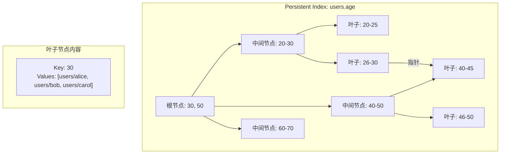

**特点**：
- 支持精确匹配、范围查询、前缀匹配
- 数据持久化到磁盘，重启不丢失
- 自动维护，数据变更时自动更新
- 复合索引遵循**最左前缀原则**

### 2. 边索引（Edge Index）

边索引是 ArangoDB 为 Edge Collection（边集合）自动创建的特殊索引，用于加速图遍历中的 `from`/`to` 查询。

```aql
// 创建边集合时自动创建边索引
CREATE COLLECTION knows TYPE = EDGE

// 边索引自动创建在 _from 和 _to 字段
// _from 索引：加速 OUTBOUND 遍历
// _to 索引：加速 INBOUND 遍历

// 图遍历自动使用边索引
FOR v, e, p IN 1..3 OUTBOUND "users/alice" knows
    RETURN v  -- 使用 _from 索引查找出边

FOR v, e, p IN 1..3 INBOUND "users/alice" knows
    RETURN v  -- 使用 _to 索引查找入边
```

**边索引结构**：

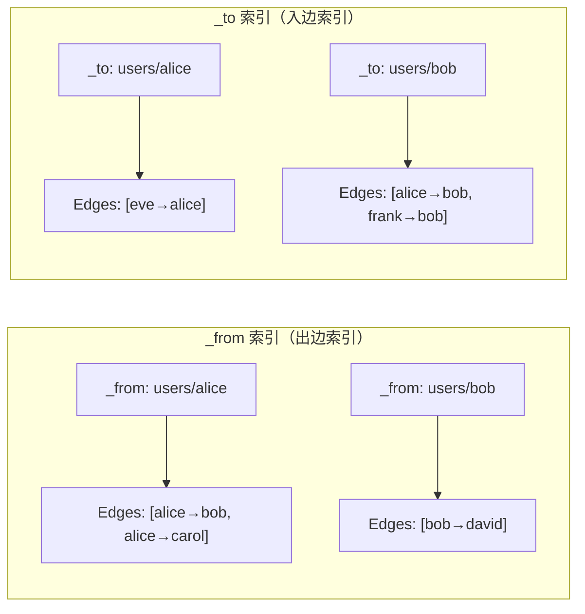

**边索引特点**：
- 边集合创建时自动创建，无需手动指定
- 专门优化图遍历查询
- 支持 OUTBOUND（出边）、INBOUND（入边）、ANY（双向）遍历
- 是 ArangoDB 图查询性能的关键

### 3. 全文索引（Fulltext Index / ArangoSearch）

ArangoDB 3.x 引入 ArangoSearch，提供强大的全文搜索能力。

```aql
// 创建 ArangoSearch 视图
CREATE VIEW articles_view WITH {
    type: "arangosearch",
    links: {
        articles: {
            includeAllFields: false,
            fields: {
                title: { analyzers: ["text_en"] },
                content: { analyzers: ["text_en", "norm"] }
            }
        }
    }
}

// 全文搜索查询
FOR doc IN articles_view
    SEARCH ANALYZER(doc.title IN TOKENS("database graph", "text_en"), "text_en")
    RETURN doc.title

// 带评分排序
FOR doc IN articles_view
    SEARCH ANALYZER(doc.content IN TOKENS("ArangoDB query", "text_en"), "text_en")
    LET score = BM25(doc)
    SORT score DESC
    RETURN { title: doc.title, score: score }
```

**倒排索引结构**：

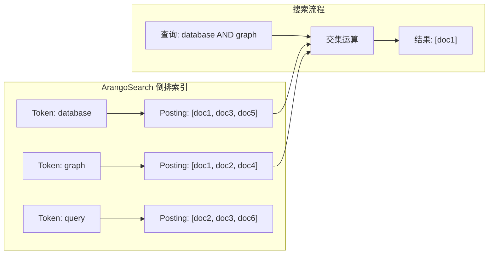

**ArangoSearch 特点**：
- 支持多语言分词器（text_en, text_zh, text_de 等）
- 支持 BM25 排序算法
- 支持短语查询、模糊匹配、同义词扩展
- 与 AQL 无缝集成

### 4. 跳表索引（Skiplist Index）

跳表索引提供有序存储，支持范围查询和有序遍历。

```aql
// 创建跳表索引
CREATE INDEX idx_user_name ON users (name) TYPE skiplist

// 有序查询
FOR u IN users
    FILTER u.name >= "A" AND u.name < "D"
    SORT u.name ASC
    RETURN u

// 前缀查询
FOR u IN users
    FILTER LIKE(u.name, "A%")
    RETURN u
```

**跳表结构示意**：

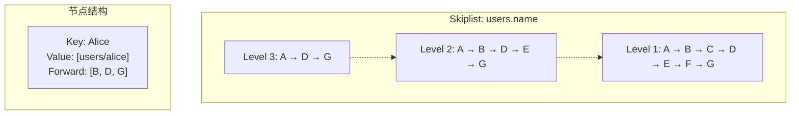

**跳表特点**：
- 查询复杂度 O(log n)
- 支持高效的插入和删除
- 范围查询友好
- 内存占用比 B+Tree 略高

### 5. 地理索引（Geo Index）

地理索引用于地理位置查询。

```aql
// 创建地理索引
CREATE INDEX idx_location ON venues (location) TYPE geo

// 地理范围查询
FOR v IN venues
    FILTER DISTANCE(v.location, [116.4, 39.9]) < 5000  // 5km 范围内
    RETURN v

// 多边形查询
FOR v IN venues
    FILTER IS_IN_POLYGON(v.location, [[x1,y1], [x2,y2], [x3,y3], [x1,y1]])
    RETURN v
```

### 6. 复合索引

复合索引是多属性组合索引，遵循**最左前缀原则**。

```aql
// 复合索引：city + age
CREATE INDEX idx_user_city_age ON users (city, age) TYPE persistent

// 生效的查询
WHERE u.city == "Beijing"                    -- 使用 city 前缀
WHERE u.city == "Beijing" AND u.age > 25     -- 使用完整索引

// 不生效的查询
WHERE u.age > 25  -- 缺少 city 前缀，索引不生效
```

**最左前缀原则图解**：

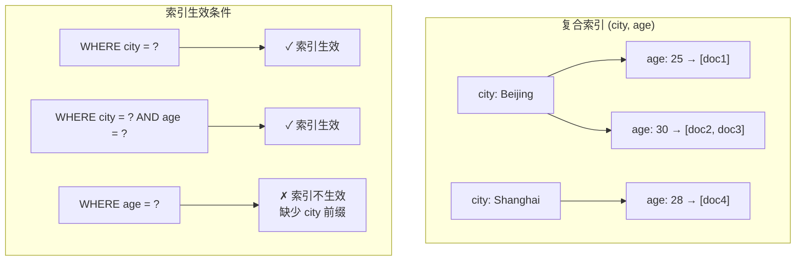

## 索引实现原理

### 1. B+Tree 实现

ArangoDB 的 Persistent Index 逻辑上是 B+Tree 结构：

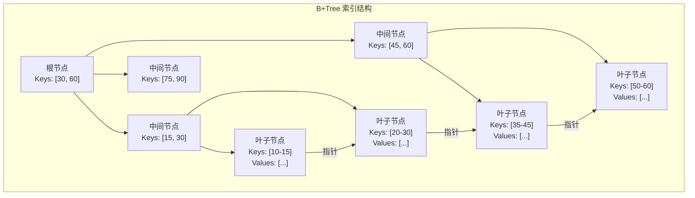

**B+Tree 特点**：
- 所有数据存储在叶子节点
- 叶子节点通过指针连接，支持高效范围查询
- 非叶子节点只存储索引键，树高度低
- 支持有序遍历

### 2. LSM-Tree 存储层

ArangoDB 3.x 默认使用 RocksDB 作为存储引擎，底层是 LSM-Tree：

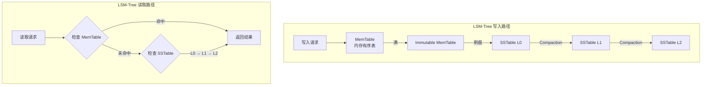

**LSM-Tree 特点**：
- **写入优化**：写入先进入 MemTable，批量刷盘
- **读取合并**：读取需要从 MemTable → L0 → L1 逐层查找
- **Compaction**：后台合并 SSTable，清理过期数据

### 3. 倒排索引实现

ArangoSearch 使用倒排索引实现全文搜索：

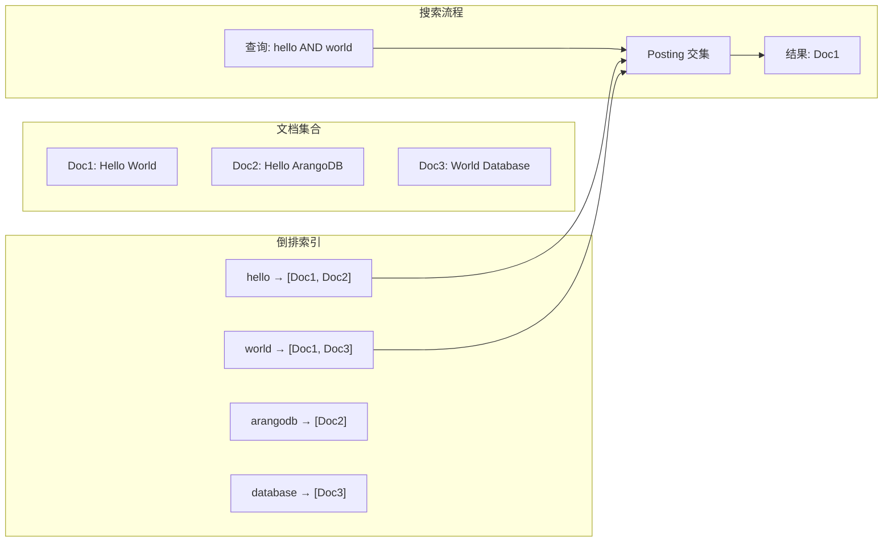

**倒排索引特点**：
- 支持布尔查询（AND/OR/NOT）
- 支持 TF-IDF / BM25 排序
- 支持短语查询、模糊匹配

## 索引选择策略

### 1. 选择原则

| 查询模式 | 推荐索引 | 示例 |
|---------|---------|------|
| 精确匹配 | Persistent Index | `WHERE name == "Alice"` |
| 多条件 AND | 复合 Persistent Index | `WHERE city == "BJ" AND age > 25` |
| 范围查询 | Persistent Index | `WHERE age > 30` |
| 有序遍历 | Skiplist Index | `SORT name ASC` |
| 全文搜索 | ArangoSearch | `SEARCH content IN TOKENS(...)` |
| 图遍历 | Edge Index（自动） | `FOR v, e IN OUTBOUND ...` |
| 地理查询 | Geo Index | `DISTANCE(...) < 5000` |

### 2. 索引设计最佳实践

```aql
-- 场景 1：用户查找（精确匹配）
CREATE INDEX idx_user_email ON users (email) TYPE persistent OPTIONS { unique: true }

-- 场景 2：多条件查询（复合索引）
CREATE INDEX idx_user_city_age ON users (city, age) TYPE persistent

-- 场景 3：图遍历优化（边索引自动创建）
CREATE COLLECTION follows TYPE = EDGE
-- 边集合自动创建 _from 和 _to 索引

-- 场景 4：全文搜索（ArangoSearch）
CREATE VIEW articles_view WITH {
    type: "arangosearch",
    links: {
        articles: {
            fields: {
                title: { analyzers: ["text_en"] },
                content: { analyzers: ["text_en"] }
            }
        }
    }
}

-- 场景 5：地理查询
CREATE INDEX idx_venue_location ON venues (location) TYPE geo
```

### 3. 索引失效场景

```aql
-- 场景 1：使用函数
FOR u IN users
    FILTER LENGTH(u.name) > 5  -- 索引失效
    RETURN u

-- 场景 2：类型转换
FOR u IN users
    FILTER u.age * 1.0 > 30.0  -- 索引可能失效
    RETURN u

-- 场景 3：复合索引缺少前缀
-- 假设索引：idx_user_city_age ON users(city, age)
FOR u IN users
    FILTER u.age > 25  -- 缺少 city 前缀
    RETURN u

-- 场景 4：OR 条件
FOR u IN users
    FILTER u.city == "Beijing" OR u.city == "Shanghai"  -- 需要分别查询
    RETURN u

-- 场景 5：负向条件
FOR u IN users
    FILTER u.city != "Beijing"  -- 索引不生效
    RETURN u
```

## 索引查询流程

### 1. AQL 查询执行流程

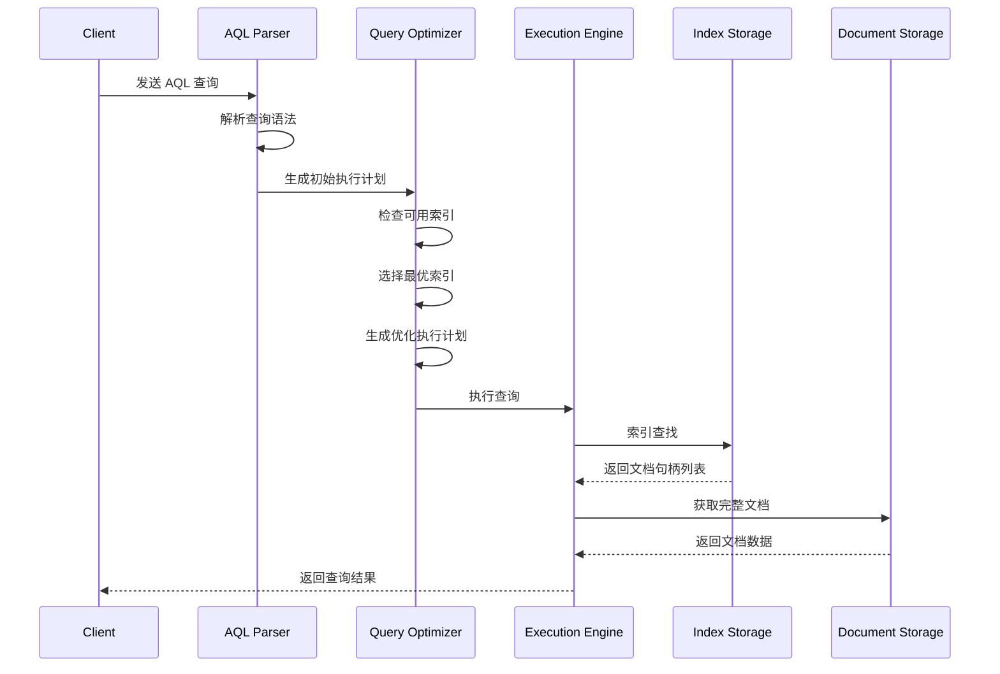

### 2. 索引选择流程

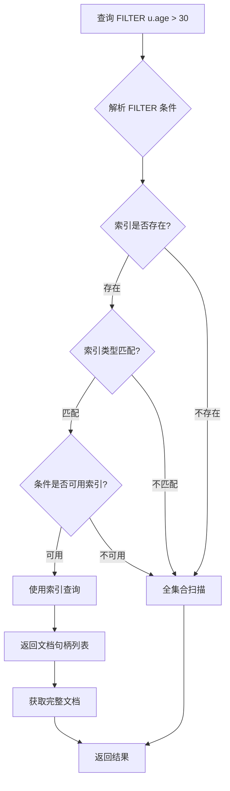

### 3. 图遍历索引流程

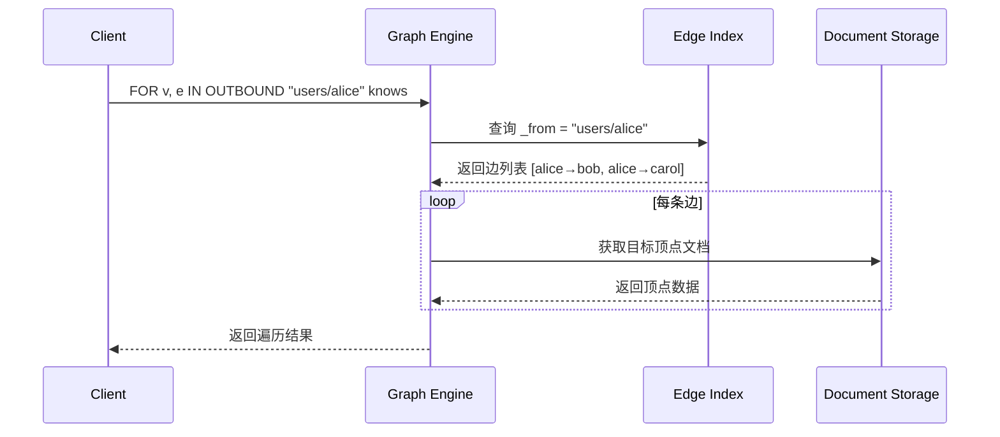

## 与项目 index/ 模块对比

### 1. 架构对比

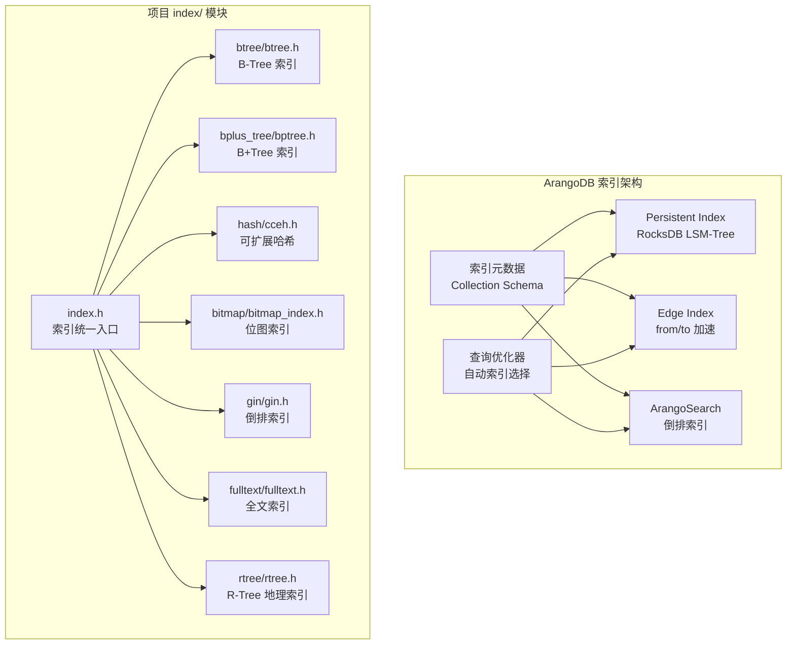

### 2. 功能对比表

| 特性 | ArangoDB | 项目 index/ 模块 |
|------|----------|-----------------|
| **B+Tree 索引** | Persistent Index（RocksDB） | `bplus_tree/bptree.h` |
| **B-Tree 索引** | 无 | `btree/btree.h` |
| **Hash 索引** | 无（_key 天然哈希） | `hash/cceh.h`, `hash/cuckoo.h` |
| **Bitmap 索引** | 无 | `bitmap/bitmap_index.h` |
| **倒排索引** | ArangoSearch | `gin/gin.h` |
| **全文索引** | ArangoSearch | `fulltext/fulltext.h` |
| **地理索引** | Geo Index | `rtree/rtree.h` |
| **边索引** | 自动创建 | CSR 存储（`graph_engine.h`） |
| **索引持久化** | RocksDB 自动 | `btree_index_save()`, `bptree_save()` |
| **分布式支持** | 多分片分布式 | 单机 |

### 3. B+Tree 对比

**ArangoDB Persistent Index**：
- 底层 LSM-Tree（RocksDB），逻辑 B+Tree
- 写入优化（MemTable 批量写入）
- 范围查询高效（叶子节点链表）
- 自动持久化

**项目 B+Tree（`bplus_tree/bptree.h`）**：

```c
// 项目 B+Tree API
bptree_index_t *bptree_create(uint32_t order, bptree_compare_fn compare, void *ctx);
int bptree_insert(bptree_index_t *index,
                  const void *key, uint32_t keylen,
                  const void *value, uint32_t valuelen);
int bptree_lookup(const bptree_index_t *index,
                  const void *key, uint32_t keylen,
                  void **value_out, uint32_t *valuelen_out);

// 范围查询
bptree_iter_t *bptree_iter_create(const bptree_index_t *index,
                                   const void *start_key, uint32_t start_keylen);
bool bptree_iter_next(bptree_iter_t *iter);
```

**关键差异**：

| 方面 | ArangoDB | 项目 B+Tree |
|------|----------|------------|
| **存储引擎** | RocksDB（LSM-Tree） | 原生 B+Tree 内存结构 |
| **持久化** | 自动（LSM-Tree） | 需手动实现 |
| **范围查询** | 叶子节点链表扫描 | 迭代器顺序遍历 |
| **写入性能** | MemTable 批量优化 | 单点插入 |
| **并发支持** | RocksDB 内置 | 需应用层加锁 |

### 4. 全文索引对比

**ArangoDB ArangoSearch**：
- 内置全文搜索引擎
- 支持多语言分词器
- 支持 BM25 排序
- 与 AQL 无缝集成

**项目全文索引（`fulltext/fulltext.h`）**：

```c
// 项目全文索引 API
fulltext_index_t *fulltext_create(void);
void fulltext_set_tokenizer(fulltext_index_t *idx, tokenizer_type_t type);
int fulltext_index_doc(fulltext_index_t *idx, int doc_id, const char *text);
int fulltext_search(fulltext_index_t *idx, const char *query,
                    int *doc_ids, float *scores, int *count, int limit);

// 分词器类型
typedef enum {
    TOKENIZER_WHITESPACE,  // 空格分词（英文）
    TOKENIZER_CHINESE_MM,  // 中文最大匹配分词
    TOKENIZER_MIXED        // 混合分词
} tokenizer_type_t;
```

**项目 GIN 索引（`gin/gin.h`）**：

```c
// GIN 倒排索引
gin_index_t *gin_create(int capacity);
int gin_insert(gin_index_t *idx, const char *key, int doc_id);
int gin_search(gin_index_t *idx, const char *key, int *results, int *count);

// Posting List 结构（小列表）
struct posting_list {
    int doc_id;
    struct posting_list *next;
};

// Posting Array 结构（大列表，支持二分查找）
struct posting_array {
    int *doc_ids;    // 有序数组
    int count;
    int capacity;
};
```

### 5. 边索引对比

**ArangoDB Edge Index**：
- 边集合创建时自动创建
- 针对 `_from` 和 `_to` 字段
- 加速 OUTBOUND/INBOUND 遍历
- 基于 RocksDB 存储

**项目图引擎（`graph_engine.h`）**：

```c
// 项目的 CSR 存储实现边索引
typedef struct csr_storage_s {
    uint64_t *row_ptr;    // 行偏移数组（每个顶点的出边起始位置）
    uint64_t *col_idx;    // 列索引数组（目标顶点 ID）
    void     *edge_data;  // 边数据
    uint64_t  num_vertices;
    uint64_t  num_edges;
} csr_storage_t;

// 出边查询 O(1)
const uint64_t *get_out_edges(csr_storage_t *csr, uint64_t src, uint32_t *count) {
    uint64_t start = csr->row_ptr[src];
    uint64_t end = csr->row_ptr[src + 1];
    *count = end - start;
    return &csr->col_idx[start];
}

// 启用 CSR 存储
graph_engine_enable_csr(rel, 1000000);
graph_engine_csr_compact(rel);  // COO → CSR 转换
```

**关键差异**：

| 方面 | ArangoDB Edge Index | 项目 CSR |
|------|---------------------|----------|
| **存储格式** | RocksDB Key-Value | CSR 邻接表 |
| **更新方式** | 增量更新 | 批量转换（COO → CSR） |
| **查询效率** | O(log n) RocksDB 查找 | O(1) 数组访问 |
| **内存占用** | 磁盘存储 | 内存压缩格式 |
| **适用场景** | 大规模图、频繁更新 | 静态图、批量查询 |

### 6. Hash 索引对比

**ArangoDB**：
- `_key` 字段天然具有唯一性
- 无需额外 Hash 索引
- 文档通过 `_key` 快速定位

**项目 Hash 索引（`hash/cceh.h`）**：

```c
// CCEH: Cache-Conscious Extendible Hashing
cceh_index_t *cceh_index_create(uint32_t segment_capacity,
                                 uint32_t initial_global_depth);
int cceh_index_insert(cceh_index_t *index,
                      const void *key, uint32_t keylen,
                      const void *value, uint32_t valuelen);
int cceh_index_lookup(const cceh_index_t *index,
                      const void *key, uint32_t keylen,
                      void **value_out, uint32_t *valuelen_out);
```

**CCEH 特点**：
- 可扩展哈希，动态调整目录大小
- Cache 友好设计（Segment 对齐）
- 支持高并发（线程 Epoch 机制）

### 7. Bitmap 索引对比

**ArangoDB**：
- 无 Bitmap 索引

**项目 Bitmap 索引（`bitmap/bitmap_index.h`）**：

```c
// Bitmap 索引
bitmap_index_t *bitmap_create(int n_docs, int n_values);
int bitmap_set(bitmap_index_t *idx, int doc_id, int value);
int bitmap_eq(const bitmap_index_t *idx, int value, int *doc_ids, int *count);
int bitmap_and(const bitmap_index_t *idx, int value1, int value2,
               int *doc_ids, int *count);
int bitmap_or(const bitmap_index_t *idx, int value1, int value2,
              int *doc_ids, int *count);
```

**Bitmap 索引特点**：
- 适合低基数属性（如性别、地区、状态）
- 位运算实现 AND/OR/NOT 高效
- 支持压缩（RLE 压缩）

**适用场景对比**：

| 索引类型 | ArangoDB | 项目 | 适用场景 |
|---------|----------|------|---------|
| B+Tree | Persistent Index | `bplus_tree/bptree.h` | 范围查询、有序遍历 |
| Hash | _key 天然哈希 | `hash/cceh.h` | 精确匹配 |
| 倒排索引 | ArangoSearch | `gin/gin.h` | 全文搜索、数组查询 |
| Bitmap | 无 | `bitmap/bitmap_index.h` | 低基数属性、多维分析 |
| 全文索引 | ArangoSearch | `fulltext/fulltext.h` | 文本搜索 |
| 地理索引 | Geo Index | `rtree/rtree.h` | 位置查询 |
| 边索引 | Edge Index | CSR 存储 | 图遍历 |

## 完整示例：社交网络索引设计

```aql
-- 1. 创建顶点集合和边集合
CREATE COLLECTION users
CREATE COLLECTION follows TYPE = EDGE  -- 自动创建边索引
CREATE COLLECTION posts

-- 2. 创建用户集合索引
-- 单属性索引（精确匹配）
CREATE INDEX idx_user_email ON users (email) TYPE persistent OPTIONS { unique: true }
CREATE INDEX idx_user_username ON users (username) TYPE persistent OPTIONS { unique: true }

-- 复合索引（多条件查询）
CREATE INDEX idx_user_city_age ON users (city, age) TYPE persistent

-- 范围查询索引
CREATE INDEX idx_user_created ON users (created_at) TYPE persistent

-- 3. 创建帖子集合索引
CREATE INDEX idx_post_user ON posts (user_id) TYPE persistent
CREATE INDEX idx_post_created ON posts (created_at) TYPE persistent

-- 4. 创建 ArangoSearch 视图（全文搜索）
CREATE VIEW posts_search WITH {
    type: "arangosearch",
    links: {
        posts: {
            includeAllFields: false,
            fields: {
                title: { analyzers: ["text_en"] },
                content: { analyzers: ["text_en", "norm"] }
            }
        }
    }
}

-- 5. 查询示例

-- 5.1 精确匹配（使用 idx_user_email）
FOR u IN users
    FILTER u.email == "alice@example.com"
    RETURN u

-- 5.2 复合条件查询（使用 idx_user_city_age）
FOR u IN users
    FILTER u.city == "Beijing" AND u.age > 25
    RETURN u

-- 5.3 范围查询（使用 idx_user_created）
FOR u IN users
    FILTER u.created_at >= "2024-01-01" AND u.created_at < "2025-01-01"
    SORT u.created_at DESC
    RETURN u

-- 5.4 图遍历（使用边索引）
FOR v, e, p IN 1..3 OUTBOUND "users/alice" follows
    FILTER e.since >= 2020
    RETURN {
        user: v.name,
        since: e.since,
        depth: LENGTH(p.edges)
    }

-- 5.5 全文搜索（使用 ArangoSearch）
FOR doc IN posts_search
    SEARCH ANALYZER(doc.content IN TOKENS("database graph", "text_en"), "text_en")
    LET score = BM25(doc)
    SORT score DESC
    LIMIT 10
    RETURN {
        title: doc.title,
        score: score
    }

-- 5.6 混合查询：图遍历 + 属性过滤
FOR v, e, p IN 1..2 OUTBOUND "users/alice" follows
    FILTER v.city == "Beijing"  -- 过滤目标顶点属性
    FILTER e.since >= 2020      -- 过滤边属性
    RETURN {
        name: v.name,
        city: v.city,
        since: e.since
    }

-- 6. 索引使用分析
-- 使用 EXPLAIN 查看执行计划
EXPLAIN FOR u IN users
    FILTER u.city == "Beijing" AND u.age > 25
    RETURN u

-- 输出示例：
-- Execution plan:
-- Id   NodeType          Index
-- 1    IndexNode         idx_user_city_age
-- 2    ReturnNode
```

## 要点总结

- **索引本质**：属性值到文档句柄的映射表，加速属性条件查询
- **索引类型**：Persistent（B+Tree）、Edge（图遍历）、ArangoSearch（全文）、Skiplist（有序）、Geo（地理）
- **实现原理**：B+Tree 逻辑结构 + LSM-Tree 存储层 + 倒排索引全文搜索
- **索引选择**：精确匹配用 Persistent，多条件用复合索引，范围查询用 B+Tree，图遍历用 Edge Index
- **边索引特点**：边集合自动创建，专门优化图遍历查询
- **ArangoSearch**：内置全文搜索，支持多语言分词和 BM25 排序
- **与项目对比**：项目提供更多索引类型（BTree/Hash/Bitmap/GIN），ArangoDB 提供分布式支持和自动持久化
- **最佳实践**：按查询模式创建索引，避免过度索引，使用 EXPLAIN 验证索引使用

## 思考题

1. ArangoDB 的 Persistent Index 使用 RocksDB 的 LSM-Tree 作为底层存储，这与传统 B+Tree 的优缺点是什么？在什么场景下选择哪种？

2. ArangoDB 的边索引（Edge Index）与项目的 CSR 存储在图遍历性能上有何差异？各自的适用场景是什么？

3. 如果要为项目的 `graph_engine` 添加类似 ArangoDB Edge Index 的功能，应该如何设计？需要考虑哪些关键点？

4. 对比 ArangoDB 的 ArangoSearch 和项目 `gin/gin.h` 的倒排索引实现，各有何优劣？在全文搜索场景下如何选择？

5. ArangoDB 的复合索引遵循最左前缀原则，这与 MySQL 的索引原则一致。请分析为什么这样设计，以及在项目 `bplus_tree/bptree.h` 中如何实现复合索引。

6. 如果项目要实现类似 ArangoDB 的 ArangoSearch 全文搜索功能，应该如何复用 `fulltext/fulltext.h` 和 `gin/gin.h`？

## 参考资料

- [ArangoDB 官方文档 - 索引](https://www.arangodb.com/docs/stable/indexing-index-basics.html)
- [ArangoDB 官方文档 - ArangoSearch](https://www.arangodb.com/docs/stable/arangosearch.html)
- [RocksDB Wiki - LSM-Tree](https://github.com/facebook/rocksdb/wiki)
- [PostgreSQL GIN 索引](https://www.postgresql.org/docs/current/gin.html)
- 项目 `engineering/include/db/index/` 模块源码
- 项目 `engineering/include/db/graph_engine.h` 图引擎源码
