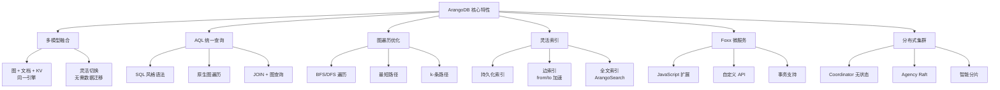
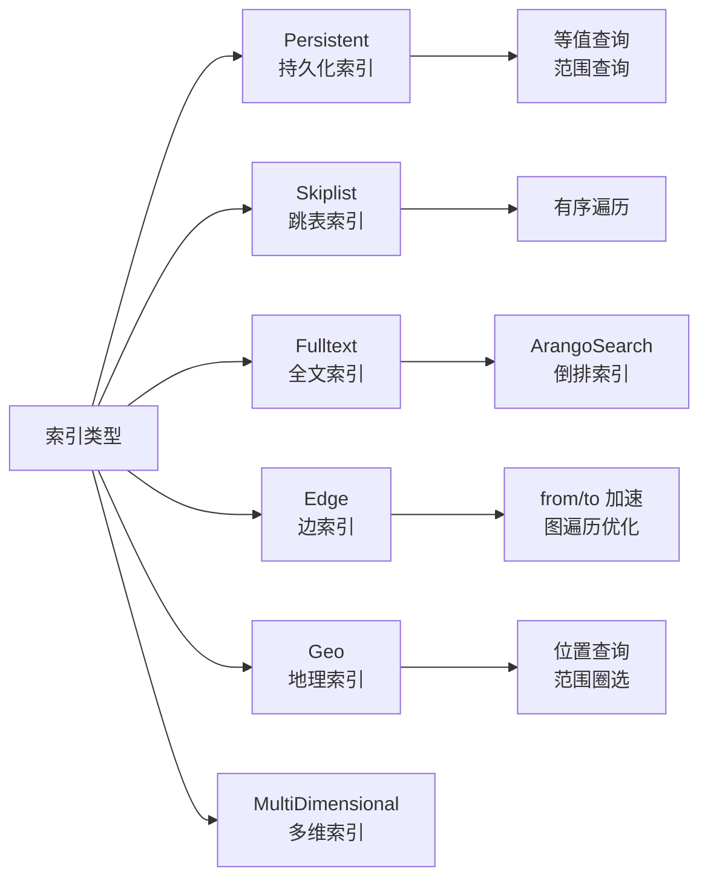

# ArangoDB 关键特性

## 学习目标

- 掌握 ArangoDB 作为多模型数据库的核心特性
- 理解 AQL 查询语言的设计优势
- 对比 ArangoDB 与 Neo4j 的差异

## 特性总览



## 核心特性详解

### 1. 多模型数据融合

ArangoDB 在同一个数据库中支持三种数据模型：

| 模型 | 集合类型 | 典型操作 | 适用场景 |
|------|---------|---------|---------|
| 文档 | Document Collection | CRUD、查询、聚合 | 用户数据、日志、配置 |
| 图 | Edge Collection | 遍历、路径查询 | 社交网络、知识图谱 |
| 键值 | 直接操作 `_key` | 点查询 | 缓存、会话、计数器 |

```aql
// 同一 AQL 中混合使用三种模型

// 1. 文档操作：查询用户
LET user = DOCUMENT("users/alice")

// 2. 图遍历：查找用户的朋友圈
LET friends = (
    FOR v, e, p IN 1..2 OUTBOUND user._id GRAPH "social"
    RETURN v.name
)

// 3. KV 操作：读取缓存计数
LET view_count = DOCUMENT("cache:user_views", user._id)

RETURN {
    user: user.name,
    friends: friends,
    views: view_count
}
```

### 2. AQL 图遍历查询

AQL（ArangoDB Query Language）提供原生图遍历语法：

```aql
// BFS 广度优先遍历：查找 1-3 度好友
FOR v, e, p IN 1..3 OUTBOUND "users/alice" knows
    RETURN {
        name: v.name,
        path: p.vertices[*].name
    }

// 指定图名称遍历
FOR v, e, p IN 1..2 ANY "users/alice" GRAPH "social"
    FILTER p.edges[*].weight > 0.5
    RETURN v

// 最短路径查询
FOR v, e IN OUTBOUND K_SHORTEST_PATHS "users/alice" TO "users/bob" knows
    RETURN {vertex: v.name, edge: e.type}

// 自定义遍历方向
FOR v, e, p IN 1..3 ANY "users/alice" knows
    RETURN v
```

遍历选项说明：

| 选项 | 说明 | 示例 |
|------|------|------|
| `OUTBOUND` | 沿边方向遍历 | 关注关系 |
| `INBOUND` | 逆边方向遍历 | 被关注关系 |
| `ANY` | 双向遍历 | 任意关系 |
| `K_SHORTEST_PATHS` | 最短 K 条路径 | 路径规划 |

### 3. 灵活的索引机制



```aql
// 创建索引示例
// 持久化索引（类似 B+树）
CREATE INDEX idx_age ON users (age) TYPE persistent

// 复合索引
CREATE INDEX idx_city_age ON users (city, age) TYPE persistent

// 边索引（自动创建在 from/to 字段）
// Edge Collection 自动创建，无需手动

// 全文索引（通过 ArangoSearch）
// 需要 ArangoSearch 视图，见下节
```

### 4. ArangoSearch 全文搜索

ArangoSearch 是 ArangoDB 内置的全文搜索引擎：

```aql
// 创建 ArangoSearch 视图
CREATE VIEW articles_view WITH {
    type: "arangosearch",
    links: {
        articles: {
            includeAllFields: true,
            fields: {
                title: { analyzers: ["text_en"] },
                content: { analyzers: ["text_en"] }
            }
        }
    }
}

// 全文搜索查询
FOR doc IN articles_view
    SEARCH ANALYZER(doc.title IN TOKENS("database graph", "text_en"), "text_en")
    RETURN doc.title

// 带评分的搜索
FOR doc IN articles_view
    SEARCH ANALYZER(doc.content IN TOKENS("ArangoDB query", "text_en"), "text_en")
    LET score = BM25(doc)
    SORT score DESC
    RETURN {title: doc.title, score: score}
```

### 5. Foxx 微服务框架

Foxx 允许在 ArangoDB 内部运行 JavaScript 服务：

```javascript
// foxx-service/index.js
'use strict';
const { aql } = require('@arangodb');
const createRouter = require('@arangodb/foxx/router');

const router = createRouter();

// 自定义 REST API
router.get('/users/:id/friends', function (req, res) {
    const userId = req.pathParams.id;
    const limit = req.queryParams.limit || 10;
    
    const result = db._query(aql`
        FOR v, e IN 1..2 OUTBOUND ${userId} GRAPH 'social'
        LIMIT ${limit}
        RETURN v
    `);
    
    res.send(result);
});

module.context.use(router);
```

Foxx 特点：
- 在数据库内部执行，减少网络开销
- 支持事务和 AQL
- 适合复杂业务逻辑

## 与 Neo4j 对比

| 维度 | ArangoDB | Neo4j |
|------|----------|-------|
| 数据模型 | 多模型（图+文档+KV） | 纯图数据库 |
| 查询语言 | AQL（类 SQL） | Cypher |
| 许可证 | Apache 2.0（完全开源） | GPL（企业版收费） |
| 集群模式 | 原生分布式，分片+复制 | 企业版支持集群 |
| 横向扩展 | 支持（Coordinator 水平扩展） | 需要企业版 |
| 存储引擎 | RocksDB（可插拔） | 原生图存储 |
| 全文搜索 | 内置 ArangoSearch | 需要外部组件 |
| 扩展机制 | Foxx（JavaScript 微服务） | 插件（Java） |
| 遍历语法 | `FOR v, e, p IN 1..N OUTBOUND ...` | `MATCH (a)-[*1..N]->(b)` |
| 索引类型 | 多种（Persistent/Skiplist/Geo） | Schema 索引 + 全文索引 |
| 学习曲线 | SQL 用户易上手 | 需要学习 Cypher 思维 |

```aql
// ArangoDB 遍历语法
FOR v, e, p IN 1..3 OUTBOUND "users/alice" knows
    RETURN v.name

// 等价 Neo4j Cypher
MATCH (a:User {name: 'alice'})-[*1..3]-(b)
RETURN b.name
```

## 要点总结

- ArangoDB 的多模型特性允许在单一系统中处理图、文档和 KV 数据
- AQL 统一查询语言，降低学习成本，SQL 用户友好
- 图遍历支持 BFS/DFS、最短路径、K 条路径等多种模式
- ArangoSearch 提供内置全文搜索，无需额外组件
- Foxx 微服务框架支持在数据库内运行业务逻辑
- 相比 Neo4j，更适合需要多模型混合的场景

## 思考题

1. ArangoDB 的多模型架构相比使用独立的图数据库 + 文档数据库，有哪些优势和劣势？
2. AQL 的图遍历语法与 Cypher 各有什么设计取舍？哪种更易优化执行？
3. Foxx 微服务在数据库内部执行，如何保证安全性和资源隔离？