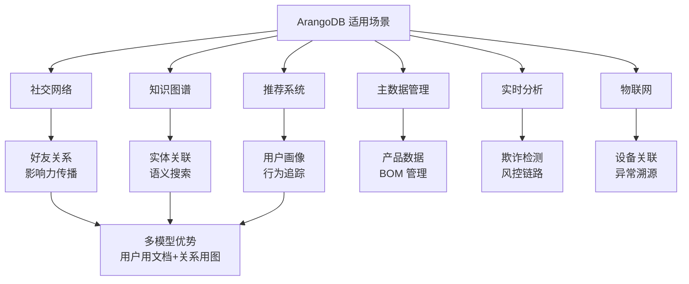
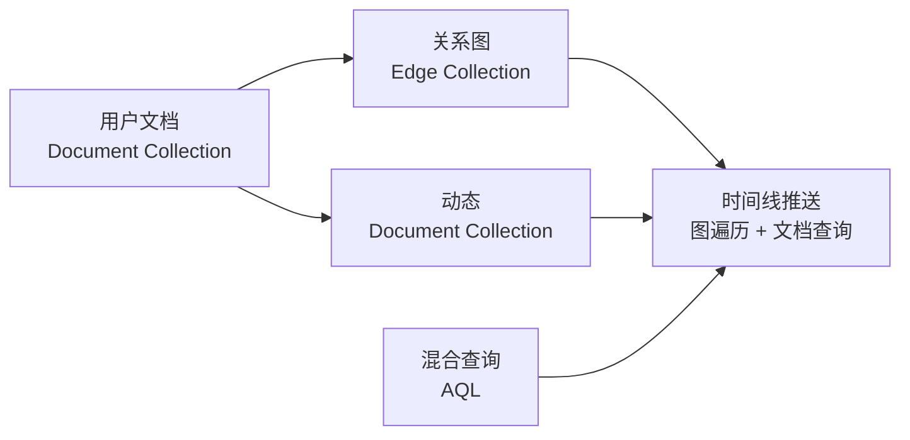
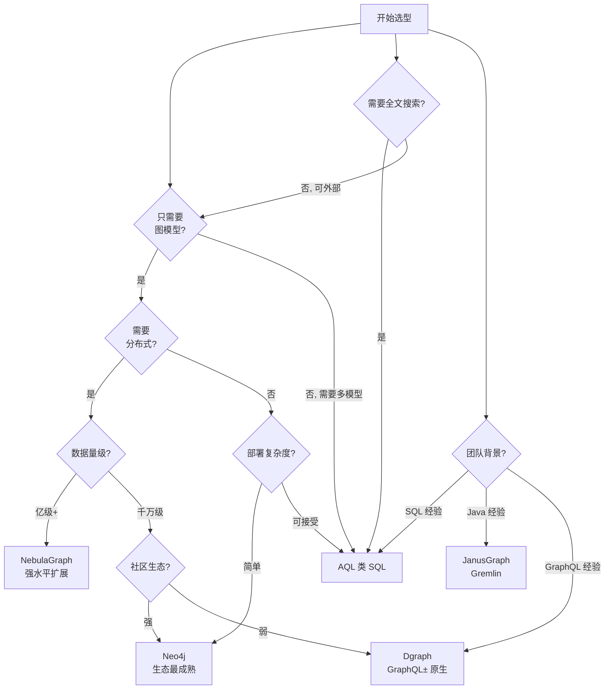

# ArangoDB 使用场景与选型对比

## 学习目标

- 理解 ArangoDB 在典型场景中的适用性
- 掌握与其他图数据库的选型对比
- 建立图数据库选型的决策框架

## 适用场景总览



## 场景详解

### 1. 社交网络



```aql
// 社交网络：查询用户及其好友的最近动态

// 1. 个人信息（文档查询）
LET user = DOCUMENT("users/alice")

// 2. 最近 3 天活跃的好友（图遍历）
LET recent_friends = (
    FOR v, e IN 1..2 OUTBOUND user._id GRAPH "social"
        FILTER e.last_active > DATE_NOW() - 3 * 86400
        RETURN DISTINCT v._id
)

// 3. 好友动态聚合（文档查询）
LET feed = (
    FOR friend_id IN recent_friends
        FOR post IN posts
            FILTER post.author == friend_id
            SORT post.created_at DESC
            LIMIT 50
            RETURN post
)

RETURN {user: user.name, feed: feed}
```

### 2. 知识图谱

```aql
// 知识图谱：实体关系查询
// 查询"爱因斯坦"关联的所有科学家和理论

FOR v, e, p IN 1..3 OUTBOUND "entities/einstein" GRAPH "knowledge_graph"
    FILTER v.type == "scientist" OR v.type == "theory"
    RETURN {
        entity: v.name,
        type: v.type,
        relation: e.type,
        path: p.vertices[*].name
    }

// 语义搜索
FOR doc IN knowledge_view
    SEARCH ANALYZER(doc.content IN TOKENS("relativity quantum", "text_en"), "text_en")
    RETURN doc
```

### 3. 推荐系统

```aql
// 推荐系统：基于用户行为的协同过滤

// 1. 用户历史行为查询
LET user_actions = (
    FOR v, e IN 1..1 OUTBOUND "users/alice" GRAPH "user_actions"
        RETURN v._id
)

// 2. 相似用户查找（通过共同购买/浏览的物品）
LET similar_users = (
    FOR item_id IN user_actions
        FOR v, e IN 1..1 INBOUND item_id GRAPH "user_actions"
            FILTER v._id != "users/alice"
            RETURN DISTINCT v._id
)

// 3. 推荐物品（相似用户喜欢的物品）
LET recommendations = (
    FOR u IN similar_users
        FOR v, e IN 1..1 OUTBOUND u GRAPH "user_actions"
            FILTER v._id NOT IN user_actions
            COLLECT item = v._id WITH COUNT INTO cnt
            SORT cnt DESC
            LIMIT 10
            RETURN {
                item: DOCUMENT(item),
                score: cnt
            }
)

RETURN recommendations
```

### 4. 欺诈检测

```aql
// 欺诈检测：查询可疑交易链路

// 查询从 A 到 B 的所有交易路径（深度 4 以内）
FOR v, e IN OUTBOUND K_SHORTEST_PATHS "account/suspect_a" TO "account/suspect_b" transfers
    LIMIT 5
    RETURN {
        path: v._id,
        amount: e.amount,
        timestamp: e.timestamp,
        risk_score: calculate_risk(e)
    }

// 环检测：发现资金循环
FOR v, e, p IN 1..5 OUTBOUND "account/suspect_a" transfers
    FILTER v._id == "account/suspect_a"
    RETURN {
        cycle_length: LENGTH(p.vertices),
        total_amount: SUM(p.edges[*].amount)
    }
```

## 与其他图数据库对比

| 维度 | ArangoDB | Neo4j | JanusGraph | Dgraph | NebulaGraph |
|------|----------|-------|------------|--------|-------------|
| 模型 | 多模型 | 纯图 | 图 | 图 | 图 |
| 查询语言 | AQL | Cypher | Gremlin | GraphQL± | nGQL |
| 存储引擎 | RocksDB 自研 | 自研 | 后端可插拔 | Badger | 自研 |
| 分布式 | 原生支持 | 企业版 | 依赖后端 | 原生支持 | 原生支持 |
| 事务 | ACID(单机) | ACID | 原子性 | ACID | 快照隔离 |
| 全文搜索 | 内置 | 需外部 | 需外部 | 需外部 | 需外部 |
| 多模型 | 图+文档+KV | 纯图 | 纯图 | 纯图 | 纯图 |
| 扩展性 | 水平扩展 | 读扩展 | 水平扩展 | 水平扩展 | 强水平扩展 |
| 学习曲线 | 低(SQL式) | 中 | 高(Gremlin) | 中 | 中 |
| 开源协议 | Apache 2.0 | GPL | Apache 2.0 | Apache 2.0 | Apache 2.0 |
| 部署复杂度 | 中 | 简单 | 复杂 | 简单 | 中等 |

## 选型决策流程



### 选型原则

1. **数据模型决定方向**：如果只需要图模型，Neo4j 生态最成熟；如果需要多模型，ArangoDB 是唯一选择
2. **规模决定架构**：千万级以下 Neo4j 足够；亿级以上需要 NebulaGraph 或 Dgraph
3. **团队能力匹配**：SQL 背景团队首选 AQL（ArangoDB），Java 背景可考虑 JanusGraph
4. **部署复杂度**：Neo4j 最简单，JanusGraph 依赖 HBase/Cassandra 等后端最复杂

### 推荐组合

| 场景 | 推荐方案 | 理由 |
|------|---------|------|
| 创业公司快速验证 | ArangoDB | 多模型灵活，减少技术栈 |
| 企业级知识图谱 | Neo4j | 生态成熟，工具链完善 |
| 亿级社交网络 | NebulaGraph | 水平扩展强，性能优秀 |
| 多模型数据平台 | ArangoDB | 唯一成熟的多模型图库 |
| 实时风控 | Dgraph | GraphQL± 实时性好 |

## 要点总结

- ArangoDB 适合需要同时处理图、文档、KV 数据的场景
- 社交网络、知识图谱、推荐系统是典型应用
- 多模型特性可以减少技术栈组件数量
- 选型时考虑数据模型、规模、团队能力三要素

## 思考题

1. 你的项目场景中，哪些数据适合用图模型，哪些适合用文档模型？ArangoDB 能否统一？
2. 相比使用 Neo4j + MongoDB 的组合，ArangoDB 多模型方案的优势和妥协是什么？
3. 知识图谱场景中，ArangoDB 的图遍历性能与纯图数据库的差距有多大？