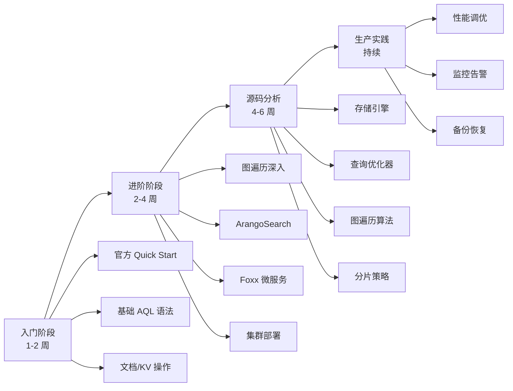
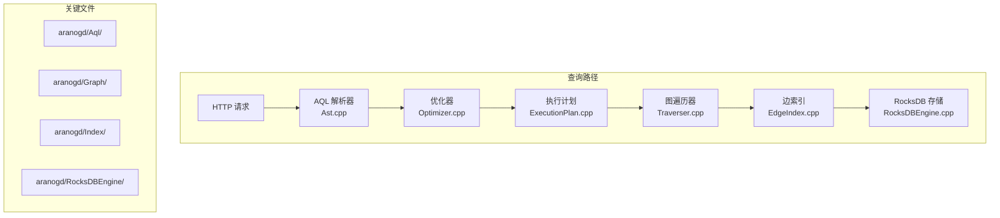

# ArangoDB 学习资源

## 学习目标

- 获取 ArangoDB 的优质学习资源
- 建立从入门到源码分析的学习路径
- 了解推荐书籍和社区资源

## 学习路径总览



## 官方资源

### 文档

| 资源 | 链接 | 说明 |
|------|------|------|
| 官方文档首页 | [https://docs.arangodb.com/](https://docs.arangodb.com/) | 所有文档入口 |
| AQL 手册 | [https://docs.arangodb.com/stable/aql/](https://docs.arangodb.com/stable/aql/) | 语法参考与示例 |
| 图遍历手册 | [https://docs.arangodb.com/stable/aql/graphs/](https://docs.arangodb.com/stable/aql/graphs/) | 图遍历操作详解 |
| 部署指南 | [https://docs.arangodb.com/stable/deploy/](https://docs.arangodb.com/stable/deploy/) | 单机/集群/DC2DC |
| ArangoSearch | [https://docs.arangodb.com/stable/arangosearch/](https://docs.arangodb.com/stable/arangosearch/) | 全文搜索引擎 |
| Foxx 文档 | [https://docs.arangodb.com/stable/foxx/](https://docs.arangodb.com/stable/foxx/) | 微服务框架 |

### 代码仓库

| 仓库 | 说明 | 关键目录 |
|------|------|---------|
| [arangoDB/arangodb](https://github.com/arangodb/arangodb) | 主仓库 | `arangod/` 核心服务 |
| [arangodb/arangojs](https://github.com/arangodb/arangojs) | JavaScript 驱动 | |
| [arangodb/go-driver](https://github.com/arangodb/go-driver) | Go 驱动 | |
| [arangodb/spring-data](https://github.com/arangodb/spring-data) | Spring Data 驱动 | |

### 学习平台

- **ArangoDB 学院**: [https://www.arangodb.com/academy/](https://www.arangodb.com/academy/) — 免费课程
- **ArangoDB 博客**: [https://www.arangodb.com/blog/](https://www.arangodb.com/blog/) — 技术文章和案例
- **ArangoDB YouTube**: [https://www.youtube.com/c/ArangoDB](https://www.youtube.com/c/ArangoDB) — 视频教程
- **ArangoDB 论坛**: [https://github.com/arangodb/arangodb/discussions](https://github.com/arangodb/arangodb/discussions)

## 源码研读指导

### 源码目录结构

```
arangodb/
├── arangod/              # 核心服务
│   ├── Aql/              # AQL 查询引擎
│   │   ├── Ast.cpp       # 抽象语法树
│   │   ├── Optimizer.cpp # 查询优化器
│   │   ├── ExecutionPlan.cpp # 执行计划
│   │   └── TraversalExecutor.cpp # 图遍历执行器
│   ├── Cluster/          # 集群管理
│   │   ├── ClusterInfo.cpp  # 集群元信息
│   │   └── Heartbeat.cpp    # 心跳检测
│   ├── GeneralServer/    # HTTP 服务器
│   ├── Graph/            # 图操作
│   │   ├── Graph.cpp     # 图管理
│   │   ├── ShortestPathFinder.cpp # 最短路径
│   │   └── Traverser.cpp # 图遍历器
│   ├── Index/            # 索引实现
│   │   ├── EdgeIndex.cpp # 边索引
│   │   └── PersistentIndex.cpp # 持久化索引
│   ├── IResearch/        # ArangoSearch 实现
│   ├── InternalRestHandler/ # REST 处理器
│   ├── RestHandler/      # REST 处理器
│   ├── RocksDBEngine/    # RocksDB 存储引擎
│   │   ├── RocksDBEngine.cpp
│   │   ├── RocksDBCollection.cpp
│   │   └── RocksDBEdgeIndex.cpp
│   ├── Scheduler/        # 调度器
│   ├── StorageEngine/    # 存储引擎抽象
│   └── V8Server/         # V8 JavaScript 引擎
├── lib/                  # 基础库
│   ├── ApplicationFeatures/ # 应用框架
│   ├── Basics/           # 基础工具
│   ├── Logger/           # 日志系统
│   └── SimpleHttpClient/ # HTTP 客户端
├── tests/                # 测试
│   ├── Aql/              # AQL 测试
│   ├── Graph/            # 图操作测试
│   └── IResearch/        # 全文搜索测试
└── V8/                   # V8 引擎集成
```

### 源码分析重点



### 源码研读建议

1. **从 AQL 查询路径入手**：`Aql/Ast.cpp` → `Aql/Optimizer.cpp` → `Aql/ExecutionPlan.cpp` → `Graph/Traverser.cpp` → `Index/EdgeIndex.cpp`
2. **理解图遍历算法**：重点阅读 `Graph/Traverser.cpp` 和 `Graph/ShortestPathFinder.cpp`，对比 BFS/DFS 实现
3. **存储引擎分离**：RocksDBEngine 目录展示了如何将 RocksDB 封装为图引擎
4. **索引机制**：`Index/EdgeIndex.cpp` 的边索引是图查询性能的关键
5. **集群一致性**：`Cluster/` 目录结合 Agency 的 Raft 实现

## 推荐书籍和论文

### 书籍

| 书名 | 作者 | 说明 |
|------|------|------|
| **Graph Databases, 2nd Edition** | Ian Robinson, Jim Webber, Emil Eifrem | Neo4j 团队出品，图数据库理论入门，适合理解图存储基础 |
| **Designing Data-Intensive Applications** | Martin Kleppmann | 数据系统设计经典，帮助理解 ArangoDB 的分布式设计 |
| **Database Internals** | Alex Petrov | 存储引擎原理，适合深入 ArangoDB 的 RocksDB 存储层 |
| **The Practitioner's Guide to Graph Data** | Denise Gosnell, Matthias Broecheler | 图数据实践指南，涵盖应用场景 |
| **Knowledge Graphs** | Aidan Hogan 等 | 知识图谱理论，适合理解 ArangoDB 在知识图谱场景的应用 |

### 论文

| 论文 | 作者/会议 | 与 ArangoDB 的关联 |
|------|----------|-------------------|
| **The Graph Traversal Pattern** | Rodriguez, Neubauer (2010) | 图遍历算法理论基础 |
| **Pregel: A System for Large-Scale Graph Processing** | Malewicz 等 (SIGMOD 2010) | 分布式图处理模型 |
| **RocksDB: Evolution of a Key-Value Store** | Dong 等 (SIGMOD 2021) | ArangoDB 底层存储引擎 |
| **A Comparison of Approaches to Large-Scale Data Analysis** | Stonebraker 等 (SIGMOD 2009) | 数据模型对比研究 |
| **Graph Querying Meets SQL** | Angles 等 (ICDE 2016) | 图查询语言标准 |

## 社区资源

| 资源 | 链接 | 说明 |
|------|------|------|
| GitHub Discussions | [https://github.com/arangodb/arangodb/discussions](https://github.com/arangodb/arangodb/discussions) | 社区问答 |
| Stack Overflow | [https://stackoverflow.com/questions/tagged/arangodb](https://stackoverflow.com/questions/tagged/arangodb) | 技术问答 |
| ArangoDB 官方博客 | [https://www.arangodb.com/blog/](https://www.arangodb.com/blog/) | 技术文章 |
| ArangoDB 案例研究 | [https://www.arangodb.com/case-studies/](https://www.arangodb.com/case-studies/) | 生产案例 |
| ArangoDB Meetup | [https://www.meetup.com/ArangoDB/](https://www.meetup.com/ArangoDB/) | 线下活动（部分城市） |
| ArangoDB 中文社区 | 微信搜索"ArangoDB 中文社区" | 中文资源 |

## 要点总结

- 官方文档是学习 ArangoDB 的首要资源，AQL 手册和图遍历手册最核心
- 源码研读建议从 AQL 查询路径入手，逐步深入存储引擎和索引
- 理解图遍历算法（BFS/DFS/最短路径）是深入 ArangoDB 的关键
- 推荐结合《Database Internals》理解 RocksDB 存储层
- 社区资源丰富，GitHub Discussions 和 Stack Overflow 是主要问答渠道

## 思考题

1. 从源码角度看，ArangoDB 的 AQL 优化器是如何将图遍历转化为高效的物理执行计划的？
2. ArangoDB 的边索引（EdgeIndex）在 RocksDB 上的实现与 PostgreSQL 的 BTree 索引有何异同？
3. 如果要在本书项目中实现一个简化的图遍历引擎，可以从 ArangoDB 的 `Graph/Traverser.cpp` 中借鉴哪些设计？