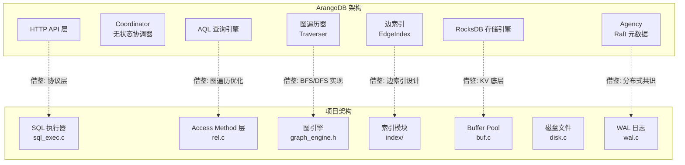
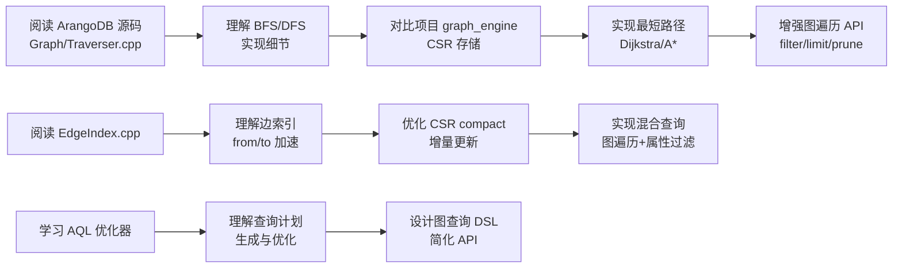

# ArangoDB 与项目关联

## 学习目标

- 分析 ArangoDB 架构与本项目存储引擎的对比
- 找出项目中可借鉴的 ArangoDB 设计
- 建立从学习到实践的技术路径

## 架构对比



## 与项目模块关联

### 1. 与 graph_engine 模块关联

项目已有图引擎实现（`engineering/include/db/graph_engine.h`）：

| ArangoDB 设计 | 项目对应 | 可借鉴程度 |
|--------------|---------|-----------|
| 边集合（Edge Collection） | `graph_edge_create()` | 已实现 |
| 顶点集合（Vertex Collection） | `graph_vertex_create()` | 已实现 |
| 边索引（from/to 加速） | CSR 存储 `graph_engine_enable_csr()` | 已实现 |
| 图遍历 BFS/DFS | `graph_scan_vertices()` 基础遍历 | 可增强 |
| 最短路径算法 | 待实现 | 高 |
| 标签/关系类型管理 | `graph_get_or_create_label()` | 已实现 |
| 多模型（图+文档+KV） | `storage_engine.h` 接口支持 | 已设计 |

```c
// 项目现有图引擎 API
graph_t *g = graph_open("mygraph");
graph_vertex_id_t v1 = graph_vertex_create(g, "User", props, n);
graph_vertex_id_t v2 = graph_vertex_create(g, "User", props, n);
graph_edge_id_t e = graph_edge_create(g, v1, v2, "KNOWS", NULL, 0);

// ArangoDB AQL 等价操作
// INSERT {name: "Alice"} INTO users
// INSERT {_from: "users/alice", _to: "users/bob"} INTO knows

// 项目的 CSR 存储（类似 ArangoDB 边索引）
graph_engine_enable_csr(rel, 1000000);
graph_engine_csr_compact(rel);  // COO → CSR 转换
```

### 2. 与 index 模块关联

项目索引目录包含丰富的索引实现：

| ArangoDB 索引 | 项目对应 | 文件 |
|--------------|---------|------|
| Persistent Index | B+树、BTree | `bplus_tree/bptree.h`, `btree/btree.h` |
| Edge Index | CSR 邻接表 | `graph_engine.h` |
| Skip List | 跳表实现 | `skip_list/skip_list.h` |
| Fulltext (ArangoSearch) | 倒排索引 | `gin/gin.h`, `gist/gist.h` |
| Geo Index | R-Tree | `rtree/rtree.h` |
| Hash Index | CCEH、Cuckoo | `hash/cceh.h`, `hash/cuckoo.h` |

```c
// 项目索引使用示例（与 ArangoDB 边索引类似）
#include "db/index/btree/btree.h"

// ArangoDB 边索引加速 from/to 查询
// 项目可使用 BTree 或 CSR 实现类似效果
btree_t *edge_idx = btree_create();
btree_insert(edge_idx, &(edge_key_t){.src = v1, .dst = v2}, ...);
```

### 3. 与 storage 模块关联

项目多模态存储引擎接口（`storage_engine.h`）：

```c
// 项目支持多数据模型，与 ArangoDB 多模型对应
typedef enum {
    MODEL_RELATIONAL = 0,
    MODEL_KV = 1,
    MODEL_GRAPH = 2,        // 图模型
    MODEL_VECTOR = 3,       // 向量模型
    MODEL_TIMESERIES = 4,
    MODEL_DOCUMENT = 5,     // 文档模型
    MODEL_SPATIAL = 6,
    MODEL_TREE = 7,
} DataModel;

// 获取图引擎操作表（类似 ArangoDB 的多模型切换）
const storage_ops_t *ops = storage_get_engine(MODEL_GRAPH);
```

### 4. 与 algo 模块关联

项目的算法库可复用于图遍历：

| ArangoDB 算法 | 项目对应 | 说明 |
|--------------|---------|------|
| BFS 遍历 | 算法库队列 | 可实现层序遍历 |
| DFS 遍历 | 算法库栈 | 可实现深度遍历 |
| 最短路径 | Dijkstra/A* | 待实现 |
| PageRank | 图算法 | 待实现 |
| 社区检测 | 聚类算法 | 可借鉴 |

## 可借鉴设计

### 1. 边索引加速图遍历

ArangoDB 的 Edge Index 本质是针对 `from`/`to` 字段的倒排索引：

```c
// ArangoDB Edge Index 设计原理
// from_index: from_vertex -> [edge1, edge2, ...]
// to_index: to_vertex -> [edge1, edge2, ...]

// 项目借鉴：CSR 格式实现高效出边查询
typedef struct csr_storage_s {
    uint64_t *row_ptr;    // 行偏移数组
    uint64_t *col_idx;    // 列索引数组（目标顶点）
    void     *edge_data;  // 边数据
    uint64_t  num_vertices;
    uint64_t  num_edges;
} csr_storage_t;

// 出边查询 O(1)
const uint64_t *get_out_edges(csr_storage_t *csr, uint64_t src, uint32_t *count) {
    uint64_t start = csr->row_ptr[src];
    uint64_t end = csr->row_ptr[src + 1];
    *count = end - start;
    return &csr->col_idx[start];
}
```

### 2. 图遍历算法实现

```c
// BFS 图遍历（借鉴 ArangoDB Traverser）
#include "ds/queue/queue.h"

typedef struct traversal_result_s {
    graph_vertex_id_t *vertices;
    graph_edge_id_t   *edges;
    size_t            count;
} traversal_result_t;

int graph_traverse_bfs(graph_t *g, graph_vertex_id_t start, int depth,
                       traversal_result_t *result) {
    queue_t *q = queue_create();
    set_t *visited = set_create();
    
    queue_enqueue(q, start);
    set_add(visited, start);
    
    while (!queue_empty(q)) {
        graph_vertex_id_t v = queue_dequeue(q);
        graph_edge_id_t *edges;
        size_t n_edges;
        
        graph_vertex_get_out_edges(g, v, NULL, &edges, &n_edges);
        for (size_t i = 0; i < n_edges; i++) {
            graph_edge_t *e;
            graph_edge_get(g, edges[i], &e);
            if (!set_contains(visited, e->dst)) {
                set_add(visited, e->dst);
                queue_enqueue(q, e->dst);
                result->vertices[result->count++] = e->dst;
            }
        }
    }
    return 0;
}
```

### 3. 混合查询（图 + 文档）

ArangoDB 的 AQL 允许在同一查询中混合图遍历和文档过滤：

```c
// 项目借鉴：在图遍历中加入属性过滤
int graph_traverse_filter(graph_t *g, graph_vertex_id_t start,
                          const char *label_filter,
                          const graph_prop_t *prop_filter,
                          size_t n_props,
                          traversal_result_t *result) {
    // 遍历图
    graph_vertex_get_out_edges(g, start, NULL, &edges, &n);
    for (size_t i = 0; i < n; i++) {
        graph_vertex_t *v;
        graph_vertex_get(g, edges[i]->dst, &v);
        
        // 过滤标签
        if (label_filter && strcmp(v->label, label_filter) != 0)
            continue;
        
        // 过滤属性（类似 ArangoDB FILTER 子句）
        if (prop_filter) {
            bool match = true;
            for (size_t j = 0; j < n_props; j++) {
                if (!graph_vertex_has_prop(v, &prop_filter[j])) {
                    match = false;
                    break;
                }
            }
            if (!match) continue;
        }
        
        result->vertices[result->count++] = v->id;
    }
    return 0;
}
```

### 4. 最短路径算法

```c
// Dijkstra 最短路径（借鉴 ArangoDB K_SHORTEST_PATHS）
#include "ds/heap/minheap.h"

typedef struct path_result_s {
    graph_vertex_id_t *path;
    size_t            length;
    double            weight;
} path_result_t;

int graph_shortest_path(graph_t *g, graph_vertex_id_t src, graph_vertex_id_t dst,
                        path_result_t *result) {
    minheap_t *pq = minheap_create();
    map_t *dist = map_create();
    map_t *prev = map_create();
    
    map_set(dist, src, 0.0);
    minheap_push(pq, 0.0, src);
    
    while (!minheap_empty(pq)) {
        graph_vertex_id_t u = minheap_pop(pq);
        if (u == dst) break;  // 找到目标
        
        graph_edge_id_t *edges;
        size_t n;
        graph_vertex_get_out_edges(g, u, NULL, &edges, &n);
        
        for (size_t i = 0; i < n; i++) {
            graph_edge_t *e;
            graph_edge_get(g, edges[i], &e);
            double alt = map_get(dist, u) + e->weight;
            
            if (alt < map_get(dist, e->dst)) {
                map_set(dist, e->dst, alt);
                map_set(prev, e->dst, u);
                minheap_push(pq, alt, e->dst);
            }
        }
    }
    
    // 回溯路径
    result->length = 0;
    graph_vertex_id_t curr = dst;
    while (curr != src) {
        result->path[result->length++] = curr;
        curr = map_get(prev, curr);
    }
    result->path[result->length++] = src;
    
    return 0;
}
```

## 学习与实践路径



### 分阶段提升计划

| 阶段 | 目标 | 可参考的 ArangoDB 源码 |
|------|------|------------------------|
| Phase 1 | 完善 CSR 边索引 | `RocksDBEdgeIndex.cpp` |
| Phase 2 | 实现 BFS/DFS 遍历 | `Traverser.cpp` |
| Phase 3 | 实现最短路径 | `ShortestPathFinder.cpp` |
| Phase 4 | 混合查询（图+过滤） | `TraversalExecutor.cpp` |
| Phase 5 | 图查询 DSL 设计 | `Optimizer.cpp` |

## 要点总结

- 项目的 `graph_engine` 已具备基础图存储能力，可借鉴 ArangoDB 增强遍历算法
- CSR 存储与 ArangoDB 边索引设计思路一致，可进一步优化增量更新
- 项目的索引模块丰富，可组合使用 BTree/SkipList/Hash 实现类似 Edge Index 的效果
- 多模态存储接口已支持图模型，可实现类似 ArangoDB 的混合查询
- 建议从 Traverser.cpp 入手，逐步实现 BFS/DFS/最短路径算法

## 思考题

1. 项目的 CSR 存储与 ArangoDB 的 RocksDB Edge Index 各有什么优缺点？在什么场景下选择哪种？
2. 如果要在项目中实现类似 AQL 的图遍历语法，需要如何设计查询优化器？
3. ArangoDB 的多模型特性在项目架构中如何体现？`storage_engine.h` 接口是否足够灵活？