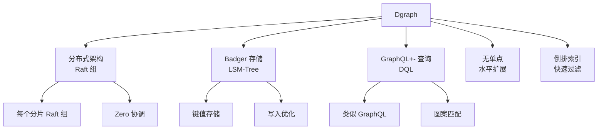
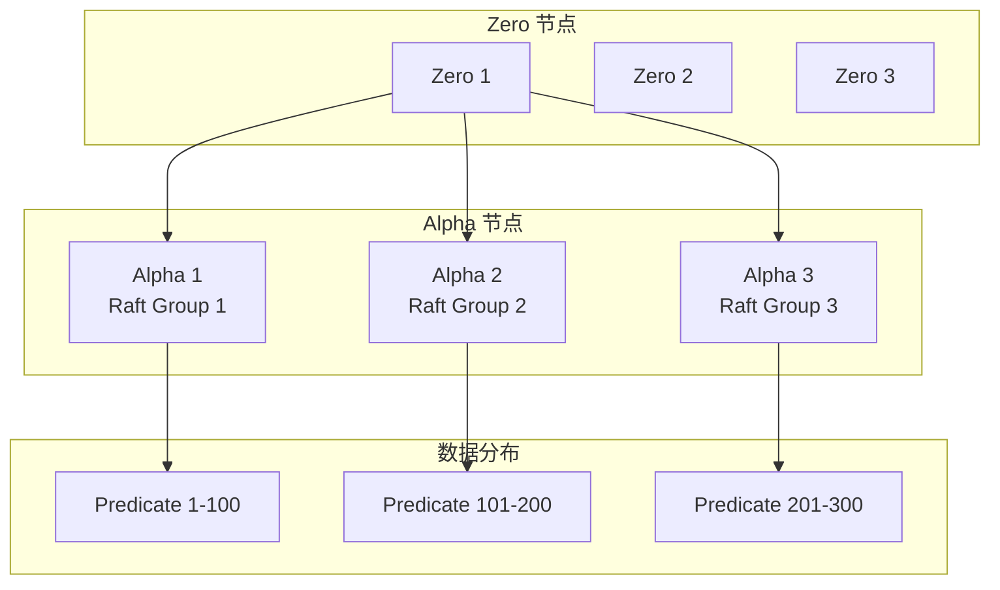

# Dgraph 项目概览

## 学习目标

- 了解 Dgraph 作为分布式图数据库的定位
- 掌握 Dgraph 的 Badger LSM-Tree 存储和 GraphQL 查询

## 项目定位

> Dgraph 是一个分布式图数据库，使用 Go 实现，支持 GraphQL 风格的查询语言，支持 trillion 级别数据。

**基本信息**：
- 开发方：Dgraph Labs
- 首次发布：2016 年
- 开源协议：Apache 2.0
- GitHub Stars：约 24k

## 核心设计



## 架构特点



## DQL 示例

```graphql
type Person {
  name: string @index(term)
  age: int
  knows: [Person]
}

# 查询
{
  query(func: eq(name, "Alice")) {
    name
    age
    knowsperson: knows {
      name
    }
  }
}

# 聚合查询
{
  query(func: has(Person.name)) {
    count(uid)
  }
}
```

## 要点总结

- 按 Predicate 分片，不同于按顶点分片
- Badger LSM-Tree 存储引擎
- GraphQL 风格查询语言 DQL
- Zero 协调器管理集群

## 思考题

1. Dgraph 按 Predicate 分片与按顶点分片相比有何优劣？
2. Badger LSM-Tree 存储对图数据写入性能有何影响？
3. Zero 协调器与 Raft Leader 的关系是什么？