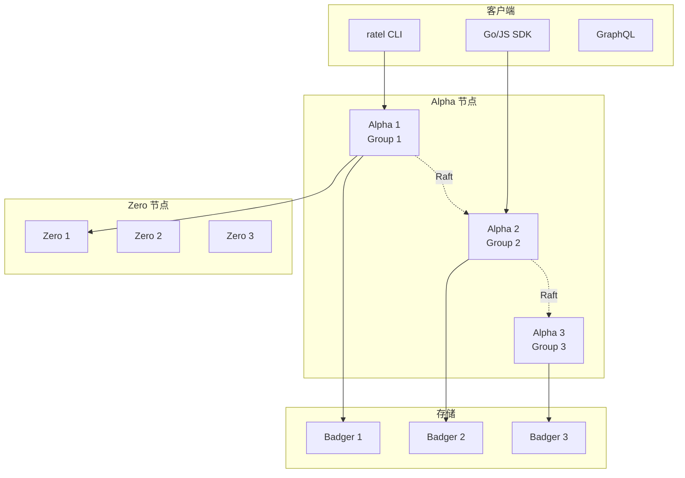
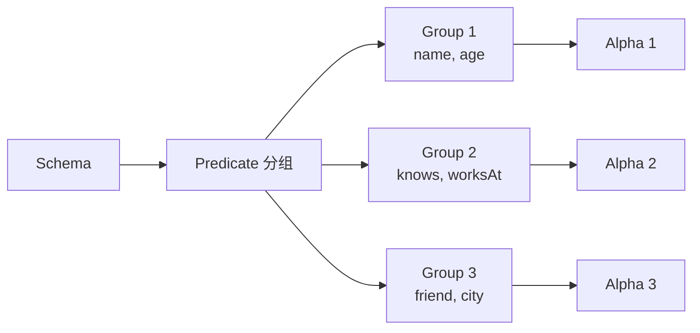

# Dgraph 架构设计

## 学习目标

- 理解 Dgraph 的 Predicate 分片架构
- 掌握 Dgraph 的 Badger LSM-Tree 存储

## 整体架构



## Predicate 分片



**关键设计**：按 Predicate（属性）分组，而非按顶点分组

```go
// 好处
// 1. 相关属性在同一节点
// 2. 减少网络跳转
// 3. 聚合查询高效

// 示例
// Alice 的所有属性（name, age, knows）在同一组
// 查询 Alice 的朋友：单节点内完成
```

## Badger LSM-Tree 存储

```go
// Badger 是 Dgraph 自研的 KV 存储
// 基于 LSM-Tree 架构

// 数据格式
// Key:   [predicate_uid_hash][uid][predicate]
// Value: [value]

// 写入流程
// 1. 写入 WAL
// 2. 写入 MemTable
// 3. MemTable 刷盘为 L0 SSTable
// 4. 后台 compaction 合并

// 读取流程
// 1. 查 MemTable
// 2. 查 L0 最新 SSTable
// 3. 逐层向下查找
```

## Zero 协调器

```go
// Zero 职责
// 1. 集群管理
// 2. 均衡负载
// 3. 垃圾回收
// 4. 快照管理

// Raft 组
// Zero 通常 3 或 5 节点
// 使用 Raft 选主

// Tablet 分配
// 每个 Predicate 对应一个 Tablet
// Tablet 分配给某个 Raft 组
// Zero 定期检查负载均衡
```

## 要点总结

- Predicate 分片优化图遍历
- Badger LSM-Tree 写入高效
- Zero 协调器管理集群
- 无单点故障

## 思考题

1. Predicate 分片相比顶点分片，在好友推荐场景下有何优势？
2. Badger 的 LSM-Tree 对图数据读取性能有何影响？
3. Zero 节点故障后如何恢复？