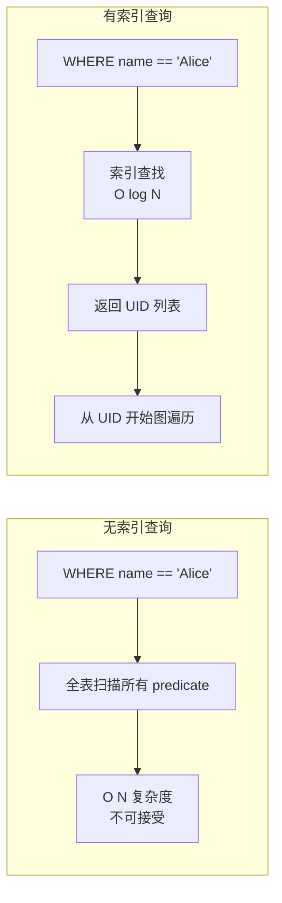
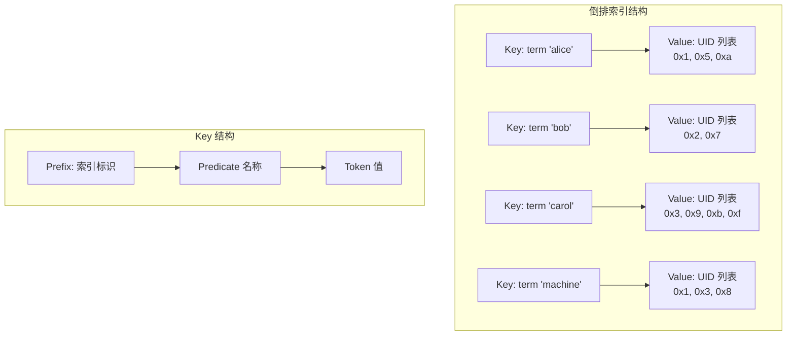
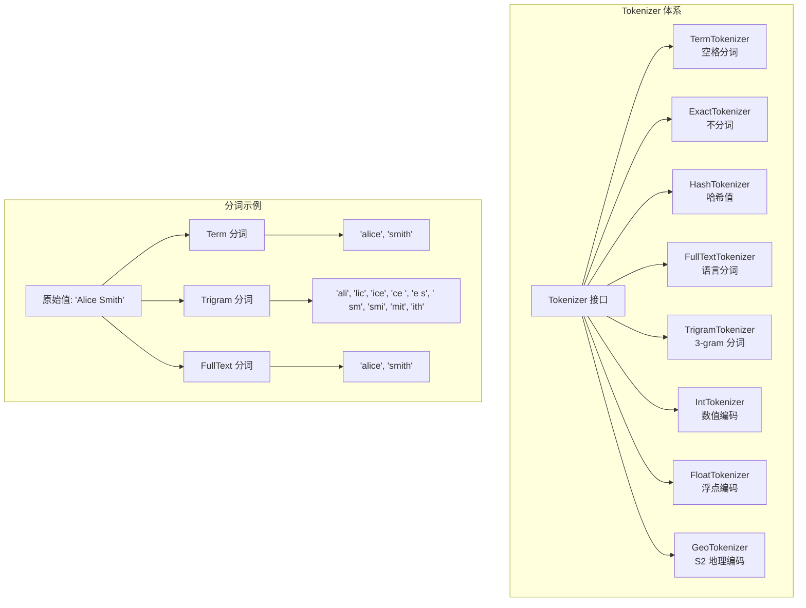
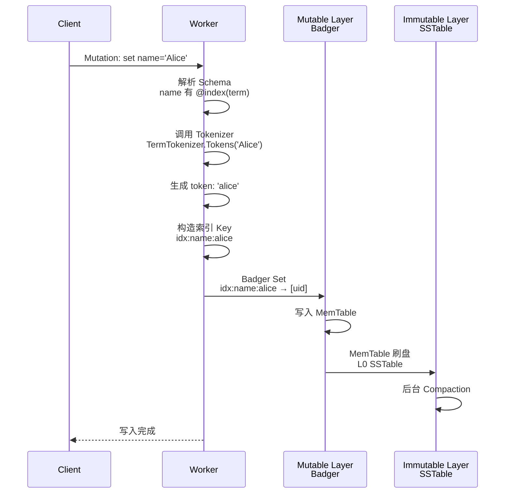
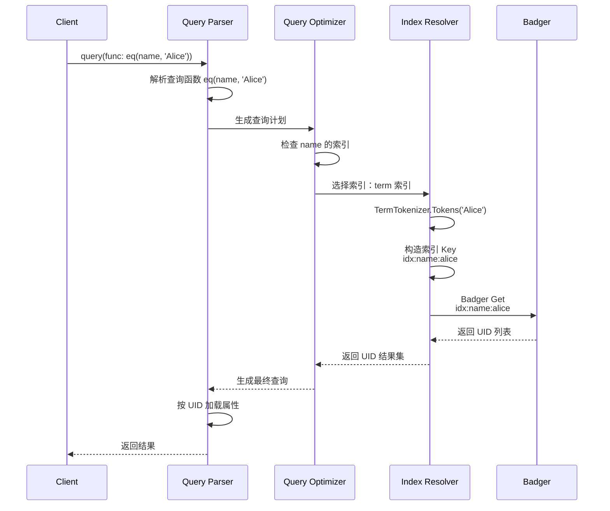
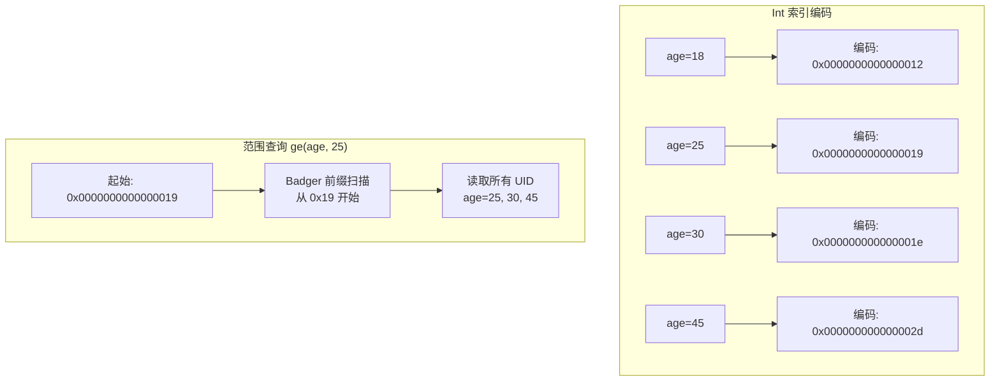
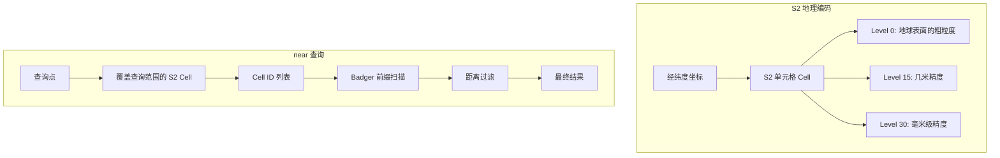
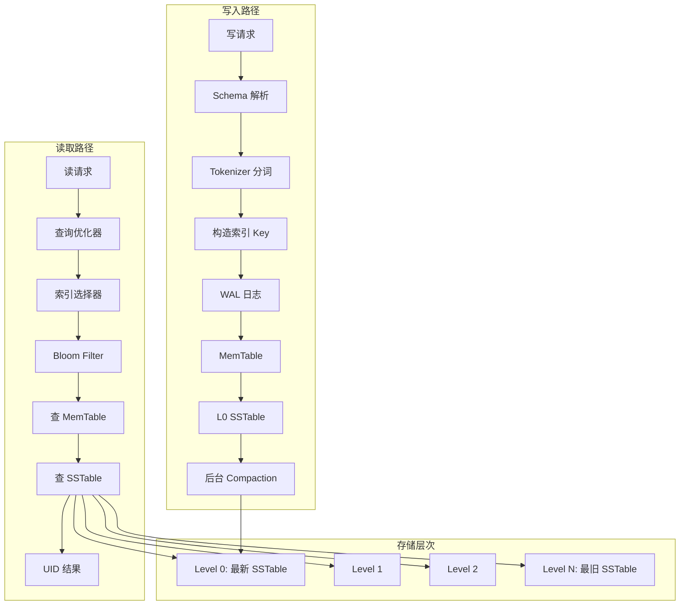
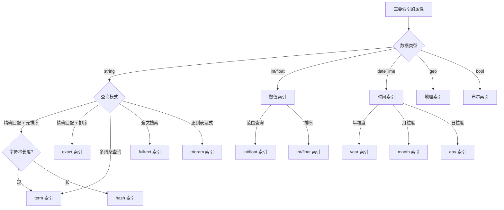
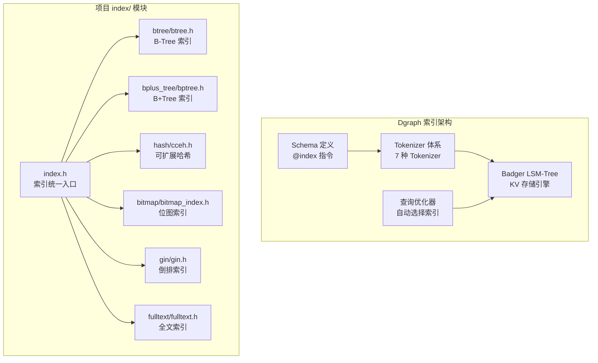

# Dgraph 索引机制

## 学习目标

- 掌握 Dgraph 的索引类型体系（@index 指令支持的各类索引）
- 理解 Dgraph 基于 Badger LSM-Tree 的倒排索引实现原理
- 能够根据查询模式选择合适的索引策略
- 对比 Dgraph 索引与项目 index/ 模块（BTree/Hash/Bitmap）的异同

## 核心概念

### 为什么图数据库需要索引？

Dgraph 的图遍历查询基于 UID 从顶点出发沿边扩展，例如：

```graphql
{
  query(func: uid(0x1)) {
    name
    knows {
      name
    }
  }
}
```

但实际场景中，用户经常需要**基于属性条件**找到起始顶点：

```graphql
{
  query(func: eq(name, "Alice")) {
    name
    age
  }
}
```

这类查询如果没有索引，Dgraph 必须**全表扫描**所有顶点的属性值，效率极低。索引的核心作用是建立**属性值到 UID 的映射**，实现 O(log N) 级别的定位。

### 索引的基本原理



**核心思想**：索引是**属性值 → UID 列表**的映射表，通过属性值快速定位起始顶点，再用 UID 进行图遍历。

### Dgraph 索引的独特之处

与传统关系数据库不同，Dgraph 的索引体系有以下几个关键特点：

| 特点 | 说明 |
|------|------|
| **Schema 驱动** | 索引在 Schema 中通过 `@index` 指令声明，而非通过 DDL 创建 |
| **按谓词索引** | 索引按 Predicate 组织，而非按表或顶点 |
| **多种索引类型** | 不同数据类型支持不同的索引，用户需根据查询模式选择 |
| **自动维护** | 数据变更时索引自动更新，无需手动重建 |
| **倒排索引为主** | 核心索引结构是倒排索引，存储在 Badger KV 引擎中 |

## 索引类型详解

### 索引类型概览

Dgraph 的 `@index` 指令根据数据类型支持不同的索引类型：

| 数据类型 | 支持的索引 | 查询函数 |
|---------|-----------|---------|
| `string` | `term`, `exact`, `fulltext`, `trigram`, `hash` | `eq`, `allofterms`, `anyofterms`, `fulltext`, `regexp`, `anyoftext`, `alloftext` |
| `int64` / `float` | `int`, `float` | `eq`, `lt`, `le`, `gt`, `ge` |
| `dateTime` | `year`, `month`, `day`, `hour` | `eq`, `lt`, `le`, `gt`, `ge` |
| `geo` | `geo` | `near`, `within`, `contains`, `intersects` |
| `bool` | `bool` | `eq` |
| `uid` | `reverse`（反向边） | `eq` |
| `password` | 自动 | `checkpwd` |

### 1. 字符串索引（string）

字符串索引是 Dgraph 最丰富的索引类别，支持多种查询模式：

**term 索引**（默认）：
```graphql
type Person {
  name: string @index(term)
}
```

term 索引对字符串进行分词，每个词条建立一个倒排条目。支持 `eq`、`allofterms`、`anyofterms` 查询。

```graphql
{
  # 精确匹配
  q1(func: eq(name, "Alice")) { name }

  # 包含所有词条
  q2(func: allofterms(name, "machine learning")) { name }

  # 包含任一词条
  q3(func: anyofterms(name, "AI ML")) { name }
}
```

**exact 索引**：
```graphql
type Person {
  email: string @index(exact)
}
```

exact 索引将整个字符串作为单个词条索引，不进行分词。支持精确匹配和排序（`orderasc`/`orderdesc`）。

```graphql
{
  q(func: eq(email, "alice@example.com"), orderasc: name) {
    email
  }
}
```

**hash 索引**：
```graphql
type Person {
  uid_str: string @index(hash)
}
```

hash 索引对字符串计算哈希值，仅支持 `eq` 查询。适合长字符串的精确匹配，存储和查询效率高。

**fulltext 索引**：
```graphql
type Article {
  content: string @index(fulltext)
}
```

fulltext 索引支持语言分词、词干提取、停用词过滤。支持全文搜索查询。

```graphql
{
  q(func: fulltext(content, "machine learning algorithms")) {
    title
  }
}
```

**trigram 索引**：
```graphql
type Person {
  bio: string @index(trigram)
}
```

trigram 索引将字符串拆分为连续的三字符子串（trigram），支持正则表达式查询。

```graphql
{
  q(func: regexp(bio, /^Al.*engineer$/i)) {
    name
  }
}
```

### 2. 数值索引（int / float）

```graphql
type Person {
  age: int @index(int)
  score: float @index(float)
}
```

数值索引基于 B+Tree 结构，支持范围查询和排序。

```graphql
{
  # 范围查询
  q1(func: ge(age, 18)) {
    name
    age
  }

  # 组合范围
  q2(func: le(age, 30)) @filter(ge(age, 18)) {
    name
    age
  }

  # 排序
  q3(func: has(age), orderasc: age, first: 10) {
    name
    age
  }
}
```

### 3. 时间索引（dateTime）

```graphql
type Event {
  createdAt: dateTime @index(year)
}
```

时间索引支持按不同粒度建立索引，粒度越细索引越大：

| 索引 | 粒度 | 用途 |
|------|------|------|
| `@index(year)` | 年 | 按年份筛选 |
| `@index(month)` | 月 | 按月份筛选 |
| `@index(day)` | 日 | 按天筛选 |
| `@index(hour)` | 小时 | 按小时筛选 |

```graphql
{
  q(func: ge(createdAt, "2024-01-01T00:00:00Z")) @filter(lt(createdAt, "2024-07-01T00:00:00Z")) {
    title
    createdAt
  }
}
```

### 4. 地理索引（geo）

```graphql
type Place {
  location: geo @index(geo)
}
```

地理索引支持空间查询：

```graphql
{
  # 附近查询（半径范围）
  near(func: near(location, [-73.935242, 40.730610], 1000.0)) {
    name
  }

  # 包含查询
  within(func: within(location, [[[-74.0, 40.7], [-73.9, 40.7], [-73.9, 40.8], [-74.0, 40.8], [-74.0, 40.7]]])) {
    name
  }
}
```

### 5. 反向边索引（@reverse）

```graphql
type Person {
  knows: [Person] @reverse
}
```

`@reverse` 不是 `@index` 的子集，它是一个独立的 Schema 指令。它自动创建反向边，使得可以从目标顶点反向查询源顶点：

```graphql
{
  # 正向：Alice 认识谁
  q1(func: eq(name, "Alice")) {
    knows { name }
  }

  # 反向：谁认识 Alice
  q2(func: eq(name, "Alice")) {
    ~knows { name }
  }
}
```

### 6. 计数索引（@count）

```graphql
type Person {
  knows: [Person] @count
}
```

`@count` 指令对边的数量建立索引，支持按边的数量进行过滤和排序：

```graphql
{
  # 朋友数大于 10 的人
  q(func: gt(count(knows), 10), orderdesc: count(knows)) {
    name
    friendCount: count(knows)
  }
}
```

### 7. 复合索引（Composite Index）

Dgraph 通过 `@cascade` 指令和过滤器的组合实现复合索引的效果，但**不直接支持**传统意义上的复合索引（如 MySQL 的联合索引）。

```graphql
{
  q(func: eq(name, "Alice")) @filter(ge(age, 25) AND has(email)) {
    uid
    name
    age
    email
  }
}
```

查询执行过程：
1. 使用 `name` 的 term 索引找到所有名为 "Alice" 的顶点
2. 使用 `age` 的 int 索引过滤年龄 >= 25
3. 使用 `email` 的 exact 索引过滤有 email 的顶点
4. 取交集得到最终结果

**性能考量**：由于 Dgraph 不支持真正的联合索引，多条件查询需要在多个单属性索引上分别查找再取交集。当某个条件的选择性很高时，先使用该条件过滤可以大幅减少后续操作的数据量。

## 索引实现原理

### 1. 倒排索引结构

Dgraph 索引的核心是倒排索引，建立在 Badger LSM-Tree KV 存储之上：



**Badger Key 编码**：

```
索引 Key 格式: [idx_prefix][predicate_length][predicate][token_term]

- idx_prefix: 1 byte，标识索引类型（term/exact/fulltext 等）
- predicate_length: varint，谓词名长度
- predicate: 谓词名
- token_term: 分词后的索引词条
```

**Value 编码**：

```
索引 Value 格式: [uid_list]

- uids 以 varint 编码的差值列表存储
- 相邻 UID 的差值较小，压缩率高
- 支持 bitmap 编码优化
```

### 2. 分词器（Tokenizer）架构

Dgraph 的索引系统围绕 Tokenizer 接口设计，每种索引类型对应一个 Tokenizer：



**Tokenizer 接口**：

```go
// Tokenizer 接口定义
type Tokenizer interface {
    // Name 返回分词器名称
    Name() string

    // Type 返回处理的数据类型
    Type() string

    // Tokens 对 given value 进行分词，返回索引词条列表
    Tokens(interface{}) ([]string, error)

    // Compare 比较两个 token 的顺序
    Compare(a, b string) int
}
```

### 3. 索引写入流程



**写入路径**：

1. 客户端提交 Mutation（数据变更）
2. Worker 解析 Schema，检测到 `name` 有 `@index(term)` 索引
3. 调用 `TermTokenizer.Tokens("Alice")` 生成索引词条 "alice"
4. 构造 Badger Key：`[idx:term][name][alice]`
5. 将 UID 追加到该 Key 的 Posting List 中
6. 写入 Badger MemTable
7. 后台异步刷盘和 Compaction

### 4. 索引查询流程



### 5. 数值索引实现

数值索引的底层实现与字符串不同，采用**有序编码**方式：



**数值编码关键点**：

- 整数采用大端序编码，保证字节序比较与数值序一致
- 浮点数通过 IEEE 754 编码转换，保持可比较性
- 时间类型（dateTime）编码为 Unix 时间戳的整数形式
- B+Tree 有序遍历支持范围查询的快速定位

### 6. 地理索引实现

地理索引基于 **Google S2 几何库** 实现：



### 7. 索引数据流总览



## 索引选择策略

### 1. 选择原则

| 查询模式 | 推荐索引类型 | 示例 |
|---------|------------|------|
| 精确匹配（短字符串） | `term` | `eq(name, "Alice")` |
| 精确匹配（长字符串） | `hash` | `eq(email, "long@example.com")` |
| 精确匹配 + 排序 | `exact` | `eq(name, "Alice")` + `orderasc` |
| 多词条查询 | `term` | `allofterms(desc, "machine learning")` |
| 全文搜索 | `fulltext` | `fulltext(content, "AI")` |
| 正则表达式 | `trigram` | `regexp(name, /^A/)` |
| 范围查询 | `int` / `float` | `ge(age, 18)` |
| 时间范围 | `dateTime` | `ge(createdAt, "2024-01")` |
| 地理空间 | `geo` | `near(loc, [lon, lat], 1000)` |
| 反向遍历 | `@reverse` | `~knows` |
| 边计数过滤 | `@count` | `gt(count(friends), 10)` |

### 2. 索引选择决策树



### 3. 多索引组合策略

当查询涉及多个属性时，Dgraph 通过 `@filter` 组合多个索引：

```graphql
# 场景：查询北京 25 岁以上的人
{
  q(func: eq(city, "Beijing")) @filter(ge(age, 25)) {
    name
    age
    city
  }
}
```

**执行策略**：

1. 使用 `city` 的 term 索引找到所有北京的人（UIDS1）
2. 使用 `age` 的 int 索引找到所有 25 岁以上的人（UIDS2）
3. 取交集：UIDS1 ∩ UIDS2
4. 加载属性返回结果

**优化建议**：选择性高的条件应放在 `func()` 中，而不是 `@filter` 中：

```graphql
-- 推荐：选择性高的条件做 func
-- 假设 city 选择性高（只有少数城市）
{
  q(func: eq(city, "Beijing")) @filter(ge(age, 25)) {
    name
  }
}

-- 如果 age 选择性更高
{
  q(func: ge(age, 25)) @filter(eq(city, "Beijing")) {
    name
  }
}
```

### 4. 索引与排序

Dgraph 的排序操作依赖索引：

```graphql
-- 按 age 排序需要 age 有 int 索引
{
  q(func: has(age), orderasc: age, first: 10) {
    name
    age
  }
}

-- 按 name 排序需要 name 有 exact 索引
{
  q(func: has(name), orderdesc: name, first: 10) {
    name
    age
  }
}
```

**排序实现原理**：Dgraph 通过 Badger 的迭代器按索引 Key 的有序遍历来实现排序，因此索引必须支持有序遍历（term 索引不支持，exact 索引支持）。

### 5. 索引代价分析

| 索引类型 | 存储代价 | 写入代价 | 查询代价 | 适用场景 |
|---------|---------|---------|---------|---------|
| `term` | 中 | 低 | 低 | 通用字符串匹配 |
| `exact` | 低 | 低 | 低 | 精确匹配 + 排序 |
| `hash` | 低 | 低 | 低 | 长字符串精确匹配 |
| `fulltext` | 高 | 高 | 中 | 全文搜索 |
| `trigram` | 非常高 | 非常高 | 高 | 正则表达式 |
| `int` | 中 | 中 | 低 | 数值范围查询 |
| `float` | 中 | 中 | 低 | 浮点范围查询 |
| `geo` | 高 | 高 | 中 | 地理空间查询 |
| `@reverse` | 中 | 中 | 低 | 反向边遍历 |
| `@count` | 低 | 中 | 低 | 边计数过滤 |

## 与项目 index/ 模块对比

### 1. 架构对比



### 2. 存储层对比

Dgraph 的索引建立在 Badger LSM-Tree 之上，项目 index/ 模块是纯粹的内存数据结构：

| 维度 | Dgraph（Badger） | 项目 index/ 模块 |
|------|-----------------|-----------------|
| **存储引擎** | LSM-Tree（Badger） | 纯内存结构 |
| **持久化** | 自动持久化 | 手动序列化 |
| **写入优化** | 批量写入 + Compaction | 单点写入 |
| **读取优化** | Bloom Filter 加速 | 直接内存访问 |
| **并发控制** | Badger 事务支持 | 应用层控制 |
| **数据量** | 磁盘级（TB 级） | 内存级（GB 级） |

### 3. 倒排索引对比

**Dgraph 倒排索引**：
- 基于 Badger KV 存储
- 索引 Key 由 Prefix + Predicate + Token 组成
- Value 存储 UID 差值列表
- 支持多种 Tokenizer（term/exact/fulltext/trigram）

**项目 GIN 索引（`gin/gin.h`）**：

```c
// GIN: Generalized Inverted Index
gin_index_t *gin_create(int capacity);
int gin_insert(gin_index_t *idx, const char *key, int doc_id);
int gin_search(gin_index_t *idx, const char *key, int *results, int *count);

// Posting List 结构
struct posting_list {
    int doc_id;
    struct posting_list *next;
};

// Posting Array 结构（优化大列表）
struct posting_array {
    int *doc_ids;    // 有序数组
    int count;
    int capacity;
};
```

**对比**：

| 维度 | Dgraph | 项目 GIN |
|------|--------|---------|
| **存储** | Badger LSM-Tree（磁盘） | 内存链表/数组 |
| **分词器** | 插件式体系（7+ 种） | 应用层自定义 |
| **Posting List** | 差值编码压缩 | 链表/数组 |
| **范围查询** | B+Tree 有序遍历 | 不支持 |
| **持久化** | 自动 | 无 |

### 4. B+Tree 对比

**Dgraph 数值索引**：
- 通过 Badger 的有序 Key 实现 B+Tree 风格的有序遍历
- Key 是大端序编码的数值，Value 是 UID 列表
- 支持范围查询和排序

**项目 B+Tree（`bplus_tree/bptree.h`）**：

```c
// 项目 B+Tree API
bptree_index_t *bptree_create(uint32_t order, bptree_compare_fn compare, void *ctx);
int bptree_insert(bptree_index_t *index, const void *key, uint32_t keylen,
                  const void *value, uint32_t valuelen);
int bptree_lookup(const bptree_index_t *index, const void *key, uint32_t keylen,
                  void **value_out, uint32_t *valuelen_out);

// 范围查询
bptree_iter_t *bptree_iter_create(const bptree_index_t *index,
                                   const void *start_key, uint32_t start_keylen);
bool bptree_iter_next(bptree_iter_t *iter);
```

**对比**：

| 维度 | Dgraph 数值索引 | 项目 B+Tree |
|------|----------------|------------|
| **底层结构** | Badger LSM-Tree 有序遍历 | 原生 B+Tree 内存结构 |
| **写入性能** | 批量 Compaction 优化 | 实时插入，可能触发分裂 |
| **范围查询** | 前缀扫描 | 叶子节点链表遍历 |
| **持久化** | 自动 | 手动 `bptree_save()` |
| **并发控制** | 事务隔离 | 应用层锁 |

### 5. Hash 索引对比

**Dgraph hash 索引**：
- 对字符串计算哈希值，仅支持 `eq` 查询
- 哈希值作为 Badger Key，避免长字符串存储

**项目 CCEH 索引（`hash/cceh.h`）**：

```c
// CCEH: Cache-Conscious Extendible Hashing
cceh_index_t *cceh_index_create(uint32_t segment_capacity, uint32_t initial_global_depth);
int cceh_index_insert(cceh_index_t *index,
                      const void *key, uint32_t keylen,
                      const void *value, uint32_t valuelen);
int cceh_index_lookup(const cceh_index_t *index,
                      const void *key, uint32_t keylen,
                      void **value_out, uint32_t *valuelen_out);
```

**对比**：

| 维度 | Dgraph hash 索引 | 项目 CCEH |
|------|-----------------|----------|
| **用途** | 长字符串精确匹配 | 通用 Key-Value 查找 |
| **哈希冲突** | Badger Key 唯一性保证 | 分段扩展解决 |
| **动态扩展** | 无（Badger 自动管理） | 全局深度动态扩展 |
| **Cache 友好** | 否（磁盘访问） | 是（Segment 对齐） |

### 6. Bitmap 索引对比

**Dgraph**：没有独立的 Bitmap 索引类型。Posting List 的 UID 列表在内部可使用 bitmap 编码优化，但对用户透明。

**项目 Bitmap 索引（`bitmap/bitmap_index.h`）**：

```c
// Bitmap 索引
bitmap_index_t *bitmap_create(int n_docs, int n_values);
int bitmap_set(bitmap_index_t *idx, int doc_id, int value);
int bitmap_eq(const bitmap_index_t *idx, int value, int *doc_ids, int *count);
int bitmap_and(const bitmap_index_t *idx, int value1, int value2, int *doc_ids, int *count);
int bitmap_or(const bitmap_index_t *idx, int value1, int value2, int *doc_ids, int *count);
```

**对比**：

| 维度 | Dgraph | 项目 Bitmap |
|------|--------|------------|
| **存在性** | 无独立 Bitmap 索引 | 独立 Bitmap 索引实现 |
| **适用场景** | 不适用 | 低基数属性、多维分析 |
| **位运算** | 不直接支持 | AND/OR/NOT 原生支持 |
| **压缩** | UID 差值编码 | RLE 压缩 |

### 7. 功能对比总结

| 特性 | Dgraph | 项目 index/ 模块 |
|------|--------|-----------------|
| **倒排索引** | 核心架构（Badger） | `gin/gin.h` |
| **B+Tree 索引** | Badger 有序遍历 | `bplus_tree/bptree.h` |
| **Hash 索引** | `hash` 索引类型 | `hash/cceh.h`, `hash/cuckoo.h` |
| **Bitmap 索引** | 内部 UID 编码优化 | `bitmap/bitmap_index.h` |
| **全文索引** | `fulltext` 索引类型 | `fulltext/fulltext.h` |
| **地理索引** | `geo` 索引类型（S2） | 无 |
| **反向索引** | `@reverse` 指令 | 无 |
| **计数索引** | `@count` 指令 | 无 |
| **分词器体系** | 插件式 Tokenizer | 应用层自定义 |
| **持久化** | 自动（Badger） | 手动 |
| **分布式** | 原生支持 | 单机 |
| **查询优化器** | 自动选择索引 | 应用层选择 |

## 完整 Schema 示例

```graphql
# 社交网络 Schema
type Person {
    uid_str: string @id @index(hash)          # 唯一标识符，hash 索引
    name: string @index(term, exact)           # 名称，支持分词和精确匹配
    email: string @index(exact)                # 邮箱，精确匹配
    bio: string @index(fulltext)               # 个人简介，全文搜索
    age: int @index(int)                       # 年龄，范围查询
    score: float @index(float)                 # 分数，范围查询
    location: geo @index(geo)                  # 地理位置，空间查询
    createdAt: dateTime @index(day)            # 创建时间，日粒度索引
    knows: [Person] @reverse @count            # 好友关系，反向边 + 计数
    likes: [Post] @reverse                     # 点赞，反向边
}

type Post {
    title: string @index(term)                 # 标题，分词索引
    content: string @index(fulltext)           # 内容，全文索引
    tags: [string] @index(term)                # 标签，分词索引
    createdAt: dateTime @index(year)           # 发布时间，年粒度索引
    author: Person                             # 作者
}
```

## 索引查询优化建议

### 1. 减少索引数量

```graphql
-- 不推荐：同时创建多个字符串索引
type Person {
    name: string @index(term) @index(exact) @index(hash) @index(trigram) @index(fulltext)
}

-- 推荐：根据查询模式选择最合适的 1-2 个索引
type Person {
    name: string @index(term, exact)  -- term 分词 + exact 排序
}
```

### 2. 利用选择性

```graphql
-- 选择性高（唯一性强）的字段放在 func() 中
-- 选择性低（重复值多）的字段放在 @filter() 中

-- 推荐：选择性高的条件做 func
{
  q(func: eq(email, "alice@example.com")) {
    name
    age
    city
  }
}
```

### 3. 分页与限制

```graphql
-- 使用 first / offset 做分页，依赖索引排序
{
  q(func: has(createdAt), orderdesc: createdAt, first: 20, offset: 0) {
    title
    createdAt
  }
}
```

### 4. 使用 has() 扫描

```graphql
-- has() 函数利用索引快速判断属性是否存在
{
  q(func: has(email)) {
    name
    email
  }
}
```

## 要点总结

- **索引类型丰富**：Dgraph 提供 7 类索引（term/exact/hash/fulltext/trigram/数值/地理），覆盖字符串、数值、时间、空间四种数据类型的查询需求
- **Schema 驱动**：索引通过 Schema 的 `@index` 指令声明，数据变更时自动维护，无需手动重建
- **倒排索引核心**：所有索引类型最终转化为倒排索引存储在 Badger LSM-Tree 中，Key 为前缀编码的索引词条，Value 为 UID 压缩列表
- **Tokenizer 体系**：每种索引类型对应一个 Tokenizer，负责将属性值分词为索引词条，Tokenizer 是 Dgraph 索引的可扩展设计
- **数值索引有序**：int/float 采用大端序编码，保证 Badger 的 Key 有序性与数值序一致，支持范围查询和排序
- **地理索引使用 S2**：基于 Google S2 几何库实现空间索引，支持 near/within/contains/intersects 四种查询
- **无复合索引**：Dgraph 不支持传统联合索引，多条件查询通过多个单属性索引取交集实现
- **与项目对比**：项目 index/ 模块提供更丰富的内存索引结构（BTree/Hash/Bitmap/GIN），但缺乏分布式、持久化、地理索引和查询优化器

## 思考题

1. Dgraph 的倒排索引基于 Badger LSM-Tree 实现，这与传统 B+Tree 实现的倒排索引（如 PostgreSQL GIN）相比，在写入和读取性能上各有何优劣？

2. Dgraph 不支持真正的复合索引，多条件查询通过多个单属性索引取交集实现。如果有三个条件 `eq(A) AND eq(B) AND ge(C)`，Dgraph 内部应该如何处理？执行顺序有何影响？

3. 如何为项目 `index/` 模块的 `gin/gin.h` 添加类似 Dgraph 的 Tokenizer 插件体系？需要抽象哪些接口？

4. Dgraph 的 `@reverse` 指令自动创建反向边索引，这与 NebulaGraph 的 Edge Index 有何本质区别？各适用于什么场景？

5. 假如要在项目 `graph_engine` 中实现类似 Dgraph 的索引功能，应该如何设计？需要引入哪些基础组件？能否复用现有的 `index/` 模块？

## 参考资料

- [Dgraph 官方文档 - Schema 索引](https://dgraph.io/docs/query-language/schema/)
- [Dgraph 官方文档 - 查询语言](https://dgraph.io/docs/query-language/query-language/)
- [Dgraph 源码 - Tokenizer 实现](https://github.com/dgraph-io/dgraph)
- [Badger 文档 - LSM-Tree 存储](https://github.com/dgraph-io/badger)
- [Google S2 几何库](http://s2geometry.io/)
- 项目 `engineering/include/db/index/` 模块源码