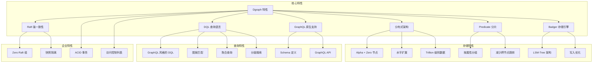
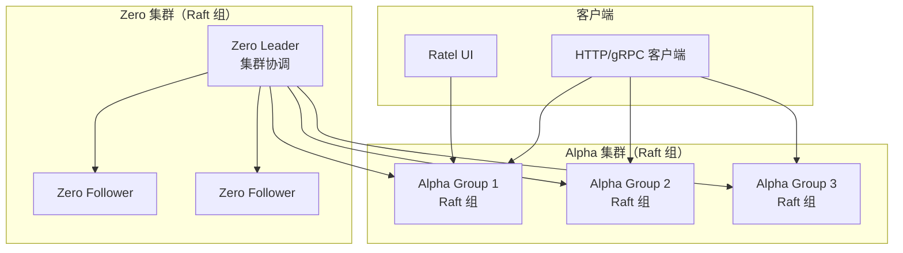
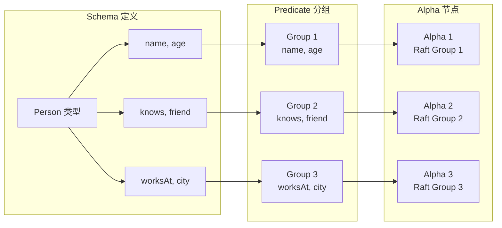
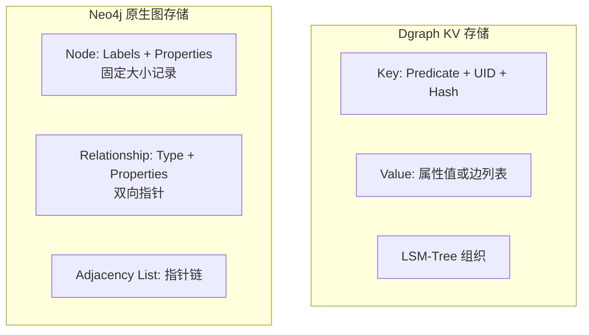

# Dgraph 关键特性

## 学习目标

- 掌握 Dgraph 的核心特性与设计理念
- 理解图数据模型、DQL 查询语言、索引机制等关键技术
- 能够与 Neo4j 等其他图数据库进行对比选型

## 特性总览



## 核心特性详解

### 1. 分布式架构

Dgraph 采用 **Alpha + Zero** 双组件架构：



**组件职责**：

| 组件 | 职责 | 说明 |
|------|------|------|
| **Zero** | 集群协调器 | 管理 Tablet 分配、负载均衡、事务时间戳、垃圾回收、快照管理 |
| **Alpha** | 数据节点 | 处理查询和写入，每个 Alpha 组是一个 Raft 复制组 |
| **Ratel** | Web UI | 浏览器管理界面，支持查询和 Schema 管理 |

**架构优势**：
- **无单点瓶颈**：Zero 和 Alpha 均可多节点部署
- **线性扩展**：增加 Alpha 组即可扩展存储和查询容量
- **高可用**：Raft 协议保证 3 节点组容忍 1 节点故障

### 2. Predicate 分片机制

Dgraph 采用独特的 **按 Predicate（属性/谓词）分片** 策略，而非按顶点分片：



**分片优势**：

| 对比项 | Predicate 分片 | 顶点分片（NebulaGraph） |
|--------|---------------|----------------------|
| 数据局部性 | 同一属性聚集，查询集中 | 顶点分散，跨节点查询多 |
| 跨节点跳转 | 少（属性在同一节点） | 多（邻居可能在不同节点） |
| 聚合查询 | 高效（单节点完成） | 需要跨节点聚合 |
| 写放大 | 写入涉及多个 Group | 写入集中在单个 Partition |
| 数据倾斜 | 热点属性可能倾斜 | 热点 Vid 可能倾斜 |

**Predicate 分片数据布局示例**：

```go
// 假设 Alice 的 name 和 age 在 Group 1，knows 在 Group 2
// 查询 Alice 的朋友姓名：
// 1. Group 1 查询 Alice 的 uid
// 2. Group 2 查询 Alice 的 knows 关系
// 3. Group 1 查询朋友姓名
// 相比顶点分片，可以减少一次跨节点查询

// 查询 Alice 的年龄和所有朋友：
// 1. Group 1 查询年龄（本地）
// 2. Group 2 查询朋友（本地）
// 两次本地查询，无需跨节点
```

### 3. DQL 查询语言

DQL（Dgraph Query Language）是 GraphQL 风格的查询语言：

```graphql
# 基础查询
{
  query(func: eq(name, "Alice")) {
    uid
    name
    age
  }
}

# 图案匹配（图遍历）
{
  query(func: eq(name, "Alice")) {
    name
    age
    knows {
      name
      age
    }
  }
}

# 多级嵌套
{
  query(func: eq(name, "Alice")) {
    name
    knows {
      name
      knows {
        name
      }
    }
  }
}

# 聚合查询
{
  query(func: has(Person.name)) {
    count(uid)
    avg(age)
    max(age)
    min(age)
  }
}

# 带参数查询
query query($name: string) {
  query(func: eq(name, $name)) {
    uid
    name
    age
  }
}
```

**查询特性对比**：

| 查询特性 | Dgraph DQL | Neo4j Cypher | 说明 |
|---------|------------|-------------|------|
| **基础查询** | `func: eq(name, "Alice")` | `MATCH (a:Person {name: "Alice"})` | DQL 函数式，Cypher 声明式 |
| **图遍历** | 嵌套 `{ knows { name } }` | `(a)-[:KNOWS]->(b)` | DQL 嵌套结构，Cypher 路径模式 |
| **多跳遍历** | 嵌套多层 `{ knows { knows { } } }` | `(a)-[*1..3]->(b)` | DQL 需要显式嵌套 |
| **聚合** | `count(uid)` 顶层聚合 | `RETURN count(b)` | 类似 |
| **过滤** | `@filter(gt(age, 18))` | `WHERE a.age > 18` | 语法不同 |
| **排序** | `orderasc: name` | `ORDER BY a.name` | 类似 |
| **分页** | `first: 10, offset: 20` | `SKIP 20 LIMIT 10` | 类似 |
| **变量** | `$name` 参数化 | `$name` 参数化 | 类似 |

**DQL 函数分类**：

| 函数类别 | 函数 | 说明 |
|---------|------|------|
| **根函数** | `eq`, `gt`, `ge`, `lt`, `le` | 等值和范围匹配 |
| **根函数** | `uid`, `uid_in` | UID 直接查询 |
| **根函数** | `has` | 存在性检查 |
| **根函数** | `allofterms`, `anyofterms` | 全文术语匹配 |
| **根函数** | `regexp` | 正则表达式 |
| **根函数** | `fulltext` | 全文搜索 |
| **过滤函数** | `@filter(gt(age, 18))` | 查询结果过滤 |
| **排序函数** | `orderasc`, `orderdesc` | 排序 |

### 4. 索引机制

Dgraph 支持多种索引类型，用于加速属性查询：

```graphql
# Schema 定义索引
type Person {
  name: string @index(term) .          # 术语索引
  age: int @index(int) .                # 整数索引
  score: float @index(float) .          # 浮点索引
  email: string @index(exact) .         # 精确匹配索引
  bio: string @index(fulltext) .        # 全文索引
  location: geo @index(geo) .           # 地理索引
  created_at: datetime @index(hour) .   # 时间索引
  tags: [string] @index(term) .         # 数组索引
}

# 复合索引（Dgraph 不支持传统复合索引，通过 filter 组合）
```

**索引类型详解**：

| 索引类型 | 适用类型 | 支持查询 | 存储开销 | 说明 |
|---------|---------|---------|---------|------|
| `term` | string | 术语匹配、等值 | 中等 | 分词后索引每个词 |
| `exact` | string | 精确等值 | 低 | 全字符串精确匹配 |
| `hash` | string | 精确等值 | 最低 | 哈希等值，范围查询不支持 |
| `fulltext` | string | 全文搜索 | 高 | 高级分词、停用词过滤 |
| `int` | int | 等值、范围、排序 | 低 | B+树风格 |
| `float` | float | 等值、范围、排序 | 低 | B+树风格 |
| `bool` | bool | 等值 | 最低 | 位图索引 |
| `geo` | geo | 地理范围 | 高 | R 树索引 |
| `hour/day/month/year` | datetime | 时间范围 | 低-中 | 时间粒度索引 |

**索引使用示例**：

```graphql
# 查询使用索引
{
  # 使用 term 索引
  alice(func: eq(name, "Alice")) {
    name
  }

  # 使用 int 索引的范围查询
  adults(func: ge(age, 18), orderasc: age) {
    name
    age
  }

  # 全文搜索
  docs(func: fulltext(bio, "graph database")) {
    name
    bio
  }

  # 组合过滤
  young_adults(func: eq(name, "Alice")) @filter(ge(age, 18) AND lt(age, 30)) {
    uid
    name
    age
  }
}
```

**索引与 Predicate 的关系**：
- 索引存储在 Predicate 所属的 Group 中
- 索引数据同样存储在 Badger 中，作为 KV 存储在 LSM-Tree 中
- 索引更新是同步的，在写入时原子更新（不同于 NebulaGraph 的异步重建）

### 5. 事务与一致性

Dgraph 实现了分布式 ACID 事务：

```go
// Dgraph 事务特性
// 1. 快照隔离（Snapshot Isolation）
// 2. 乐观并发控制（OCC），无锁
// 3. 分布式事务（跨多个 Alpha 组）
// 4. 时间戳由 Zero 统一分配

// Go 客户端事务示例
func transactionExample(client *dgo.Dgraph) error {
    ctx := context.Background()
    
    // 开启事务
    txn := client.NewTxn()
    defer txn.Discard(ctx)
    
    // 读取
    resp, err := txn.Query(ctx, `{
        alice(func: eq(name, "Alice")) {
            uid
            name
            age
        }
    }`)
    if err != nil {
        return err
    }
    
    // 写入
    mu := &api.Mutation{
        SetNquads: []byte(`
            <_:alice> <name> "Alice" .
            <_:alice> <age> "31" .
            <_:bob> <name> "Bob" .
            <_:alice> <knows> <_:bob> .
        `),
    }
    
    _, err = txn.Mutate(ctx, mu)
    if err != nil {
        return err
    }
    
    // 提交
    return txn.Commit(ctx)
}
```

**事务隔离级别与并发控制**：

| 特性 | Dgraph | Neo4j | NebulaGraph |
|------|--------|-------|-------------|
| **隔离级别** | 快照隔离 | 可重复读 | 单分区快照隔离 |
| **并发控制** | 乐观（OCC） | 悲观（锁） | 乐观 |
| **分布式事务** | 支持（跨 Group） | 不支持 | 单分区原子性 |
| **死锁** | 无（无锁） | 可能 | 无 |
| **冲突检测** | 提交时检测 | 写入时检测 | 提交时检测 |
| **重试机制** | 客户端自动重试 | 手动处理 | 客户端处理 |

### 6. Facet 分面搜索

Dgraph 支持边属性（Facet）的过滤和排序：

```graphql
# 定义 Schema 带 Facet
type Person {
  name: string
  knows: [Person] @facets(since: int, closeness: float)
}

# 插入数据带 Facet
mutation {
  set {
    <alice> <name> "Alice" .
    <bob> <name> "Bob" .
    <alice> <knows> <bob> (since=2020, closeness=0.85) .
  }
}

# 查询 Facet
{
  query(func: eq(name, "Alice")) {
    name
    knows @facets(since, closeness) {
      name
    }
  }
}

# Facet 过滤
{
  query(func: eq(name, "Alice")) {
    name
    knows @facets(ge(closeness, 0.8)) {
      name
    }
  }
}

# Facet 排序
{
  query(func: eq(name, "Alice")) {
    name
    knows @facets(orderdesc: closeness) {
      name
    }
  }
}
```

## 与 Neo4j 对比

| 特性 | Dgraph | Neo4j |
|------|--------|-------|
| **架构** | 分布式 Alpha + Zero | 单机/Causal Cluster |
| **存储模型** | 基于 Badger LSM-Tree 的 KV 存储 | 原生图存储（邻接表） |
| **查询语言** | DQL（GraphQL 风格） | Cypher（声明式图案匹配） |
| **分片策略** | Predicate 分片 | 无分片（单实例） |
| **事务** | 分布式快照隔离 | 完整 ACID |
| **扩展性** | 线性水平扩展 | 读扩展，写入单机 |
| **容量** | Trillion 级别 | 约 340 亿节点 |
| **许可证** | Apache 2.0 | GPL / 商业许可 |
| **开发语言** | Go | Java |
| **社区** | 国际社区活跃 | 全球最大图数据库社区 |
| **部署复杂度** | 中等（需要 Go 环境） | 简单（Java JVM） |
| **GraphQL 支持** | 原生 GraphQL API | 通过插件支持 |

### 查询语言对比

```graphql
# Dgraph DQL
{
  query(func: eq(name, "Alice")) {
    name
    age
    knows {
      name
    }
  }
}
```

```cypher
# Neo4j Cypher
MATCH (a:Person {name: "Alice"})-[:KNOWS]->(b:Person)
RETURN a.name, a.age, b.name AS friend_name;
```

**关键差异**：

| 维度 | Dgraph DQL | Neo4j Cypher |
|------|-----------|-------------|
| **语法风格** | 函数式嵌套 | 声明式模式匹配 |
| **遍历方向** | 嵌套结构隐含方向 | 箭头明确方向 |
| **多跳遍历** | 多层嵌套 | `[*1..3]` 简洁语法 |
| **变量复用** | 通过 UID 引用 | 变量绑定 |
| **学习曲线** | 对 GraphQL 开发者友好 | 对 SQL 开发者友好 |
| **表达力** | 适合树形查询 | 适合任意图模式 |

### 存储模型对比



| 存储特点 | Dgraph | Neo4j |
|---------|--------|-------|
| **遍历复杂度** | O(log n) KV 查找 | O(1) 指针遍历 |
| **写入性能** | 优秀（LSM-Tree 顺序写） | 良好（B+树随机写） |
| **存储效率** | 中等（编码开销） | 高（原生存储） |
| **分布式友好** | 天然支持 | 需要企业版 |
| **压缩比** | 高（LSM-Tree 压缩） | 中 |
| **缓存效率** | Bloom Filter 加速 | 指针缓存 |

## 代码示例

### 完整示例：社交网络

```graphql
# 1. Schema 定义
type Person {
  name: string @index(term) .
  age: int @index(int) .
  city: string @index(term) .
  knows: [Person] @facets(since: int, closeness: float) .
  worksAt: [Company] @facets(position: string, since: int) .
}

type Company {
  name: string @index(term) .
  industry: string @index(term) .
  employs: [Person] @reverse .
}

# 2. 插入数据
mutation {
  set {
    # 人员
    <p001> <name> "Alice" .
    <p001> <age> "30" .
    <p001> <city> "Beijing" .
    <p002> <name> "Bob" .
    <p002> <age> "28" .
    <p002> <city> "Shanghai" .
    <p003> <name> "Carol" .
    <p003> <age> "32" .
    <p003> <city> "Guangzhou" .
    <p004> <name> "David" .
    <p004> <age> "26" .
    <p004> <city> "Shenzhen" .

    # 公司
    <c001> <name> "TechCorp" .
    <c001> <industry> "Technology" .
    <c002> <name> "FinanceInc" .
    <c002> <industry> "Finance" .

    # 关系
    <p001> <knows> <p002> (since=2020, closeness=0.8) .
    <p001> <knows> <p003> (since=2019, closeness=0.9) .
    <p002> <knows> <p004> (since=2021, closeness=0.7) .
    <p003> <knows> <p004> (since=2022, closeness=0.6) .

    # 工作
    <p001> <worksAt> <c001> (position="Engineer", since=2018) .
    <p002> <worksAt> <c002> (position="Analyst", since=2020) .
    <p003> <worksAt> <c001> (position="Manager", since=2019) .
  }
}

# 3. 查询示例

# 3.1 查询 Alice 的朋友
{
  alice(func: eq(name, "Alice")) {
    uid
    name
    age
    knows {
      name
      age
    }
  }
}

# 3.2 查询两度人脉
{
  alice(func: eq(name, "Alice")) {
    name
    knows {
      name
      knows {
        name
      }
    }
  }
}

# 3.3 按城市过滤 + 排序
{
  beijing(func: eq(city, "Beijing")) {
    name
    age
    knows @filter(ge(closeness, 0.7)) {
      name
    }
  }
}

# 3.4 聚合查询：统计各城市人数
{
  people(func: has(name)) {
    count(uid)
    city
  }
}

# 3.5 年龄范围查询
{
  young(func: ge(age, 20)) @filter(le(age, 30)) {
    name
    age
    city
  }
}

# 3.6 查询 Alice 的同事（通过 worksAt 逆关系）
{
  alice(func: eq(name, "Alice")) {
    name
    worksAt {
      name
      ~employs {
        name
      }
    }
  }
}

# 3.7 分面搜索：查询亲密朋友
{
  alice(func: eq(name, "Alice")) {
    name
    knows @facets(ge(closeness, 0.8)) @facets(since, closeness) {
      name
    }
  }
}

# 3.8 全文搜索
{
  docs(func: fulltext(name, "ali")) {
    uid
    name
  }
}
```

### 使用 GraphQL 模式

Dgraph 支持原生 GraphQL：

```graphql
# GraphQL Schema
type Person {
  id: ID!
  name: String! @search(by: [term])
  age: Int
  city: String @search(by: [term])
  knows: [Person] @hasInverse(field: knownBy)
  knownBy: [Person] @hasInverse(field: knows)
  worksAt: [Company]
}

type Company {
  id: ID!
  name: String! @search(by: [term])
  industry: String
  employees: [Person] @hasInverse(field: worksAt)
}

# GraphQL 查询
{
  queryPerson(filter: { name: { eq: "Alice" } }) {
    id
    name
    age
    knows {
      name
    }
    worksAt {
      name
    }
  }
}

# GraphQL 变更
mutation {
  addPerson(input: [
    { name: "Eve", age: 35, city: "Hangzhou" }
  ]) {
    person {
      id
      name
    }
  }
}

# GraphQL 订阅
subscription {
  watchPerson(filter: { name: { eq: "Alice" } }) {
    id
    name
    age
  }
}
```

## 要点总结

- **分布式架构**：Alpha + Zero 双组件，Raft 保障强一致性，支持 Trillion 级别数据
- **Predicate 分片**：按属性分组，减少跨节点图遍历跳转，优化聚合查询
- **DQL 查询语言**：GraphQL 风格，函数式嵌套，支持图案匹配、聚合、分面搜索
- **Badger 存储引擎**：自研 LSM-Tree KV 存储，写入优化，Bloom Filter 加速读取
- **索引机制**：多种索引类型（term/exact/int/fulltext/geo），同步更新
- **事务**：快照隔离，乐观并发控制，分布式事务
- **与 Neo4j 对比**：分布式扩展性强，但单点遍历性能略逊于原生图存储
- **GraphQL 原生支持**：可作为 GraphQL 后端直接使用

## 思考题

1. Dgraph 的 Predicate 分片相比 Vid 分片（NebulaGraph）在好友推荐场景下有何优劣？
2. Dgraph 的乐观事务在什么场景下容易出现冲突？如何优化写入模式减少冲突？
3. DQL 的嵌套查询与 Cypher 的路径模式匹配在表达力上各有何局限？
4. Badger 的 LSM-Tree 架构对图数据读取性能有何影响？如何通过 Bloom Filter 和缓存缓解？
5. Dgraph 的 Facet 分面搜索与边属性索引的关系是什么？分面搜索的实现原理是什么？