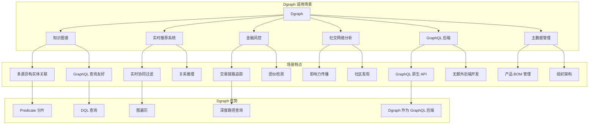
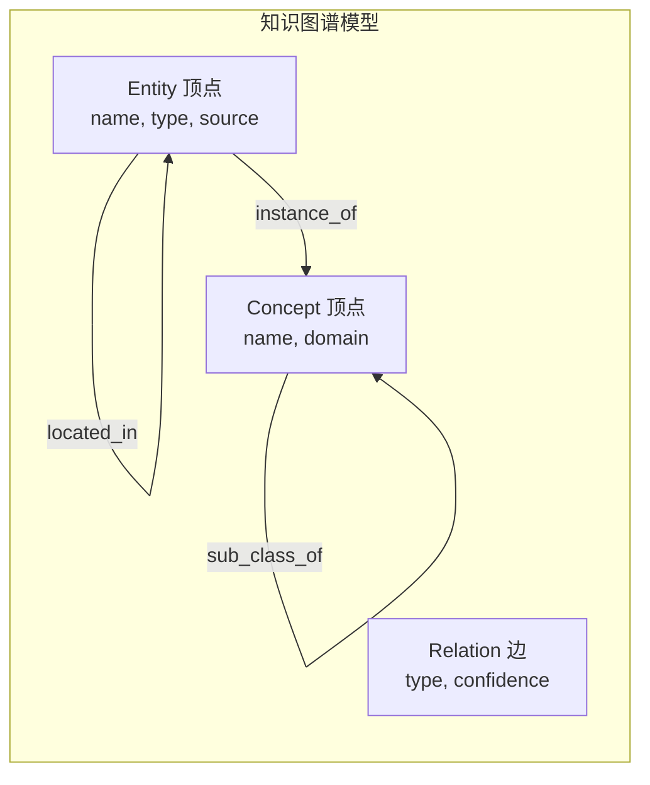
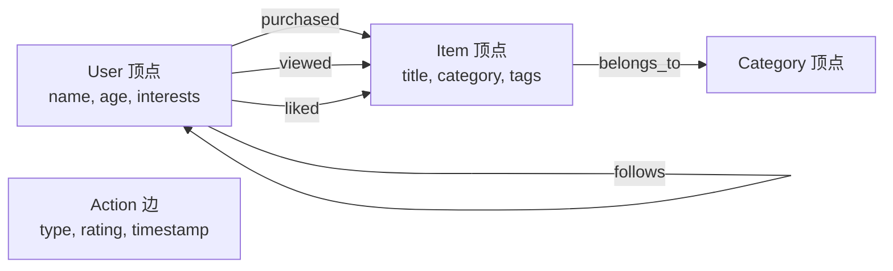
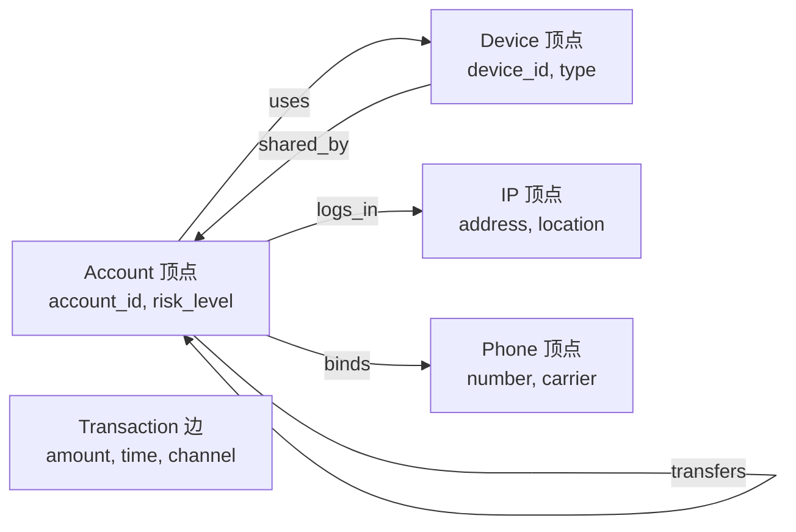
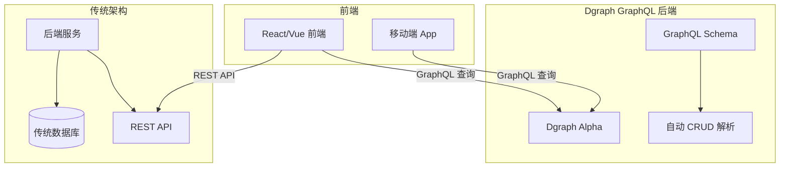
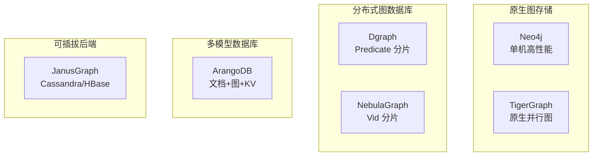
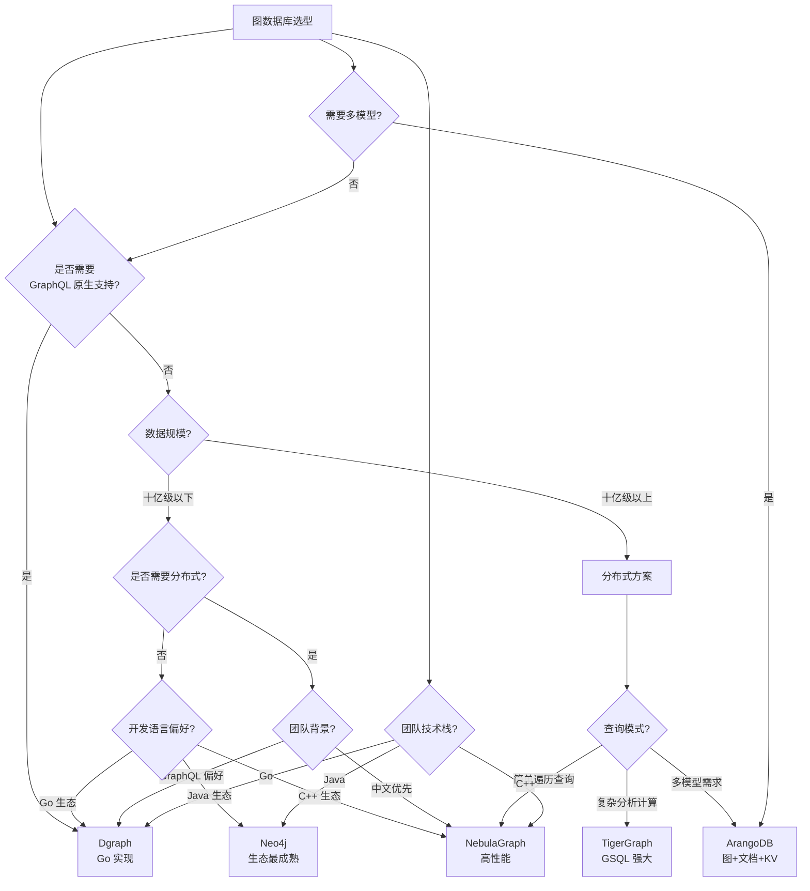

# Dgraph 使用场景与选型对比

## 学习目标

- 掌握 Dgraph 的典型应用场景
- 理解 Dgraph 与其他图数据库的选型差异
- 能够根据实际需求进行图数据库选型决策

## 适用场景总览



## 典型应用场景

### 1. 知识图谱

Dgraph 在知识图谱领域具有天然优势，因为其 DQL 的嵌套查询风格特别适合实体关系查询。

**数据模型**：



**DQL 实现**：

```graphql
# Schema 定义
type Entity {
  name: string @index(term) .
  type: string @index(term) .
  source: string .
  description: string @index(fulltext) .
  related_to: [Entity] @facets(relation_type: string, confidence: float) .
  instance_of: [Concept] .
  located_in: [Entity] .
}

type Concept {
  name: string @index(term) .
  domain: string @index(term) .
  sub_class_of: [Concept] .
}

# 查询示例

# 1. 实体关联查询：查询阿里巴巴投资的公司的关联公司
{
  alibaba(func: eq(name, "阿里巴巴")) @filter(eq(type, "company")) {
    name
    related_to @filter(eq(relation_type, "投资")) {
      name
      related_to {
        name
      }
    }
  }
}

# 2. 概念层级查询
{
  tech_concept(func: eq(name, "人工智能")) {
    name
    sub_class_of {
      name
      sub_class_of {
        name
      }
    }
  }
}

# 3. 实体消歧（通过类型和属性过滤）
{
  people(func: eq(name, "李娜")) @filter(eq(type, "person")) {
    uid
    name
    description
    related_to {
      name
    }
  }
}
```

**知识图谱场景适用性分析**：

| 需求 | Dgraph 优势 | 注意事项 |
|------|-------------|---------|
| 多源实体融合 | DQL 嵌套查询适合树形实体关系 | 需要合理设计 Schema |
| 实体消歧 | 支持 `@filter` 组合条件 | 需要创建足够索引 |
| 关系推理 | 图遍历 + Facet 边属性 | 多跳遍历需显式嵌套 |
| 全文搜索 | 内置 `fulltext` 索引 | 中文分词需要配置 |
| GraphQL API | 原生支持，无需额外开发 | 自动生成 CRUD 接口 |

### 2. 实时推荐系统

Dgraph 的 Predicate 分片策略在推荐系统中可减少跨节点查询。

**数据模型**：



**DQL 实现**：

```graphql
# Schema 定义
type User {
  name: string @index(term) .
  age: int .
  interests: [string] @index(term) .
  purchased: [Item] @facets(rating: float, time: datetime) .
  viewed: [Item] @facets(time: datetime) .
  liked: [Item] .
  follows: [User] .
}

type Item {
  title: string @index(term) .
  category: string @index(term) .
  tags: [string] @index(term) .
  price: float @index(float) .
  belongs_to: [Category] .
}

type Category {
  name: string @index(term) .
}

# 协同过滤推荐
# 1. 找到当前用户购买的商品
# 2. 找到购买相同商品的用户
# 3. 推荐这些用户购买的其他商品
{
  me(func: eq(name, "user001")) {
    name
    purchased {
      title
      ~purchased @filter(uid($uid_me)) {
        name
        purchased {
          title
        }
      }
    }
  }
}

# 基于兴趣的推荐
{
  recommend(func: eq(name, "user001")) {
    interests
    ~purchased @filter(ge(rating, 4.0)) {
      name
      purchased {
        title
        category
      }
    }
  }
}

# 热门推荐（聚合查询）
{
  popular(func: has(purchased)) {
    count(purchased)
    title
    category
  }
}
```

**推荐系统场景对比**：

| 推荐策略 | Dgraph 实现 | 性能特点 |
|---------|-------------|---------|
| 协同过滤 | 图遍历 + 反向边 | 依赖图结构，多跳遍历 |
| 基于内容 | 属性过滤 + 兴趣匹配 | 利用索引，效率高 |
| 混合推荐 | 组合查询 | 灵活但需优化 |
| 实时推荐 | 单次查询完成 | 写入延迟低（LSM-Tree） |

### 3. 金融风控

金融风控需要实时关联分析和深度路径追踪。

**数据模型**：



**DQL 实现**：

```graphql
# Schema 定义
type Account {
  account_id: string @index(exact) .
  name: string .
  risk_level: int @index(int) .
  created_at: datetime .
  transfers: [Account] @facets(amount: float, time: datetime, channel: string) .
  uses: [Device] @facets(time: datetime) .
  logs_in: [IP] @facets(time: datetime) .
  binds: [Phone] .
  related_to: [Account] @facets(relation: string) .
}

type Device {
  device_id: string @index(exact) .
  device_type: string .
  os: string .
  shared_by: [Account] @reverse .
}

type IP {
  address: string @index(exact) .
  location: string .
  isp: string .
}

type Phone {
  number: string @index(exact) .
  carrier: string .
}

# 1. 异常关联检测：与高风险账户共享设备的账户
{
  high_risk(func: eq(risk_level, 3)) {
    account_id
    uses {
      device_id
      ~uses {
        account_id
        risk_level
      }
    }
  }
}

# 2. 检测循环转账（洗钱模式）
# 需要深度遍历 3-4 跳
{
  acc1(func: eq(account_id, "ACC001")) {
    account_id
    transfers @facets(ge(amount, 100000)) {
      account_id
      transfers @facets(ge(amount, 100000)) {
        account_id
        transfers @facets(ge(amount, 100000)) {
          account_id
        }
      }
    }
  }
}

# 3. 短期大额交易检测
{
  account(func: eq(account_id, "ACC001")) {
    account_id
    transfers @facets(ge(amount, 100000)) {
      account_id
    }
  }
}

# 4. 设备指纹分析：同一设备关联的账户
{
  device(func: eq(device_id, "DEV001")) {
    device_id
    ~uses {
      account_id
      risk_level
      transfers {
        account_id
      }
    }
  }
}
```

**风控场景适用性**：

| 风控需求 | Dgraph 能力 | 实现方式 |
|---------|-------------|---------|
| 实时关联分析 | DQL 嵌套查询 | 单次查询完成多跳遍历 |
| 团伙识别 | 图遍历 + 属性过滤 | 通过共享设备/IP 关联 |
| 循环检测 | 深度路径遍历 | 嵌套 3-4 层查询 |
| 规则引擎 | @filter 组合条件 | `AND`/`OR`/`NOT` |
| 大额交易追踪 | Facet 边属性过滤 | 金额和时间过滤 |

### 4. GraphQL 后端

Dgraph 的最大特色之一是原生支持 GraphQL，可以作为全栈应用的 GraphQL 后端。

**架构**：



**GraphQL 后端优势**：

| 对比项 | Dgraph GraphQL 后端 | 传统后端 + 数据库 |
|--------|--------------------|-----------------|
| **开发效率** | 定义 Schema 即生成 API | 需要编写 CRUD 代码 |
| **查询灵活性** | 客户端自定义查询字段 | 返回固定字段 |
| **关联查询** | 原生图遍历，深度关联 | 需要 JOIN 或多次查询 |
| **类型安全** | GraphQL 强类型 Schema | 手动序列化/反序列化 |
| **实时更新** | 支持 Subscription | 需要 WebSocket 额外开发 |
| **维护成本** | 低（Schema 驱动） | 高（后端代码维护） |

**GraphQL 后端示例**：

```graphql
# GraphQL Schema（Dgraph 自动生成 API）
type User @remote {
  id: ID!
  name: String! @search(by: [term, exact])
  email: String! @search(by: [hash])
  posts: [Post]
}

type Post @remote {
  id: ID!
  title: String! @search(by: [term, fulltext])
  content: String
  author: User!
  comments: [Comment]
}

type Comment @remote {
  id: ID!
  text: String
  author: User!
  post: Post!
}

# 自动生成的查询
query {
  queryUser(filter: { name: { eq: "Alice" } }) {
    id
    name
    email
    posts {
      title
      comments {
        text
        author {
          name
        }
      }
    }
  }
}

# 自动生成的变更
mutation {
  addUser(input: [{ name: "Alice", email: "alice@example.com" }]) {
    user {
      id
      name
    }
  }
}
```

### 5. 社交网络分析

社交网络的好友关系、影响力传播分析。

```graphql
# Schema 定义
type User {
  name: string @index(term) .
  age: int .
  city: string @index(term) .
  follows: [User] @facets(since: datetime) .
  posts: [Post] .
  likes: [Post] .
}

type Post {
  content: string @index(fulltext) .
  created_at: datetime .
  author: User .
  liked_by: [User] .
}

# 好友推荐（共同好友数排序）
# 注意：Dgraph 需要多次查询来实现
# Step 1: 获取用户的好友
{
  me(func: eq(name, "Alice")) {
    follows {
      uid
    }
  }
}

# Step 2: 获取好友的好友（需要应用层聚合）
# 或使用单次嵌套查询
{
  me(func: eq(name, "Alice")) {
    follows {
      follows {
        name
      }
    }
  }
}

# 影响力传播分析
{
  influencer(func: eq(name, "Alice")) {
    name
    posts {
      content
      liked_by {
        name
      }
    }
  }
}

# 六度人脉（多跳遍历）
{
  me(func: eq(name, "Alice")) {
    follows {
      uid
      follows {
        uid
        follows {
          uid
          follows {
            uid
            follows {
              uid
              follows {
                uid
              }
            }
          }
        }
      }
    }
  }
}
```

## 与其他图数据库对比

### 图数据库分类体系



### 详细对比表格

| 特性 | Dgraph | Neo4j | NebulaGraph | TigerGraph | ArangoDB | JanusGraph |
|------|--------|-------|-------------|------------|----------|------------|
| **架构** | 分布式 | 单机/集群 | 分布式 | 分布式 | 集群 | 分布式 |
| **存储模型** | Badger LSM-Tree | 原生图 | RocksDB KV | 原生图 | RocksDB | 可插拔 |
| **分片策略** | Predicate 分片 | 无 | Vid Hash 分片 | 原生分区 | 集群分片 | 后端决定 |
| **查询语言** | DQL (GraphQL) | Cypher | nGQL | GSQL | AQL | Gremlin |
| **事务** | 分布式快照隔离 | 完整 ACID | 单分区 ACID | 完整 ACID | 单集合 ACID | 后端依赖 |
| **GraphQL 支持** | 原生 | 插件 | 无 | 无 | 无 | 无 |
| **遍历性能** | 良好 | 极佳 | 优秀 | 极佳 | 良好 | 取决于后端 |
| **水平扩展** | 线性 | 企业版 | 线性 | 线性 | 有限 | 线性 |
| **许可证** | Apache 2.0 | GPL/商业 | Apache 2.0 | 商业/社区 | Apache 2.0 | Apache 2.0 |
| **开发语言** | Go | Java | C++ | C++ | C++/JS | Java |
| **容量上限** | Trillion 级 | 约 340 亿 | 千亿顶点 | 万亿边 | 十亿级 | 取决于后端 |
| **部署复杂度** | 中 | 简单 | 中 | 中 | 中 | 复杂 |
| **中文社区** | 一般 | 一般 | 活跃 | 一般 | 较少 | 一般 |

### 查询语言对比

**相同查询在不同图数据库中的实现**：

```graphql
# Dgraph DQL
{
  query(func: eq(name, "Alice")) {
    name
    knows {
      name
    }
  }
}
```

```cypher
# Neo4j Cypher
MATCH (a:Person {name: "Alice"})-[:KNOWS]->(b:Person)
RETURN a.name, b.name AS friend;
```

```ngql
# NebulaGraph nGQL
GO FROM "Alice" OVER knows YIELD dst(edge) AS friend;
```

```sql
# TigerGraph GSQL
SELECT tgt
FROM Person:s -(knows:e)-> Person:tgt
WHERE s.name == "Alice";
```

```aql
# ArangoDB AQL
FOR v, e IN 1..1 OUTBOUND "users/alice" knows
    RETURN { friend: v.name }
```

### 存储模型对比

| 数据库 | 存储模型 | 核心数据结构 | 遍历方式 | 写入性能 | 读取性能 |
|--------|---------|-------------|---------|---------|---------|
| **Dgraph** | Predicate 分片 + Badger LSM-Tree | Key: Predicate+UID, Value: 属性/边 | DQL 嵌套查询 | 极佳（顺序写） | 良好（Bloom Filter） |
| **Neo4j** | 原生邻接表 | 固定大小记录 + 双向指针链表 | O(1) 指针跳跃 | 良好 | 极佳 |
| **NebulaGraph** | Vid Hash + RocksDB KV | Key: Part+Vid+Tag, Value: 编码属性 | O(log n) KV 查找 | 优秀 | 优秀 |
| **TigerGraph** | 原生并行图 | 分区邻接表 + 压缩位图 | 并行遍历 | 良好 | 极佳 |

## 选型决策流程



### 选型决策矩阵

| 决策因素 | 推荐选择 | 原因 |
|---------|---------|------|
| **GraphQL 原生支持** | Dgraph | 唯一原生支持 GraphQL 的图数据库 |
| **数据量 < 10亿，快速开发** | Neo4j | 部署简单，社区成熟 |
| **数据量 > 10亿，分布式必须** | NebulaGraph | Apache 开源，线性扩展强 |
| **需要复杂图计算** | TigerGraph | GSQL 强大，性能最优 |
| **多模型需求** | ArangoDB | 文档+图+KV 统一 |
| **Go 技术栈** | Dgraph | 原生 Go 实现，易于二次开发 |
| **已有 Hadoop 生态** | JanusGraph | 与 HBase/Cassandra 集成 |
| **国产化合规** | NebulaGraph | 国产开源，中文支持完善 |
| **全栈 GraphQL 应用** | Dgraph | 前端直接定义查询 |

### 实际案例选型参考

| 行业案例 | 数据规模 | 查询特点 | 推荐选择 | 原因 |
|---------|---------|---------|---------|------|
| 知识图谱（百科） | 十亿顶点 | 实体关系查询 | Dgraph | DQL 嵌套查询 + GraphQL API |
| 社交网络（微信） | 百亿顶点 | 实时遍历 | NebulaGraph | 分布式，强水平扩展 |
| 金融风控（银行） | 亿级顶点 | 深度路径追踪 | Dgraph/TigerGraph | 多跳遍历能力强 |
| 推荐系统（电商） | 十亿顶点 | 协同过滤 | NebulaGraph/Dgraph | 分布式，开源 |
| GraphQL 后端（全栈） | 千万级 | 灵活查询 | Dgraph | 原生 GraphQL 支持 |
| 多模型数据平台 | 千万级 | 混合查询 | ArangoDB | 唯一成熟的多模型方案 |
| 网络安全（运营商） | 亿级顶点 | 复杂分析 | TigerGraph | 复杂图算法 |
| IoT 拓扑（设备管理） | 千万顶点 | 简单关联 | Neo4j | 单机够用 |

## Dgraph 与其他图数据库的适用场景总结

### Dgraph 最适合的场景

1. **需要原生 GraphQL 支持的全栈应用**：Dgraph 是唯一原生支持 GraphQL 的图数据库，可直接作为后端
2. **知识图谱构建**：DQL 的嵌套查询风格天然适合实体关系树形查询
3. **Go 技术栈团队**：Dgraph 使用 Go 实现，Go 开发者可以深入二次开发
4. **中等规模分布式图数据库**：十亿级数据量，需要分布式但不想引入复杂依赖
5. **实时风控系统的深度路径查询**：多跳遍历能力适合金融风控

### Dgraph 不推荐的场景

1. **单机小规模快速原型**：Neo4j 部署更简单，社区更成熟
2. **超大规模（千亿级）极致性能**：NebulaGraph 的 C++ 实现在性能上更有优势
3. **需要复杂图算法的 OLAP 场景**：TigerGraph 的 GSQL 在图计算方面更强
4. **需要多模型灵活切换**：ArangoDB 支持文档+图+KV 统一
5. **Java 生态的深度集成**：Neo4j 的 Java 生态最完善

## 要点总结

- **Dgraph 核心优势**：原生 GraphQL 支持、Predicate 分片、DQL 嵌套查询、Badger LSM-Tree 写入优化
- **典型场景**：知识图谱、GraphQL 后端、金融风控、推荐系统、社交网络分析
- **选型关键**：GraphQL 需求、数据规模、团队技术栈、查询模式
- **与其他对比**：Dgraph 在 GraphQL 支持和 Go 生态方面不可替代，但遍历性能不如原生图存储
- **选型建议**：需要 GraphQL 后端首选 Dgraph，海量数据选 NebulaGraph，快速开发选 Neo4j

## 思考题

1. 在什么情况下应该选择 Dgraph 而不是 Neo4j？给出具体的判断标准。
2. Dgraph 的 Predicate 分片在知识图谱场景中比 Vid 分片有何优势？在社交网络中呢？
3. 对于一个需要同时提供 GraphQL API 和复杂图分析的系统，如何设计基于 Dgraph 的架构？
4. Dgraph 作为 GraphQL 后端的限制是什么？什么情况下需要补充传统后端逻辑？
5. 比较 Dgraph 和 NebulaGraph 在分布式架构上的设计差异，哪种更适合你的业务场景？