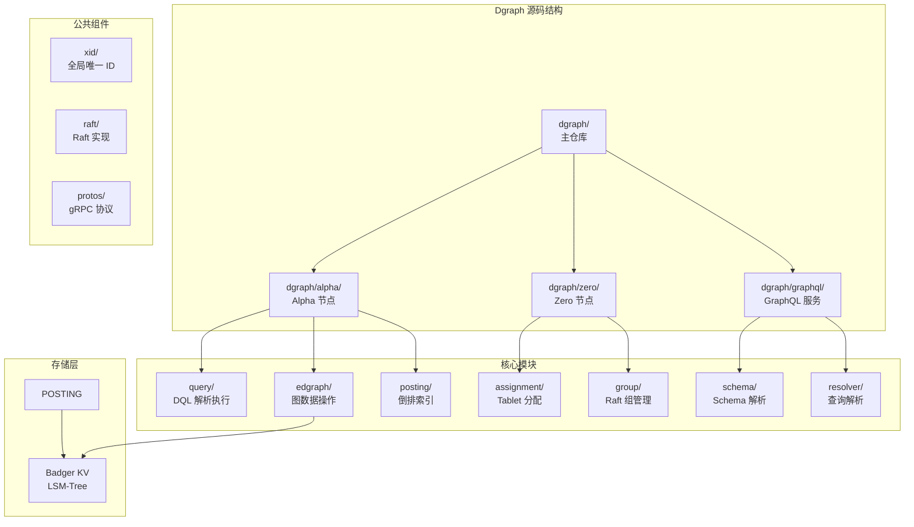
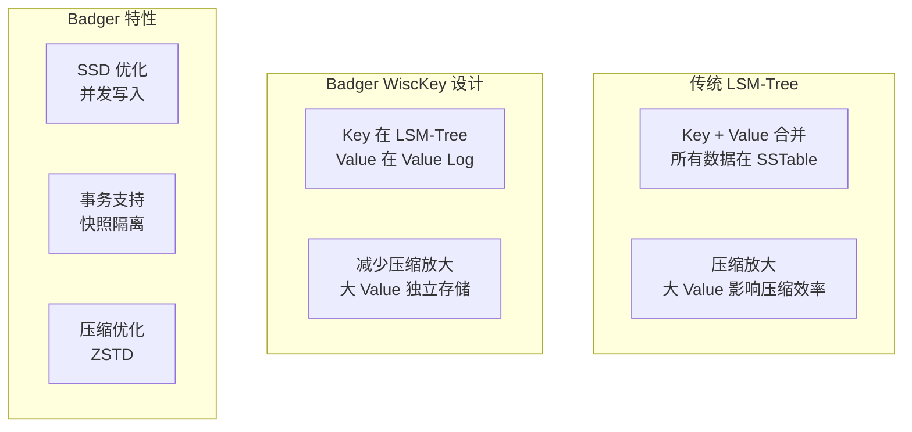

# Dgraph 学习资源

## 学习目标

- 获取 Dgraph 的优质学习资源
- 了解 Dgraph 源码结构和研读路径
- 掌握从入门到精通的学习路径

## 官方资源

### 官方文档与代码

| 资源类型 | 链接 | 说明 |
|---------|------|------|
| **官方文档** | [https://dgraph.io/docs/](https://dgraph.io/docs/) | 英文文档，涵盖安装、DQL、GraphQL、架构设计 |
| **DQL 语法手册** | [https://dgraph.io/docs/query-language/](https://dgraph.io/docs/query-language/) | DQL 查询语法完整参考 |
| **GraphQL 文档** | [https://dgraph.io/docs/graphql/](https://dgraph.io/docs/graphql/) | GraphQL 模式和 API 文档 |
| **GitHub 仓库** | [https://github.com/dgraph-io/dgraph](https://github.com/dgraph-io/dgraph) | 核心源码，Apache 2.0 许可 |
| **Badger 仓库** | [https://github.com/dgraph-io/badger](https://github.com/dgraph-io/badger) | 自研 LSM-Tree KV 存储引擎 |
| **官方博客** | [https://dgraph.io/blog/](https://dgraph.io/blog/) | 技术文章和架构设计分享 |
| **Discourse 论坛** | [https://discuss.dgraph.io/](https://discuss.dgraph.io/) | 官方问答社区 |
| **Slack 社区** | [https://dgraph.slack.com/](https://dgraph.slack.com/) | 实时技术交流 |

### 快速开始

- **Docker 部署**：`docker run -d --name dgraph -p 8080:8080 -p 9080:9080 -p 8000:8000 dgraph/standalone:v23.1`
- **Ratel UI**：[http://localhost:8000](http://localhost:8000)（管理界面）
- **HTTP API**：`localhost:8080`
- **gRPC API**：`localhost:9080`

## 源码研读路径

Dgraph 采用 Go 语言实现，源码结构清晰，适合深入学习分布式图数据库实现：



### 核心模块说明

| 模块 | 路径 | 核心功能 | 入口文件 |
|------|------|---------|---------|
| **Alpha 服务** | `dgraph/alpha/` | 处理查询和写入请求 | `main.go` |
| **DQL 解析** | `dgraph/query/` | DQL 语法解析、查询执行 | `query.go` |
| **图数据操作** | `dgraph/edgraph/` | 图数据 Schema、Mutation、Query | `server.go` |
| **倒排索引** | `dgraph/posting/` | Predicate 索引、数据编码 | `posting.go` |
| **Zero 服务** | `dgraph/zero/` | 集群协调、Tablet 分配、事务时间戳 | `main.go` |
| **Tablet 分配** | `dgraph/zero/assignment/` | Predicate 到 Group 的映射 | `oracle.go` |
| **GraphQL 服务** | `dgraph/graphql/` | GraphQL Schema 解析、查询转换 | `main.go` |
| **Badger KV** | `badger/` | 自研 LSM-Tree KV 存储 | `db.go` |

### 推荐研读顺序

```mermaid
graph LR
    subgraph 第一阶段：理解架构
        A1[README + 架构文档] --> A2[alpha/main.go<br/>Alpha 启动]
        A2 --> A3[zero/main.go<br/>Zero 启动]
        A3 --> A4[dgraph.proto<br/>gRPC 协议]
    end

    subgraph 第二阶段：查询路径
        B1[query/query.go<br/>DQL 解析] --> B2[query/execution.go<br/>查询执行]
        B2 --> B3[posting/posting.go<br/>数据访问]
        B3 --> B4[Badger 读操作]
    end

    subgraph 第三阶段：写入路径
        C1[edgraph/server.go<br/>Mutation 处理] --> C2[posting/mvcc.go<br/>MVCC 写入]
        C2 --> C3[Badger 事务提交]
        C3 --> C4[倒排索引更新]
    end

    subgraph 第四阶段：分布式机制
        D1[zero/oracle.go<br/>时间戳分配] --> D2[zero/assignment.go<br/>Tablet 分配]
        D2 --> D3[raft/<br/>Raft 实现]
        D3 --> D4[zero/group.go<br/>Raft 组管理]
    end

    A4 --> B1
    B4 --> C1
    C4 --> D1
```

### 重点源码文件

| 功能领域 | 关键文件 | 学习重点 |
|---------|---------|---------|
| **DQL 解析** | `query/query.go` | 查询 AST 构建、函数解析 |
| **查询执行** | `query/execution.go` | 查询执行流程、子查询协调 |
| **数据编码** | `posting/list.go` | Predicate 数据存储格式 |
| **倒排索引** | `posting/index.go` | 索引结构、索引查询 |
| **MVCC 实现** | `posting/mvcc.go` | 多版本并发控制 |
| **事务处理** | `edgraph/server.go` | 事务时间戳、提交流程 |
| **Badger 存储** | `badger/db.go` | LSM-Tree 写入、读取 |
| **Raft 实现** | `raft/raft.go` | Raft 协议在 Dgraph 中的应用 |
| **Zero 协调** | `zero/oracle.go` | 集群时间戳管理 |
| **Tablet 分配** | `zero/assignment.go` | Predicate 到 Group 的映射算法 |

### 调试建议

```bash
# 本地编译 Dgraph（需要 Go 1.21+）
git clone https://github.com/dgraph-io/dgraph.git
cd dgraph
make install

# 启动本地开发集群
# 1. 启动 Zero
dgraph zero --port_offset=0 --idx=1 --replicas=1

# 2. 启动 Alpha（另一个终端）
dgraph alpha --port_offset=0 --lru_mb=1024 --zero=localhost:5080

# 开启详细日志
dgraph alpha --v=3 --logtostderr

# Go 调试
go test -v ./dgraph/query/...
dlv debug ./dgraph/alpha
```

## 推荐书籍和论文

### 图数据库书籍

| 书籍 | 作者 | 说明 | 推荐度 |
|------|------|------|-------|
| **《图数据库》** | Ian Robinson 等 | 图数据库概念和 Neo4j 实践，经典入门 | ⭐⭐⭐⭐⭐ |
| **《Neo4j 实战》** | Aleksa Vukotic | Neo4j 实战案例，Cypher 查询技巧 | ⭐⭐⭐⭐ |
| **《Graph Databases》** | Jim Webber 等 | 图数据库理论，免费电子书 | ⭐⭐⭐⭐ |
| **《数据密集型应用系统设计》** | Martin Kleppmann | 分布式系统设计，涵盖 LSM-Tree 和图存储讨论 | ⭐⭐⭐⭐⭐ |

### 相关论文

| 论文 | 说明 | 链接 |
|------|------|------|
| **Dgraph: A Distributed Graph Database** | Dgraph 设计论文（无官方论文，但博客有详细介绍） | [Dgraph Blog](https://dgraph.io/blog/) |
| **Badger: Fast SSD-optimized Key-Value Store** | Dgraph 自研 KV 存储引擎 | [Badger GitHub](https://github.com/dgraph-io/badger) |
| **WiscKey: Separating Keys from Values in SSD-conscious Storage** | Badger 采用的 Key-Value 分离设计 | [USENIX ATC 16](https://www.usenix.org/conference/atc16/technical-sessions/presentation/lu) |
| **Raft Consensus Algorithm** | Raft 协议原论文 | [raft.github.io](https://raft.github.io/) |
| **The Google Percolator Paper** | 分布式事务快照隔离设计参考 | [ACM DL](https://dl.acm.org/) |

### LSM-Tree 和存储引擎

| 资源 | 说明 |
|------|------|
| **《 LSM-Tree 存储引擎设计》** | LSM-Tree 原理，写放大分析 |
| **Badger 源码** | 自研 LSM-Tree KV 存储，Key-Value 分离设计 |
| **RocksDB Wiki** | 类似的 LSM-Tree 实现，大量设计文档 |
| **LevelDB 源码** | LSM-Tree 经典实现 |

### 分布式系统基础

| 书籍/论文 | 说明 |
|---------|------|
| **《分布式系统：概念与设计》** | 分布式系统理论基础 |
| **《分布式系统原理》** | CAP、一致性、容错等核心概念 |
| **In Search of an Understandable Consensus Algorithm** | Raft 论文原文 |
| **Google Percolator 论文** | 分布式快照隔离实现参考 |

## 社区资源

### 英文社区

| 资源 | 链接 | 说明 |
|------|------|------|
| **Discourse 论坛** | [discuss.dgraph.io](https://discuss.dgraph.io/) | 官方问答社区，问题响应快 |
| **Slack** | [dgraph.slack.com](https://dgraph.slack.com/) | 实时技术交流 |
| **GitHub Issues** | [github.com/dgraph-io/dgraph/issues](https://github.com/dgraph-io/dgraph/issues) | Bug 报告和功能请求 |
| **YouTube** | [Dgraph Channel](https://www.youtube.com/c/Dgraph) | 视频教程和演讲 |
| **Twitter** | [@dgraphlabs](https://twitter.com/dgraphlabs) | 最新动态 |

### 中文社区

| 资源 | 说明 |
|------|------|
| **CSDN 博客** | 搜索 "Dgraph" 有实践文章 |
| **掘金社区** | 偶尔有深度技术文章 |
| **知乎专栏** | 图数据库相关讨论 |
| **个人博客** | 国内开发者实践分享 |

### 第三方教程

| 资源 | 说明 |
|------|------|
| **Dgraph Tour** | 官方交互式教程（已下线，但 GitHub 有存档） |
| **Dgraph 101** | 社区维护的入门教程 |
| **GitHub Discussions** | 官方仓库的讨论区 |

## SDK 和工具

### 官方 SDK

| 语言 | 仓库 | 文档 |
|------|------|------|
| **Go** | [dgo](https://github.com/dgraph-io/dgo) | 内置于源码，官方推荐 |
| **Java** | [dgraph4j](https://github.com/dgraph-io/dgraph4j) | Java 客户端 |
| **Python** | [pydgraph](https://github.com/dgraph-io/pydgraph) | Python 客户端 |
| **JavaScript/Node.js** | [dgraph-js](https://github.com/dgraph-io/dgraph-js) | JavaScript 客户端 |
| **C#** | [Dgraph-dotnet](https://github.com/dgraph-io/dgraph-dotnet) | .NET 客户端 |
| **Rust** | [dgraph-rs](https://github.com/Swoorup/dgraph-rs) | 社区维护 |

### 图算法扩展

| 工具 | 说明 |
|------|------|
| **Dgraph 复杂查询** | 通过 DQL 嵌套实现图算法 |
| **外部图计算框架** | 导出数据到 Spark/Flink 进行离线图计算 |

### 运维工具

| 工具 | 说明 |
|------|------|
| **Ratel** | 官方 Web UI，数据可视化和查询 |
| **Dgraph Dashboard** | 监控面板（正在开发） |
| **Bulk Loader** | 批量数据导入工具 |
| **Live Loader** | 实时数据导入工具 |
| **Dgraph Backup** | 数据备份恢复工具 |

## 学习路径

### 按阶段推荐

```mermaid
graph LR
    subgraph 入门阶段 1-2周
        A1[官方文档阅读] --> A2[Docker 部署实践]
        A2 --> A3[DQL 基础语法]
        A3 --> A4[简单 CRUD 操作]
    end

    subgraph 进阶阶段 2-4周
        B1[DQL 进阶语法] --> B2[GraphQL 模式]
        B2 --> B3[索引机制理解]
        B3 --> B4[分布式部署]
    end

    subgraph 应用阶段 1-2月
        C1[应用场景实践] --> C2[SDK 集成开发]
        C2 --> C3[GraphQL 后端]
        C3 --> C4[生产环境部署]
    end

    subgraph 深入阶段 2-3月
        D1[源码研读] --> D2[Badger 存储]
        D2 --> D3[Raft 分布式机制]
        D3 --> D4[贡献代码]
    end

    A4 --> B1
    B4 --> C1
    C4 --> D1
```



| 阶段 | 目标 | 推荐资源 | 预计时间 |
|------|------|---------|---------|
| **入门** | 独立使用 Dgraph 完成基本操作 | 官方文档 Quickstart + DQL 语法 | 1-2 周 |
| **进阶** | 理解 GraphQL 模式、索引、分布式部署 | GraphQL 文档 + 部署指南 | 2-4 周 |
| **应用** | 实际场景应用开发，GraphQL 后端 | SDK 文档 + 案例 + 最佳实践 | 1-2 月 |
| **深入** | 理解源码实现，能贡献代码 | 源码 + 架构设计 + Badger 文档 | 2-3 月 |

### 对比学习建议

将 Dgraph 与其他图数据库对比学习，效果更佳：

1. **Dgraph vs Neo4j**：理解分布式与单机、Predicate 分片与原生图存储的权衡
2. **Dgraph vs NebulaGraph**：理解 Predicate 分片与 Vid 分片的差异
3. **Dgraph vs ArangoDB**：理解纯图数据库与多模型数据库的选择
4. **Dgraph vs TigerGraph**：理解开源与商业产品、DQL 与 GSQL 的差异

### GraphQL 技能提升路径

Dgraph 的原生 GraphQL 支持使其成为学习 GraphQL 的最佳实践平台：

```mermaid
graph LR
    subgraph GraphQL 基础
        G1[Schema 定义] --> G2[Query 查询]
        G2 --> G3[Mutation 变更]
        G3 --> G4[Subscription 订阅]
    end

    subgraph Dgraph GraphQL
        D1[Dgraph @remote 指令] --> D2[@search 索引指令]
        D2 --> D3[@hasInverse 关系指令]
        D3 --> D4[自定义 Dgraph 函数]
    end

    subgraph 高级特性
        H1[GraphQL +/- DQL] --> H2[嵌套查询优化]
        H2 --> H3[实时订阅实现]
        H3 --> H4[GraphQL 网关设计]
    end

    G4 --> D1
    D4 --> H1
```

### 实践项目建议

| 项目 | 涉及知识点 | 难度 |
|------|-----------|------|
| **知识图谱构建** | Schema 设计、DQL 嵌套查询、索引 | ⭐⭐ |
| **GraphQL 后端 API** | GraphQL Schema、@remote、CRUD | ⭐⭐ |
| **社交网络系统** | 图遍历、Facet 边属性、实时订阅 | ⭐⭐⭐ |
| **推荐系统** | 协同过滤、聚合查询、性能优化 | ⭐⭐⭐ |
| **风控系统** | 多跳遍历、深度路径查询、实时告警 | ⭐⭐⭐⭐ |

## Badger 存储引擎专题

### Badger 设计特点

Badger 是 Dgraph 团队自研的 LSM-Tree KV 存储，采用 **Key-Value 分离** 设计：



### Badger 源码重点

| 文件 | 功能 | 学习重点 |
|------|------|---------|
| `badger/db.go` | 数据库入口 | 初始化、打开、关闭 |
| `badger/levels.go` | LSM-Tree 层管理 | Compaction 策略 |
| `badger/value.go` | Value Log 管理 | 大值存储、垃圾回收 |
| `badger/txn.go` | 事务实现 | MVCC、快照隔离 |
| `badger/skl.go` | SkipList MemTable | 内存表结构 |
| `badger/table.go` | SSTable 格式 | 磁盘格式、Bloom Filter |

### Badger 与 RocksDB 对比

| 特性 | Badger | RocksDB |
|------|--------|---------|
| **设计理念** | Key-Value 分离（WiscKey） | Key-Value 合并 |
| **适用场景** | 大 Value 场景、SSD | 通用 KV 存储 |
| **压缩放大** | 低（Value 分离） | 高（合并压缩） |
| **读取性能** | 小 Value 快，大 Value 需额外 IO | 一致性高 |
| **写入性能** | 极佳（SSD 优化） | 优秀 |
| **实现语言** | Go | C++ |
| **生态集成** | Dgraph 内置 | 广泛集成 |

## 要点总结

- **官方文档**：英文文档完善，DQL 和 GraphQL 文档是学习的首选
- **源码采用 Go 实现**，结构清晰，Badger 和 Raft 模块可独立学习
- **建议按 入门 → 进阶 → 应用 → 深入 的阶段循序渐进**
- **GraphQL 原生支持是 Dgraph 最大特色**，适合作为 GraphQL 学习平台
- **Badger 存储引擎值得深入学习**，Key-Value 分离设计独具特色
- **对比学习**（Dgraph vs Neo4j/NebulaGraph/ArangoDB）能加深理解
- **实践项目是掌握 Dgraph 的最佳途径**

## 思考题

1. Dgraph 的源码中，DQL 查询是如何被解析和执行的？与 GraphQL 查询的处理路径有何不同？
2. Badger 的 Key-Value 分离设计在什么场景下比 RocksDB 的合并设计更有优势？有何劣势？
3. Dgraph 的 Zero 节点如何管理集群的时间戳和 Tablet 分配？与 Raft Leader 的关系是什么？
4. 如果要为 Dgraph 贡献代码，应该从哪个模块开始？为什么？
5. Dgraph 的 GraphQL 支持与 Neo4j 的 GraphQL 插件有何本质区别？实现原理有何不同？