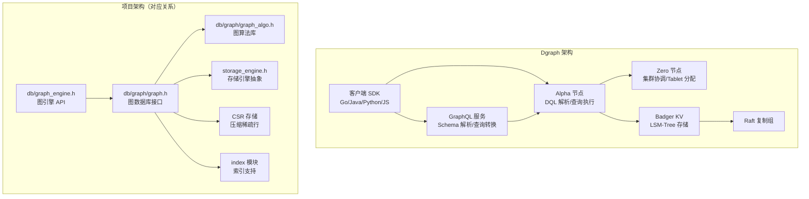
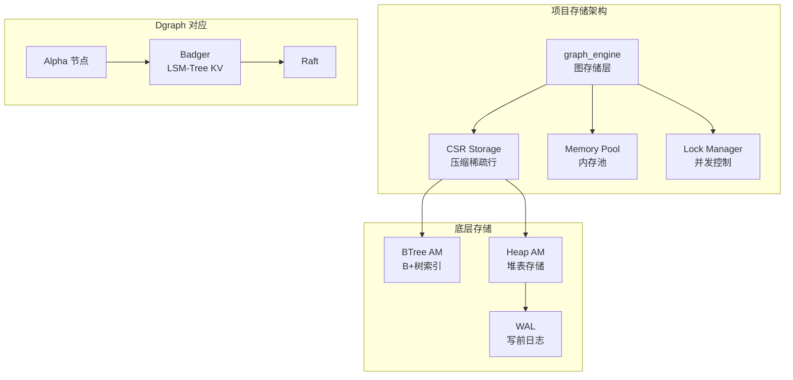

# Dgraph 项目关联

## 学习目标

- 理解 Dgraph 与本项目架构的对应关系
- 分析 Dgraph 设计对本项目 graph_engine 的启发
- 明确可借鉴的设计模式和技术实现

## 架构对比

### 整体架构映射



### 组件对应关系

| Dgraph 组件 | 项目对应模块 | 说明 |
|--------------|-------------|------|
| **Alpha 节点** | `db/graph/graph_engine.c` | 图查询解析和执行 |
| **DQL 解析器** | `db/graph/graph_cypher.c` | Cypher/nGQL 风格查询解析 |
| **GraphQL 服务** | 暂无对应 | 可扩展 GraphQL API |
| **Storage Service** | `db/storage/graph/graph_engine.c` | 图存储引擎 |
| **Badger KV Store** | `storage_engine.h` → BTree/Heap | 底层存储抽象 |
| **Raft 复制** | `dist_txn.h`, `raft.h`（Phase 9） | 分布式一致性 |
| **Zero 协调器** | `db/catalog.h` + 分布式扩展 | 元数据管理 |
| **索引模块** | `index/` 模块 + `graph_index.c` | 属性索引支持 |
| **图算法扩展** | `db/graph/graph_algo.h` | BFS/DFS/PageRank 等 |

## 与项目模块的关联

### 1. 与 graph_engine 的关联

项目中的 `graph_engine.h` 实现了图存储引擎，提供 CSR 存储和内存池支持：

```c
// 项目：graph_engine.h 核心结构
typedef struct graph_engine_db_s {
    graph_t *graph;              // 图数据库句柄
    char name[256];              // 图名称
    char data_dir[512];          // 数据目录
    AccessMode mode;             // 访问模式

    void *mem_pool;              // 内存池
    bool use_mem_pool;           // 是否使用内存池

    void *csr_storage;           // CSR 存储
    bool use_csr;                // 是否使用 CSR

    lock_manager_t *lockmgr;     // 锁管理器
    void *rwlock;                // 读写锁
} graph_engine_db_t;
```

**与 Dgraph 对比**：

| 设计点 | Dgraph | 项目实现 | 差异分析 |
|--------|--------|---------|---------|
| **存储模型** | KV（Badger LSM-Tree） | CSR + 邻接表 | 项目更接近原生图存储 |
| **分片策略** | Predicate 分片 | 无分片（单机） | Dgraph 分布式友好 |
| **内存管理** | Go GC 管理 | 可选内存池 | 项目提供更多控制 |
| **并发控制** | Raft 分布式锁 | 本地读写锁 | Dgraph 支持分布式 |
| **CSR 支持** | 无 | 可选启用 | 项目提供压缩存储优化 |

**可借鉴设计**：

```c
// 可借鉴 Dgraph 的 Predicate 分组策略
typedef struct graph_predicate_group_s {
    char group_name[64];         // 分组名称
    graph_label_id_t *labels;    // 包含的标签
    size_t num_labels;
    char *predicates;            // 包含的属性名
    size_t num_predicates;
    uint64_t estimated_size;     // 估计数据大小
} graph_predicate_group_t;

// 可借鉴 Dgraph 的 Tablet 分配
typedef struct graph_tablet_s {
    uint64_t tablet_id;          // Tablet ID
    graph_predicate_group_t *group;
    char storage_node[64];       // 存储节点地址
    uint64_t data_size;          // 数据大小
} graph_tablet_t;
```

### 2. 与 graph 模块的关联

项目的 `db/graph/graph.h` 提供图数据库的核心接口：

```c
// 项目：graph.h 核心接口
graph_vertex_id_t graph_vertex_create(graph_t *g,
                                      const char *label,
                                      const graph_prop_t *props,
                                      size_t n_props);

graph_edge_id_t graph_edge_create(graph_t *g,
                                  graph_vertex_id_t src,
                                  graph_vertex_id_t dst,
                                  const char *rel_type,
                                  const graph_prop_t *props,
                                  size_t n_props);

int graph_vertex_get_out_edges(graph_t *g,
                               graph_vertex_id_t vid,
                               const char *rel_type,
                               graph_edge_id_t **out_edges,
                               size_t *out_count);
```

**与 Dgraph DQL 对比**：

```graphql
# Dgraph DQL 查询
{
  query(func: eq(name, "Alice")) {
    name
    knows {
      name
    }
  }
}
```

```c
// 项目等价 API 调用
graph_vertex_id_t alice_vid = /* 通过属性索引获取 */;
graph_edge_id_t *edges;
size_t edge_count;
graph_vertex_get_out_edges(graph, alice_vid, "knows", &edges, &edge_count);

for (size_t i = 0; i < edge_count; i++) {
    graph_edge_t *edge;
    graph_edge_get(graph, edges[i], &edge);
    graph_vertex_t *friend;
    graph_vertex_get(graph, edge->dst, &friend);
    printf("Friend: %s\n", friend->name);
}
```

**可借鉴 Dgraph 的查询接口设计**：

```c
// 可借鉴 Dgraph 的嵌套查询模式
typedef struct graph_query_options_s {
    const char *label;           // 标签过滤
    graph_prop_filter_t *filters; // 属性过滤
    size_t num_filters;

    // 嵌套查询
    struct graph_query_options_s *nested;
    const char *nested_rel_type; // 嵌套的关系类型
} graph_query_options_t;

// 类似 DQL 的嵌套查询 API
int graph_query_nested(void *graph,
                       graph_vertex_id_t start,
                       const graph_query_options_t *options,
                       graph_query_result_t **out_result);
```

### 3. 与 graph_algo 的关联

项目的 `graph_algo.h` 实现了丰富的图算法：

```c
// 项目：图算法枚举
typedef enum GraphTraverseMode_e {
    GRAPH_TRAVERSE_BFS,          // 广度优先
    GRAPH_TRAVERSE_DFS           // 深度优先
} GraphTraverseMode;

// PageRank 算法
typedef struct GraphPageRankOptions_s {
    double damping;             // 阻尼因子（默认 0.85）
    int max_iterations;         // 最大迭代次数
    double tolerance;           // 收敛阈值
} GraphPageRankOptions;

// Dijkstra 最短路径
typedef struct GraphPath_s {
    graph_vertex_id_t *vertices;  // 路径顶点数组
    graph_edge_id_t *edges;       // 路径边数组
    size_t length;               // 路径长度
    double total_weight;         // 总权重
} GraphPath;
```

**与 Dgraph 查询能力对比**：

| 算法 | Dgraph（DQL 内置） | 项目实现 | 差异 |
|------|-------------------|---------|------|
| BFS/DFS | 嵌套查询隐含遍历 | `graph_traverse_next()` | 项目显式迭代器 |
| Dijkstra | 无内置 | `graph_dijkstra()` | 项目独立实现 |
| PageRank | 无内置 | `graph_pagerank()` | 项目独立实现 |
| Louvain | 无内置 | `graph_louvain()` | 项目独立实现 |
| 连通分量 | 无内置 | `graph_connected_components()` | 项目独立实现 |

**可借鉴设计**：

```c
// 可借鉴 Dgraph 的 Facet 边属性设计
typedef struct graph_edge_facet_s {
    const char *name;            // 属性名
    graph_value_type_t type;     // 数据类型
    union {
        int64_t int_val;
        double float_val;
        const char *string_val;
    } value;
} graph_edge_facet_t;

// 带边属性的边创建
graph_edge_id_t graph_edge_create_with_facets(
    graph_t *g,
    graph_vertex_id_t src,
    graph_vertex_id_t dst,
    const char *rel_type,
    const graph_edge_facet_t *facets,
    size_t num_facets
);

// 边属性过滤遍历
int graph_traverse_filter_by_facet(
    GraphTraverseIter *iter,
    const char *facet_name,
    double min_value,
    double max_value
);
```

### 4. 与存储引擎的关联

项目的存储引擎抽象层：



**关键差异分析**：

| 方面 | Dgraph | 项目 | 分析 |
|------|--------|------|------|
| **存储格式** | KV 编码（Predicate+UID） | CSR + 邻接表 | 项目遍历效率更高 |
| **底层引擎** | Badger LSM-Tree | BTree/Heap | 项目有原生存储优势 |
| **写入优化** | LSM-Tree 顺序写 | B+树随机写 | Dgraph 写入更优 |
| **分布式支持** | Raft 复制 | 单机（Phase 9 扩展） | Dgraph 分布式成熟 |
| **持久化** | Badger WAL | 项目 WAL | 类似机制 |
| **压缩** | LSM-Tree 压缩 | CSR 压缩 | 各有优势 |

## 可借鉴的设计

### 1. Predicate 分片策略

Dgraph 的 Predicate 分片策略可借鉴用于项目的分布式扩展：

```c
/**
 * Predicate 分片配置（借鉴 Dgraph 设计）
 */
typedef struct graph_predicate_s {
    char name[64];               // 属性名
    graph_value_type_t type;     // 数据类型
    bool indexed;                // 是否索引
    char index_type[32];         // 索引类型

    // 所属 Tablet
    uint64_t tablet_id;
    char storage_node[64];
} graph_predicate_t;

typedef struct graph_tablet_manager_s {
    graph_predicate_t *predicates;
    size_t num_predicates;

    // Tablet 分配表
    struct {
        uint64_t tablet_id;
        char predicate_name[64];
        uint64_t data_size;
        char alpha_node[64];     // 存储节点
    } *tablets;
    size_t num_tablets;

    // Zero 协调器地址
    char zero_addr[128];
} graph_tablet_manager_t;

/**
 * 根据 Predicate 查找 Tablet
 */
int graph_find_tablet(
    const graph_tablet_manager_t *mgr,
    const char *predicate_name,
    uint64_t *out_tablet_id,
    char *out_storage_node
) {
    // 查找 Predicate 对应的 Tablet
    for (size_t i = 0; i < mgr->num_tablets; i++) {
        if (strcmp(mgr->tablets[i].predicate_name, predicate_name) == 0) {
            *out_tablet_id = mgr->tablets[i].tablet_id;
            strcpy(out_storage_node, mgr->tablets[i].alpha_node);
            return 0;
        }
    }
    return -1;
}
```

### 2. DQL 嵌套查询接口

借鉴 Dgraph 的 DQL 嵌套查询设计，优化项目查询接口：

```c
/**
 * 嵌套查询配置（借鉴 DQL 设计）
 */
typedef struct graph_nested_query_s {
    const char *rel_type;        // 关系类型
    graph_label_id_t *dst_labels; // 目标标签过滤
    size_t num_dst_labels;

    // 属性过滤（类似 @filter）
    struct {
        const char *prop_name;
        graph_compare_op_t op;
        graph_value_t value;
    } *filters;
    size_t num_filters;

    // Facet 过滤（借鉴 Dgraph Facet）
    struct {
        const char *facet_name;
        graph_compare_op_t op;
        double value;
    } *facet_filters;
    size_t num_facet_filters;

    // 结果限制
    size_t limit;
    size_t offset;

    // 嵌套子查询
    struct graph_nested_query_s *nested;
} graph_nested_query_t;

/**
 * 执行嵌套查询（类似 DQL）
 * 示例：查询 Alice 的朋友的朋友
 */
int graph_execute_nested(
    void *graph,
    graph_vertex_id_t start,
    const graph_nested_query_t *query,
    graph_nested_result_t **out_result
);

// 使用示例
graph_nested_query_t query = {
    .rel_type = "knows",
    .limit = 10,
    .nested = &(graph_nested_query_t){
        .rel_type = "knows",
        .limit = 5,
        .facet_filters = &(struct){ .facet_name = "closeness", .op = GRAPH_OP_GE, .value = 0.8 },
        .num_facet_filters = 1
    }
};
```

### 3. Facet 边属性机制

借鉴 Dgraph 的 Facet 边属性设计：

```c
/**
 * Facet 边属性（借鉴 Dgraph 设计）
 */
typedef struct graph_facet_s {
    char name[32];               // 属性名
    graph_value_type_t type;     // 数据类型
    union {
        int64_t int_val;
        double float_val;
        struct {
            char data[256];
            size_t len;
        } string_val;
    } value;
} graph_facet_t;

/**
 * 带边属性的边创建
 */
graph_edge_id_t graph_edge_create_facets(
    graph_t *g,
    graph_vertex_id_t src,
    graph_vertex_id_t dst,
    const char *rel_type,
    const graph_facet_t *facets,
    size_t num_facets
);

/**
 * 查询边属性
 */
int graph_edge_get_facets(
    graph_t *g,
    graph_edge_id_t eid,
    graph_facet_t **out_facets,
    size_t *out_count
);

/**
 * 按 Facet 过滤遍历
 */
int graph_traverse_filter_facet(
    GraphTraverseIter *iter,
    const char *facet_name,
    graph_compare_op_t op,
    double value
);
```

### 4. 索引机制

借鉴 Dgraph 的属性索引机制：

```c
/**
 * 属性索引定义（借鉴 Dgraph @index 指令）
 */
typedef struct graph_prop_index_def_s {
    char index_name[64];         // 索引名称
    char predicate_name[64];     // 属性名
    graph_value_type_t prop_type;

    // 索引类型
    enum {
        GRAPH_INDEX_TERM,        // 术语索引
        GRAPH_INDEX_EXACT,       // 精确匹配
        GRAPH_INDEX_HASH,        // 哈希索引
        GRAPH_INDEX_INT,         // 整数索引
        GRAPH_INDEX_FLOAT,       // 浮点索引
        GRAPH_INDEX_FULLTEXT,    // 全文索引
        GRAPH_INDEX_GEO,         // 地理索引
    } index_type;

    // 索引参数
    int max_length;              // 字符串最大长度
    char analyzer[32];           // 分析器名称
} graph_prop_index_def_t;

/**
 * 创建属性索引
 */
int graph_create_prop_index(
    void *graph,
    const graph_prop_index_def_t *def
);

/**
 * 使用属性索引查询（类似 Dgraph eq/has 函数）
 */
int graph_query_by_prop_index(
    void *graph,
    const char *predicate_name,
    graph_compare_op_t op,
    const graph_value_t *value,
    graph_vertex_id_t **out_vids,
    size_t *out_count
);

/**
 * 术语匹配查询
 */
int graph_query_term_match(
    void *graph,
    const char *predicate_name,
    const char *term,
    graph_vertex_id_t **out_vids,
    size_t *out_count
);
```

### 5. Badger 风格的写入优化

借鉴 Badger 的 LSM-Tree 写入优化：

```c
/**
 * LSM-Tree 风格的图写入缓冲（借鉴 Badger 设计）
 */
typedef struct graph_write_buffer_s {
    // MemTable（内存表）
    struct {
        graph_vertex_record_t *vertices;
        size_t num_vertices;
        graph_edge_record_t *edges;
        size_t num_edges;
    } memtable;

    // Immutable MemTable（冻结的内存表）
    struct {
        graph_vertex_record_t *vertices;
        size_t num_vertices;
    } *immutable_tables;
    size_t num_immutable;

    // 写入 WAL
    void *wal;

    // 刷盘阈值
    size_t memtable_size_limit;
    size_t immutable_count_limit;

    // 后台 Compaction 线程
    pthread_t compaction_thread;
    bool compaction_running;
} graph_write_buffer_t;

/**
 * 批量写入优化
 */
int graph_batch_write(
    void *graph,
    const graph_vertex_record_t *vertices,
    size_t num_vertices,
    const graph_edge_record_t *edges,
    size_t num_edges
);
```

## 学习与实践路径

### 理论学习路径

```mermaid
graph LR
    subgraph 基础阶段
        B1[阅读 Dgraph 官方文档] --> B2[理解 DQL 语法]
        B2 --> B3[理解 Predicate 分片机制]
        B3 --> B4[理解 GraphQL 原生支持]
    end

    subgraph 架构理解
        A1[Alpha 节点架构] --> A2[Zero 协调器设计]
        A2 --> A3[Badger KV 存储]
        A3 --> A4[Raft 分布式复制]
    end

    subgraph 源码研读
        S1[dgraph/query DQL 解析] --> S2[posting 数据编码]
        S2 --> S3[badger/db KV 存储]
        S3 --> S4[zero/oracle 协调]
    end

    subgraph 项目实践
        P1[对比 graph_engine.c] --> P2[实现嵌套查询]
        P2 --> P3[添加 Facet 边属性]
        P3 --> P4[实现 Predicate 分片]
        P4 --> P5[优化写入性能]
    end

    B4 --> A1
    A4 --> S1
    S4 --> P1
```



### 实践任务清单

| 任务 | 涉及模块 | Dgraph 借鉴点 | 预期收益 |
|------|---------|---------------|---------|
| **实现嵌套查询** | `graph_engine.h` | DQL 嵌套查询设计 | 简化多跳遍历代码 |
| **添加 Facet 边属性** | `graph.h` | Facet 边属性机制 | 支持边属性过滤和排序 |
| **实现属性索引** | `index/` 模块 | @index 指令设计 | 支持属性条件查询 |
| **优化写入性能** | `graph_engine.c` | Badger LSM-Tree 设计 | 提升写入吞吐量 |
| **实现 Predicate 分片** | `graph_engine.h` | Predicate 分片机制 | 支持分布式扩展 |
| **添加 GraphQL API** | 新模块 | GraphQL 原生支持 | 提供现代查询接口 |

### 代码对比分析示例

**Dgraph Storage Key 编码**：

```go
// Dgraph: Predicate Key 格式
// Key: xid_hash(predicate) + uid + attr
// Value: 属性值或 UID 列表

// 项目可借鉴的编码设计
typedef struct graph_predicate_key_s {
    uint32_t predicate_id;       // 属性 ID
    uint64_t uid;                // 顶点 UID
    uint32_t attr_id;            // 属性 ID
} __attribute__((packed)) graph_predicate_key_t;

typedef struct graph_predicate_value_s {
    uint64_t version;            // 版本号
    uint8_t data[0];             // 变长数据
} graph_predicate_value_t;
```

**项目 CSR 存储优化**：

```c
// 项目 CSR 格式（对比 KV 编码）
typedef struct graph_csr_s {
    uint64_t *row_ptr;           // 行指针（顶点偏移）
    uint32_t *col_idx;           // 列索引（邻居顶点）
    uint32_t *edge_data;         // 边数据偏移
    uint64_t num_vertices;
    uint64_t num_edges;
} graph_csr_t;

// CSR vs KV：遍历效率对比
// CSR: row_ptr[src] → col_idx[start..end] → O(1) 邻居访问
// KV: Hash(predicate, src) → LSM-Tree Seek → O(log n) 查找
```

### Dgraph 与项目的技术栈对比

| 技术维度 | Dgraph | 项目 | 学习建议 |
|---------|--------|------|---------|
| **实现语言** | Go | C | 理解语言特性差异 |
| **存储引擎** | Badger（自研） | BTree/Heap（自研） | 对比 LSM-Tree 与 B+树 |
| **查询语言** | DQL/GraphQL | Cypher 风格 API | 理解查询语言设计 |
| **分片策略** | Predicate 分片 | 无（单机） | 理解分布式设计权衡 |
| **事务机制** | 快照隔离 | 读写锁 | 理解并发控制差异 |
| **开发模式** | Schema 驱动 | API 驱动 | 理解开发体验差异 |

## 要点总结

- **架构映射**：项目 `graph_engine` 对应 Dgraph Alpha 节点，`graph_algo` 提供更丰富的图算法
- **存储差异**：项目采用 CSR + 邻接表，Dgraph 采用 Badger KV，各有优劣
- **可借鉴设计**：Predicate 分片、DQL 嵌套查询、Facet 边属性、属性索引、LSM-Tree 写入优化
- **学习路径**：文档阅读 → 架构理解 → 源码研读 → 项目实践
- **实践任务**：嵌套查询实现、Facet 边属性添加、属性索引、写入优化、Predicate 分片、GraphQL API

## 思考题

1. 项目的 CSR 存储与 Dgraph 的 Badger KV 存储在遍历性能上有何差异？各自适合什么场景？
2. 如果要为项目实现类似 Dgraph 的 Predicate 分片机制，需要修改哪些模块？设计要点是什么？
3. 项目的 `graph_algo.h` 算法库与 Dgraph 的查询能力有何异同？如何互补？
4. Dgraph 的 Facet 边属性机制与传统的边属性存储有何不同？如何在项目中实现？
5. 从 Dgraph 的 Badger LSM-Tree 实现中，项目可以借鉴哪些写入优化设计？
6. 如果要为项目添加原生 GraphQL 支持，应该如何设计架构？与 Dgraph 的实现有何差异？