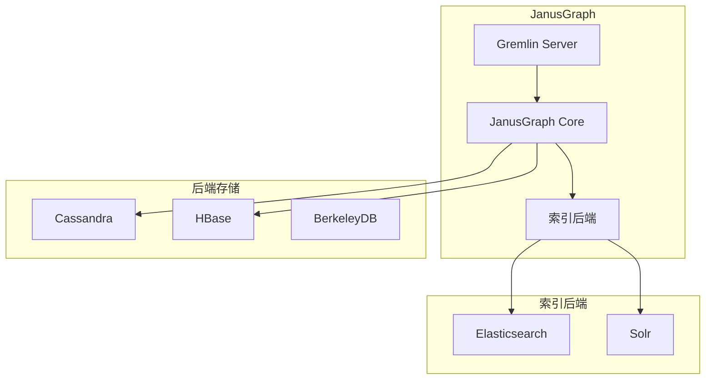

# JanusGraph 项目概览

## 学习目标

- 了解 JanusGraph 作为 Apache 顶级图计算框架的定位
- 掌握 JanusGraph 的后端解耦和 Gremlin 查询

## 项目定位

> JanusGraph 是一个可扩展的图数据库，支持 Apache TinkerPop 栈，可用多种后端存储（Cassandra/HBase/BerkeleyDB）。

**基本信息**：
- 开发方：JanusGraph 社区（Linux Foundation 项目）
- 首次发布：2017 年（从 TitanDB 分叉）
- 开源协议：Apache 2.0
- GitHub Stars：约 7k

## 核心设计

```mermaid
graph TD
    A[JanusGraph] --> B[后端解耦<br/>可插拔存储]
    A --> C[Gremlin 查询<br/>Apache TinkerPop]
    A --> D[索引后端<br/>Elasticsearch/Solr]
    A --> E[事务支持<br/>外部存储]
    A --> F[OLAP 支持<br/>Spark/Flink]

    B --> B1[Cassandra]
    B --> B2[HBase]
    B --> B3[BerkeleyDB
```

## 架构特点



## Gremlin 示例

```groovy
// Gremlin 查询
g.V().has('person', 'name', 'Alice')  // 查找顶点
  .outE('knows')                       // 边
  .inV()                               // 邻居
  .values('name')                      // 属性

// 路径查询
g.V('Alice').repeat(out()).times(3).path()

// 聚合
g.V().hasLabel('person').count()

// 过滤
g.V().has('person', 'age', gt(30))
```

## 要点总结

- 后端存储可插拔
- 兼容 Apache TinkerPop Gremlin
- 支持 OLAP 批处理
- 适合大规模图数据存储

## 思考题

1. JanusGraph 的后端解耦设计与直接嵌入存储相比有何优势？
2. JanusGraph 的全局图索引如何与后端存储的本地索引配合？
3. Gremlin 的图遍历与 Cypher 的图案匹配在语义上有何不同？