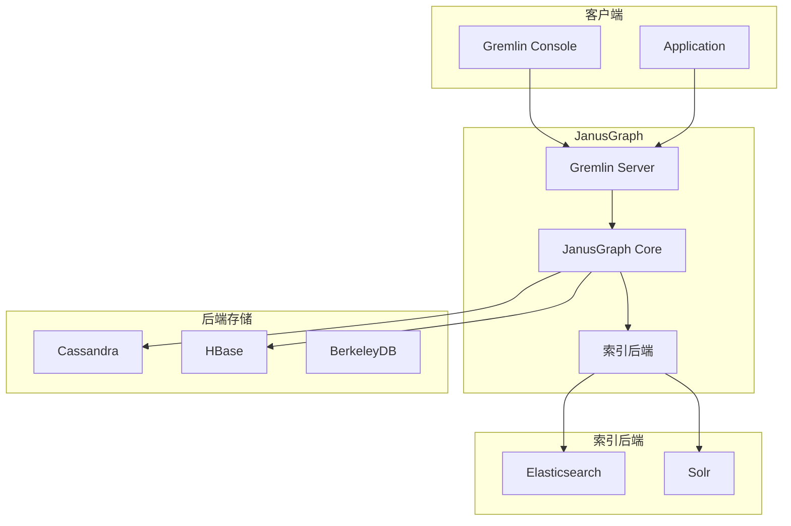

# JanusGraph 架构设计

## 学习目标

- 理解 JanusGraph 的后端解耦架构
- 掌握 JanusGraph 的混合索引机制

## 整体架构



## 后端存储对比

| 后端 | 类型 | 适用场景 |
|------|------|---------|
| Cassandra | 分布式 | 大规模、写入多 |
| HBase | 分布式 | 大规模、Hadoop 生态 |
| BerkeleyDB | 嵌入式 | 小规模、简单部署 |
| ScyllaDB | 分布式 | Cassandra 替代 |
| Oracle | 单机 | 企业级 |

## 图存储结构

```java
// JanusGraph 存储结构
// 每个顶点存储为一行

// Key:   [partition_key][vertex_id]
// Value: [edge_info][property_info]

// 边存储在顶点中
// IN 或 OUT 边都存储在源顶点
// 双向链表连接

// 索引结构
// 全局索引：外部索引后端
// 混合索引：Elasticsearch/Solr
```

## 混合索引

```java
// 索引配置
// 1. 边属性索引
// 2. 顶点属性索引
// 3. 全文索引
// 4. 地理位置索引

// 示例
schema.propertyKey('name').asString().index().by('name').text().make();
schema.propertyKey('age').asInteger().index().by('age').range().make();

// 查询时自动使用索引
g.V().has('name', textContains('Alice'))
```

## 事务机制

```java
// JanusGraph 事务
GraphTraversalSource g = graph.traversal();

// 开启事务
GraphTraversal<Vertex, Vertex> t = g.tx().begin();

// 顶点操作
Vertex v = g.addV('person').property('name', 'Alice').next();
v.property('age', 30);

// 提交
g.tx().commit();

// 回滚
g.tx().rollback();
```

## 要点总结

- 后端存储完全可插拔
- 混合索引支持复杂查询
- 事务由后端存储保证
- 支持 OLAP 批处理

## 思考题

1. 后端解耦设计如何影响 JanusGraph 的事务语义？
2. JanusGraph 的全局索引与后端本地索引如何配合？
3. Cassandra 后端的写入路径是什么？