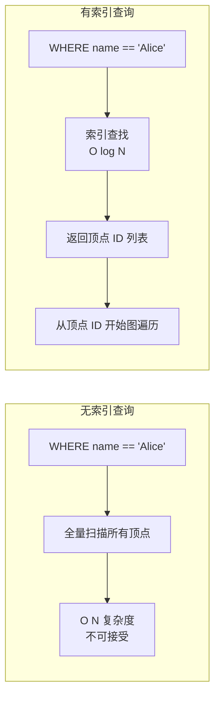
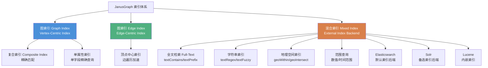
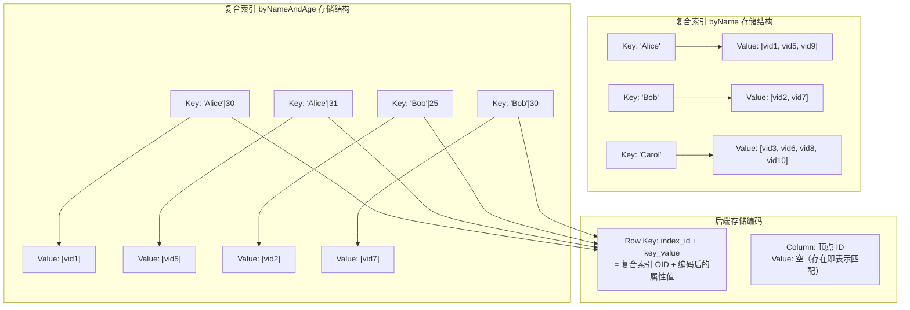
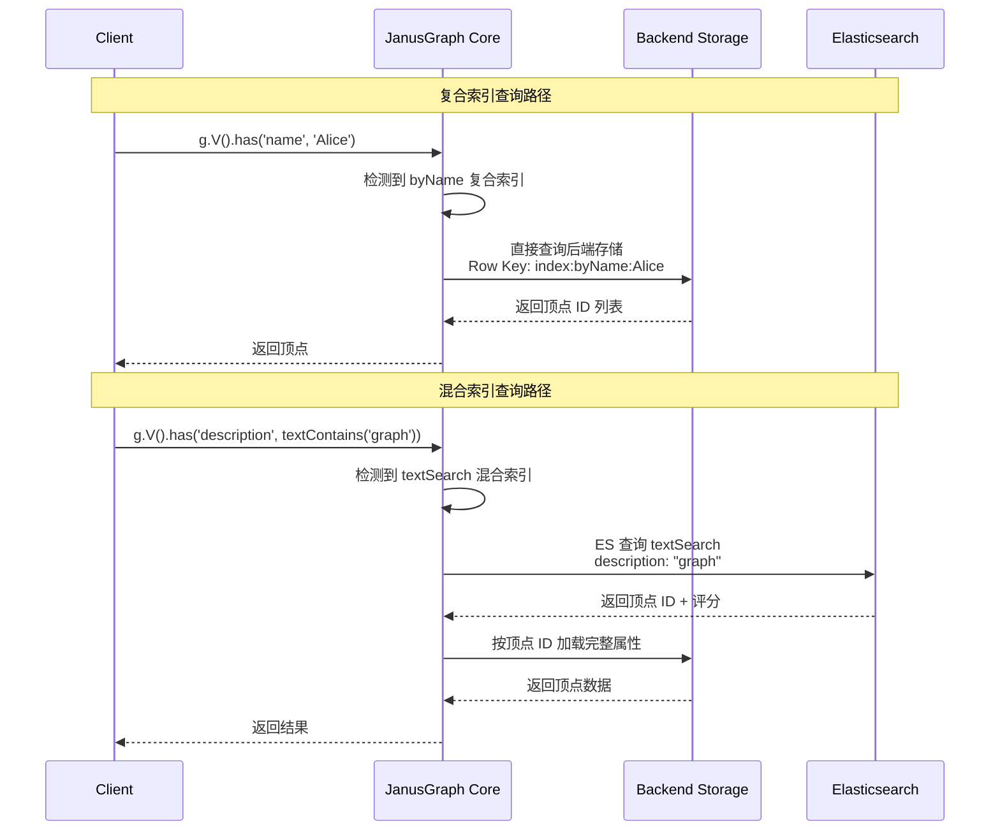
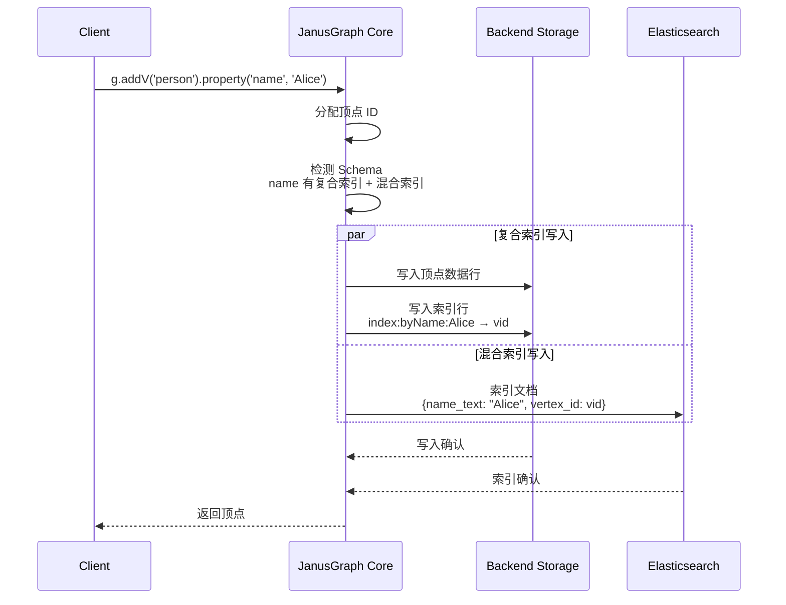
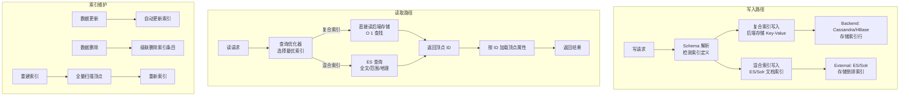
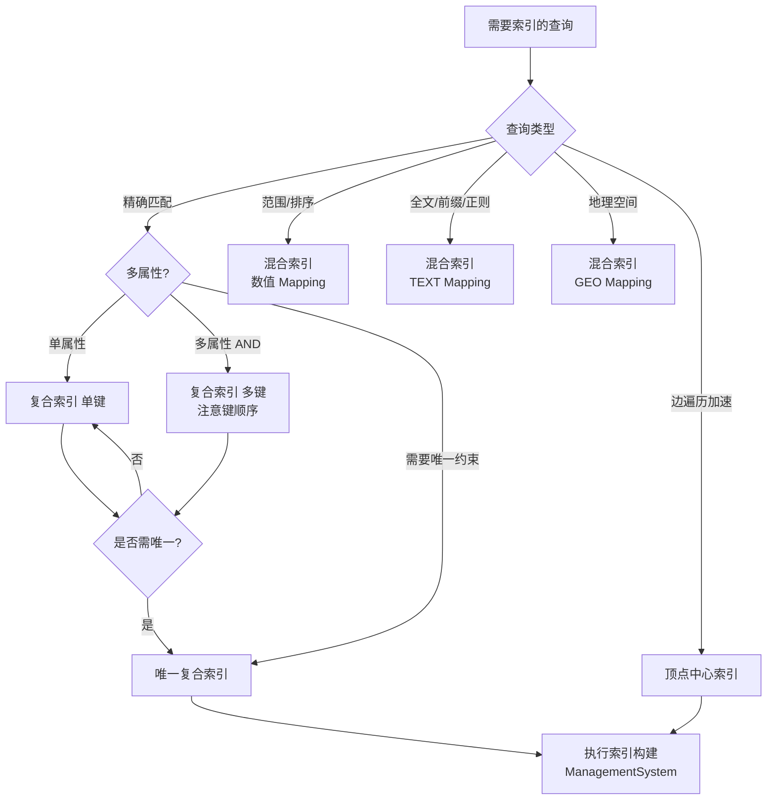
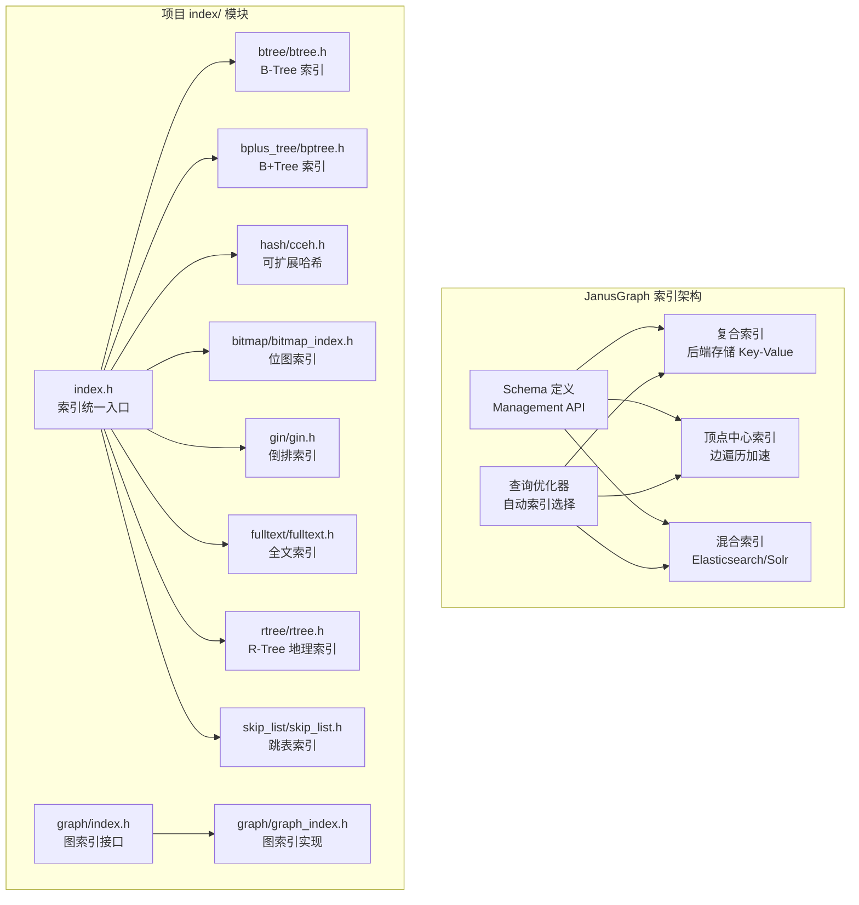

# JanusGraph 索引机制

## 学习目标

- 理解 JanusGraph 的索引类型体系（复合索引 / 混合索引 / 图索引）
- 掌握索引的实现原理及其与后端存储的协作关系
- 能够根据查询模式选择合适的索引策略
- 对比 JanusGraph 索引与项目 `index/` 模块（BTree/Hash/Bitmap）的异同

## 核心概念

### 为什么图数据库需要索引？

JanusGraph 的图遍历查询基于顶点 ID 沿边扩展，但实际查询中用户经常需要**基于属性条件**找到起始顶点：

```groovy
// 需要索引的查询：按属性值定位顶点
g.V().has('person', 'name', 'Alice')

// 不需要索引的查询：已知顶点 ID 后遍历
g.V(123).out('knows').values('name')
```

如果没有索引，`has('name', 'Alice')` 需要**全量扫描所有顶点**的属性值，效率极低。索引的核心作用是建立**属性值到顶点 ID 的映射**，实现 O(log N) 级别的定位。

### 索引的基本原理



### JanusGraph 索引的独特之处

与关系数据库不同，JanusGraph 的索引体系依赖于**后端存储的直接索引**和**外部索引引擎**的双层架构：

| 特点 | 说明 |
|------|------|
| **双层索引架构** | 图索引（后端存储层） + 混合索引（外部搜索引擎） |
| **Schema 驱动** | 索引通过 Management API 定义，支持显式 Schema 管理 |
| **按标签索引** | 索引按顶点标签（Vertex Label）或边标签（Edge Label）组织 |
| **后端依赖** | 索引的持久化和一致性依赖后端存储（Cassandra/HBase/BerkeleyDB） |
| **外部索引引擎** | 全文检索和地理空间查询依赖 Elasticsearch/Solr |
| **自动维护** | 数据变更时索引自动更新，无需手动重建 |

## 索引类型详解

### 索引整体分类



### 1. 复合索引（Composite Index）

复合索引是 JanusGraph 最基本的索引类型，索引数据直接存储在**后端存储**（Cassandra/HBase/BerkeleyDB）中，不依赖外部索引引擎。

**特点**：
- 支持精确匹配查询（`has(key, value)`）
- 支持单属性和多属性组合
- 不依赖外部索引引擎，延迟低
- 不支持范围查询、全文检索、模糊匹配

**创建示例**：

```groovy
// 打开管理接口
mgmt = graph.openManagement()

// 定义属性键
name = mgmt.makePropertyKey('name').dataType(String.class).make()
age = mgmt.makePropertyKey('age').dataType(Integer.class).make()
email = mgmt.makePropertyKey('email').dataType(String.class).make()

// 单属性复合索引
mgmt.buildIndex('byName', Vertex.class)
    .addKey(name)
    .buildCompositeIndex()

// 复合索引（多属性组合）
mgmt.buildIndex('byNameAndAge', Vertex.class)
    .addKey(name)
    .addKey(age)
    .buildCompositeIndex()

// 唯一索引
mgmt.buildIndex('uniqueEmail', Vertex.class)
    .addKey(email)
    .unique()
    .buildCompositeIndex()

// 边索引
since = mgmt.makePropertyKey('since').dataType(Integer.class).make()
mgmt.buildIndex('knowsSince', Edge.class)
    .addKey(since)
    .buildCompositeIndex()

mgmt.commit()
```

**查询使用**：

```groovy
// 使用单属性索引
g.V().has('name', 'Alice')

// 使用复合索引（必须包含所有前缀键）
g.V().has('name', 'Alice').has('age', 30)

// 复合索引前缀匹配有效
g.V().has('name', 'Alice')  // 使用 byNameAndAge 的前缀

// 唯一索引
g.V().has('email', 'alice@example.com')
```

**复合索引原理**：



### 2. 顶点中心索引（Vertex-Centric Index）

顶点中心索引用于加速单个顶点的边遍历，解决"超级节点"（度数极高的顶点）的遍历性能问题。

**背景问题**：当 Alice 有 100 万条 `knows` 边，查询 `Alice 的 knows 朋友中年龄大于 30 的` 时，需要遍历所有 100 万条边并过滤，效率极低。

**解决思路**：在顶点内部按边属性建立索引，边遍历时**只读取满足条件的边**。

```groovy
// 定义边属性和索引
since = mgmt.makePropertyKey('since').dataType(Integer.class).make()

// 创建顶点中心索引
mgmt.buildEdgeIndex(g.getOrCreateEdgeLabel('knows'), 'knowsBySince', Direction.BOTH, Order.desc, since)

// 创建复合顶点中心索引
mgmt.buildEdgeIndex(g.getOrCreateEdgeLabel('knows'), 'knowsBySinceAndLocation', Direction.BOTH, Order.desc, since, location)
```

**顶点中心索引原理**：


**顶点中心索引的存储结构**：在顶点行内按索引组织边数据，边按属性值排序存储，支持范围过滤和排序。

### 3. 混合索引（Mixed Index）

混合索引依赖外部索引后端（Elasticsearch / Solr / Lucene），支持复杂查询类型。

**特点**：
- 支持全文检索（`textContains`、`textPrefix`、`textRegex`）
- 支持范围查询（数值、时间）
- 支持地理空间查询（`geoWithin`、`geoIntersect`、`geoDisjoint`）
- 支持模糊匹配和正则表达式
- 依赖外部搜索引擎，延迟略高

**创建示例**：

```groovy
mgmt = graph.openManagement()

// 定义属性
name = mgmt.makePropertyKey('name').dataType(String.class).make()
description = mgmt.makePropertyKey('description').dataType(String.class).make()
age = mgmt.makePropertyKey('age').dataType(Integer.class).make()
location = mgmt.makePropertyKey('location').dataType(Geoshape.class).make()

// 混合索引 - 全文检索
mgmt.buildIndex('textSearch', Vertex.class)
    .addKey(name, Mapping.TEXT.asParameter())
    .addKey(description, Mapping.TEXT.asParameter())
    .buildMixedIndex('search')

// 混合索引 - 字符串精确匹配 + 全文
mgmt.buildIndex('nameMixed', Vertex.class)
    .addKey(name, Mapping.TEXTSTRING.asParameter())
    .buildMixedIndex('search')

// 混合索引 - 数值范围
mgmt.buildIndex('ageRange', Vertex.class)
    .addKey(age, Mapping.INTEGER.asParameter())
    .buildMixedIndex('search')

// 混合索引 - 地理空间
mgmt.buildIndex('geoSearch', Vertex.class)
    .addKey(location, Mapping.POINT.asParameter())
    .buildMixedIndex('search')

// 混合索引 - 复合（全文 + 范围）
mgmt.buildIndex('combinedSearch', Vertex.class)
    .addKey(name, Mapping.TEXT.asParameter())
    .addKey(age, Mapping.INTEGER.asParameter())
    .buildMixedIndex('search')

mgmt.commit()
```

**混合索引查询**：

```groovy
// 全文检索
g.V().has('description', textContains('graph database'))
g.V().has('name', textPrefix('Ali'))

// 范围查询
g.V().has('age', gt(25))
g.V().has('age', between(20, 30))

// 地理空间查询
g.V().has('location', geoWithin(Geoshape.circle(37.97, 23.72, 50)))

// 复合查询：全文 + 范围
g.V().has('description', textContains('engineer'))
     .has('age', gt(30))

// 正则表达式
g.V().has('name', textRegex('Ali.*'))
```

### 4. 索引类型对比

| 维度 | 复合索引（Composite） | 顶点中心索引（Vertex-Centric） | 混合索引（Mixed） |
|------|---------------------|-------------------------------|-----------------|
| **存储位置** | 后端存储（Cassandra/HBase） | 后端存储，顶点行内 | 外部索引后端（ES/Solr） |
| **查询类型** | 精确匹配 | 边遍历排序/范围 | 全文/范围/地理/正则 |
| **依赖外部引擎** | 否 | 否 | 是（Elasticsearch/Solr） |
| **延迟** | 低 | 低 | 中（网络开销） |
| **适用场景** | 属性精确匹配 | 超级节点边遍历加速 | 复杂查询、全文搜索 |
| **复合键支持** | 是（多属性） | 是（边属性组合） | 是（跨属性组合） |
| **唯一性约束** | 支持 | 不支持 | 不支持 |

## 索引实现原理

### 1. 复合索引实现原理

复合索引的底层存储依赖后端存储的 Key-Value 模型：

**索引 Key 编码**：

```
[图索引 ID][属性值编码] → [顶点 ID 列表]

- 图索引 ID: 系统分配的索引唯一标识
- 属性值编码: 按数据类型序列化（String 按 UTF-8、Integer 按大端序）
- 顶点 ID: 匹配该属性值的所有顶点 ID
```

**后端存储映射**：

| 后端 | 索引存储方式 |
|------|-------------|
| Cassandra | Row Key = 索引 ID + 属性值，Column Name = 顶点 ID |
| HBase | Row Key = 索引 ID + 属性值，Column = 顶点 ID |
| BerkeleyDB | Key = 索引 ID + 属性值，Value = 顶点 ID 列表 |

**示例**：复合索引 `byName` 在 Cassandra 中的存储

```
Row Key: index:byName:Alice
    → Column: vid1 (timestamp)
    → Column: vid5 (timestamp)
    → Column: vid9 (timestamp)

Row Key: index:byName:Bob
    → Column: vid2 (timestamp)
    → Column: vid7 (timestamp)
```

### 2. 混合索引实现原理

混合索引将索引数据存储在外部搜索引擎中，JanusGraph 通过 REST API 或 Thrift 接口与搜索引擎通信。

**Elasticsearch 索引映射**：

```json
{
  "mappings": {
    "janusgraph_index": {
      "properties": {
        "name_text": {
          "type": "text",
          "analyzer": "standard"
        },
        "name_string": {
          "type": "keyword"
        },
        "age_int": {
          "type": "integer"
        },
        "location_geo": {
          "type": "geo_point"
        },
        "vertex_id": {
          "type": "long"
        }
      }
    }
  }
}
```

**查询流程**：



### 3. 索引写入流程



### 4. 索引更新与删除

JanusGraph 的索引在数据变更时自动维护：

```groovy
// 更新属性值
g.V(alice).property('name', 'AliceSmith').iterate()

// 内部流程：
// 1. 从复合索引中删除旧值条目 (byName:Alice → vid)
// 2. 向复合索引添加新值条目 (byName:AliceSmith → vid)
// 3. 向 ES 发送更新文档
```

### 5. 索引数据流总览



## 索引选择策略

### 1. 选择原则

| 查询模式 | 推荐索引类型 | 示例 |
|---------|------------|------|
| 精确匹配（单属性） | 复合索引 | `has('name', 'Alice')` |
| 精确匹配（多属性 AND） | 复合索引 | `has('name', 'Alice').has('age', 30)` |
| 范围查询 | 混合索引 | `has('age', gt(25))` |
| 全文检索 | 混合索引 | `has('desc', textContains('graph'))` |
| 前缀匹配 | 混合索引 | `has('name', textPrefix('Ali'))` |
| 正则表达式 | 混合索引 | `has('name', textRegex('Ali.*'))` |
| 地理空间查询 | 混合索引 | `has('loc', geoWithin(circle))` |
| 模糊匹配 | 混合索引 | `has('name', textFuzzy('Alice'))` |
| 边遍历加速 | 顶点中心索引 | `outE('knows').has('since', gt(2020))` |
| 唯一性约束 | 复合索引 + unique | `has('email', 'a@b.com')` |

### 2. 索引选择决策树



### 3. 索引设计最佳实践

**场景 1：用户查找（精确匹配）**

```groovy
// 用户通过 email 精确查找，需要唯一约束
// 推荐：唯一复合索引
mgmt.buildIndex('userByEmail', Vertex.class)
    .addKey(email)
    .unique()
    .buildCompositeIndex()

// 用户通过 name 精确查找，不需要唯一
// 推荐：复合索引
mgmt.buildIndex('userByName', Vertex.class)
    .addKey(name)
    .buildCompositeIndex()
```

**场景 2：多条件筛选**

```groovy
// 查询：name = 'Alice' AND age > 30
// 推荐：复合索引 + 混合索引混合使用
// name 精确匹配用复合索引，age 范围用混合索引

// 复合索引（精确匹配部分）
mgmt.buildIndex('byName', Vertex.class)
    .addKey(name)
    .buildCompositeIndex()

// 混合索引（范围查询部分）
mgmt.buildIndex('byAge', Vertex.class)
    .addKey(age, Mapping.INTEGER.asParameter())
    .buildMixedIndex('search')

// 查询时，JanusGraph 自动组合使用两个索引
g.V().has('name', 'Alice').has('age', gt(30))
```

**场景 3：全文搜索**

```groovy
// 需要全文搜索 description 字段
// 推荐：混合索引 + TEXT Mapping
mgmt.buildIndex('descSearch', Vertex.class)
    .addKey(description, Mapping.TEXT.asParameter())
    .buildMixedIndex('search')
```

**场景 4：超级节点边遍历**

```groovy
// Alice 有大量 knows 边，查询 since > 2020 的边
// 推荐：顶点中心索引
mgmt.buildEdgeIndex(
    g.getOrCreateEdgeLabel('knows'),
    'knowsBySince',
    Direction.BOTH,
    Order.desc,
    since
)
```

### 4. 索引构建与重建

索引定义后需要**显式构建**才能生效：

```groovy
// 1. 定义索引
mgmt = graph.openManagement()
name = mgmt.getPropertyKey('name')
mgmt.buildIndex('byName', Vertex.class).addKey(name).buildCompositeIndex()
mgmt.commit()

// 2. 执行索引构建（异步）
mgmt = graph.openManagement()
mgmt.updateIndex(mgmt.getGraphIndex('byName'), SchemaAction.REGISTER_INDEX).get()
mgmt.commit()

// 3. 等待索引状态变为 ENABLED
ManagementSystem.awaitGraphIndexStatus(graph, 'byName').status(SchemaStatus.ENABLED).call()

// 4. 重建现有数据的索引
mgmt = graph.openManagement()
mgmt.updateIndex(mgmt.getGraphIndex('byName'), SchemaAction.REINDEX).get()
mgmt.commit()
```

### 5. 索引代价分析

| 索引类型 | 存储代价 | 写入代价 | 查询代价 | 适用场景 |
|---------|---------|---------|---------|---------|
| 复合索引（单键） | 低 | 低 | 极低 | 精确匹配 |
| 复合索引（多键） | 低 | 中 | 极低 | 多属性精确匹配 |
| 唯一复合索引 | 低 | 中 | 极低 | 唯一约束 + 精确匹配 |
| 顶点中心索引 | 中 | 中 | 低 | 超级节点边遍历 |
| 混合索引（全文） | 高 | 高 | 中 | 全文检索 |
| 混合索引（范围） | 中 | 中 | 低 | 数值/时间范围 |
| 混合索引（地理） | 高 | 高 | 中 | 地理空间查询 |

## 与项目 index/ 模块对比

### 1. 架构对比



### 2. 功能对比表

| 特性 | JanusGraph | 项目 index/ 模块 |
|------|-----------|-----------------|
| **复合索引** | 后端存储 Key-Value | `bplus_tree/bptree.h` 复合键 |
| **B-Tree 索引** | 无（后端存储提供） | `btree/btree.h` |
| **B+Tree 索引** | 无（后端存储提供） | `bplus_tree/bptree.h` |
| **Hash 索引** | 无（后端存储提供） | `hash/cceh.h`, `hash/cuckoo.h` |
| **Bitmap 索引** | 无 | `bitmap/bitmap_index.h` |
| **倒排索引** | 外部 ES/Solr 提供 | `gin/gin.h` |
| **全文索引** | 混合索引（ES/Solr） | `fulltext/fulltext.h` |
| **地理索引** | 混合索引（ES/Solr） | `rtree/rtree.h` |
| **顶点中心索引** | 原生支持 | `graph/graph_index.h` 标签索引 |
| **边索引** | 顶点中心索引 | CSR 存储（`graph_csr.h`） |
| **索引持久化** | 后端存储自动持久化 | 手动序列化 |
| **分布式支持** | 原生支持 | 单机 |
| **查询优化器** | 自动选择索引 | 应用层选择 |

### 3. 复合索引对比

**JanusGraph 复合索引**：
- 存储在后端存储的 Key-Value 中
- 索引 Key = 索引 ID + 属性值编码
- 支持唯一约束
- 自动持久化

**项目 B+Tree（`bplus_tree/bptree.h`）**：

```c
// 项目 B+Tree 复合键支持
typedef struct bptree_composite_key_s {
    bptree_key_t *keys;      // 复合键数组
    uint32_t num_keys;       // 键数量
} bptree_composite_key_t;

// 复合键插入
bptree_index_t *idx = bptree_create(4, compare_composite, NULL);
bptree_composite_key_t ckey = { .keys = keys, .num_keys = 2 };
bptree_insert(idx, &ckey, sizeof(ckey), &vid, sizeof(vid));

// 复合键查询
bptree_composite_key_t qkey = { .keys = qkeys, .num_keys = 1 }; // 前缀匹配
bptree_iter_t *iter = bptree_iter_create(idx, &qkey, sizeof(qkey));
```

**对比**：

| 维度 | JanusGraph 复合索引 | 项目 B+Tree |
|------|-------------------|------------|
| **底层存储** | 后端存储 Key-Value | 原生 B+Tree 内存结构 |
| **持久化** | 自动（后端存储） | 手动 `bptree_save()` |
| **复合键** | 属性值编码拼接 | 复合键结构体 |
| **唯一约束** | 原生支持 | 应用层检查 |
| **前缀匹配** | 自动支持 | 迭代器范围扫描 |
| **并发控制** | 后端存储事务 | 应用层锁 |

### 4. 顶点中心索引对比

**JanusGraph 顶点中心索引**：
- 在顶点内部按边属性组织边
- 支持按属性值排序和范围过滤
- 解决超级节点遍历性能问题

**项目图索引（`graph/graph_index.h`）**：

```c
// 项目标签索引
typedef struct GraphLabelIndexEntry_s {
    graph_label_id_t label_id;
    graph_vertex_id_t *vertex_ids;  // 顶点 ID 数组
    size_t num_vertices;
    size_t capacity;
    UT_hash_handle hh;              // UTHash 句柄
} GraphLabelIndexEntry;

// 项目属性索引
typedef struct GraphPropIndex_s {
    char index_name[128];
    char prop_name[64];
    GraphIndexType type;            // BTREE / HASH / RANGE
    GraphPropValueEntry *value_index;  // Hash 索引
    GraphPropIndexEntry **range_indexes; // 范围索引
    size_t num_range_indexes;
    void *mem_pool;
} GraphPropIndex;
```

**对比**：

| 维度 | JanusGraph 顶点中心索引 | 项目图索引 |
|------|------------------------|-----------|
| **定位** | 边遍历加速（超级节点） | 标签/属性精确查找 |
| **存储位置** | 顶点行内 | 独立 Hash 表/B+Tree |
| **边遍历优化** | 原生优化 | CSR 邻接表 |
| **范围过滤** | 按边属性排序过滤 | 属性范围查询 |
| **超级节点** | 专门优化 | 全量遍历 |

### 5. 混合索引对比

**JanusGraph 混合索引**：
- 依赖外部索引引擎（ES/Solr）
- 支持全文、范围、地理查询
- 通过网络请求交互

**项目全文索引（`fulltext/fulltext.h`）**：

```c
// 项目全文索引 API
fulltext_index_t *fulltext_create(void);
void fulltext_set_tokenizer(fulltext_index_t *idx, tokenizer_type_t type);
int fulltext_index_doc(fulltext_index_t *idx, int doc_id, const char *text);
int fulltext_search(fulltext_index_t *idx, const char *query,
                    int *doc_ids, float *scores, int *count, int limit);

// 分词器类型
typedef enum {
    TOKENIZER_WHITESPACE,    // 空格分词（英文）
    TOKENIZER_CHINESE_MM,    // 中文最大匹配分词
    TOKENIZER_MIXED          // 混合分词
} tokenizer_type_t;
```

**项目 GIN 索引（`gin/gin.h`）**：

```c
// GIN 倒排索引
gin_index_t *gin_create(int capacity);
int gin_insert(gin_index_t *idx, const char *key, int doc_id);
int gin_search(gin_index_t *idx, const char *key, int *results, int *count);

// Posting List 结构
struct posting_list {
    int doc_id;
    struct posting_list *next;
};

// Posting Array 结构（大列表优化）
struct posting_array {
    int *doc_ids;    // 有序数组
    int count;
    int capacity;
};
```

**对比**：

| 维度 | JanusGraph 混合索引 | 项目全文/GIN |
|------|--------------------|-------------|
| **存储引擎** | Elasticsearch/Solr（分布式） | 内存结构 |
| **分词器** | ES 标准分词器 + 自定义 | 空格/中文分词 |
| **查询类型** | 全文/范围/地理/正则/模糊 | 全文搜索 |
| **地理空间** | 原生支持（GeoShape） | RTree 独立实现 |
| **分布式** | 原生支持 | 单机 |
| **持久化** | ES 自动持久化 | 手动 |

### 6. 存储层对比

**JanusGraph**：索引存储在后端存储中，图数据与索引数据物理上分离但逻辑上统一管理。

**项目**：图数据存储在 `graph_engine` 中，索引存储在 `graph/graph_index.h` 的独立 Hash 表/B+Tree 中。

| 维度 | JanusGraph | 项目图索引 |
|------|-----------|-----------|
| **数据存储** | 后端存储（Cassandra/HBase） | graph_engine 内存结构 |
| **索引存储** | 后端存储 + 外部 ES | graph/graph_index.h 内存结构 |
| **一致性** | 后端存储事务保证 | 应用层保证 |
| **故障恢复** | 后端存储复制 + ES 副本 | 手动持久化 |
| **容量扩展** | 水平扩展 | 单机内存限制 |

### 7. 功能对比总结

| 特性 | JanusGraph | 项目 index/ 模块 |
|------|-----------|-----------------|
| **复合索引** | 后端存储 Key-Value 实现 | `bplus_tree/bptree.h` 复合键 |
| **B-Tree 索引** | 无 | `btree/btree.h` |
| **B+Tree 索引** | 无（后端存储有序遍历） | `bplus_tree/bptree.h` |
| **Hash 索引** | 无（后端存储 Key-Value 查找） | `hash/cceh.h`, `hash/cuckoo.h` |
| **Bitmap 索引** | 无 | `bitmap/bitmap_index.h` |
| **倒排索引** | 外部 ES/Solr | `gin/gin.h` |
| **全文索引** | 混合索引（ES/Solr） | `fulltext/fulltext.h` |
| **地理索引** | 混合索引（ES/Solr） | `rtree/rtree.h` |
| **顶点中心索引** | 原生支持 | `graph/graph_index.h` 标签索引 |
| **跳表索引** | 无 | `skip_list/skip_list.h` |
| **分词器体系** | ES 分析器 | 内置分词器 |
| **持久化** | 自动（后端存储 + ES） | 手动 |
| **分布式** | 原生支持 | 单机 |
| **查询优化器** | 自动选择索引 | 应用层选择 |

## 完整示例：社交网络索引设计

### Schema 定义

```groovy
// 打开管理接口
mgmt = graph.openManagement()

// 顶点标签
person = mgmt.makeVertexLabel('person').make()
company = mgmt.makeVertexLabel('company').make()
post = mgmt.makeVertexLabel('post').make()

// 边标签
knows = mgmt.makeEdgeLabel('knows').multiplicity(MULTI).make()
worksFor = mgmt.makeEdgeLabel('worksFor').multiplicity(MANY2ONE).make()
wrote = mgmt.makeEdgeLabel('wrote').multiplicity(MULTI).make()

// 属性键
name = mgmt.makePropertyKey('name').dataType(String.class).make()
email = mgmt.makePropertyKey('email').dataType(String.class).make()
bio = mgmt.makePropertyKey('bio').dataType(String.class).make()
age = mgmt.makePropertyKey('age').dataType(Integer.class).make()
location = mgmt.makePropertyKey('location').dataType(Geoshape.class).make()
createdAt = mgmt.makePropertyKey('createdAt').dataType(Date.class).make()
since = mgmt.makePropertyKey('since').dataType(Integer.class).make()
title = mgmt.makePropertyKey('title').dataType(String.class).make()
content = mgmt.makePropertyKey('content').dataType(String.class).make()

// === 索引定义 ===

// 1. 复合索引（精确匹配）
// 用户 email 唯一索引
mgmt.buildIndex('personByEmail', Vertex.class)
    .addKey(email).unique().buildCompositeIndex()

// 用户 name 索引
mgmt.buildIndex('personByName', Vertex.class)
    .addKey(name).buildCompositeIndex()

// 公司 name 索引
mgmt.buildIndex('companyByName', Vertex.class)
    .addKey(name).buildCompositeIndex()

// 2. 混合索引（全文检索 + 范围查询）
mgmt.buildIndex('personSearch', Vertex.class)
    .addKey(bio, Mapping.TEXT.asParameter())
    .addKey(age, Mapping.INTEGER.asParameter())
    .addKey(createdAt, Mapping.DATE.asParameter())
    .addKey(location, Mapping.POINT.asParameter())
    .buildMixedIndex('search')

// 帖子全文搜索
mgmt.buildIndex('postSearch', Vertex.class)
    .addKey(title, Mapping.TEXT.asParameter())
    .addKey(content, Mapping.TEXT.asParameter())
    .addKey(createdAt, Mapping.DATE.asParameter())
    .buildMixedIndex('search')

// 3. 顶点中心索引（边遍历加速）
// knows 边按 since 排序
mgmt.buildEdgeIndex(knows, 'knowsBySince', Direction.BOTH, Order.desc, since)

// 提交 Schema
mgmt.commit()

// === 索引构建 ===
// 注册索引
mgmt = graph.openManagement()
mgmt.updateIndex(mgmt.getGraphIndex('personByEmail'), SchemaAction.REGISTER_INDEX).get()
mgmt.updateIndex(mgmt.getGraphIndex('personByName'), SchemaAction.REGISTER_INDEX).get()
mgmt.updateIndex(mgmt.getGraphIndex('companyByName'), SchemaAction.REGISTER_INDEX).get()
mgmt.commit()

// 等待索引启用
ManagementSystem.awaitGraphIndexStatus(graph, 'personByEmail').call()
ManagementSystem.awaitGraphIndexStatus(graph, 'personByName').call()
ManagementSystem.awaitGraphIndexStatus(graph, 'companyByName').call()

// 重建现有数据
mgmt = graph.openManagement()
mgmt.updateIndex(mgmt.getGraphIndex('personByEmail'), SchemaAction.REINDEX).get()
mgmt.updateIndex(mgmt.getGraphIndex('personByName'), SchemaAction.REINDEX).get()
mgmt.updateIndex(mgmt.getGraphIndex('companyByName'), SchemaAction.REINDEX).get()
mgmt.commit()
```

### 查询示例

```groovy
// 1. 精确匹配（使用复合索引）
g.V().has('person', 'email', 'alice@example.com')
g.V().has('person', 'name', 'Alice')

// 2. 全文搜索（使用混合索引）
g.V().has('bio', textContains('graph database engineer'))
g.V().has('post', 'title', textPrefix('How to'))

// 3. 范围查询（使用混合索引）
g.V().has('age', between(25, 40))
g.V().has('createdAt', gt(new Date('2024-01-01')))

// 4. 地理空间查询（使用混合索引）
g.V().has('location', geoWithin(Geoshape.circle(37.97, 23.72, 50)))

// 5. 复合查询：全文 + 范围
g.V().has('bio', textContains('engineer'))
     .has('age', gt(30))

// 6. 图遍历 + 边索引加速
g.V().has('person', 'name', 'Alice')
     .outE('knows').has('since', gt(2020))
     .inV().values('name')

// 7. 多跳查询
g.V().has('person', 'name', 'Alice')
     .out('knows')
     .has('age', gt(25))
     .values('name')
```

## 要点总结

- **索引类型**：JanusGraph 提供三类索引——复合索引（精确匹配）、混合索引（全文/范围/地理）、顶点中心索引（边遍历加速），覆盖不同查询需求
- **双层架构**：图索引存储在后端存储中（Cassandra/HBase Key-Value），混合索引依赖外部搜索引擎（Elasticsearch/Solr）
- **复合索引高效**：直接在后端存储中查找，延迟最低，适合精确匹配查询，支持唯一约束
- **混合索引强大**：依赖外部搜索引擎，支持全文检索、地理空间查询、范围查询、模糊匹配
- **顶点中心索引**：专门解决超级节点的边遍历性能问题，在顶点行内按属性组织边
- **Schema 驱动**：索引通过 Management API 定义，需要显式构建和重建才能生效
- **索引构建流程**：定义 → 注册 → 等待启用 → 重建现有数据，四个步骤缺一不可
- **与项目对比**：项目 index/ 模块提供更丰富的内存索引结构（BTree/Hash/Bitmap/GIN），JanusGraph 提供分布式持久化和外部搜索引擎集成

## 思考题

1. JanusGraph 的复合索引直接存储在后端存储中，这与将索引数据与图数据分离存储相比，各有什么优缺点？在什么场景下选择哪种方式？

2. 混合索引依赖外部搜索引擎（ES/Solr），如何保证索引与图数据的强一致性？在写入失败时如何处理？

3. 顶点中心索引如何解决超级节点的遍历性能问题？如果项目中 graph_engine 的 CSR 存储遇到类似问题，应该如何优化？

4. 对比 JanusGraph 的复合索引和项目 `bplus_tree/bptree.h` 的复合键实现，各自的适用场景和性能特性有何不同？

5. 如果要在项目中为 `graph_engine` 添加类似 JanusGraph 的混合索引功能，应该如何设计？能否复用现有的 `fulltext/fulltext.h` 和 `gin/gin.h`？

6. JanusGraph 的索引构建需要显式执行 REGISTER_INDEX 和 REINDEX 操作，这种设计是为了解决什么问题？项目中是否需要类似的索引构建流程？

## 参考资料

- [JanusGraph 官方文档 - 索引](https://docs.janusgraph.org/index-management/)
- [JanusGraph 官方文档 - Schema 与索引定义](https://docs.janusgraph.org/schema/)
- [JanusGraph 官方文档 - 索引后端](https://docs.janusgraph.org/index-backend/)
- [Elasticsearch 官方文档 - 映射与分析](https://www.elastic.co/guide/en/elasticsearch/reference/current/mapping.html)
- 项目 `engineering/include/db/index/` 模块源码
- 项目 `engineering/include/db/graph/index.h` 图索引接口
- 项目 `engineering/include/db/graph/graph_index.h` 图索引实现