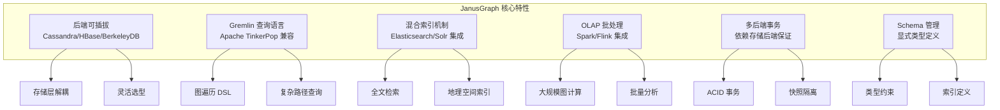
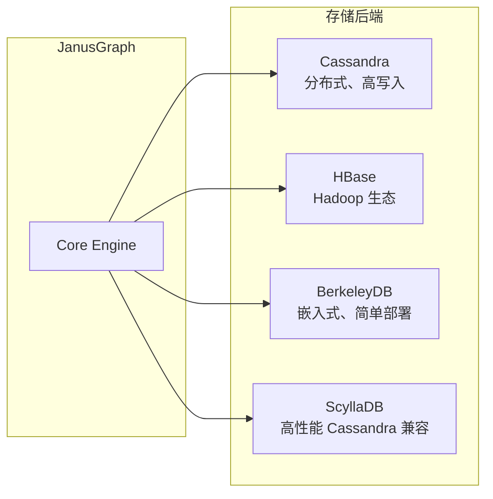
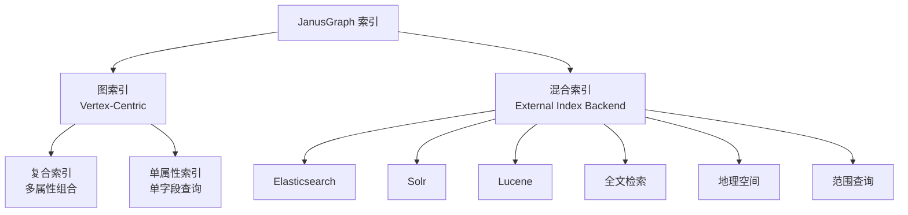

# JanusGraph 关键特性

## 学习目标

- 掌握 JanusGraph 的核心差异化特性
- 理解后端可插拔架构的业务价值
- 对比 JanusGraph 与 Neo4j 的设计差异

## 特性总览



## 核心特性详解

### 1. 后端可插拔架构

JanusGraph 最大特点是存储层完全解耦，支持多种后端存储：



| 后端存储 | 特点 | 适用场景 | 水平扩展 |
|---------|------|---------|---------|
| Cassandra | 最终一致、高可用 | 大规模写入、跨数据中心 | 原生支持 |
| HBase | 强一致、Hadoop 生态 | 大数据分析、企业级 | 原生支持 |
| BerkeleyDB | 嵌入式、本地文件 | 小规模、开发测试 | 单机 |
| ScyllaDB | C++ 重写、低延迟 | 高性能 Cassandra 替代 | 原生支持 |

**配置示例**：

```properties
# Cassandra 后端
storage.backend=cql
storage.hostname=127.0.0.1

# HBase 后端
storage.backend=hbase
storage.hostname=127.0.0.1

# BerkeleyDB 后端
storage.backend=berkeleyje
storage.directory=/path/to/data
```

### 2. Gremlin 图遍历查询

JanusGraph 完全兼容 Apache TinkerPop 栈，使用 Gremlin 作为查询语言：

```groovy
// 基本顶点查询
g.V().has('person', 'name', 'Alice')

// 多跳遍历
g.V().has('person', 'name', 'Alice')
 .out('knows')
 .has('age', gt(30))
 .values('name')

// 路径查询
g.V().has('person', 'name', 'Alice')
 .repeat(out('knows')).times(3)
 .path()

// 聚合计算
g.V().hasLabel('person')
 .groupCount().by('city')

// 子图模式匹配
g.V().match(
  __.as('a').has('name', 'Alice'),
  __.as('a').out('knows').as('b'),
  __.as('b').has('age', gt(30))
).select('b')
```

**Gremlin vs Cypher 对比**：

| 特性 | Gremlin | Cypher |
|------|---------|--------|
| 语言风格 | 函数式链式调用 | SQL 类声明式 |
| 遍历控制 | 精细控制每一步 | 声明式模式匹配 |
| 学习曲线 | 较陡峭 | 较平缓 |
| 可编程性 | 支持嵌套、条件、循环 | 固定模式 |
| 生态 | TinkerPop 多图库 | Neo4j 原生 |

### 3. 混合索引机制

JanusGraph 支持两种索引类型：



**索引定义示例**：

```groovy
// 打开管理接口
mgmt = graph.openManagement()

// 定义属性
name = mgmt.makePropertyKey('name').dataType(String.class).make()
age = mgmt.makePropertyKey('age').dataType(Integer.class).make()
location = mgmt.makePropertyKey('location').dataType(Geoshape.class).make()

// 单属性索引
mgmt.buildIndex('nameIdx', Vertex.class).addKey(name).buildCompositeIndex()

// 复合索引
mgmt.buildIndex('nameAgeIdx', Vertex.class)
    .addKey(name).addKey(age)
    .buildCompositeIndex()

// 混合索引（全文检索）
mgmt.buildIndex('searchIdx', Vertex.class)
    .addKey(name, Mapping.TEXT.asParameter())
    .addKey(location, Mapping.TEXT.asParameter())
    .buildMixedIndex('search')

// 提交 Schema
mgmt.commit()
```

**查询自动使用索引**：

```groovy
// 自动使用 nameIdx
g.V().has('name', 'Alice')

// 自动使用 nameAgeIdx
g.V().has('name', 'Alice').has('age', 30)

// 全文检索使用混合索引
g.V().has('name', textContains('Alice'))

// 地理空间查询
g.V().has('location', geoWithin(geoCircle(37.97, 23.72, 50)))
```

### 4. Schema 管理

JanusGraph 采用显式 Schema 定义：

```groovy
// 打开管理接口
mgmt = graph.openManagement()

// 定义顶点标签
person = mgmt.makeVertexLabel('person').make()
company = mgmt.makeVertexLabel('company').make()

// 定义边标签
knows = mgmt.makeEdgeLabel('knows').make()
worksFor = mgmt.makeEdgeLabel('worksFor').multiplicity(MANY2ONE).make()

// 定义属性
name = mgmt.makePropertyKey('name').dataType(String.class).make()
age = mgmt.makePropertyKey('age').dataType(Integer.class).make()

// 属性约束（可选）
mgmt.setConsistency(name, ConsistencyModifier.LOCK)

// 提交
mgmt.commit()
```

### 5. 事务支持

JanusGraph 事务语义依赖后端存储：

```groovy
// 开启事务（隐式）
g = graph.traversal()

// 添加数据
v1 = g.addV('person').property('name', 'Alice').next()
v2 = g.addV('person').property('name', 'Bob').next()
g.addE('knows').from(v1).to(v2).iterate()

// 显式提交
graph.tx().commit()

// 回滚
graph.tx().rollback()
```

**事务隔离级别**：

| 后端 | 隔离级别 | 说明 |
|------|---------|------|
| Cassandra | 最终一致 | 无跨行事务 |
| HBase | 快照隔离 | 单行原子性 |
| BerkeleyDB | 可串行化 | 完整 ACID |

### 6. OLAP 批处理集成

JanusGraph 可与 Spark/Flink 集成进行大规模图计算：

```groovy
// 使用 Spark 进行 PageRank
graph.compute(SparkGraphComputer.class)
     .program(PageRankVertexProgram.build().create())
     .submit()
```

## 与 Neo4j 对比

| 维度 | JanusGraph | Neo4j |
|------|-----------|-------|
| 存储模型 | 外挂存储 | 原生图存储 |
| 查询语言 | Gremlin | Cypher |
| 水平扩展 | 原生支持 | 企业版支持 |
| 事务语义 | 依赖后端 | 原生 ACID |
| 索引类型 | 混合索引 | B+Tree + 全文 |
| 部署复杂度 | 高（多组件） | 低（单组件） |
| 学习曲线 | 陡峭（Gremlin） | 平缓（Cypher） |
| 社区生态 | TinkerPop | 独立生态 |
| 企业支持 | 商业版 | Aura 云服务 |
| 适用场景 | 大规模、分布式 | 企业级、单机优先 |

**选型建议**：
- **选择 JanusGraph**：需要水平扩展、已有 Cassandra/HBase 基础设施、TinkerPop 生态
- **选择 Neo4j**：企业级应用、快速原型开发、偏好 Cypher 语法

## 代码示例

### 连接 JanusGraph

```java
// Java 连接配置
Configuration config = new BaseConfiguration();
config.setProperty("storage.backend", "cql");
config.setProperty("storage.hostname", "localhost");

JanusGraph graph = JanusGraphFactory.open(config);
GraphTraversalSource g = graph.traversal();
```

### 数据操作

```groovy
// 创建顶点
alice = g.addV('person').property('name', 'Alice').property('age', 30).next()
bob = g.addV('person').property('name', 'Bob').property('age', 35).next()

// 创建边
g.addE('knows').from(alice).to(bob).property('since', 2020).iterate()

// 查询
g.V().has('person', 'name', 'Alice').out('knows').values('name')

// 更新属性
g.V(alice).property('age', 31).iterate()

// 删除顶点
g.V(alice).drop().iterate()
```

### 复杂遍历查询

```groovy
// 找出 Alice 三度好友中年龄大于 30 的人
g.V().has('person', 'name', 'Alice')
 .repeat(out('knows')).times(3)
 .has('age', gt(30))
 .dedup()
 .values('name')

// 计算最短路径
g.V().has('name', 'Alice')
 .repeat(out().simplePath()).until(has('name', 'Bob'))
 .path().limit(1)

// 社区发现（标签传播）
g.V().hasLabel('person')
 .property('community', __.in('knows').values('community').groupCount().order(local).by(values, desc).select(keys).limit(1))
 .iterate()
```

## 要点总结

- 后端可插拔是 JanusGraph 最核心的差异化特性，适合已有 Cassandra/HBase 基础设施的场景
- Gremlin 图遍历语言功能强大但学习曲线陡峭，适合复杂图算法实现
- 混合索引机制结合外部搜索引擎，支持全文检索和地理空间查询
- 事务语义依赖后端存储，选择后端时需考虑一致性需求
- 与 Neo4j 相比，JanusGraph 更适合大规模分布式场景，但部署复杂度更高

## 思考题

1. JanusGraph 的后端可插拔设计对事务语义有什么影响？如何选择合适的后端？
2. Gremlin 的函数式链式调用与 Cypher 的声明式模式匹配各有什么优缺点？
3. 混合索引与图索引的使用场景分别是什么？如何选择？
