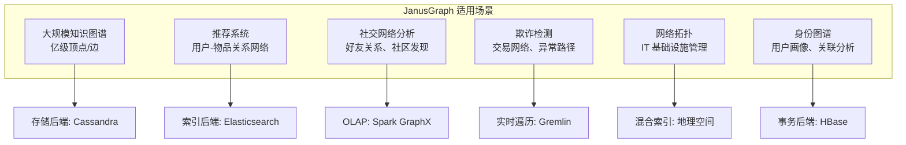
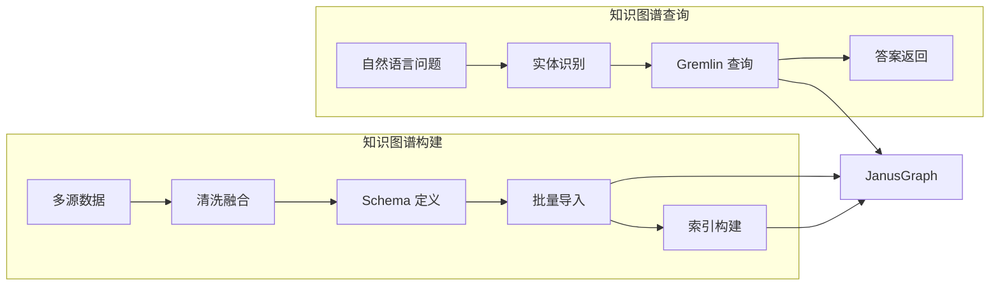
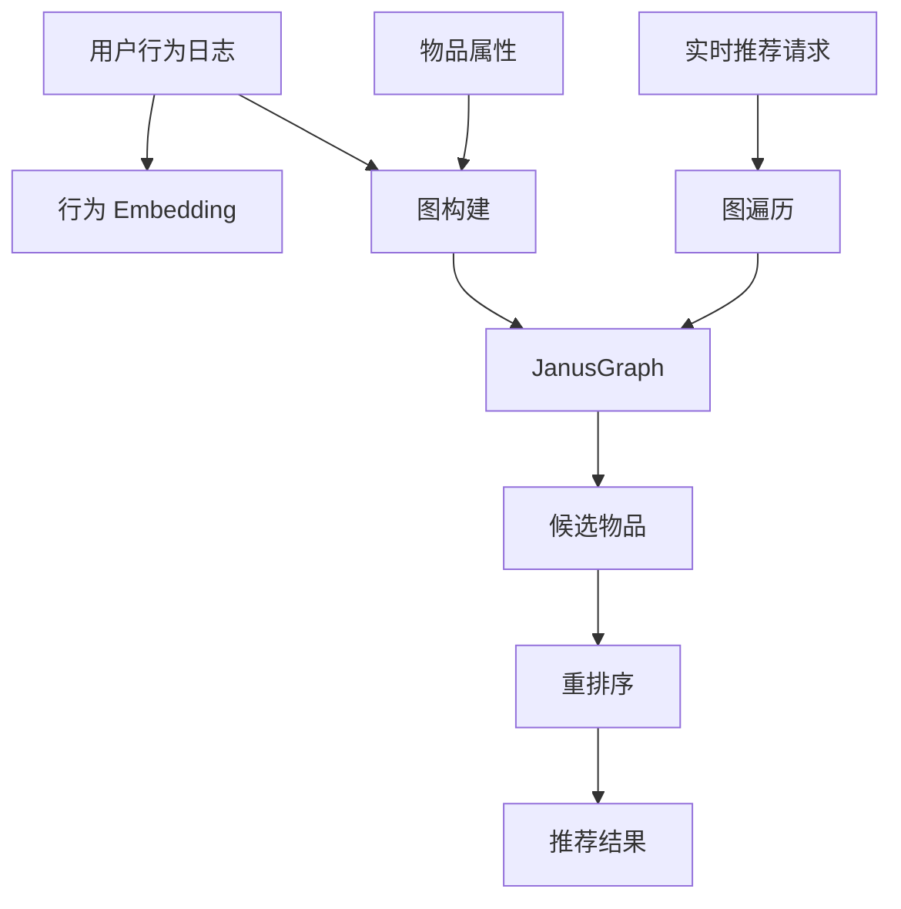
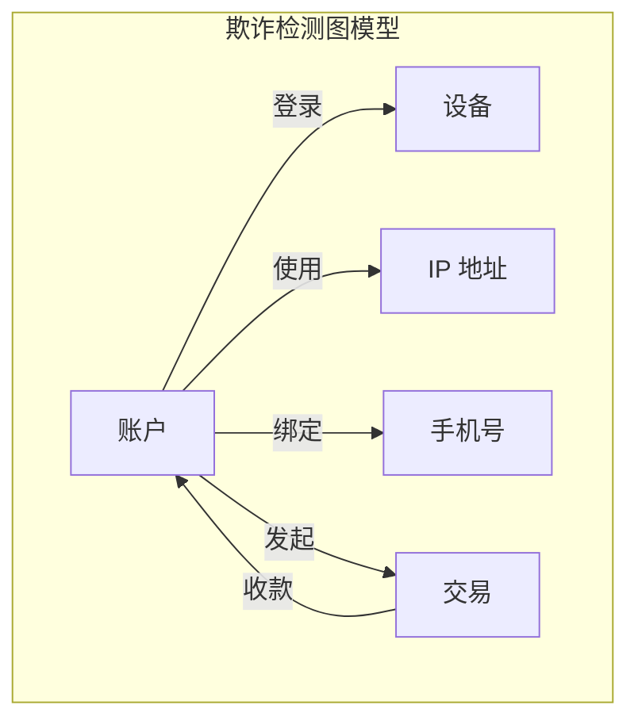
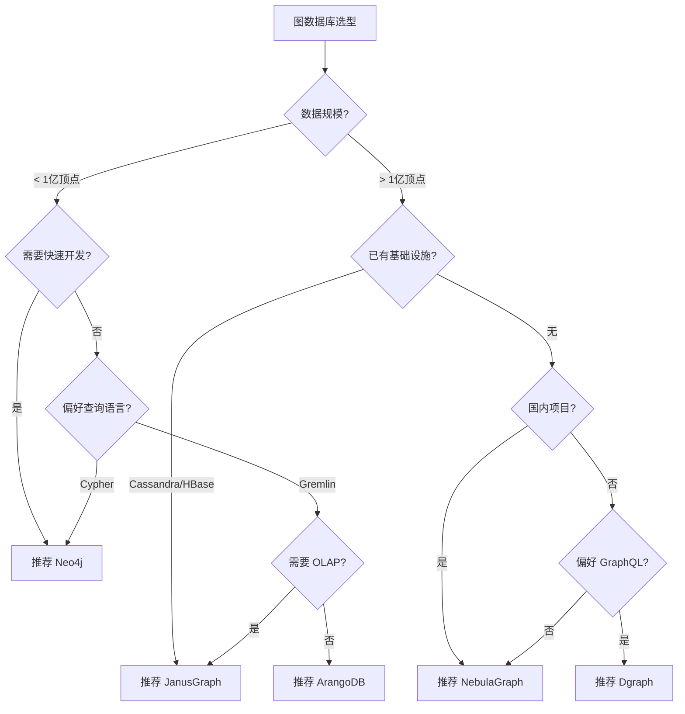

# JanusGraph 使用场景与选型对比

## 学习目标

- 理解 JanusGraph 在各场景中的具体应用方式
- 掌握与其他图数据库的选型决策流程
- 分析不同场景下 JanusGraph 的优势与局限

## 适用场景总览



## 典型场景详解

### 1. 大规模知识图谱



**场景特点**：
- 数据规模：亿级顶点、十亿级边
- 查询模式：多跳遍历、路径查询、子图匹配
- 更新频率：批量导入为主，增量更新较少

**配置建议**：

```properties
# Cassandra 后端（大规模写入）
storage.backend=cql
storage.hostname=cassandra-cluster

# Elasticsearch 索引（全文检索）
index.search.backend=elasticsearch
index.search.hostname=es-cluster

# 批量加载优化
storage.batch-loading=true
ids.block-size=10000
```

### 2. 推荐系统



**推荐查询示例**：

```groovy
// 基于好友关系的协同过滤
g.V().has('user', 'userId', 'U001')
 .out('viewed').in('viewed')
 .where(neq('U001'))
 .groupCount().by('userId')
 .order(local).by(values, desc)
 .limit(10)

// 基于物品相似度推荐
g.V().has('item', 'itemId', 'I001')
 .in('purchased').out('purchased')
 .where(neq('I001'))
 .groupCount().by('itemId')
 .order(local).by(values, desc)
 .limit(10)
```

### 3. 社交网络分析

**场景特点**：
- 好友关系图：关注/粉丝/好友
- 内容互动图：点赞/评论/转发
- 社区发现：标签传播、LPA 算法
- 影响力分析：PageRank、中心度

**社区发现示例**：

```groovy
// 计算顶点度中心度
g.V().hasLabel('user')
 .project('user', 'degree')
 .by('userId')
 .by(__.both('follows').count())

// PageRank 计算（需要 OLAP）
graph.compute(SparkGraphComputer.class)
     .program(PageRankVertexProgram.build().create())
     .submit()
```

### 4. 欺诈检测



**欺诈路径检测**：

```groovy
// 检测异常账户关联
g.V().has('account', 'risk_level', 'high')
 .both('login_device', 'use_ip', 'bind_phone')
 .both()
 .has('account', 'risk_level', 'normal')
 .dedup()
 .path()

// 检测循环转账
g.V().hasLabel('transaction')
 .has('amount', gt(10000))
 .repeat(out('transfer_to').simplePath())
 .until(cyclicPath())
 .path()
```

### 5. 网络拓扑管理

```groovy
// 查找设备故障影响范围
g.V().has('device', 'status', 'down')
 .repeat(out('connected_to')).emit()
 .dedup()
 .hasLabel('server')
 .values('server_name')

// 最短网络路径
g.V().has('device', 'name', 'Router-A')
 .repeat(out('connected_to').simplePath())
 .until(has('name', 'Server-Z'))
 .path().limit(1)
```

## 与其他图数据库对比

| 维度 | JanusGraph | Neo4j | NebulaGraph | Dgraph | ArangoDB |
|------|-----------|-------|-------------|--------|----------|
| 存储模型 | 外挂存储 | 原生图 | 原生图 | 原生图 | 多模型 |
| 查询语言 | Gremlin | Cypher | nGQL | GraphQL± | AQL |
| 水平扩展 | 原生支持 | 企业版 | 原生支持 | 原生支持 | 原生支持 |
| 部署复杂度 | 高 | 低 | 中 | 中 | 中 |
| 学习曲线 | 陡峭 | 平缓 | 中等 | 中等 | 中等 |
| 索引能力 | 外挂 ES/Solr | 内置 | 内置 | 内置 | 内置 |
| 事务一致性 | 依赖后端 | ACID | ACID | 最终一致 | ACID |
| 大数据集成 | Spark/Flink | 无 | Spark | 无 | 无 |
| 国内生态 | 一般 | 强 | 强 | 一般 | 一般 |
| 典型用户 | Cisco, Huawei | Airbnb, eBay | 微博, 快手 | Slashdot | Barclays |

### 详细对比分析

#### JanusGraph vs Neo4j

| 对比维度 | JanusGraph | Neo4j |
|---------|-----------|-------|
| 架构设计 | 计算存储分离 | 计算存储一体 |
| 数据规模 | 适合超大规模 | 单机优先，集群版昂贵 |
| 部署运维 | 需要管理多个组件 | 单进程，开箱即用 |
| 开发效率 | Gremlin 学习成本高 | Cypher 简洁易懂 |
| 企业支持 | 商业版可用 | Aura 云服务成熟 |
| 适用阶段 | 规模优先 | 快速开发优先 |

#### JanusGraph vs NebulaGraph

| 对比维度 | JanusGraph | NebulaGraph |
|---------|-----------|-------------|
| 开发语言 | Java | C++ |
| 性能 | 依赖后端 | 高性能原生实现 |
| 国内生态 | 一般 | 文档齐全、社区活跃 |
| 企业支持 | 商业版 | 云服务 Nebula Cloud |
| 查询语言 | Gremlin | nGQL（类似 Cypher） |
| 适用场景 | 已有 Cassandra/HBase | 新建图项目 |

## 选型决策流程



### 选型决策树

**问题 1：数据规模**
- < 1 亿顶点：考虑 Neo4j、ArangoDB
- 1-10 亿顶点：考虑 NebulaGraph、Dgraph
- > 10 亿顶点：JanusGraph + Cassandra

**问题 2：部署环境**
- 已有 Cassandra/HBase：JanusGraph 天然适配
- 已有 Elasticsearch：JanusGraph 可复用索引
- 全新部署：Neo4j/NebulaGraph 更简单

**问题 3：查询语言偏好**
- SQL 背景：Cypher/nGQL 易上手
- 编程背景：Gremlin 更灵活
- GraphQL 背景：Dgraph 天然兼容

**问题 4：OLAP 需求**
- 需要大规模图计算：JanusGraph + Spark
- 纯 OLTP 场景：Neo4j/NebulaGraph

## 不适用场景

| 场景 | 原因 | 替代方案 |
|------|------|---------|
| 小规模原型开发 | 部署复杂，学习成本高 | Neo4j |
| 强一致性要求 | 依赖后端一致性 | Neo4j/NebulaGraph |
| 纯 OLTP 高并发 | Gremlin 性能不如原生 | Neo4j/NebulaGraph |
| 国内合规项目 | 文档、社区支持有限 | NebulaGraph |
| 快速迭代项目 | Schema 变更成本高 | Neo4j |

## 要点总结

- JanusGraph 最适合大规模分布式图场景，尤其是已有 Cassandra/HBase 基础设施的企业
- 与 Neo4j 相比，JanusGraph 牺牲了开发效率换取了水平扩展能力
- 与 NebulaGraph 相比，JanusGraph 更适合大数据生态集成（Spark/Flink）
- 选型时需综合考虑数据规模、基础设施、团队技能、合规要求
- 小规模快速开发优先选择 Neo4j，大规模分布式优先选择 JanusGraph/NebulaGraph

## 思考题

1. 如果你的项目数据规模从 1000 万顶点增长到 10 亿顶点，从 Neo4j 迁移到 JanusGraph需要考虑哪些因素？
2. JanusGraph 使用外挂索引后端（ES/Solr）与 Neo4j 内置索引各有什么优缺点？
3. 在欺诈检测场景中，JanusGraph 的实时遍历查询如何与离线图计算（Spark）协同？