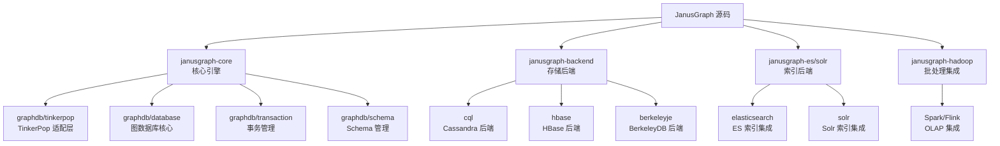
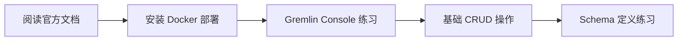
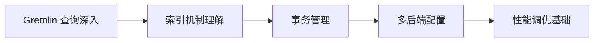
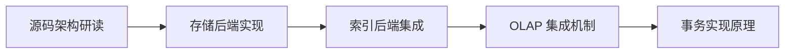
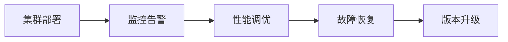

# JanusGraph 学习资源

## 学习目标

- 获取 JanusGraph 的优质学习资源
- 建立从入门到深入的学习路径
- 了解源码研读的关键模块

## 官方资源

### 文档与仓库

- **官方文档**：[https://docs.janusgraph.org](https://docs.janusgraph.org)
- **GitHub 仓库**：[https://github.com/JanusGraph/janusgraph](https://github.com/JanusGraph/janusgraph)
- **官方博客**：[https://janusgraph.org/blog](https://janusgraph.org/blog)
- **问题追踪**：[https://github.com/JanusGraph/janusgraph/issues](https://github.com/JanusGraph/janusgraph/issues)

### 相关项目

- **Apache TinkerPop**：[https://tinkerpop.apache.org](https://tinkerpop.apache.org) — Gremlin 查询语言标准
- **Gremlin Console**：[https://tinkerpop.apache.org/docs/current/tutorials/getting-started/](https://tinkerpop.apache.org/docs/current/tutorials/getting-started/) — 交互式查询工具
- **Gremlin Language Variants**：Java/Python/JavaScript/Go 等多语言 SDK

## 源码研读路径



### 核心模块说明

| 模块 | 路径 | 功能 |
|------|------|------|
| Core | `janusgraph-core/` | 图引擎核心，TinkerPop 适配 |
| Database | `core/graphdb/database/` | 图存储、顶点/边管理 |
| Transaction | `core/graphdb/transaction/` | 事务生命周期管理 |
| Schema | `core/graphdb/schema/` | 类型定义、索引管理 |
| Backend | `janusgraph-backend/` | 存储后端抽象层 |
| CQL Backend | `backend/cql/` | Cassandra 实现 |
| HBase Backend | `backend/hbase/` | HBase 实现 |
| ES Index | `janusgraph-es/` | Elasticsearch 索引 |
| Solr Index | `janusgraph-solr/` | Solr 索引 |

### 关键源码文件

```
janusgraph-core/
├── src/main/java/org/janusgraph/
│   ├── core/                   # 核心接口定义
│   │   ├── JanusGraph.java     # 主接口
│   │   ├── JanusGraphVertex.java
│   │   └── JanusGraphEdge.java
│   ├── graphdb/
│   │   ├── database/           # 图数据库实现
│   │   │   └── StandardJanusGraph.java
│   │   ├── transaction/        # 事务管理
│   │   │   └── StandardJanusGraphTx.java
│   │   ├── schema/             # Schema 管理
│   │   │   └── SchemaContainer.java
│   │   └── tinkerpop/          # TinkerPop 适配
│   │       └── JanusGraphBlueprintsGraph.java
│   └── diskstorage/            # 存储抽象层
│       ├── Backend.java        # 后端接口
│       └── Entry.java          # 存储条目

janusgraph-backend/
├── cql/                        # Cassandra 后端
│   └── CQLStoreManager.java
├── hbase/                      # HBase 后端
│   └── HBaseStoreManager.java
└── berkeleyje/                 # BerkeleyDB 后端
    └── BerkeleyJEStoreManager.java
```

## 学习路径

### 阶段 1：入门（1-2 周）



**学习资源**：
1. [官方入门教程](https://docs.janusgraph.org/getting-started/)
2. [Gremlin 入门](https://tinkerpop.apache.org/docs/current/tutorials/getting-started/)
3. [Docker 部署指南](https://docs.janusgraph.org/getting-started/installation/)

**实践任务**：
- 使用 Docker Compose 部署 JanusGraph + Cassandra + Elasticsearch
- 通过 Gremlin Console 创建图、添加顶点和边
- 定义 Schema（顶点标签、边标签、属性、索引）

### 阶段 2：进阶（2-4 周）



**学习资源**：
1. [Gremlin 查询参考](https://tinkerpop.apache.org/docs/current/reference/)
2. [索引与查询优化](https://docs.janusgraph.org/indexes/)
3. [事务与并发](https://docs.janusgraph.org/transactions/)

**实践任务**：
- 编写复杂 Gremlin 查询（多跳遍历、聚合、子图）
- 创建复合索引和混合索引，对比查询性能
- 理解不同后端的事务隔离级别差异

### 阶段 3：深入（4-8 周）



**学习资源**：
1. [架构设计文档](https://docs.janusgraph.org/advanced-topics/architecture/)
2. [源码注释与设计文档](https://github.com/JanusGraph/janusgraph/tree/master/docs)
3. TinkerPop 规范文档

**实践任务**：
- 阅读 `StandardJanusGraph.java` 理解图初始化流程
- 阅读 `CQLStoreManager.java` 理解 Cassandra 存储实现
- 阅读 `ElasticsearchIndex.java` 理解索引集成

### 阶段 4：生产实践（持续）



**学习资源**：
1. [生产部署指南](https://docs.janusgraph.org/operations/)
2. [监控与诊断](https://docs.janusgraph.org/operations/diagnostics/)
3. [性能调优](https://docs.janusgraph.org/advanced-topics/performance/)

## 推荐书籍与论文

### 书籍

| 书名 | 作者 | 说明 |
|------|------|------|
| 《图数据库》 | Ian Robinson 等 | O'Reilly 经典，涵盖 Neo4j 和图建模 |
| 《Gremlin 实战》 | TinkerPop 社区 | Gremlin 查询语言深度指南 |
| 《Apache TinkerPop 实践》 | 社区文档 | TinkerPop 栈完整教程 |

### 论文与技术报告

1. **JanusGraph 技术白皮书**：架构设计与存储模型
2. **TinkerPop 规范**：Gremlin 语言语义定义
3. **Cassandra 论文**：理解后端存储特性
4. **Elasticsearch 架构**：理解索引后端实现

## 社区资源

### 邮件列表与论坛

- **用户邮件列表**：`janusgraph-users@googlegroups.com`
- **开发者邮件列表**：`janusgraph-dev@googlegroups.com`
- **Slack 工作区**：[JanusGraph Slack](https://janusgraph.slack.com)

### 中文社区

- **JanusGraph 中文社区**：微信公众号、技术博客
- **图数据库技术交流群**：微信群、QQ 群

### 会议与活动

- **JanusGraph Summit**：年度社区大会
- **Apache Con**：TinkerPop 相关议题
- **国内图数据库大会**：技术分享与案例交流

## 学习建议

### 对于初学者

1. 从 Docker 部署开始，避免环境配置问题
2. 先掌握 Gremlin 基础语法，再学习高级遍历
3. 理解 Schema 定义的重要性，养成先定义后使用的习惯

### 对于进阶用户

1. 深入理解后端存储差异，选择合适的技术栈
2. 学习索引机制，避免全图扫描的性能陷阱
3. 研读源码，理解 TinkerPop 适配层的实现

### 对于生产用户

1. 关注版本升级公告，及时修复安全问题
2. 建立监控告警体系，跟踪集群健康状态
3. 制定备份恢复策略，确保数据安全

## 要点总结

- 官方文档是最权威的学习入口，应优先阅读
- Gremlin 是 JanusGraph 的核心查询语言，需要重点掌握
- 源码核心在 `janusgraph-core/graphdb/` 目录，建议逐步深入
- 社区活跃度较高，遇到问题可以寻求社区帮助

## 思考题

1. Gremlin Console 与编程语言 SDK（如 Java/Python）在开发体验上有什么差异？
2. 阅读 `StandardJanusGraph.java` 源码，理解图初始化流程中后端连接是如何建立的？
3. 如何根据业务场景选择合适的存储后端（Cassandra vs HBase vs BerkeleyDB）？