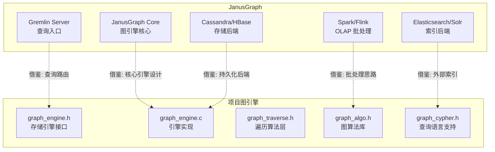
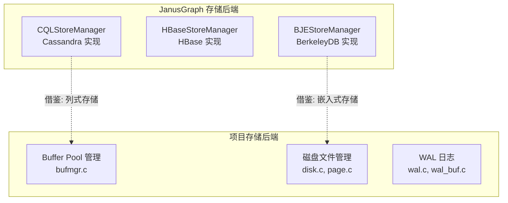
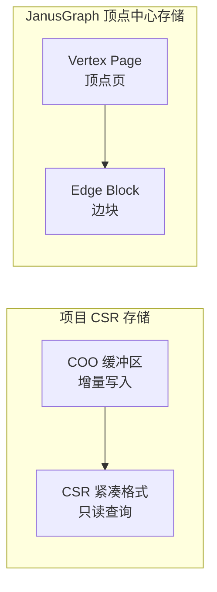
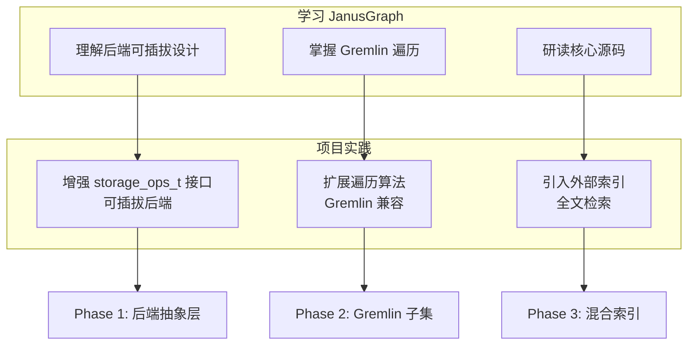

# JanusGraph 与项目关联

## 学习目标

- 分析 JanusGraph 设计对项目图引擎的启发性
- 梳理项目中可借鉴的技术点
- 建立 JanusGraph 学习与项目实践的映射关系

## 架构对比



## 模块关联分析

### 1. graph_engine 模块关联

项目中的 `graph_engine` 模块实现了图存储引擎的基本能力：

| 项目模块 | JanusGraph 对应 | 可借鉴程度 |
|---------|----------------|-----------|
| `graph_engine_db_t` | `StandardJanusGraph` | ⭐⭐⭐ |
| `storage_ops_t` 接口 | `Backend` 抽象层 | ⭐⭐⭐ |
| `graph_engine_enable_csr` | 顶点中心存储 | ⭐⭐⭐ |
| `graph_engine_enable_lock` | 事务并发控制 | ⭐⭐ |
| `graph_engine_enable_mem_pool` | 内存管理 | ⭐⭐ |

### 2. 存储后端对比



**项目可借鉴的 JanusGraph 存储设计**：

1. **键值编码**：JanusGraph 将图数据编码为 `<key, value>` 对存入后端，项目的 `kv_engine` 可直接复用此模式
2. **邻接表存储**：JanusGraph 的边存储采用邻接表，与项目 `graph_engine` 的 CSR 存储思路一致
3. **分区策略**：JanusGraph 的 Hash 分区可借鉴到项目将来的分布式演进

### 3. 索引结构对比

| 项目索引 | JanusGraph 对应 | 差异点 |
|---------|----------------|-------|
| BTree (btreeam.c) | 复合索引（Composite Index） | 项目为 BTree，JanusGraph 用后端索引 |
| 未实现 | 混合索引（Mixed Index） | JanusGraph 引入 ES/Solr |
| 未实现 | 全文检索 | 项目可考虑引入外部索引 |
| 未实现 | 地理空间索引 | 项目暂不涉及 |

### 4. 遍历算法对比

项目图遍历算法实现（`graph_traverse.h`）与 JanusGraph 的 Gremlin 遍历对应关系：

| 项目 API | JanusGraph Gremlin | 说明 |
|---------|-------------------|------|
| `graph_engine_bfs` | `repeat(out()).times(n)` | BFS 遍历 |
| `graph_engine_shortest_path` | `repeat(out().simplePath()).until(has())` | 最短路径 |
| `graph_dijkstra_path` | 加权最短路径 | 需要自定义 `weight_fn` |
| `graph_engine_pagerank` | `PageRankVertexProgram` | 需要 OLAP 集成 |
| `graph_get_neighbors` | `out()/in()/both()` | 邻居查询 |
| `graph_traverse_iter` | Gremlin Step 迭代 | 惰性求值模式 |

## 可借鉴的设计

### 1. 后端可插拔抽象

JanusGraph 的 `Backend` 接口值得项目借鉴：

```c
// JanusGraph 风格的 Backend 接口（伪代码）
// public interface StoreManager {
//     Store openDatabase(String name);
//     void close();
//     Transaction beginTransaction();
// }

// 项目现有 storage_ops_t 接口
typedef struct storage_ops_s {
    int (*open)(void *store, const char *name);
    int (*close)(void *store);
    int (*begin_txn)(void *store, void **txn);
    int (*commit)(void *txn);
    int (*rollback)(void *txn);
} storage_ops_t;
```

**项目提升方向**：为 `storage_ops_t` 增加可插拔后端注册机制，支持运行时切换存储后端：

```c
// 借鉴 JanusGraph 的可插拔设计
// 注册不同后端实现
storage_backend_register("cassandra", &cassandra_ops);
storage_backend_register("rocksdb", &rocksdb_ops);
storage_backend_register("berkeleyje", &bdb_ops);

// 根据配置选择后端
const storage_ops_t *ops = storage_backend_get("cassandra");
```

### 2. 混合索引机制

JanusGraph 的外部索引引擎设计对未来项目扩展有重要参考价值：

```c
// 项目当前：仅支持 BTree 索引
// btree_insert(btree, key, value);

// 借鉴 JanusGraph 混合索引：引入外部索引
typedef struct mixed_index_s {
    char *name;                    // 索引名称
    index_type_t type;             // 索引类型（全文/范围/地理）
    void *backend;                 // 后端句柄（ES/Solr）
    int (*query)(void *backend,    // 查询回调
                 const char *query,
                 void **results,
                 int *count);
} mixed_index_t;
```

### 3. CSR 存储优化

项目已实现 CSR 存储（`graph_engine_enable_csr`），JanusGraph 的顶点中心存储可提供优化思路：



**项目可优化方向**：
- 借鉴 JanusGraph 的边分块存储，减少大顶点邻接表的随机访问
- 实现增量 CSR 合并策略，避免频繁全量紧凑

### 4. 图遍历算法

项目已实现 BFS、最短路径、Dijkstra、PageRank 等算法，JanusGraph 的 Gremlin 遍历器实现值得借鉴：

```c
// 项目现有：一次性遍历
graph_engine_bfs_result_t result;
graph_engine_bfs(rel, start, max_depth, &result);

// 借鉴 JanusGraph 的惰性求值迭代器
// 项目已有 graph_traverse_iter_t 实现
graph_traverse_iter_t *iter = graph_traverse_iter_create(rel, start, OUT, -1);
graph_vertex_id_t vid;
int depth;
while (graph_traverse_iter_next(iter, &vid, &depth)) {
    // 逐顶点处理，内存友好
}
graph_traverse_iter_destroy(iter);
```

## 学习与实践路径



### 建议学习路径

**阶段 1：理解后端解耦**
- 阅读 JanusGraph `Backend.java` 源码
- 对比项目 `storage_ops_t` 接口，找出差距
- 实现一个简单的内存后端 demo

**阶段 2：增强遍历能力**
- 学习 Gremlin 遍历器模式（惰性求值、Step 组合）
- 借鉴到项目 `graph_traverse_iter_t` 优化
- 增加更多图算法支持（社区发现、标签传播）

**阶段 3：引入外部索引**
- 理解 JanusGraph 混合索引机制
- 评估是否引入 Elasticsearch 或 SQLite FTS
- 实现索引查询下推

## 要点总结

- JanusGraph 的后端可插拔设计对项目 `storage_ops_t` 抽象层有直接借鉴价值
- 项目 CSR 存储与 JanusGraph 顶点中心存储思路一致，可借鉴边分块优化
- 项目图遍历算法已覆盖基本功能，可借鉴 Gremlin 惰性求值模式
- 混合索引是项目未来扩展的重要方向，JanusGraph 的 ES/Solr 集成为参考
- 建议分三阶段引入 JanusGraph 的设计精华：后端抽象 -> 遍历增强 -> 混合索引

## 思考题

1. 项目 `storage_ops_t` 接口如何借鉴 JanusGraph 的 `Backend` 抽象，实现运行时切换存储后端？
2. 项目现有的 CSR 存储如何借鉴 JanusGraph 的边分块策略，优化大顶点的邻接表访问？
3. 如果要在项目中引入 Gremlin 兼容的子集，需要实现哪些核心步骤？
4. 项目引入外部索引后，如何保证索引与图数据的强一致性？