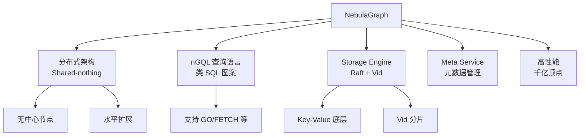
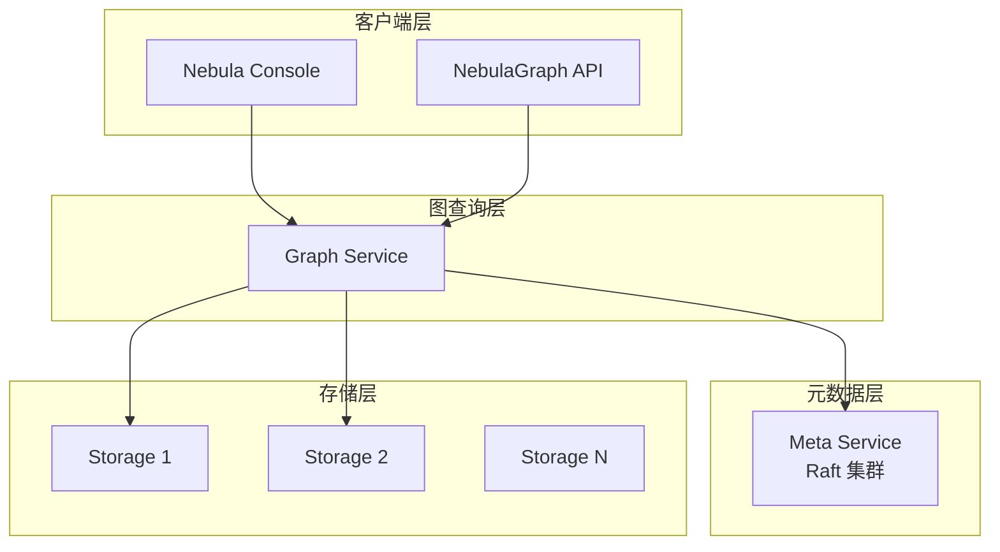

# NebulaGraph 项目概览

## 学习目标

- 了解 NebulaGraph 作为国产高性能分布式图数据库的定位
- 掌握 NebulaGraph 的架构设计和 nGQL 查询语言

## 项目定位

> NebulaGraph 是国产开源的高性能分布式图数据库，支持千亿顶点和万亿边的大规模图数据。

**基本信息**：
- 开发方：vesoft（杭州维表科技）
- 首次发布：2019 年
- 开源协议： Apache 2.0
- GitHub Stars：约 12k

## 核心设计



## 架构特点



## nGQL 示例

```ngql
-- 创建图空间
CREATE SPACE my_graph (vid_type=FIXED_STRING(30));

-- 创建标签和边
CREATE TAG person(name string, age int);
CREATE EDGE know(likeness int);

-- 插入数据
INSERT VERTEX person(name, age) VALUES "Alice":("Alice", 30);
INSERT VERTEX person(name, age) VALUES "Bob":("Bob", 25);
INSERT EDGE know(likeness) VALUES "Alice"->"Bob":(90);

-- 图查询
GO FROM "Alice" OVER know YIELD dst(edge);
```

## 要点总结

- 国产开源，Apache 2.0 许可证
- 分布式 Shared-nothing 架构
- nGQL 类 SQL，易学易用
- 支持千亿顶点万亿边

## 思考题

1. NebulaGraph 的 Vid（顶点 ID）分片策略与 Neo4j 有何不同？
2. Meta Service 的 Raft 集群在集群中扮演什么角色？
3. Storage Engine 基于 KV 存储的设计有什么优缺点？