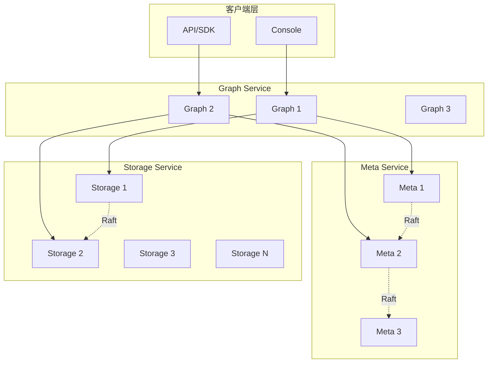
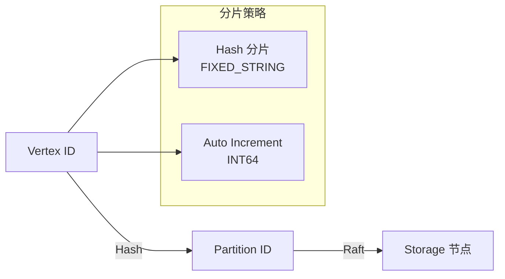

# NebulaGraph 架构设计

## 学习目标

- 理解 NebulaGraph 的分布式存储架构
- 掌握 Vid 分片和 Raft 复制机制

## 整体架构



## Vid 分片机制



**分片流程**：
1. 计算 Vid 的 Hash 或使用自增 ID
2. `partition_id = hash(vid) % num_partitions`
3. 根据 Partition ID 找到对应 Storage 节点
4. Raft 组负责该 Partition 的复制

## Meta Service

```go
// Meta Service 职责
// 1. Schema 管理（Space/Tag/Edge）
// 2. 用户认证和授权
// 3. 集群拓扑管理
// 4. 心跳和健康检查

// Raft 组
// Meta Service 通常 3 节点
// Raft 复制保证强一致性
```

## Storage Service

```go
// Storage Service 架构
// 底层基于 RocksDB 的 KV 存储

// Key 格式
// <part_id> + <vid> + <tag_id> + <prop_name> → <prop_value>

// Vertex Key:    [part, vid, 0, 0]        → vertex data
// Edge Key:      [part, src_vid, rank, dst_vid, edge_type] → edge data

// 写入流程
// 1. Graph Service 解析查询
// 2. 根据 Vid 计算目标 Partition
// 3. 发送请求到对应 Storage 节点
// 4. Raft 组复制到多数节点
// 5. 返回成功
```

## 要点总结

- 无中心化设计，各层独立扩展
- Vid 分片实现数据分布
- Storage 基于 RocksDB KV 存储
- Raft 保证强一致性

## 思考题

1. NebulaGraph 的 Vid 分片与 Dgraph 的 Predicate 分片有何本质区别？
2. Storage Service 的 KV 存储如何支持图语义？
3. Meta Service 故障对集群有何影响？