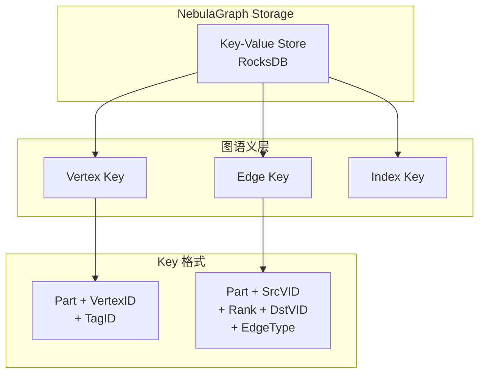

# NebulaGraph 存储与事务

## 学习目标

- 理解 NebulaGraph 的 KV 存储引擎
- 掌握 NebulaGraph 的 VID 和 Partition 机制

## 存储引擎



## Vertex Key 格式

```go
// Vertex Key: <part_id(4)> + <vid_len(1)> + <vid> + <tag_id(4)>
// Value: <version(8)> + <prop_data>

// 示例
// part_id = 1
// vid = "Alice"
// tag_id = 1 (Person)
// key = [0,0,0,1][5]["Alice"][0,0,0,1]
```

## Edge Key 格式

```go
// Edge Key: <part_id(4)> + <src_vid_len(1)> + <src_vid>
//                    + <rank(8)> + <dst_vid_len(1)> + <dst_vid>
//                    + <edge_type(4)>

// rank: 用于同一对顶点的多条边排序
// edge_type: 边类型（正数正向，负数反向）

// Value: <version(8)> + <prop_data>
```

## 事务支持

```ngql
-- NebulaGraph 支持 KV 级别事务
-- 单分区操作保证原子性
-- 跨分区操作需要应用层协调

-- 插入顶点
INSERT VERTEX person(name, age) VALUES "Alice":("Alice", 30);

-- 插入边（原子操作）
INSERT EDGE know(likeness) VALUES "Alice"->"Bob":(90);
```

## 要点总结

- 基于 RocksDB 的 KV 存储
- Vertex/Edge Key 设计清晰
- 支持版本管理
- 单分区事务保证原子性