# NebulaGraph 索引机制

## 学习目标

- 掌握 NebulaGraph 的索引类型及其适用场景
- 理解索引的实现原理（倒排索引、B+Tree、LSM-Tree）
- 能够根据查询模式选择合适的索引策略
- 对比 NebulaGraph 索引与项目 `index/` 模块的异同

## 核心概念

### 为什么图数据库需要索引？

图数据库的核心查询是基于顶点 ID（Vid）的遍历，如 `GO FROM "Alice" OVER knows`。但实际场景中，经常需要**基于属性条件**查找顶点或边，例如：

```ngql
-- 查找所有居住在北京的用户
LOOKUP ON person WHERE person.city == "Beijing" YIELD ...;

-- 查找年龄大于 30 的用户
LOOKUP ON person WHERE person.age > 30 YIELD ...;
```

这类查询如果没有索引，就需要**全图扫描**，效率极低。索引的作用是建立**属性值到顶点/边 ID 的映射**，实现快速定位。

### 索引的基本原理

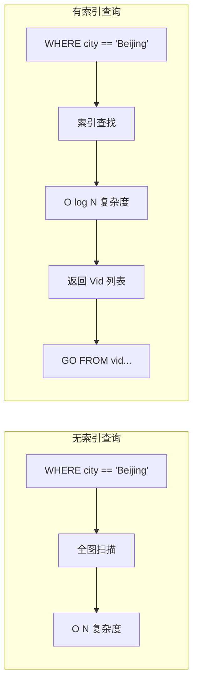

**核心思想**：索引是**属性值 → Vid** 的映射表，通过属性值快速定位 Vid，再用 Vid 进行图遍历。

## 索引类型详解

### 1. 顶点索引（Tag Index）

顶点索引建立在 Tag（顶点类型）的属性上，用于加速 `LOOKUP ON tag` 查询。

```ngql
-- 创建单属性索引
CREATE TAG INDEX idx_person_name ON person(name(20));

-- 创建复合索引
CREATE TAG INDEX idx_person_city_age ON person(city(20), age);

-- 查询示例
LOOKUP ON person WHERE person.name == "Alice" YIELD ...;
LOOKUP ON person WHERE person.city == "Beijing" AND person.age > 25 YIELD ...;
```

**索引结构示意**：

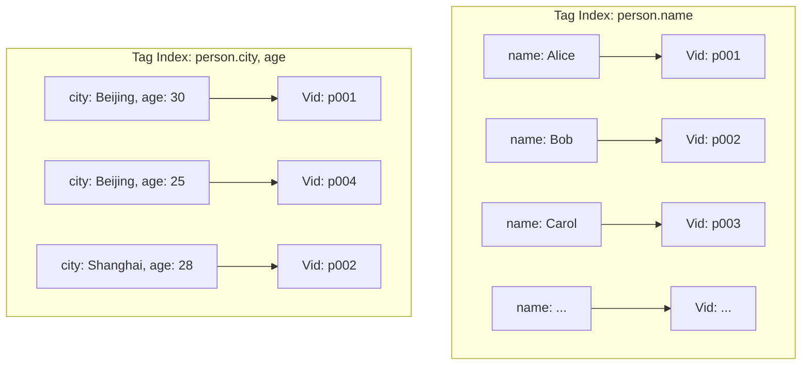

### 2. 边索引（Edge Index）

边索引建立在 Edge Type（边类型）的属性上，用于加速边的属性查询。

```ngql
-- 创建边索引
CREATE EDGE INDEX idx_knows_since ON knows(since);
CREATE EDGE INDEX idx_knows_likeness ON knows(likeness);

-- 查询示例
LOOKUP ON knows WHERE knows.since > 2020 YIELD ...;
```

**边索引的特点**：
- 索引值包含 `SrcVid → DstVid → Rank` 信息
- 支持按边属性过滤后再进行图遍历

### 3. 属性索引

属性索引是 Tag/Edge Index 的底层实现，支持多种查询模式：

| 查询类型 | 索引支持 | 示例 |
|---------|---------|------|
| 精确匹配 | 支持 | `name == "Alice"` |
| 范围查询 | 支持 | `age > 30` |
| 前缀匹配 | 支持 | `name STARTS WITH "Al"` |
| 模糊查询 | 有限支持 | `name CONTAINS "li"`（效率低） |

### 4. 全文索引（Full-Text Index）

NebulaGraph 3.x 支持全文索引，用于文本检索场景：

```ngql
-- 创建全文索引（需要先部署 Elasticsearch）
CREATE ELASTICSEARCH INDEX fulltext_bio ON person(bio);

-- 全文搜索
LOOKUP ON person WHERE es_query(person.bio, "machine learning") YIELD ...;
```

**全文索引特点**：
- 底层依赖 Elasticsearch
- 支持复杂的文本搜索语法（布尔查询、短语查询等）
- 需要 Elasticsearch 集群运维

### 5. 复合索引

复合索引是多属性组合索引，遵循**最左前缀原则**：

```ngql
-- 复合索引：city + age
CREATE TAG INDEX idx_person_city_age ON person(city(20), age);

-- 生效的查询
WHERE person.city == "Beijing"                    -- 使用 city 前缀
WHERE person.city == "Beijing" AND person.age > 25 -- 使用完整索引

-- 不生效的查询
WHERE person.age > 25  -- 缺少 city 前缀，索引不生效
```

**最左前缀原则**：复合索引 `(A, B, C)` 可以支持：
- `WHERE A = ?`
- `WHERE A = ? AND B = ?`
- `WHERE A = ? AND B = ? AND C = ?`

但不支持：
- `WHERE B = ?`（缺少 A）
- `WHERE C = ?`（缺少 A、B）

## 索引实现原理

### 1. 倒排索引（Inverted Index）

NebulaGraph 的属性索引本质上是一个**倒排索引**：

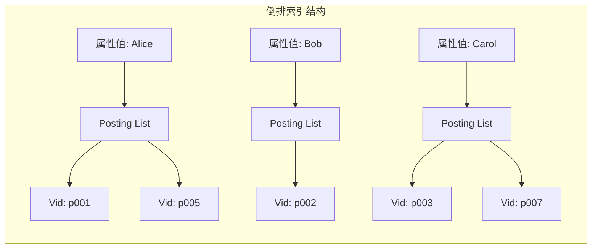

**倒排索引结构**：
- **Key**：属性值（如 `"Alice"`, `30`, `"Beijing"`）
- **Value**：Posting List，包含所有该属性值的 Vid 列表

**查询流程**：

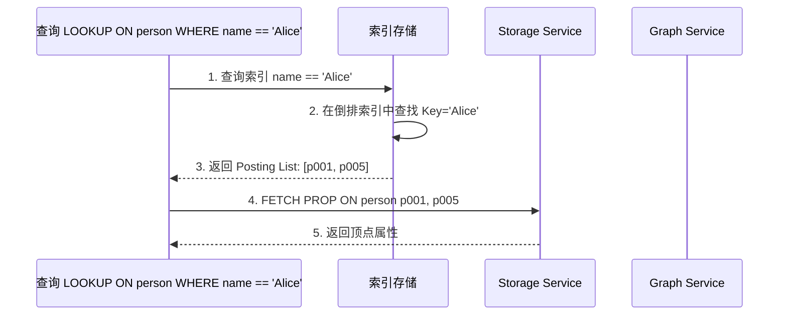

### 2. B+Tree 实现

NebulaGraph 底层使用 RocksDB 存储，RocksDB 基于 **LSM-Tree**，但索引结构逻辑上是 **B+Tree** 形式：

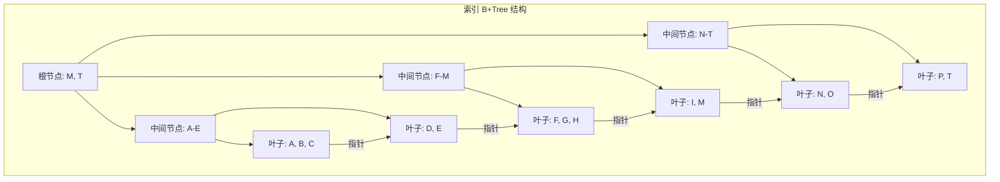

**B+Tree 特点**：
- 所有数据存储在叶子节点
- 叶子节点通过指针连接，支持范围查询
- 非叶子节点只存储索引键，树高度低

**范围查询优势**：

```ngql
-- 范围查询：age 在 25-35 之间的用户
LOOKUP ON person WHERE person.age >= 25 AND person.age <= 35 YIELD ...;
```

B+Tree 叶子节点链表结构使得范围查询非常高效：找到 `age=25` 的叶子节点后，顺序扫描链表直到 `age=35`。

### 3. LSM-Tree 存储层

RocksDB 底层使用 **LSM-Tree（Log-Structured Merge Tree）** 存储：

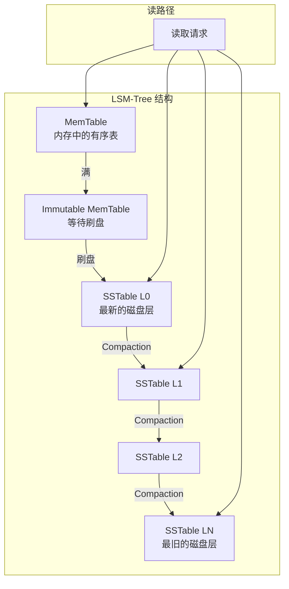

**LSM-Tree 特点**：
- **写入优化**：写入先进入 MemTable，批量刷盘
- **读取合并**：读取需要从 MemTable → L0 → L1 → ... 逐层查找
- **Compaction**：后台合并 SSTable，清理过期数据

**索引写入流程**：

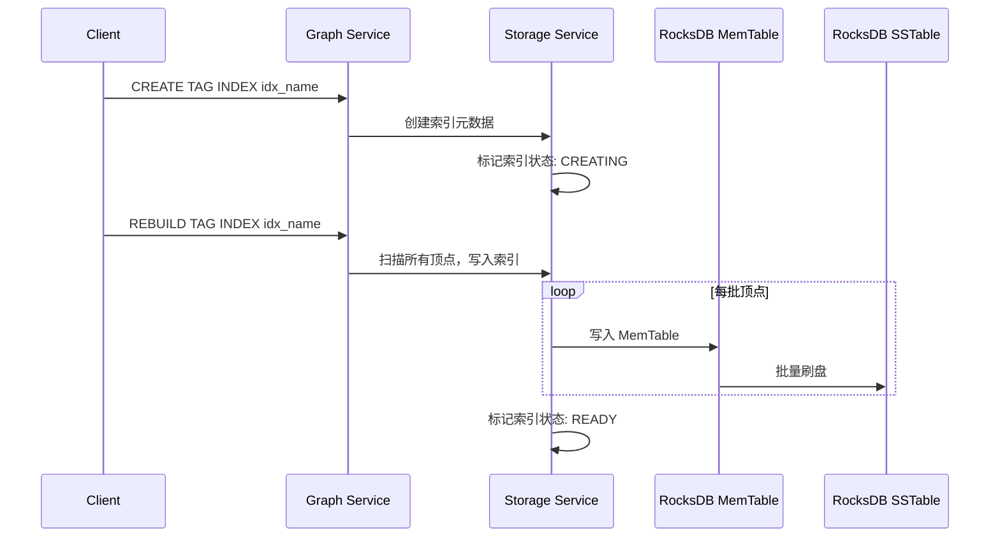

### 4. 索引重建机制

NebulaGraph 的索引有一个重要特点：**数据变更后必须手动重建索引**。

```ngql
-- 插入新数据后，索引不会自动更新
INSERT VERTEX person(name, age) VALUES "p010": ("David", 35);

-- 必须手动重建索引
REBUILD TAG INDEX idx_person_name;

-- 查看重建状态
SHOW TAG INDEX STATUS;
-- 结果：
-- | Index Name      | Status  |
-- |-----------------|---------|
-- | idx_person_name | RUNNING |
```

**为什么需要手动重建？**

| 原因 | 说明 |
|------|------|
| **性能考虑** | 批量插入时，每次更新索引会严重影响性能 |
| **分布式一致性** | NebulaGraph 是分布式系统，索引分布在多个 Partition，同步更新复杂 |
| **LSM-Tree 特性** | RocksDB 写入是追加式的，重建索引可以批量写入，效率更高 |

**重建流程**：

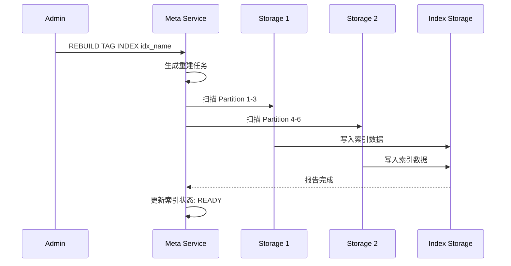

## 索引选择策略

### 1. 选择原则

| 查询模式 | 推荐索引 | 示例 |
|---------|---------|------|
| 精确匹配 | 单属性索引 | `WHERE name == "Alice"` |
| 多条件 AND | 复合索引 | `WHERE city == "BJ" AND age > 25` |
| 范围查询 | B+Tree 索引 | `WHERE age > 30` |
| 前缀匹配 | 字符串索引 | `WHERE name STARTS WITH "Al"` |
| 全文搜索 | 全文索引 | `WHERE es_query(bio, "ML")` |

### 2. 索引设计最佳实践

```ngql
-- 场景 1：用户查找（精确匹配）
CREATE TAG INDEX idx_user_id ON user(user_id(32));
CREATE TAG INDEX idx_user_email ON user(email(64));

-- 场景 2：地理位置 + 时间查询（复合索引）
CREATE TAG INDEX idx_event_location_time ON event(location(20), event_time);

-- 场景 3：社交网络边属性（边索引）
CREATE EDGE INDEX idx_friend_since ON friend(since);
CREATE EDGE INDEX idx_interaction_strength ON interaction(strength);

-- 场景 4：全文搜索（全文索引）
CREATE ELASTICSEARCH INDEX fulltext_content ON article(content);
```

### 3. 索引选择示例

```ngql
-- 查询 1：单条件精确匹配
LOOKUP ON person WHERE person.name == "Alice" YIELD ...;
-- 使用索引：idx_person_name

-- 查询 2：多条件 AND
LOOKUP ON person 
WHERE person.city == "Beijing" AND person.age > 25 
YIELD ...;
-- 使用索引：idx_person_city_age（如果存在）

-- 查询 3：范围查询
LOOKUP ON person WHERE person.age >= 25 AND person.age <= 35 YIELD ...;
-- 使用索引：idx_person_age（B+Tree 范围扫描）

-- 查询 4：前缀匹配
LOOKUP ON person WHERE person.name STARTS WITH "Al" YIELD ...;
-- 使用索引：idx_person_name（前缀扫描）

-- 查询 5：全文搜索
LOOKUP ON article WHERE es_query(article.content, "machine learning") YIELD ...;
-- 使用索引：fulltext_content（Elasticsearch）
```

### 4. 索引失效场景

```ngql
-- 场景 1：使用函数
LOOKUP ON person WHERE LENGTH(person.name) > 5 YIELD ...;
-- 索引失效：函数计算导致无法使用索引

-- 场景 2：类型转换
LOOKUP ON person WHERE person.age * 1.0 > 30.0 YIELD ...;
-- 索引失效：类型转换导致索引不匹配

-- 场景 3：复合索引缺少前缀
-- 假设索引：idx_person_city_age ON person(city, age)
LOOKUP ON person WHERE person.age > 25 YIELD ...;
-- 索引失效：缺少 city 前缀

-- 场景 4：OR 条件
LOOKUP ON person 
WHERE person.city == "Beijing" OR person.city == "Shanghai" 
YIELD ...;
-- 索引可能部分生效：OR 条件需要分别查询再合并
```

## 与项目 index/ 模块对比

### 1. 架构对比

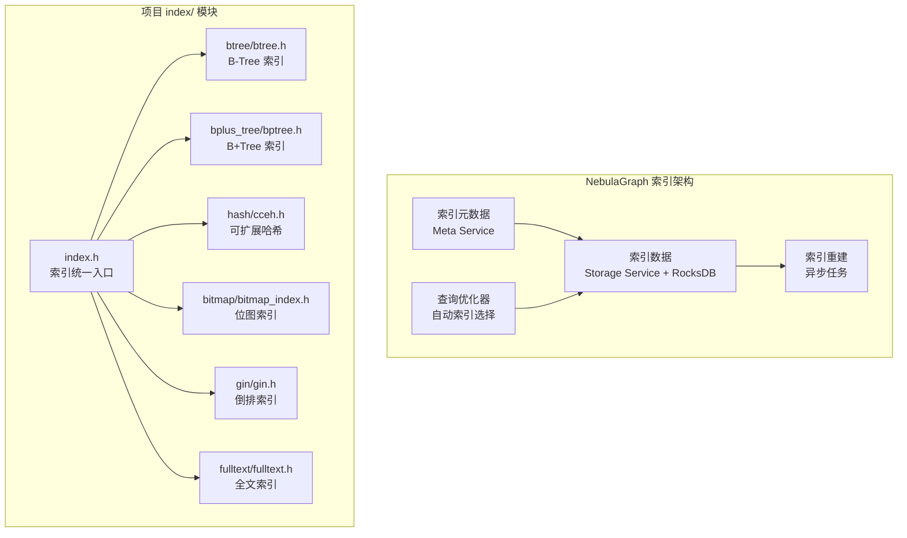

### 2. 功能对比表

| 特性 | NebulaGraph | 项目 index/ 模块 |
|------|-------------|-----------------|
| **B+Tree 索引** | RocksDB 内置 | `bplus_tree/bptree.h` |
| **Hash 索引** | 无（Vid 天然哈希） | `hash/cceh.h`, `hash/cuckoo.h` |
| **Bitmap 索引** | 无 | `bitmap/bitmap_index.h` |
| **倒排索引** | 属性索引本质是倒排 | `gin/gin.h` |
| **全文索引** | Elasticsearch 外挂 | `fulltext/fulltext.h` |
| **索引持久化** | RocksDB 自动 | `btree_index_save()`, `bptree_save()` |
| **索引重建** | 手动 REBUILD | 应用层控制 |
| **分布式支持** | 多 Partition 分布式 | 单机 |

### 3. BTree/B+Tree 对比

**NebulaGraph（RocksDB）**：
- 底层 LSM-Tree，逻辑上是 B+Tree
- 写入优化（MemTable 批量写入）
- 范围查询高效（叶子节点链表）

**项目 B+Tree（`bplus_tree/bptree.h`）**：

```c
// 项目 B+Tree API
bptree_index_t *bptree_create(uint32_t order, bptree_compare_fn compare, void *ctx);
int bptree_insert(bptree_index_t *index, const void *key, uint32_t keylen,
                  const void *value, uint32_t valuelen);
int bptree_lookup(const bptree_index_t *index, const void *key, uint32_t keylen,
                  void **value_out, uint32_t *valuelen_out);

// 范围查询
bptree_iter_t *bptree_iter_create(const bptree_index_t *index,
                                   const void *start_key, uint32_t start_keylen);
bool bptree_iter_next(bptree_iter_t *iter);
```

**关键差异**：

| 方面 | NebulaGraph | 项目 B+Tree |
|------|-------------|------------|
| **存储引擎** | RocksDB（LSM-Tree） | 原生 B+Tree 内存结构 |
| **持久化** | 自动（LSM-Tree） | 手动 `bptree_save()` |
| **范围查询** | 叶子节点链表扫描 | 迭代器顺序遍历 |
| **写入性能** | MemTable 批量优化 | 单点插入 |

### 4. Hash 索引对比

**NebulaGraph**：
- Vid 本身是哈希分片的，天然具有 Hash 索引特性
- 无需额外 Hash 索引

**项目 Hash 索引（`hash/cceh.h`）**：

```c
// CCEH: Cache-Conscious Extendible Hashing
cceh_index_t *cceh_index_create(uint32_t segment_capacity, uint32_t initial_global_depth);
int cceh_index_insert(cceh_index_t *index,
                      const void *key, uint32_t keylen,
                      const void *value, uint32_t valuelen);
int cceh_index_lookup(const cceh_index_t *index,
                      const void *key, uint32_t keylen,
                      void **value_out, uint32_t *valuelen_out);
```

**CCEH 特点**：
- 可扩展哈希，动态调整目录大小
- Cache 友好设计（Segment 对齐）
- 支持高并发（线程 Epoch 机制）

### 5. 倒排索引对比

**NebulaGraph 属性索引**：
- 本质是倒排索引：属性值 → Vid 列表
- 使用 RocksDB 存储，Key 是属性值，Value 是 Vid 列表

**项目 GIN 索引（`gin/gin.h`）**：

```c
// GIN: Generalized Inverted Index
gin_index_t *gin_create(int capacity);
int gin_insert(gin_index_t *idx, const char *key, int doc_id);
int gin_search(gin_index_t *idx, const char *key, int *results, int *count);

// Posting List 结构
struct posting_list {
    int doc_id;
    struct posting_list *next;
};

// Posting Array 结构（优化大列表）
struct posting_array {
    int *doc_ids;    // 有序数组
    int count;
    int capacity;
};
```

**GIN 特点**：
- Posting List 链表适合小列表
- Posting Array 适合大列表，支持二分查找
- 可用于全文搜索、数组查询等

### 6. Bitmap 索引对比

**NebulaGraph**：
- 无 Bitmap 索引

**项目 Bitmap 索引（`bitmap/bitmap_index.h`）**：

```c
// Bitmap 索引
bitmap_index_t *bitmap_create(int n_docs, int n_values);
int bitmap_set(bitmap_index_t *idx, int doc_id, int value);
int bitmap_eq(const bitmap_index_t *idx, int value, int *doc_ids, int *count);
int bitmap_and(const bitmap_index_t *idx, int value1, int value2, int *doc_ids, int *count);
int bitmap_or(const bitmap_index_t *idx, int value1, int value2, int *doc_ids, int *count);
```

**Bitmap 索引特点**：
- 适合低基数属性（如性别、地区、状态）
- 位运算实现 AND/OR/NOT 高效
- 支持压缩（RLE 压缩）

**适用场景对比**：

| 索引类型 | NebulaGraph | 项目 | 适用场景 |
|---------|-------------|------|---------|
| B+Tree | 索引存储 | `bplus_tree/bptree.h` | 范围查询、有序遍历 |
| Hash | Vid 分片 | `hash/cceh.h` | 精确匹配 |
| 倒排索引 | 属性索引 | `gin/gin.h` | 全文搜索、数组查询 |
| Bitmap | 无 | `bitmap/bitmap_index.h` | 低基数属性、多维分析 |
| 全文索引 | Elasticsearch | `fulltext/fulltext.h` | 文本搜索 |

## 索引查询流程

### 1. LOOKUP 查询流程

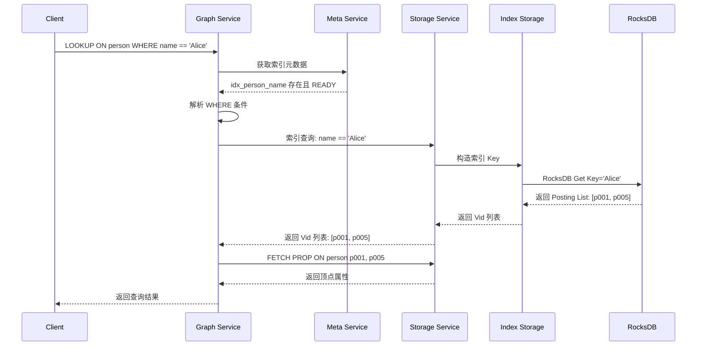

### 2. 索引选择流程

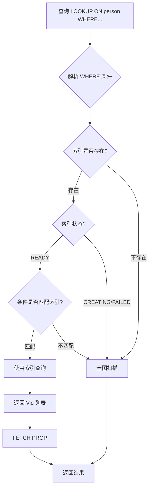

### 3. 索引重建流程

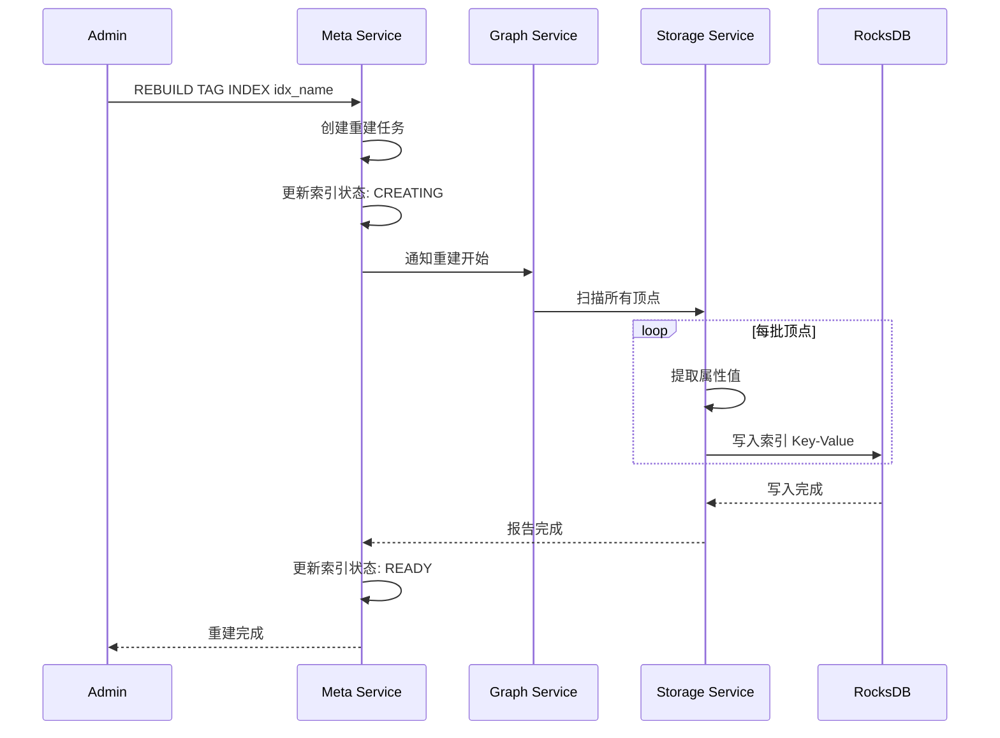

## 代码示例

### 完整示例：社交网络索引

```ngql
-- 1. 创建图空间
CREATE SPACE IF NOT EXISTS social_network(
    vid_type=FIXED_STRING(32),
    partition_num=9,
    replica_factor=3
);

USE social_network;

-- 2. 创建 Schema
CREATE TAG IF NOT EXISTS person(
    name string,
    age int,
    city string,
    email string
);

CREATE EDGE IF NOT EXISTS knows(
    since int,
    closeness double
);

-- 3. 创建索引
-- 单属性索引（精确匹配）
CREATE TAG INDEX idx_person_name ON person(name(30));
CREATE TAG INDEX idx_person_email ON person(email(50));

-- 复合索引（多条件查询）
CREATE TAG INDEX idx_person_city_age ON person(city(20), age);

-- 边索引
CREATE EDGE INDEX idx_knows_since ON knows(since);

-- 4. 插入数据
INSERT VERTEX person(name, age, city, email) VALUES
    "p001": ("Alice", 30, "Beijing", "alice@example.com"),
    "p002": ("Bob", 28, "Shanghai", "bob@example.com"),
    "p003": ("Carol", 32, "Beijing", "carol@example.com"),
    "p004": ("David", 26, "Guangzhou", "david@example.com"),
    "p005": ("Eve", 30, "Beijing", "eve@example.com");

INSERT EDGE knows(since, closeness) VALUES
    "p001"->"p002": (2020, 0.8),
    "p001"->"p003": (2019, 0.9),
    "p002"->"p004": (2021, 0.7),
    "p003"->"p005": (2018, 0.85);

-- 5. 重建索引
REBUILD TAG INDEX idx_person_name;
REBUILD TAG INDEX idx_person_email;
REBUILD TAG INDEX idx_person_city_age;
REBUILD EDGE INDEX idx_knows_since;

-- 查看索引状态
SHOW TAG INDEX STATUS;
SHOW EDGE INDEX STATUS;

-- 6. 索引查询示例

-- 6.1 精确匹配（使用 idx_person_name）
LOOKUP ON person 
WHERE person.name == "Alice" 
YIELD properties(vertex).name, properties(vertex).age;

-- 6.2 复合条件查询（使用 idx_person_city_age）
LOOKUP ON person 
WHERE person.city == "Beijing" AND person.age > 28 
YIELD properties(vertex).name, properties(vertex).age;

-- 6.3 范围查询（使用 idx_person_age，需额外创建）
CREATE TAG INDEX idx_person_age ON person(age);
REBUILD TAG INDEX idx_person_age;

LOOKUP ON person 
WHERE person.age >= 28 AND person.age <= 32 
YIELD properties(vertex).name, properties(vertex).age;

-- 6.4 边属性查询（使用 idx_knows_since）
LOOKUP ON knows 
WHERE knows.since >= 2020 
YIELD src(edge) AS src, dst(edge) AS dst, properties(edge).since;

-- 6.5 组合查询：先索引查询，再图遍历
GO FROM "p001" OVER knows 
WHERE properties(edge).since >= 2020 
YIELD dst(edge) AS friend
| FETCH PROP ON person $-.friend 
YIELD properties(vertex).name;

-- 7. 性能分析
-- 使用 EXPLAIN 查看执行计划
EXPLAIN LOOKUP ON person WHERE person.name == "Alice" YIELD ...;
```

### 索引使用最佳实践

```ngql
-- 实践 1：避免过度索引
-- 不推荐：为每个属性都创建索引
CREATE TAG INDEX idx_person_name ON person(name);
CREATE TAG INDEX idx_person_age ON person(age);
CREATE TAG INDEX idx_person_city ON person(city);
CREATE TAG INDEX idx_person_email ON person(email);

-- 推荐：根据查询模式创建复合索引
CREATE TAG INDEX idx_person_city_age ON person(city(20), age);

-- 实践 2：定期重建索引
-- 数据变更后及时重建
INSERT VERTEX person(...) VALUES ...;
REBUILD TAG INDEX idx_person_name;

-- 实践 3：使用 EXPLAIN 验证索引使用
EXPLAIN LOOKUP ON person WHERE person.name == "Alice" YIELD ...;
-- 检查输出是否包含 "indexScan" 节点

-- 实践 4：监控索引状态
SHOW TAG INDEX STATUS;
-- 确保状态为 READY
```

## 要点总结

- **索引本质**：属性值到 Vid 的映射表，加速属性条件查询
- **索引类型**：顶点索引、边索引、复合索引、全文索引
- **实现原理**：倒排索引 + B+Tree（RocksDB LSM-Tree）
- **索引选择**：精确匹配用单属性，多条件用复合索引，范围查询用 B+Tree
- **索引重建**：数据变更后必须手动 `REBUILD INDEX`
- **与项目对比**：项目提供更多索引类型（BTree/Hash/Bitmap/GIN），但缺乏分布式支持
- **最佳实践**：按查询模式创建索引，避免过度索引，定期重建监控

## 思考题

1. NebulaGraph 的索引为什么需要手动重建？这与传统数据库的自动索引更新有何优劣？

2. 如果要为项目的 `graph_engine` 添加属性索引功能，应该如何设计？可以复用哪些 `index/` 模块？

3. NebulaGraph 的复合索引遵循最左前缀原则，这与 MySQL 的索引原则一致。请分析为什么这样设计。

4. 对比 NebulaGraph 的倒排索引和项目 `gin/gin.h` 的实现，各有何优劣？在什么场景下应该选择哪种？

5. 如果项目要实现类似 NebulaGraph 的索引重建机制，需要考虑哪些关键点？如何保证重建期间的数据一致性？

## 参考资料

- [NebulaGraph 官方文档 - 索引](https://docs.nebula-graph.com.cn/3.3.0/1.introduction/2.data-model/)
- [NebulaGraph 源码 - 索引实现](https://github.com/vesoft-inc/nebula)
- [RocksDB Wiki - LSM-Tree](https://github.com/facebook/rocksdb/wiki)
- [PostgreSQL GIN 索引](https://www.postgresql.org/docs/current/gin.html)
- 项目 `engineering/include/db/index/` 模块源码
