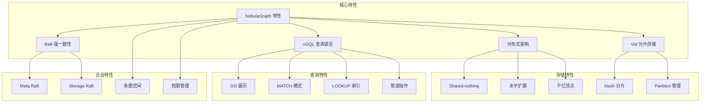
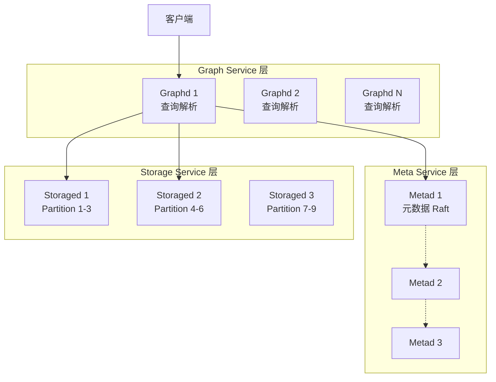
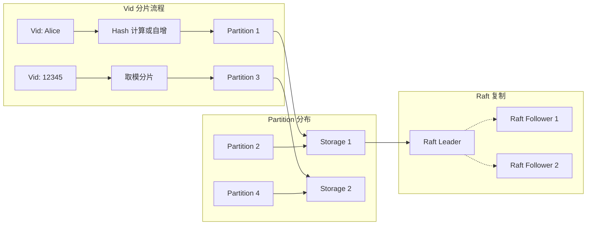
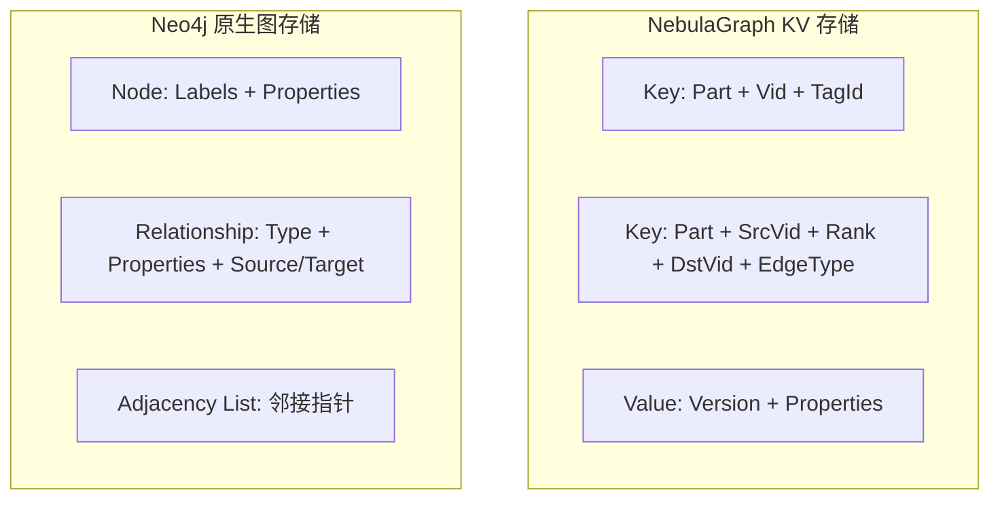

# NebulaGraph 关键特性

## 学习目标

- 掌握 NebulaGraph 的核心特性与设计理念
- 理解图数据模型、遍历查询、索引机制等关键技术
- 能够与 Neo4j 等其他图数据库进行对比选型

## 特性总览



## 核心特性详解

### 1. 分布式 Shared-nothing 架构

NebulaGraph 采用无共享架构，各组件独立扩展：



**架构优势**：
- **线性扩展**：增加 Storage 节点即可线性提升容量
- **高可用**：任意组件故障不影响整体服务
- **无中心节点**：避免单点瓶颈

### 2. nGQL 查询语言

nGQL 是类 SQL 的图查询语言，支持多种查询模式：

```ngql
-- 1. GO 语句：高效的图遍历
GO FROM "Alice" OVER knows YIELD 
    dst(edge) AS friend, 
    properties(edge).likeness AS likeness;

-- 2. 多跳遍历
GO 2 STEPS FROM "Alice" OVER knows 
    YIELD dst(edge) AS friend_of_friend;

-- 3. MATCH 模式匹配（兼容 Cypher 风格）
MATCH (a:Person)-[:KNOWS]->(b:Person)-[:KNOWS]->(c:Person)
WHERE a.name == "Alice"
RETURN DISTINCT c.name AS friend_of_friend;

-- 4. LOOKUP 索引查询
LOOKUP ON person 
WHERE person.name == "Alice" 
YIELD person.name, person.age;

-- 5. 管道操作
GO FROM "Alice" OVER knows YIELD dst(edge) AS fid 
| GO FROM $-.fid OVER knows YIELD dst(edge) AS fof;
```

**查询特性对比**：

| 查询类型 | 语法 | 适用场景 | 性能特点 |
|---------|------|---------|---------|
| GO | `GO FROM vid OVER edge` | 高效遍历，已知起点 | 最快，原生遍历 |
| MATCH | `MATCH (a)-[r]->(b)` | 复杂模式匹配 | 灵活，但开销较大 |
| LOOKUP | `LOOKUP ON tag WHERE...` | 属性条件查询 | 需要索引支持 |
| FETCH | `FETCH PROP ON tag vid` | 点属性获取 | O(1) 直接访问 |

### 3. Vid 分片机制



**分片策略**：

| Vid 类型 | 分片方式 | 特点 | 适用场景 |
|---------|---------|------|---------|
| FIXED_STRING | Hash 分片 | 字符串哈希均匀分布 | 用户 ID、URL 等 |
| INT64 | 自增 ID | 顺序递增，局部性好 | 内部生成 ID |

**分片计算公式**：
```go
// Hash 分片
partition_id = hash(vid) % num_partitions

// 自增 ID 分片
partition_id = auto_id % num_partitions
```

### 4. 索引机制

NebulaGraph 的索引支持属性条件查询：

```ngql
-- 创建 Tag 索引
CREATE TAG INDEX idx_person_name ON person(name(20));
CREATE TAG INDEX idx_person_age ON person(age);

-- 创建 Edge 索引
CREATE EDGE INDEX idx_knows_likeness ON knows(likeness);

-- 复合索引
CREATE TAG INDEX idx_person_name_age ON person(name(20), age);

-- 重建索引（数据变更后必须执行）
REBUILD TAG INDEX idx_person_name;

-- 查看索引状态
SHOW TAG INDEX STATUS;
```

**索引特性**：

| 特性 | 说明 | 限制 |
|------|------|------|
| 必须重建 | 数据变更后需 `REBUILD INDEX` | 异步重建，耗时 |
| 单属性索引 | 支持精确匹配、范围查询 | 模糊查询效率低 |
| 复合索引 | 支持多字段组合 | 遵循最左前缀 |
| 自动选择 | 查询优化器自动选择索引 | 可用 `EXPLAIN` 查看 |

### 5. 多图空间与权限管理

```ngql
-- 创建图空间（类似数据库）
CREATE SPACE social(
    vid_type=FIXED_STRING(30),
    partition_num=15,
    replica_factor=3
);

-- 创建用户和角色
CREATE USER admin WITH PASSWORD 'admin123';
CREATE ROLE admin_role;
GRANT ROLE admin_role TO admin;

-- 授权
GRANT ROLE ADMIN ON SPACE social TO admin;
```

## 与 Neo4j 对比

| 特性 | NebulaGraph | Neo4j |
|------|-------------|-------|
| **架构** | 分布式 Shared-nothing | 单机/集群（Causal Cluster） |
| **存储模型** | KV 存储（RocksDB） | 原生图存储（邻接表） |
| **查询语言** | nGQL | Cypher |
| **事务** | 单分区原子性 | ACID 强一致性 |
| **扩展性** | 线性水平扩展 | 需要企业版集群 |
| **分片** | Vid Hash 分片 | 无分片（单实例） |
| **容量** | 千亿顶点万亿边 | 单机约 340 亿节点 |
| **许可证** | Apache 2.0（完全开源） | GPL + 商业许可 |
| **社区** | 国内主导，中文文档完善 | 国际社区活跃 |
| **适用场景** | 大规模生产环境 | 中小规模、快速开发 |

### 查询语言对比

```ngql
# NebulaGraph nGQL
GO FROM "Alice" OVER knows 
    YIELD dst(edge) AS friend;
```

```cypher
# Neo4j Cypher
MATCH (a:Person {name: "Alice"})-[:KNOWS]->(b:Person)
RETURN b.name AS friend;
```

**关键差异**：
- **nGQL** 以 `GO FROM vid` 起始，遍历效率高
- **Cypher** 以 `MATCH` 模式匹配为主，表达力强

### 存储模型对比



| 存储特点 | NebulaGraph | Neo4j |
|---------|-------------|-------|
| 遍历复杂度 | O(1) 到 O(k) 取决于 KV 查询 | O(1) 原生指针遍历 |
| 存储效率 | 需要编码/解码开销 | 原生存储，无额外开销 |
| 分布式支持 | 天然支持 | 需要企业版集群 |

## 代码示例

### 完整示例：社交网络图

```ngql
-- 1. 创建图空间
CREATE SPACE IF NOT EXISTS social_network(
    vid_type=FIXED_STRING(32),
    partition_num=9,
    replica_factor=3
);

USE social_network;

-- 2. 创建 Schema
CREATE TAG IF NOT EXISTS person(
    name string,
    age int,
    city string
);

CREATE TAG IF NOT EXISTS company(
    name string,
    industry string
);

CREATE EDGE IF NOT EXISTS knows(
    since int,
    closeness double
);

CREATE EDGE IF NOT EXISTS works_at(
    position string,
    since int
);

-- 3. 创建索引
CREATE TAG INDEX idx_person_name ON person(name(20));
CREATE TAG INDEX idx_person_city ON person(city(20));
CREATE EDGE INDEX idx_knows_since ON knows(since);

-- 4. 插入数据
INSERT VERTEX person(name, age, city) VALUES
    "p001": ("Alice", 30, "Beijing"),
    "p002": ("Bob", 28, "Shanghai"),
    "p003": ("Carol", 32, "Guangzhou"),
    "p004": ("David", 26, "Shenzhen");

INSERT VERTEX company(name, industry) VALUES
    "c001": ("TechCorp", "Technology"),
    "c002": ("FinanceInc", "Finance");

INSERT EDGE knows(since, closeness) VALUES
    "p001"->"p002": (2020, 0.8),
    "p001"->"p003": (2019, 0.9),
    "p002"->"p004": (2021, 0.7);

INSERT EDGE works_at(position, since) VALUES
    "p001"->"c001": ("Engineer", 2018),
    "p002"->"c002": ("Analyst", 2020);

-- 5. 重建索引
REBUILD TAG INDEX idx_person_name;
REBUILD TAG INDEX idx_person_city;

-- 6. 查询示例

-- 6.1 查找 Alice 的朋友
GO FROM "p001" OVER knows YIELD 
    dst(edge) AS friend_id,
    properties(edge).closeness AS closeness
| FETCH PROP ON person $-.friend_id YIELD 
    properties(vertex).name AS name;

-- 6.2 查找两度人脉
GO 2 STEPS FROM "p001" OVER knows YIELD 
    dst(edge) AS fof_id
| FETCH PROP ON person $-.fof_id YIELD 
    properties(vertex).name AS name;

-- 6.3 按属性查找
LOOKUP ON person 
WHERE person.city == "Beijing" 
YIELD properties(vertex).name AS name, 
      properties(vertex).age AS age;

-- 6.4 路径查询
FIND SHORTEST PATH FROM "p001" TO "p004" OVER knows 
    YIELD path AS p;

-- 6.5 MATCH 模式查询
MATCH (a:person)-[:knows]->(b:person)-[:works_at]->(c:company)
WHERE a.name == "Alice"
RETURN b.name AS friend, c.name AS company;
```

## 要点总结

- **分布式架构**：Shared-nothing 设计，线性扩展，支持千亿顶点
- **nGQL 语言**：类 SQL 语法，GO/MATCH/LOOKUP 多种查询模式
- **Vid 分片**：Hash 分片实现数据分布，Raft 保证强一致性
- **索引机制**：支持属性索引，数据变更后必须重建
- **开源协议**：Apache 2.0 完全开源，无商业版功能限制
- **与 Neo4j 对比**：适合大规模分布式场景，但遍历效率略低于原生图存储

## 思考题

1. NebulaGraph 的 Vid 分片策略在什么场景下会导致数据倾斜？如何优化？
2. 为什么 NebulaGraph 的索引在数据变更后必须手动重建？这与其他数据库有何不同？
3. GO 语句和 MATCH 语句的执行原理有何差异？在什么场景下应该优先使用 GO？
4. NebulaGraph 的单分区事务与 Neo4j 的 ACID 事务各有何优劣？
