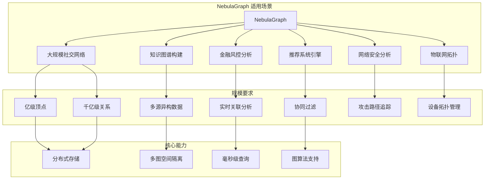
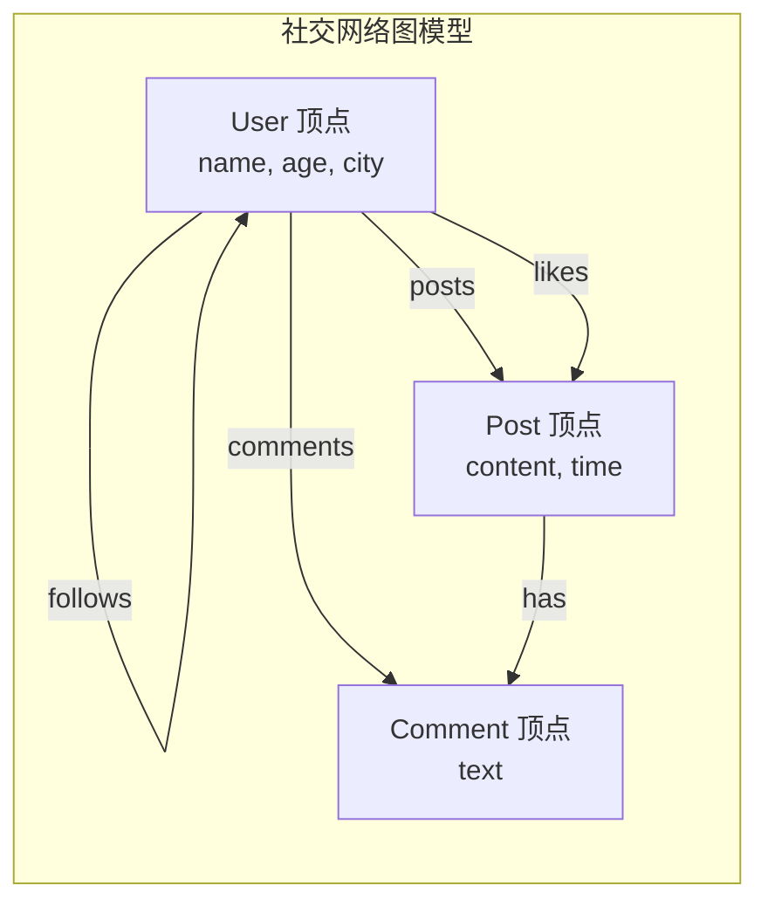
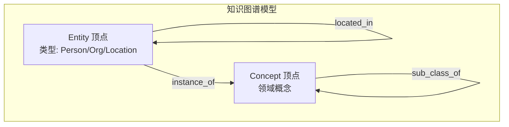
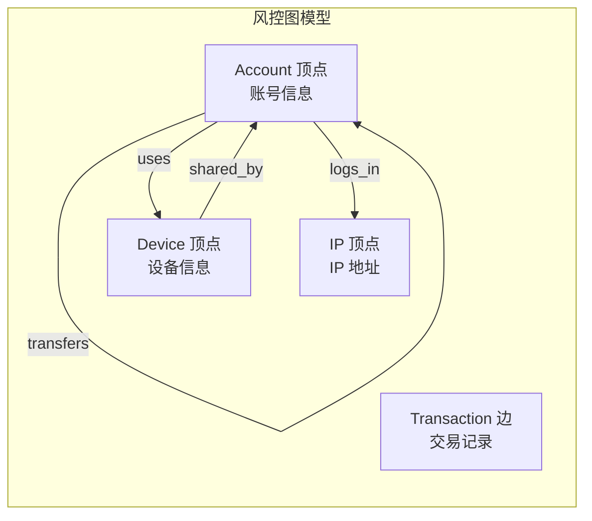
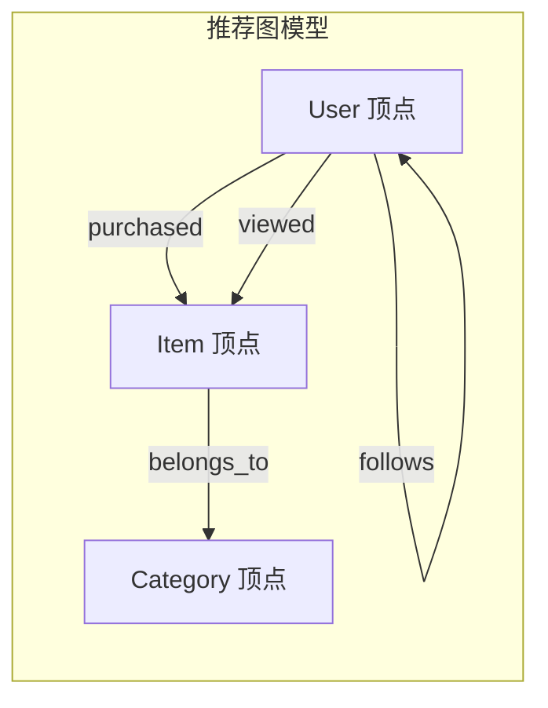
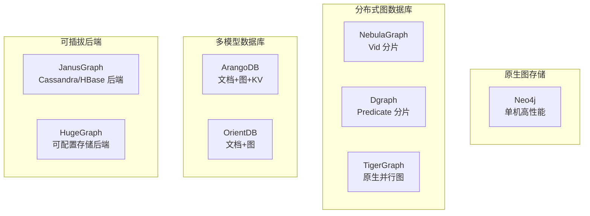
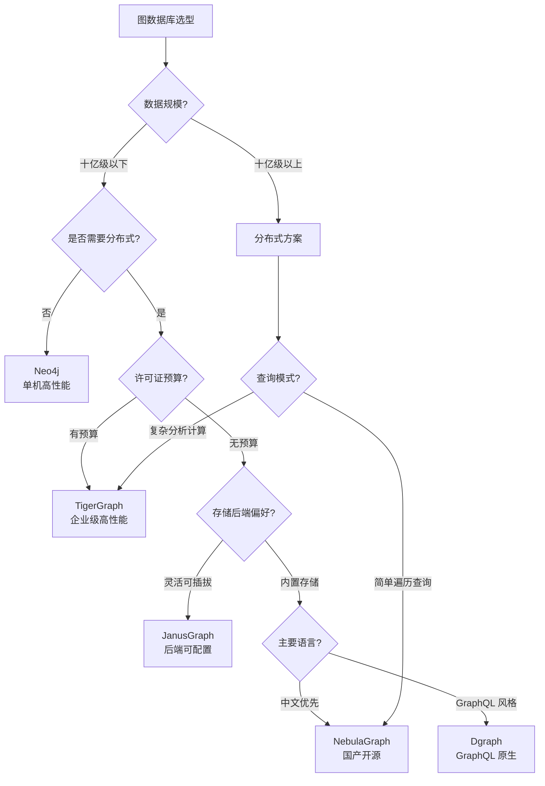

# NebulaGraph 使用场景与选型对比

## 学习目标

- 掌握 NebulaGraph 的典型应用场景
- 理解 NebulaGraph 与其他图数据库的选型差异
- 能够根据实际需求进行图数据库选型决策

## 适用场景总览



## 典型应用场景

### 1. 大规模社交网络

社交网络是 NebulaGraph 最典型的应用场景：

**数据模型**：



**nGQL 实现**：

```ngql
-- 创建社交网络图空间
CREATE SPACE social(
    vid_type=FIXED_STRING(32),
    partition_num=100,
    replica_factor=3
);

USE social;

-- 创建标签和边类型
CREATE TAG user(name string, age int, city string);
CREATE TAG post(content string, created_at timestamp);
CREATE EDGE follows(since int);
CREATE EDGE likes(time timestamp);
CREATE EDGE posts(created_at timestamp);

-- 查询示例：好友推荐（共同好友数排序）
GO FROM "user001" OVER follows YIELD dst(edge) AS f1
| GO FROM $-.f1 OVER follows YIELD dst(edge) AS f2
| WHERE $-.f2 != "user001"
| GROUP BY $-.f2 YIELD $-.f2 AS recommended, count(*) AS common_friends
| ORDER BY $-.common_friends DESC
| LIMIT 10;

-- 查询示例：六度人脉
GO 6 STEPS FROM "user001" OVER follows YIELD dst(edge) AS contact
| GROUP BY $-.contact YIELD $-.contact, count(*) AS paths;
```

**适用性分析**：

| 需求 | NebulaGraph 优势 | 注意事项 |
|------|------------------|---------|
| 亿级用户 | 分布式存储，线性扩展 | 合理设置 partition_num |
| 实时互动 | 毫秒级遍历响应 | 热点 Vid 需要分散 |
| 关系查询 | GO 语句高效遍历 | 复杂模式用 MATCH |
| 数据隔离 | 多图空间隔离 | 不同业务独立空间 |

### 2. 知识图谱构建

知识图谱涉及大规模实体关系存储：

**数据模型**：



**nGQL 实现**：

```ngql
-- 创建知识图谱空间
CREATE SPACE knowledge_graph(
    vid_type=FIXED_STRING(64),
    partition_num=50,
    replica_factor=3
);

USE knowledge_graph;

-- 创建实体和关系
CREATE TAG entity(name string, type string, source string);
CREATE TAG concept(name string, domain string);

CREATE EDGE related_to(relation_type string, confidence double);
CREATE EDGE instance_of(provenance string);
CREATE EDGE sub_class_of(level int);

-- 实体链接查询（多跳关联）
MATCH (e1:entity)-[r1:related_to]->(e2:entity)-[r2:related_to]->(e3:entity)
WHERE e1.name == "阿里巴巴" AND r1.relation_type == "投资"
RETURN DISTINCT e2.name AS investee, e3.name AS related_company;

-- 概念层级查询
GO FROM "concept_tech" OVER sub_class_of YIELD dst(edge) AS child
| FETCH PROP ON concept $-.child YIELD properties(vertex).name AS concept_name;
```

**知识图谱适用性**：

| 场景特点 | NebulaGraph 支持 | 方案建议 |
|---------|------------------|---------|
| 多源数据融合 | 多图空间隔离 | 按领域分空间 |
| 实体消歧 | 属性索引 | 创建唯一标识索引 |
| 关系推理 | 图算法库 | PageRank 重要性排序 |
| 版本管理 | 属性时间戳 | 应用层实现版本控制 |

### 3. 金融风控分析

金融风控需要实时关联分析能力：

**数据模型**：



**nGQL 实现**：

```ngql
-- 创建风控图空间
CREATE SPACE risk_control(
    vid_type=FIXED_STRING(32),
    partition_num=30,
    replica_factor=3
);

USE risk_control;

-- 创建 Schema
CREATE TAG account(
    account_id string, 
    name string, 
    risk_level int,
    create_time timestamp
);
CREATE TAG device(device_id string, device_type string);
CREATE TAG ip_addr(address string, location string);

CREATE EDGE transfers(
    amount double, 
    time timestamp,
    channel string
);
CREATE EDGE uses(time timestamp);
CREATE EDGE logs_in(time timestamp);

-- 创建索引支持风控查询
CREATE TAG INDEX idx_account_id ON account(account_id(20));
CREATE TAG INDEX idx_risk_level ON account(risk_level);

-- 风控查询示例：检测异常关联账户
-- 查找与高风险账户共享设备的账户
MATCH (a1:account)-[:uses]->(d:device)<-[:uses]-(a2:account)
WHERE a1.risk_level >= 3
RETURN DISTINCT a2.account_id AS potential_risk, 
       a2.risk_level AS current_level,
       d.device_id AS shared_device;

-- 检测循环转账（洗钱模式）
MATCH (a:account)-[:transfers]->(b:account)-[:transfers]->(c:account)-[:transfers]->(a)
WHERE a.account_id == "ACC001"
RETURN a.account_id, b.account_id, c.account_id;

-- 短期大额交易检测
GO FROM "ACC001" OVER transfers 
WHERE properties(edge).amount > 100000 
   AND properties(edge).time > timestamp("2024-01-01")
YIELD dst(edge) AS target, 
      properties(edge).amount AS amount,
      properties(edge).time AS tx_time;
```

**风控场景优势**：

| 风控需求 | NebulaGraph 能力 | 实现方式 |
|---------|------------------|---------|
| 实时关联 | 毫秒级图遍历 | GO 语句直达 |
| 团伙识别 | 社区检测算法 | Louvain 算法 |
| 路径追踪 | 最短路径 | FIND SHORTEST PATH |
| 模式匹配 | 复杂图模式 | MATCH 查询 |

### 4. 推荐系统引擎

图数据库在推荐系统中用于协同过滤和关系推荐：

**数据模型**：



**nGQL 实现**：

```ngql
-- 协同过滤推荐
-- 找到购买相同商品的用户，推荐他们购买的其他商品
GO FROM "user001" OVER purchased YIELD dst(edge) AS item
| GO FROM $-.item OVER purchased REVERSELY YIELD src(edge) AS similar_user
| WHERE $-.similar_user != "user001"
| GO FROM $-.similar_user OVER purchased YIELD dst(edge) AS rec_item
| WHERE $-.rec_item NOT IN (GO FROM "user001" OVER purchased YIELD dst(edge))
| GROUP BY $-.rec_item YIELD $-.rec_item, count(*) AS score
| ORDER BY $-.score DESC
| LIMIT 20;

-- 二度关系推荐（好友的好友）
GO 2 STEPS FROM "user001" OVER follows 
    YIELD dst(edge) AS fof
| WHERE $-.fof != "user001"
| GROUP BY $-.fof YIELD $-.fof, count(*) AS common_friends
| ORDER BY $-.common_friends DESC
| LIMIT 10;
```

## 与其他图数据库对比

### 图数据库分类



### 详细对比表格

| 特性 | NebulaGraph | Neo4j | Dgraph | TigerGraph | ArangoDB | JanusGraph |
|------|-------------|-------|--------|------------|----------|------------|
| **架构** | 分布式 | 单机/集群 | 分布式 | 分布式 | 集群 | 分布式 |
| **存储模型** | KV (RocksDB) | 原生图 | KV (Badger) | 原生图 | 多模型 | 可插拔 |
| **分片策略** | Vid Hash | 无 | Predicate | 原生分区 | 集群分片 | 后端决定 |
| **查询语言** | nGQL | Cypher | DQL (GraphQL) | GSQL | AQL | Gremlin |
| **事务** | 单分区 ACID | 完整 ACID | 分布式事务 | 完整 ACID | 单集合 ACID | 后端依赖 |
| **遍历性能** | 优秀 | 极佳 | 优秀 | 极佳 | 良好 | 取决于后端 |
| **水平扩展** | 线性 | 需要企业版 | 线性 | 线性 | 有限 | 线性 |
| **许可证** | Apache 2.0 | GPL/商业 | Apache | 商业/社区 | Apache | Apache |
| **容量上限** | 千亿顶点 | ~340亿节点 | 百亿级 | 万亿边 | 十亿级 | 取决于后端 |
| **中文社区** | 活跃 | 一般 | 一般 | 一般 | 较少 | 一般 |
| **成熟度** | 生产可用 | 成熟稳定 | 成长中 | 成熟稳定 | 成熟稳定 | 成熟 |

### 查询语言对比

**相同查询在不同图数据库中的实现**：

```ngql
# NebulaGraph nGQL
GO FROM "Alice" OVER knows YIELD dst(edge) AS friend;
```

```cypher
# Neo4j Cypher
MATCH (a:Person {name: "Alice"})-[:KNOWS]->(b)
RETURN b.name AS friend;
```

```graphql
# Dgraph DQL (GraphQL 风格)
{
  query(func: eq(name, "Alice")) {
    knows {
      name
    }
  }
}
```

```sql
# TigerGraph GSQL
SELECT tgt
FROM Person:s -(knows:e)-> Person:tgt
WHERE s.name == "Alice";
```

### 存储模型对比

| 数据库 | 存储模型 | 优势 | 劣势 |
|--------|---------|------|------|
| **Neo4j** | 原生邻接表 | O(1) 遍历，最佳性能 | 单机容量受限 |
| **NebulaGraph** | KV 编码 | 分布式友好，容量大 | 编码开销，遍历略慢 |
| **Dgraph** | Predicate 分片 | 灵活分片，GraphQL 友好 | 数据倾斜风险 |
| **TigerGraph** | 原生并行图 | 高性能，支持复杂计算 | 商业许可成本高 |
| **JanusGraph** | 可插拔后端 | 存储灵活，大数据生态 | 架构复杂，运维成本高 |

## 选型决策流程



### 选型决策矩阵

| 决策因素 | 推荐选择 | 原因 |
|---------|---------|------|
| 数据量 < 10亿，快速开发 | Neo4j | 部署简单，社区成熟 |
| 数据量 > 10亿，分布式必须 | NebulaGraph | Apache 开源，线性扩展 |
| 需要复杂图计算 | TigerGraph | GSQL 强大，性能最优 |
| 已有 Hadoop 生态 | JanusGraph | 与 HBase/Cassandra 集成 |
| GraphQL 风格偏好 | Dgraph | 原生 GraphQL API |
| 多模型需求 | ArangoDB | 文档+图统一 |
| 国产化合规要求 | NebulaGraph | 国产开源，中文支持完善 |

### 实际案例选型参考

| 行业案例 | 数据规模 | 查询特点 | 推荐选择 | 原因 |
|---------|---------|---------|---------|------|
| 社交网络（微信） | 百亿顶点 | 实时遍历 | NebulaGraph | 分布式，国产支持 |
| 知识图谱（百科） | 十亿顶点 | 复杂推理 | Neo4j/JanusGraph | 单机够用，生态成熟 |
| 金融风控（银行） | 亿级顶点 | 实时关联 | NebulaGraph/TigerGraph | 分布式，高性能 |
| 推荐系统（电商） | 十亿顶点 | 协同过滤 | NebulaGraph | 分布式，开源无成本 |
| 网络安全（运营商） | 亿级顶点 | 路径追踪 | Neo4j/TigerGraph | 复杂分析 |
| IoT 拓扑（设备管理） | 千万顶点 | 简单关联 | Neo4j | 单机够用 |

## 要点总结

- **NebulaGraph 优势**：分布式架构、千亿级容量、Apache 2.0 开源、中文社区活跃
- **典型场景**：大规模社交网络、知识图谱、金融风控、推荐系统
- **选型关键**：数据规模、查询复杂度、分布式需求、许可证预算
- **与其他对比**：容量和扩展性优于 Neo4j，遍历性能略逊于原生图存储
- **选型建议**：十亿级以上数据优先 NebulaGraph，十亿级以下 Neo4j 足够

## 思考题

1. 在什么情况下应该选择 NebulaGraph 而不是 Neo4j？请给出具体的判断标准。
2. NebulaGraph 的 Vid 分片策略在社交网络场景中可能遇到什么问题？如何解决？
3. 对于一个金融风控系统，需要同时支持实时查询和离线图计算，应该如何设计架构？
4. 比较 NebulaGraph 和 JanusGraph 在大数据生态集成方面的优劣。
