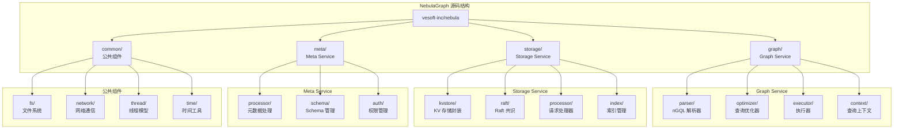

# NebulaGraph 学习资源

## 学习目标

- 获取 NebulaGraph 的优质学习资源
- 了解 NebulaGraph 源码结构和研读路径
- 掌握从入门到精通的学习路径

## 官方资源

### 官方文档与代码

| 资源类型 | 链接 | 说明 |
|---------|------|------|
| **官方文档** | [https://docs.nebula-graph.com.cn/](https://docs.nebula-graph.com.cn/) | 中文文档完善，版本覆盖 1.x-3.x |
| **GitHub 仓库** | [https://github.com/vesoft-inc/nebula](https://github.com/vesoft-inc/nebula) | 核心源码，Apache 2.0 许可 |
| **GitHub 仓库（Graph）** | [https://github.com/vesoft-inc/nebula-graph](https://github.com/vesoft-inc/nebula-graph) | Graph 服务源码 |
| **GitHub 仓库（Storage）** | [https://github.com/vesoft-inc/nebula-storage](https://github.com/vesoft-inc/nebula-storage) | Storage 服务源码 |
| **GitHub 仓库（Meta）** | [https://github.com/vesoft-inc/nebula-metad](https://github.com/vesoft-inc/nebula-metad) | Meta 服务源码 |
| **官方论坛** | [https://discuss.nebula-graph.com.cn/](https://discuss.nebula-graph.com.cn/) | 中文问答社区 |
| **官方博客** | [https://nebula-graph.com.cn/posts/](https://nebula-graph.com.cn/posts/) | 技术文章和案例分享 |
| **Slack 社区** | [https://join.slack.com/t/nebulagraph](https://join.slack.com/t/nebulagraph) | 国际社区交流 |

### 快速开始

- **Docker 部署**：[https://docs.nebula-graph.com.cn/3.6.0/2.quick-start/](https://docs.nebula-graph.com.cn/3.6.0/2.quick-start/)
- **nGQL 语法手册**：[https://docs.nebula-graph.com.cn/3.6.0/3.ngql-guide/](https://docs.nebula-graph.com.cn/3.6.0/3.ngql-guide/)
- **客户端 SDK**：[https://docs.nebula-graph.com.cn/3.6.0/14.client/](https://docs.nebula-graph.com.cn/3.6.0/14.client/)

## 源码研读路径

NebulaGraph 采用 C++ 实现，源码结构清晰，适合深入学习：



### 核心模块说明

| 模块 | 路径 | 核心功能 | 入口文件 |
|------|------|---------|---------|
| **Graph Service** | `graph/` | nGQL 解析、优化、执行 | `GraphService.cpp` |
| **nGQL 解析器** | `graph/parser/` | 词法分析、语法分析 | `Scanner.lex`, `Parser.yy` |
| **查询优化器** | `graph/optimizer/` | RBO/CBO 优化 | `Optimizer.cpp` |
| **执行器** | `graph/executor/` | 算子执行 | `Executor.cpp` |
| **Storage Service** | `storage/` | 数据存储、索引、Raft | `StorageService.cpp` |
| **KV Store** | `storage/kvstore/` | RocksDB 封装 | `KVEngine.cpp` |
| **Raft 实现** | `storage/raft/` | Raft 共识协议 | `RaftPart.cpp` |
| **索引管理** | `storage/index/` | 索引创建、查询 | `IndexManager.cpp` |
| **Meta Service** | `meta/` | 元数据管理、Schema | `MetaService.cpp` |
| **Schema 管理** | `meta/schema/` | Tag/Edge 定义 | `SchemaManager.cpp` |

### 推荐研读顺序

```mermaid
graph LR
    subgraph 第一阶段：理解架构
        A1[README + 架构文档] --> A2[graph/ 入口]
        A2 --> A3[storage/ 入口]
        A3 --> A4[meta/ 入口]
    end

    subgraph 第二阶段：查询路径
        B1[parser/<br/>nGQL 解析] --> B2[optimizer/<br/>查询优化]
        B2 --> B3[executor/<br/>执行器]
        B3 --> B4[存储访问]
    end

    subgraph 第三阶段：存储路径
        C1[kvstore/<br/>RocksDB 封装] --> C2[raft/<br/>Raft 协议]
        C2 --> C3[index/<br/>索引实现]
        C3 --> C4[Vertex/Edge 编码]
    end

    subgraph 第四阶段：高级特性
        D1[分布式事务] --> D2[查询优化器]
        D2 --> D3[索引优化]
    end

    A4 --> B1
    B4 --> C1
    C4 --> D1
```

### 重点源码文件

| 功能领域 | 关键文件 | 学习重点 |
|---------|---------|---------|
| **nGQL 解析** | `graph/parser/Parser.yy` | 语法定义，理解 AST 结构 |
| **查询执行** | `graph/executor/QueryExecutor.cpp` | GO/MATCH 等查询的执行流程 |
| **存储编码** | `storage/codec/RowCodecV2.cpp` | Vertex/Edge Key-Value 编码格式 |
| **Raft 实现** | `storage/raft/RaftPart.cpp` | Raft 协议在图数据库中的应用 |
| **索引实现** | `storage/index/IndexManager.cpp` | 索引创建、重建、查询流程 |
| **查询优化** | `graph/optimizer/Optimizer.cpp` | RBO/CBO 优化规则 |

### 调试建议

```bash
# 编译 Debug 版本
cmake -DCMAKE_BUILD_TYPE=Debug ..
make -j$(nproc)

# 开启详细日志
--log_level=DEBUG

# GDB 调试
gdb ./bin/nebula-graphd
```

## 推荐书籍和论文

### 图数据库书籍

| 书籍 | 作者 | 说明 | 推荐度 |
|------|------|------|-------|
| **《图数据库》** | Ian Robinson 等 | 图数据库概念和 Neo4j 实践，经典入门 | ⭐⭐⭐⭐⭐ |
| **《Neo4j 实战》** | Aleksa Vukotic | Neo4j 实战案例，Cypher 查询技巧 | ⭐⭐⭐⭐ |
| **《Graph Databases》** | Jim Webber 等 | 图数据库理论，免费电子书 | ⭐⭐⭐⭐ |
| **《数据密集型应用系统设计》** | Martin Kleppmann | 分布式系统设计，包含图存储讨论 | ⭐⭐⭐⭐⭐ |

### 相关论文

| 论文 | 说明 | 链接 |
|------|------|------|
| **The Neo4j Graph Database** | Neo4j 原生图存储设计 | [ACM DL](https://dl.acm.org/) |
| **HyperGraphDB: A Generalized Graph Database** | 超图数据库概念 | ResearchGate |
| **JanusGraph: A Distributed Graph Database** | JanusGraph 架构设计 | [官网文档](https://docs.janusgraph.org/) |
| **Raft Consensus Algorithm** | Raft 协议原论文 | [raft.github.io](https://raft.github.io/) |
| **RocksDB: A Persistent Key-Value Store** | NebulaGraph 底层存储 | [rocksdb.org](https://rocksdb.org/) |

### 分布式系统基础

| 书籍/论文 | 说明 |
|---------|------|
| **《分布式系统：概念与设计》** | 分布式系统理论基础 |
| **《分布式系统原理》** | CAP、一致性、容错等核心概念 |
| **In Search of an Understandable Consensus Algorithm** | Raft 论文原文 |

## 社区资源

### 中文社区

| 资源 | 链接 | 说明 |
|------|------|------|
| **官方论坛** | [discuss.nebula-graph.com.cn](https://discuss.nebula-graph.com.cn/) | 中文问答，问题响应快 |
| **微信公众号** | "NebulaGraph" | 技术文章推送，案例分享 |
| **知乎专栏** | [NebulaGraph 专栏](https://zhuanlan.zhihu.com/nebulagraph) | 技术深度文章 |
| **B站视频** | [NebulaGraph 官方](https://space.bilibili.com/nesoft-inc) | 技术分享录像 |
| **Meetup 活动** | [活动预告](https://nebula-graph.com.cn/events) | 线下技术交流 |

### 英文社区

| 资源 | 链接 | 说明 |
|------|------|------|
| **Slack** | [nebulagraph.slack.com](https://nebulagraph.slack.com/) | 国际社区，英文交流 |
| **Stack Overflow** | `#nebula-graph` 标签 | 技术问答 |
| **YouTube** | [NebulaGraph Channel](https://www.youtube.com/c/NebulaGraph) | 视频教程 |

### 第三方教程

| 资源 | 说明 |
|------|------|
| **掘金小册** | 《NebulaGraph 入门到实践》系列 |
| **CSDN 博客** | 搜索 "NebulaGraph" 有大量实践文章 |
| **GitHub Discussions** | 官方 GitHub 仓库的讨论区 |

## SDK 和工具

### 官方 SDK

| 语言 | 仓库 | 文档 |
|------|------|------|
| **Python** | [nebula-python](https://github.com/vesoft-inc/nebula-python) | [文档](https://github.com/vesoft-inc/nebula-python#readme) |
| **Java** | [nebula-java](https://github.com/vesoft-inc/nebula-java) | [文档](https://github.com/vesoft-inc/nebula-java#readme) |
| **Go** | [nebula-go](https://github.com/vesoft-inc/nebula-go) | [文档](https://github.com/vesoft-inc/nebula-go#readme) |
| **C++** | 内置于源码 | `graph/client/cpp/` |

### 图算法扩展

| 工具 | 说明 |
|------|------|
| **nebula-algorithm** | 图算法库（PageRank、Louvain 等） |
| **nebula-analytics** | 图分析平台 |

### 运维工具

| 工具 | 说明 |
|------|------|
| **NebulaGraph Studio** | 可视化管理工具，Web UI |
| **nebula-dashboard** | 监控面板 |
| **nebula-importer** | 批量数据导入工具 |
| **nebula-backup** | 数据备份恢复工具 |

## 学习路径

### 按阶段推荐

```mermaid
graph LR
    subgraph 入门阶段 1-2周
        A1[官方文档阅读] --> A2[Docker 部署实践]
        A2 --> A3[nGQL 基础语法]
        A3 --> A4[简单 CRUD 操作]
    end

    subgraph 进阶阶段 2-4周
        B1[索引机制理解] --> B2[查询优化技巧]
        B2 --> B3[分布式部署]
        B3 --> B4[性能调优]
    end

    subgraph 应用阶段 1-2月
        C1[应用场景实践] --> C2[SDK 集成开发]
        C2 --> C3[图算法应用]
        C3 --> C4[生产环境部署]
    end

    subgraph 深入阶段 2-3月
        D1[源码研读] --> D2[架构设计理解]
        D2 --> D3[性能瓶颈分析]
        D3 --> D4[贡献代码]
    end

    A4 --> B1
    B4 --> C1
    C4 --> D1
```



| 阶段 | 目标 | 推荐资源 | 预计时间 |
|------|------|---------|---------|
| **入门** | 独立使用 NebulaGraph 完成基本操作 | 官方文档 Quickstart + nGQL 语法 | 1-2 周 |
| **进阶** | 理解索引、优化、分布式部署 | 性能调优文档 + 部署指南 | 2-4 周 |
| **应用** | 实际场景应用开发 | SDK 文档 + 案例 + 图算法 | 1-2 月 |
| **深入** | 理解源码实现，能贡献代码 | 源码 + 架构设计文档 | 2-3 月 |

### 对比学习建议

将 NebulaGraph 与其他图数据库对比学习，效果更佳：

1. **NebulaGraph vs Neo4j**：理解分布式与单机、KV 存储与原生图的权衡
2. **NebulaGraph vs Dgraph**：理解 Vid 分片与 Predicate 分片的差异
3. **NebulaGraph vs JanusGraph**：理解内置存储与可插拔后端的选择
4. **NebulaGraph vs TigerGraph**：理解开源与商业产品的能力差距

### 实践项目建议

| 项目 | 涉及知识点 | 难度 |
|------|-----------|------|
| **社交网络系统** | 图空间设计、Schema 设计、索引、遍历 | ⭐⭐ |
| **知识图谱构建** | 多类型实体、复杂关系、查询推理 | ⭐⭐⭐ |
| **推荐系统** | 协同过滤、图算法、实时查询 | ⭐⭐⭐⭐ |
| **风控系统** | 关联分析、模式匹配、实时告警 | ⭐⭐⭐⭐ |

## 要点总结

- 官方中文文档完善，是学习的首选资源
- 源码采用 C++ 实现，结构清晰，适合深入研读
- 建议按 入门 → 进阶 → 应用 → 深入 的阶段循序渐进
- 中文社区活跃，问题响应快，适合国内开发者
- 对比学习（NebulaGraph vs Neo4j/Dgraph/JanusGraph）能加深理解
- 实践项目是掌握 NebulaGraph 的最佳途径

## 思考题

1. NebulaGraph 的源码中，nGQL 解析器是如何将查询语句转换为执行计划的？
2. NebulaGraph 的 Storage Service 如何将图语义（Vertex/Edge）编码为 KV 格式？这种设计有何优缺点？
3. 对比 NebulaGraph 和 Neo4j 的查询优化器设计，它们分别采用了什么优化策略？
4. 如果要为 NebulaGraph 贡献代码，应该从哪个模块开始？为什么？
