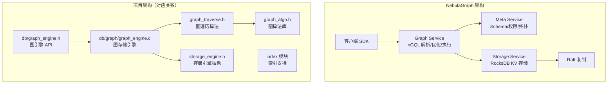
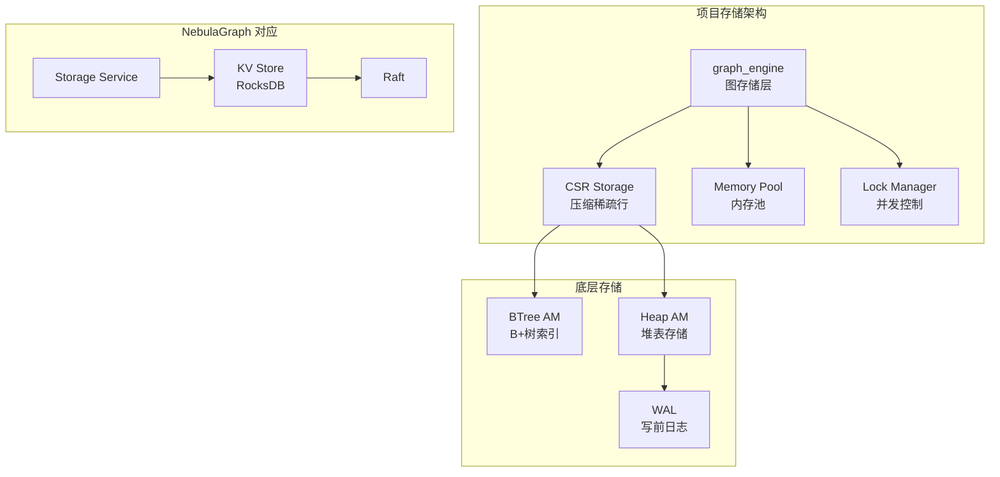

# NebulaGraph 项目关联

## 学习目标

- 理解 NebulaGraph 与本项目架构的对应关系
- 分析 NebulaGraph 设计对本项目 graph_engine 的启发
- 明确可借鉴的设计模式和技术实现

## 架构对比

### 整体架构映射



### 组件对应关系

| NebulaGraph 组件 | 项目对应模块 | 说明 |
|------------------|-------------|------|
| **Graph Service** | `db/graph/graph_engine.c` | 图查询解析和执行 |
| **nGQL 解析器** | `db/graph/graph_cypher.h` | Cypher/nGQL 风格查询解析 |
| **Storage Service** | `db/storage/graph/graph_engine.h` | 图存储引擎 |
| **KV Store (RocksDB)** | `storage_engine.h` → BTree/Heap | 底层存储抽象 |
| **Raft 复制** | `dist_txn.h`, `raft.h` | 分布式一致性（Phase 9） |
| **Meta Service** | `db/catalog.h` | 元数据管理 |
| **索引模块** | `index/` 模块 | 属性索引支持 |

## 与项目模块的关联

### 1. 与 graph_engine 的关联

项目中的 `graph_engine.h` 实现了图存储引擎：

```c
// 项目：graph_engine.h 核心结构
typedef struct graph_engine_db_s {
    graph_t *graph;              // 图数据库句柄
    char name[256];              // 图名称
    char data_dir[512];          // 数据目录
    AccessMode mode;             // 访问模式

    void *mem_pool;              // 内存池
    bool use_mem_pool;           // 是否使用内存池

    void *csr_storage;           // CSR 存储
    bool use_csr;                // 是否使用 CSR

    lock_manager_t *lockmgr;     // 锁管理器
    void *rwlock;                // 读写锁
} graph_engine_db_t;
```

**与 NebulaGraph 对比**：

| 设计点 | NebulaGraph | 项目实现 | 差异分析 |
|--------|-------------|---------|---------|
| 存储模型 | KV（RocksDB） | CSR + 邻接表 | 项目更接近原生图存储 |
| 内存管理 | 无显式内存池 | 可选内存池 | 项目提供更多控制 |
| 并发控制 | Raft 分布式锁 | 本地读写锁 | Nebula 支持分布式 |
| CSR 支持 | 无 | 可选启用 | 项目提供压缩存储优化 |

**可借鉴设计**：

```c
// 可借鉴 NebulaGraph 的 Vid 分片策略
typedef struct graph_partition_config_s {
    int partition_num;           // 分片数量
    graph_partition_func_t func; // 分片函数
    uint64_t (*hash_func)(const void *key, size_t len);
} graph_partition_config_t;

// Vid 分片计算
static inline uint64_t graph_compute_partition(
    const graph_partition_config_t *config,
    graph_vertex_id_t vid
) {
    if (config->func == GRAPH_PARTITION_HASH) {
        return config->hash_func(&vid, sizeof(vid)) % config->partition_num;
    }
    return vid % config->partition_num;
}
```

### 2. 与 graph_traverse 的关联

项目的 `graph_traverse.h` 提供图遍历能力：

```c
// 项目：遍历方向定义
typedef enum graph_traverse_direction_e {
    GRAPH_TRAVERSE_OUT,          // 出边方向
    GRAPH_TRAVERSE_IN,           // 入边方向
    GRAPH_TRAVERSE_BOTH          // 双向
} graph_traverse_direction_t;

// BFS 遍历结果
typedef struct graph_engine_bfs_result_s {
    graph_vertex_id_t *vertices;  // 遍历到的顶点数组
    int *depths;                  // 对应深度
    size_t count;                 // 顶点数
} graph_engine_bfs_result_t;
```

**与 NebulaGraph nGQL GO 语句对比**：

```ngql
# NebulaGraph GO 语句
GO FROM "Alice" OVER knows YIELD dst(edge) AS friend;
```

```c
// 项目等价 API 调用
graph_engine_bfs_result_t result;
graph_engine_bfs(graph_db, alice_vid, 1, &result);  // 1 跳 = depth 1
```

**可借鉴设计**：

```c
// 可借鉴 NebulaGraph 的多跳遍历设计
typedef struct graph_traverse_options_s {
    int max_depth;              // 最大深度（对应 GO N STEPS）
    graph_traverse_direction_t direction;
    graph_label_id_t *edge_types; // 边类型过滤（对应 OVER edge）
    size_t num_edge_types;
    bool include_start;         // 是否包含起点
    size_t limit;               // 结果限制（对应 LIMIT）
} graph_traverse_options_t;

// 多跳遍历 API
int graph_traverse_multi_hop(
    void *graph,
    graph_vertex_id_t start,
    const graph_traverse_options_t *options,
    graph_traverse_result_t **out_result
);
```

### 3. 与 graph_algo 的关联

项目的 `graph_algo.h` 实现了丰富的图算法：

```c
// 项目：图算法枚举
typedef enum GraphTraverseMode_e {
    GRAPH_TRAVERSE_BFS,          // 广度优先
    GRAPH_TRAVERSE_DFS           // 深度优先
} GraphTraverseMode;

// PageRank 算法
typedef struct GraphPageRankOptions_s {
    double damping;             // 阻尼因子（默认 0.85）
    int max_iterations;         // 最大迭代次数
    double tolerance;           // 收敛阈值
} GraphPageRankOptions;

// Dijkstra 最短路径
typedef struct GraphPath_s {
    graph_vertex_id_t *vertices;  // 路径顶点数组
    graph_edge_id_t *edges;       // 路径边数组
    size_t length;               // 路径长度
    double total_weight;         // 总权重
} GraphPath;
```

**与 NebulaGraph 图算法对比**：

| 算法 | NebulaGraph（nebula-algorithm） | 项目实现 | 差异 |
|------|--------------------------------|---------|------|
| BFS/DFS | GO 语句内置 | `graph_traverse.h` | 均支持 |
| Dijkstra | FIND SHORTEST PATH | `graph_dijkstra_path()` | 均支持 |
| PageRank | nebula-algorithm 扩展 | `graph_pagerank()` | 均支持 |
| Louvain | nebula-algorithm 扩展 | `graph_louvain()` | 均支持 |
| 连通分量 | nebula-algorithm 扩展 | `graph_connected_components()` | 均支持 |

**可借鉴设计**：

```c
// 可借鉴 NebulaGraph 的算法参数化设计
typedef struct graph_algo_config_s {
    // 通用参数
    int max_iterations;         // 最大迭代
    double tolerance;           // 收敛阈值
    
    // 算法特定参数
    union {
        struct {
            double damping;     // PageRank 阻尼因子
        } pagerank;
        
        struct {
            int resolution;     // Louvain 分辨率
        } louvain;
        
        struct {
            bool directed;      // 是否考虑方向
        } scc;                  // 强连通分量
    };
} graph_algo_config_t;

// 统一的算法执行接口
int graph_execute_algo(
    void *graph,
    graph_algo_type_t algo_type,
    const graph_algo_config_t *config,
    void **out_result
);
```

### 4. 与存储引擎的关联

项目的存储引擎抽象层：



**关键差异分析**：

| 方面 | NebulaGraph | 项目 | 分析 |
|------|-------------|------|------|
| 存储格式 | KV 编码 | CSR + 邻接表 | 项目遍历效率更高 |
| 底层引擎 | RocksDB | BTree/Heap | 项目有原生存储优势 |
| 分布式支持 | Raft 复制 | 单机（Phase 9 扩展） | Nebula 分布式成熟 |
| 持久化 | RocksDB WAL | 项目 WAL | 类似机制 |

## 可借鉴的设计

### 1. Vid 分片策略

NebulaGraph 的 Vid 分片策略可借鉴用于项目的分布式扩展：

```c
/**
 * Vid 分片配置（借鉴 NebulaGraph 设计）
 */
typedef struct graph_partition_s {
    int partition_id;           // 分片 ID
    uint64_t vertex_count;      // 顶点数量
    uint64_t edge_count;        // 边数量
    char storage_node[64];      // 存储节点地址
} graph_partition_t;

typedef struct graph_partition_manager_s {
    graph_partition_t *partitions;
    size_t num_partitions;
    
    // 分片函数
    uint64_t (*hash_func)(graph_vertex_id_t vid);
    
    // 分片映射表（缓存）
    struct {
        graph_vertex_id_t vid;
        int partition_id;
    } *partition_cache;
    size_t cache_size;
} graph_partition_manager_t;

/**
 * 根据 Vid 查找分片
 */
int graph_partition_find(
    const graph_partition_manager_t *mgr,
    graph_vertex_id_t vid,
    graph_partition_t **out_partition
) {
    // Hash 计算
    uint64_t hash = mgr->hash_func(vid);
    int partition_id = hash % mgr->num_partitions;
    
    *out_partition = &mgr->partitions[partition_id];
    return 0;
}
```

### 2. 邻居查询接口

借鉴 NebulaGraph 的 GO 语句设计，优化邻居查询接口：

```c
/**
 * 邻居查询选项（借鉴 GO 语句设计）
 */
typedef struct graph_neighbor_options_s {
    graph_traverse_direction_t direction;  // 方向
    graph_label_id_t *edge_types;          // 边类型过滤
    size_t num_edge_types;
    
    // 属性过滤（借鉴 WHERE 子句）
    struct {
        const char *prop_name;
        graph_value_type_t type;
        graph_compare_op_t op;
        void *value;
    } *filters;
    size_t num_filters;
    
    // 结果限制（借鉴 LIMIT）
    size_t limit;
    
    // 排序（借鉴 ORDER BY）
    const char *order_by_prop;
    bool ascending;
} graph_neighbor_options_t;

/**
 * 查询邻居（借鉴 GO FROM vid OVER edge）
 */
int graph_get_neighbors_ex(
    void *graph,
    graph_vertex_id_t vid,
    const graph_neighbor_options_t *options,
    graph_neighbors_t *out_neighbors
);
```

### 3. 图遍历算法

借鉴 NebulaGraph 的多跳遍历设计：

```c
/**
 * 多跳遍历配置
 */
typedef struct graph_hop_traverse_s {
    int num_hops;               // 跳数（对应 GO N STEPS）
    graph_traverse_direction_t direction;
    
    // 每跳的边类型过滤
    struct {
        graph_label_id_t *edge_types;
        size_t num_edge_types;
    } *hop_edge_filter;
    
    // 结果收集模式
    bool unique_vertices;       // 是否去重
    bool include_intermediate;  // 是否包含中间节点
} graph_hop_traverse_t;

/**
 * 多跳遍历 API
 */
int graph_hop_traverse(
    void *graph,
    graph_vertex_id_t start,
    const graph_hop_traverse_t *config,
    graph_traverse_result_t **out_result
);
```

### 4. 索引设计

借鉴 NebulaGraph 的属性索引机制：

```c
/**
 * 属性索引定义（借鉴 NebulaGraph CREATE INDEX）
 */
typedef struct graph_index_def_s {
    char index_name[64];        // 索引名称
    graph_label_id_t label_id;  // 标签 ID
    
    // 索引字段
    struct {
        char prop_name[64];
        graph_value_type_t type;
        int max_length;         // 字符串最大长度
    } *fields;
    size_t num_fields;
    
    bool unique;                // 是否唯一索引
} graph_index_def_t;

/**
 * 创建属性索引
 */
int graph_create_index(
    void *graph,
    const graph_index_def_t *def
);

/**
 * 重建索引（借鉴 NebulaGraph REBUILD INDEX）
 */
int graph_rebuild_index(
    void *graph,
    const char *index_name
);

/**
 * 使用索引查询（借鉴 LOOKUP ON）
 */
int graph_lookup_by_index(
    void *graph,
    const char *index_name,
    const graph_index_query_t *query,
    graph_vertex_id_t **out_vids,
    size_t *out_count
);
```

## 学习与实践路径

### 理论学习路径


### 实践任务清单

| 任务 | 涉及模块 | NebulaGraph 借鉴点 | 预期收益 |
|------|---------|-------------------|---------|
| **优化邻居查询** | `graph_traverse.h` | GO 语句设计思路 | 统一遍历接口 |
| **实现 Vid 分片** | `graph_engine.h` | Partition 机制 | 支持分布式扩展 |
| **添加属性索引** | `index/` 模块 | 索引创建/重建机制 | 支持属性条件查询 |
| **优化 CSR 存储** | `graph_engine.h` | KV 编码效率分析 | 提升存储密度 |
| **添加图空间隔离** | `graph_engine.h` | 多图空间设计 | 支持多业务隔离 |

### 代码对比分析示例

**NebulaGraph Storage Key 编码**：

```cpp
// NebulaGraph: Vertex Key 格式
// <part_id(4)> + <vid_len(1)> + <vid> + <tag_id(4)>
// Value: <version(8)> + <prop_data>

// 项目可借鉴的编码设计
typedef struct graph_vertex_key_s {
    uint32_t partition_id;
    uint8_t vid_len;
    uint8_t vid_data[32];
    uint32_t tag_id;
} __attribute__((packed)) graph_vertex_key_t;

typedef struct graph_vertex_value_s {
    uint64_t version;
    uint8_t prop_data[0];  // 变长属性数据
} graph_vertex_value_t;
```

**项目 CSR 存储优化**：

```c
// 项目 CSR 格式（对比 KV 编码）
typedef struct graph_csr_s {
    uint64_t *row_ptr;      // 行指针（顶点偏移）
    uint32_t *col_idx;      // 列索引（邻居顶点）
    uint32_t *edge_data;    // 边数据偏移
    uint64_t num_vertices;
    uint64_t num_edges;
} graph_csr_t;

// CSR vs KV：遍历效率对比
// CSR: row_ptr[src] → col_idx[start..end] → O(1) 邻居访问
// KV: Hash(part, src) → RocksDB Seek → O(log n) 查找
```

## 要点总结

- **架构映射**：项目 `graph_engine` 对应 NebulaGraph Storage Service，`graph_traverse` 对应 Graph Service
- **存储差异**：项目采用 CSR + 邻接表，NebulaGraph 采用 KV 编码，各有优劣
- **可借鉴设计**：Vid 分片策略、多跳遍历接口、属性索引机制、图空间隔离
- **学习路径**：文档阅读 → 架构理解 → 源码研读 → 项目实践
- **实践任务**：邻居查询优化、Vid 分片实现、属性索引添加、CSR 存储优化

## 思考题

1. 项目的 CSR 存储与 NebulaGraph 的 KV 存储在遍历性能上有何差异？各自适合什么场景？
2. 如果要为项目实现类似 NebulaGraph 的 Vid 分片机制，需要修改哪些模块？设计要点是什么？
3. 项目的 `graph_algo.h` 算法库与 NebulaGraph 的 nebula-algorithm 扩展有何异同？如何互补？
4. 从 NebulaGraph 的 Raft 实现中，项目可以借鉴哪些分布式一致性设计？