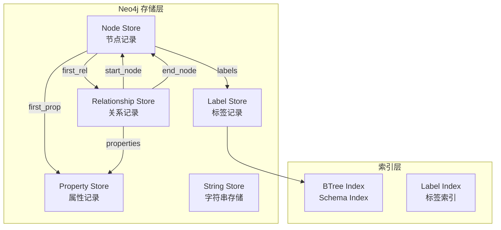

# Neo4j 架构设计

## 学习目标

- 理解 Neo4j 的原生图存储引擎
- 掌握 Neo4j 的存储结构（节点、关系、属性）

## 存储架构



## 节点存储

```c
// NodeRecord 结构（约 15 字节）
struct NodeRecord {
    int64_t  in_use;       // 是否使用
    int64_t  first_rel;    // 第一条关系 ID
    int64_t  first_prop;   // 第一个属性 ID
    int64_t  labels;       // 标签（内联或指针）
    int64_t  next_rel;     // 下一个关系（已废弃）
    int64_t  prop;         // 属性指针
    int32_t  dynamic;      // 动态标签标志
};
```

**邻接链表**：每个节点记录存储第一条关系的 ID，关系记录之间通过链表连接

## 关系存储

```c
// RelationshipRecord 结构（约 34 字节）
struct RelationshipRecord {
    int64_t  in_use;
    int64_t  first_node;   // 起始节点
    int64_t  second_node;  // 终止节点
    int64_t  rel_type;     // 关系类型
    int64_t  first_prop;   // 属性 ID
    int64_t  next_rel;     // 同节点下一关系
    int32_t  first_in_seq; // 第一个同类型关系
    int32_t  second_in_seq;// 第二个同类型关系
};
```

## 属性存储

```c
// PropertyRecord 结构
// 属性使用 PropertyBlock 存储
// 小属性内联，大属性存储指针到 Dynamic Store

// Dynamic Store 存储
// - 字符串（> 120 字节）
// - 数组
// - 大的属性值
```

## 存储优势

| 特性 | Neo4j | 关系数据库 |
|------|-------|-----------|
| 邻居遍历 | O(1) 链表 | O(N) JOIN |
| 路径查询 | 链表游走 | 多表 JOIN |
| 属性存储 | Property Store | 列存储 |
| 索引 | BTree | BTree |

## 要点总结

- 节点和关系都是固定大小记录
- 通过链表实现 O(1) 邻居遍历
- 属性存储与记录分离
- 支持内联标签节省空间

## 思考题

1. Neo4j 的邻接链表存储对写入性能有何影响？
2. 如何优化大规模图的存储空间？
3. Label 内联与指针方式各有何优劣？