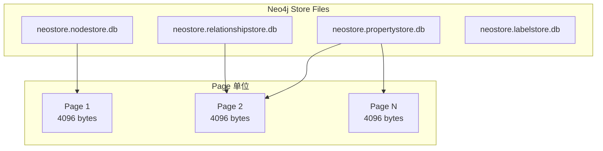

# Neo4j 存储引擎

## 学习目标

- 理解 Neo4j 的页面存储结构
- 掌握 Neo4j 的节点/关系/属性存储格式

## 页面存储



**页面大小**：默认 4096 字节（可配置）

## 节点记录格式

```c
// 节点记录（固定 15 字节）
// +----------------+------------------+------------------+
// | in_use(1)      | first_rel(6)     | first_prop(6)    |
// +----------------+------------------+------------------+
// | labels(6)      | next_rel_id(6)   | prop(4)          |
// +----------------+------------------+------------------+
// | dynamic(2)     |
// +----------------+

// first_rel: 关系链表的第一个关系 ID
// first_prop: 属性链表的头指针
// labels: 内联标签（低 5 位）或指向 Dynamic Store 的指针
```

## 关系记录格式

```c
// 关系记录（固定 34 字节）
// +----------------+------------------+------------------+
// | in_use(1)      | first_node(6)    | second_node(6)   |
// +----------------+------------------+------------------+
// | rel_type(2)    | first_prop(6)    | next_rel(6)      |
// +----------------+------------------+------------------+
// | first_in_seq(4)| second_in_seq(4) |
// +----------------+------------------+

// first_node/second_node: 起始和终止节点 ID
// rel_type: 关系类型 ID
// next_rel: 同节点下一关系
// first_in_seq/second_in_seq: 同类型关系链表
```

## 属性记录格式

```c
// 属性记录（可变长）
// 小属性（< 120 字节）：内联在记录中
// 大属性：存储指针到 Dynamic Store

// PropertyBlock 结构
// [header][type][value(s)]
// header: 占用位数表示属性数量和大小
// type: 数据类型
// value: 内联值或指针
```

## 要点总结

- 节点和关系都是固定大小记录
- 通过链表实现 O(1) 邻居遍历
- 属性使用 PropertyBlock 动态存储
- 支持内联标签优化小数据

## 思考题

1. 关系记录为何存储 first_in_seq 和 second_in_seq？
2. 如何优化稀疏图的存储空间？
3. Dynamic Store 的垃圾回收机制是什么？