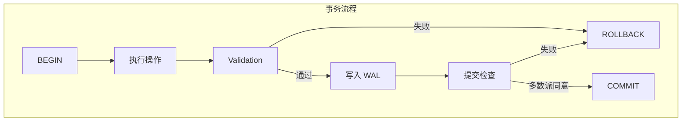

# Neo4j 事务与索引

## 学习目标

- 掌握 Neo4j 的事务机制（Write-Ahead Log + 锁）
- 理解 Neo4j 的 Schema Index 和 Label Index

## 事务机制



## 锁机制

```cypher
// 锁类型
// 1. 节点锁：节点被修改时加锁
// 2. 关系锁：关系被修改时加锁
// 3. 模式锁：Schema 变更时加锁

// 隔离级别：READ COMMITTED + 快照
// 每个事务开始时获取快照

// 死锁检测
// 超时检测：默认 5 秒
// 锁等待超时后自动回滚
```

## Schema Index

```cypher
-- 创建索引
CREATE INDEX FOR (p:Person) ON (p.name);
CREATE INDEX FOR (p:Person) ON (p.email);
CREATE INDEX FOR ()-[r:KNOWS]-() ON (r.since);

-- 查看索引
:schema

-- 删除索引
DROP INDEX index_name;

-- 唯一约束（自动创建索引）
CREATE CONSTRAINT FOR (p:Person) REQUIRE p.email IS UNIQUE;
```

## Label Index

```cypher
-- 按 Label 扫描
MATCH (p:Person) WHERE p:Person
-- 实际执行时使用 Label Index 加速

-- 组合查询
MATCH (p:Person:Employee) WHERE p:Person AND p:Employee
-- Label Index 支持多标签
```

## 要点总结

- WAL 保证事务持久性
- 节点和关系粒度锁
- Schema Index 基于 BTree
- Label Index 加速标签扫描

## 思考题

1. Neo4j 的事务隔离级别与关系数据库有何不同？
2. Schema Index 和 Label Index 的底层实现有何异同？
3. 如何避免大事务对性能的影响？