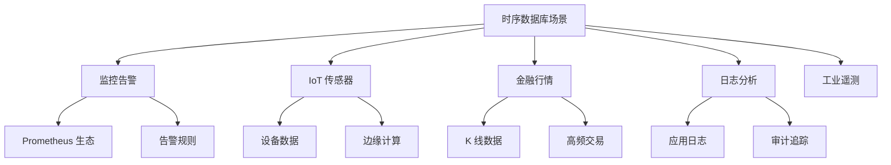

# 时序数据库使用场景与对比

## 使用场景总览



## 场景 1：监控系统

```sql
-- TimescaleDB: 存储指标
INSERT INTO metrics VALUES (NOW(), 'api-server', 'cpu_usage', 75.5);
INSERT INTO metrics VALUES (NOW(), 'api-server', 'memory_usage', 60.2);

-- 查询最近 CPU 使用率
SELECT time_bucket('1 minute', time) AS minute,
    AVG(value)
FROM metrics
WHERE name = 'cpu_usage' AND time > NOW() - INTERVAL '1 hour'
GROUP BY minute;
```

## 场景 2：IoT 数据采集

```influx
# InfluxDB Line Protocol
temperature,sensor_id=s1,location=factory1 value=25.5 1700000000000000000
humidity,sensor_id=s1,location=factory1 value=65.0 1700000000000000000
```

## 时序数据库对比

| 特性 | TimescaleDB | InfluxDB | QuestDB | GreptimeDB | VictoriaMetrics |
|------|-------------|----------|---------|------------|-----------------|
| 基础 | PostgreSQL | 自研 | 自研 | 自研 | 自研 |
| 查询 | SQL | InfluxQL/Flux | SQL | SQL/PromQL | PromQL/MetricsQL |
| 压缩 | 40-90% | 3-5x | 10x | 10x | 10x |
| 写入 | 中 | 高 | 极高 | 高 | 极高 |
| 许可证 | Apache/TSL | MIT | Apache | Apache | Apache |

## 选型建议

| 场景 | 推荐 |
|------|------|
| 需要复杂 SQL 分析 | TimescaleDB |
| Prometheus 生态 | VictoriaMetrics |
| 高性能摄取 | QuestDB |
| 国产云原生 | GreptimeDB |
| 简单时序存储 | InfluxDB |