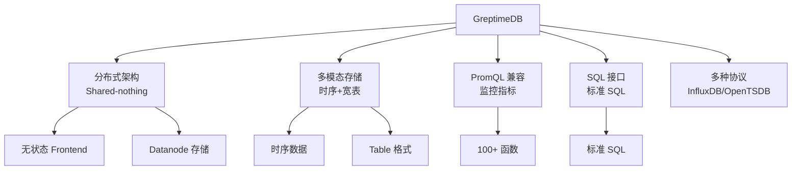
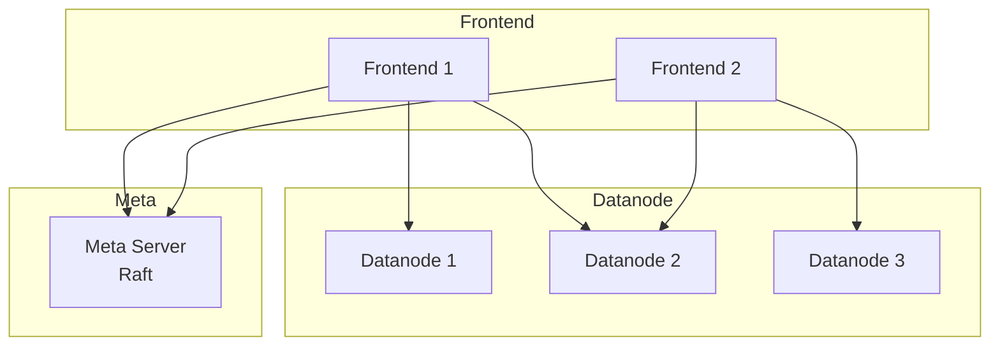

# GreptimeDB 项目概览

## 学习目标

- 了解 GreptimeDB 作为国产云原生时序数据库的定位
- 掌握 GreptimeDB 的分布式架构和 PromQL 兼容

## 项目定位

> GreptimeDB 是国产开源的云原生时序数据库，兼容 Prometheus 和 OpenTSDB 协议，支持 SQL 和 PromQL 查询。

**基本信息**：
- 开发方：Greptime（杭州势到科技）
- 首次发布：2022 年
- 开源协议：Apache 2.0
- GitHub Stars：约 5k

## 核心设计

## 架构特点

## 要点总结

- 国产开源，云原生设计
- PromQL 100% 兼容
- 多模态存储支持
- 多种协议接入

## 思考题

1. GreptimeDB 的分布式架构与 VictoriaMetrics 有何不同？
2. GreptimeDB 的 PromQL 兼容对监控系统迁移有何意义？
3. 多模态存储（时序+宽表）的设计理念是什么？