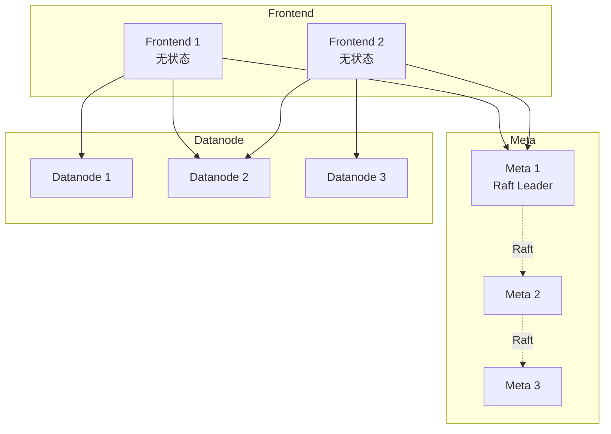
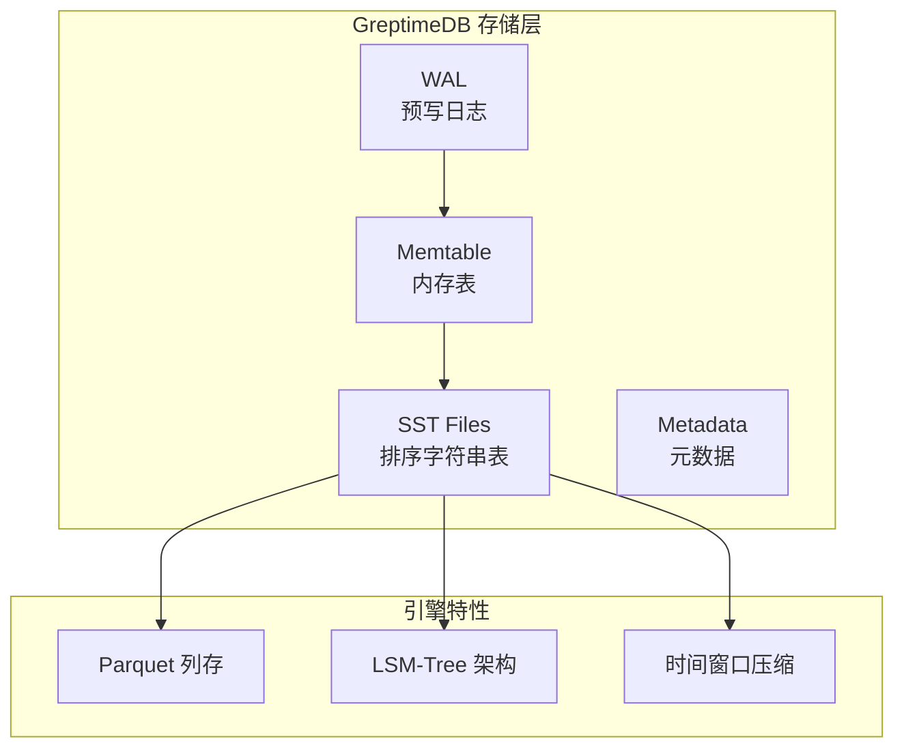

# GreptimeDB 架构设计

## 学习目标

- 理解 GreptimeDB 的分布式架构
- 掌握 GreptimeDB 的存储引擎设计

## 整体架构



## 存储引擎



## 表结构设计

```sql
-- 创建时序表
CREATE TABLE sensor_data (
    ts TIMESTAMP TIME INDEX,
    sensor_id STRING TAG,
    location STRING TAG,
    temperature DOUBLE,
    humidity DOUBLE,
    ts TIMESTAMP,
    PRIMARY KEY (sensor_id, location)
) WITH (
    'append_mode' = 'true',
    'ttl' = '7d'
);

-- 时间索引必须指定
-- Tags 会被索引
-- Fields 存储数据值
```

## 要点总结

- Frontend 无状态，水平扩展
- Datanode 基于 LSM-Tree 存储
- 支持 Parquet 列式存储
- 兼容多种协议（Prometheus/InfluxDB）