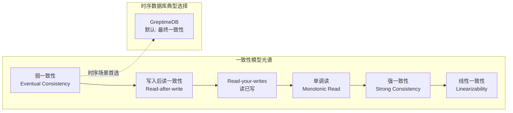
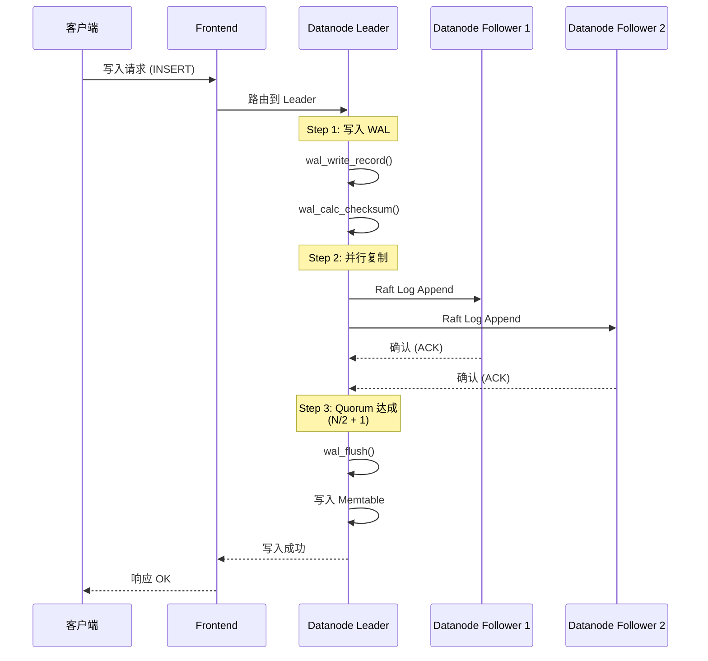
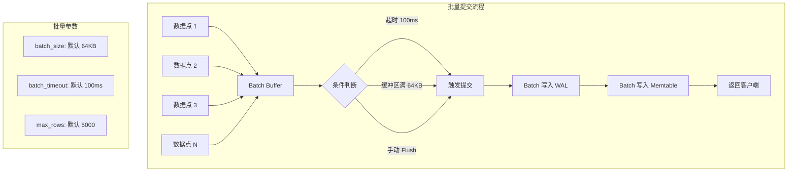
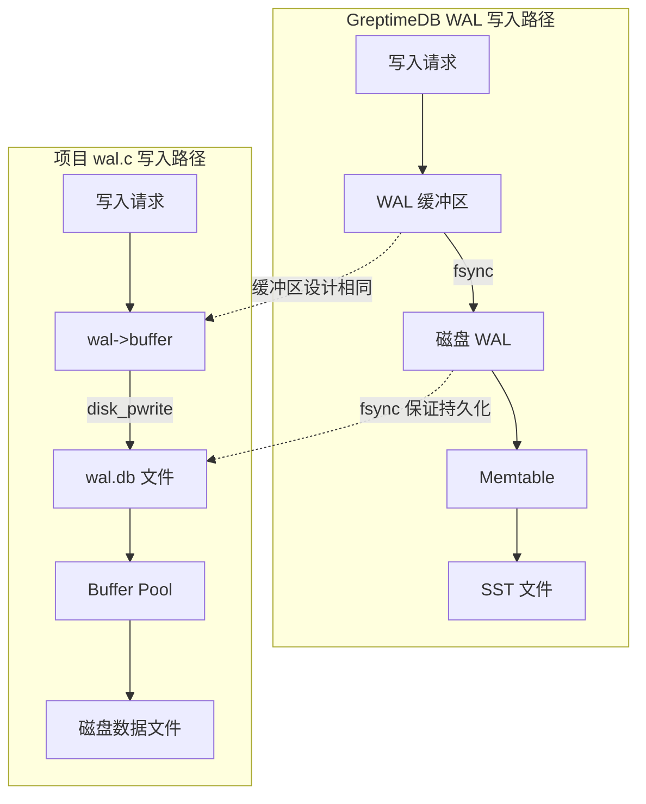
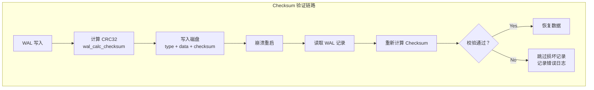
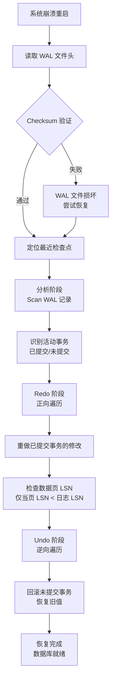
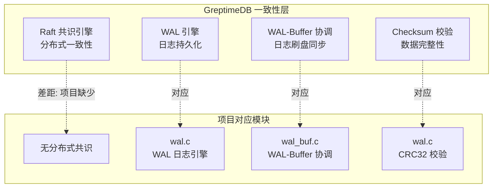

# GreptimeDB 事务与一致性模型

## 学习目标

- 理解时序数据库一致性模型与关系型数据库的差异
- 掌握 GreptimeDB 的写入一致性策略（quorum 写入、批量提交）
- 学习 GreptimeDB 的数据完整性保证机制（WAL、checksum）
- 对比项目 wal.c/wal_buf.c 模块，找出可借鉴的设计点

## 时序数据库的一致性挑战

时序数据库（TSDB）与关系数据库在一致性模型上有着本质差异。关系数据库追求 ACID 事务的强一致性，而时序数据库通常优先保证**可用性**和**写入性能**，在一致性上做出取舍。

### 时序数据库的典型场景

```
监控指标采集 ──→ 持续高吞吐写入 ──→ 写入 > 查询
告警数据上报 ──→ 单点写入，多点查询 ──→ 允许少量丢失
IoT 传感器数据 ──→ 海量设备并发 ──→ 时序有序，Batch 写入
```

这些场景的共同特征：
- **写入并发极高**：每秒数百万个数据点
- **数据天然有序**：时间戳自带排序属性
- **允许短暂的不一致**：最终一致性通常可接受
- **极少更新和删除**：时序数据以追加写为主

## 一致性模型概述



### 1. 弱一致性（Weak Consistency）

写入成功后，读取可能看不到最新数据。这是时序数据库的**默认选择**，因为：
- 写入链路经过 Frontend -> WAL -> Memtable 后即可返回，不等待数据落盘
- 副本之间的数据同步存在延迟

**适用场景**：
- 监控大盘（分钟级延迟可接受）
- 告警检测（阈值判断不依赖精确点值）
- IoT 趋势分析（聚合视图足够了）

### 2. 最终一致性（Eventual Consistency）

所有副本最终会收敛到一致状态，但无法保证收敛的时间上限。GreptimeDB 的 Datanode 之间通过 Raft 协议保证最终一致性。

**收敛条件**：
- 副本间网络正常
- Leader 持续处理写入
- Follower 追赶 Leader 进度

### 3. 强一致性（Strong Consistency）

每次读取都能看到之前所有写入的结果。GreptimeDB 通过以下方式支持强一致性：
- **读取 Leader**：所有读取请求路由到 Raft Leader
- **Quorum 读取**：读取多个副本，取最新版本
- **等待刷盘**：写入时等待 WAL 刷盘 + 确认

**代价**：写入延迟增加 2-3 倍，吞吐量下降 50% 以上。

## 写入一致性

### Quorum 写入

GreptimeDB 的分布式写入基于 Raft 共识协议，通过 quorum 机制平衡一致性与性能。



**Quorum 参数**：
- 副本数 N = 3（默认）
- 写入需确认数 W = 2（N/2 + 1）
- 读取需确认数 R = 1（允许 stale read）
- 写入延迟 = max(WAL 延迟, 副本确认延迟)

### 批量提交（Batch Commit）

时序数据库的写入特点是**高吞吐、小数据量**，GreptimeDB 通过批量提交优化写入性能。



**批量提交的优势**：
- 减少 Raft 共识次数（批量提交只触发一次共识）
- 减少 fsync 次数（合并刷盘）
- 提高网络吞吐（合并小包）

**与项目 wal.c 的对比**：

| 特性 | GreptimeDB | 项目 wal.c |
|------|-----------|-----------|
| 批量写入 | 支持，64KB 缓冲区 | 支持，1MB 缓冲区 |
| 刷盘触发 | 超时/满/手动 | 缓冲区满/关闭时 |
| Raft 集成 | 集成在写入路径 | 无 |
| 批量提交事务 | 支持，一组数据点 | 支持，逐记录写入 |

## 数据完整性保证

### WAL（Write-Ahead Logging）

GreptimeDB 的 WAL 机制与项目 wal.c 实现高度相似，都遵循"先写日志，再写数据"的核心原则。



**WAL 保证的三个维度**：

1. **持久性（Durability）**：事务提交后，WAL 日志必须刷到磁盘
2. **原子性（Atomicity）**：WAL 记录要么完整写入，要么完全不写
3. **恢复性（Recovery）**：崩溃后通过 WAL 重做/回滚

**GreptimeDB WAL 记录格式**：
```
┌────────────────────────────────────────────┐
│ Record Header (固定长度)                     │
│  - type: 日志类型 (BEGIN/INSERT/COMMIT/...) │
│  - lsn: 日志序列号                          │
│  - txn_id: 事务 ID                         │
│  - prev_lsn: 上一条日志 LSN                 │
│  - checksum: 记录校验和                     │
├────────────────────────────────────────────┤
│ Data                                       │
│  - key: 写入的键                            │
│  - value: 写入的值                          │
│  - timestamp: 时间戳                        │
└────────────────────────────────────────────┘
```

**项目 wal.c 的 WAL 记录格式**：
```
┌────────────────────────────────────────────┐
│ Record Header (24 bytes)                    │
│  - type: 1 byte     (日志类型)               │
│  - size: 3 bytes    (数据大小)               │
│  - lsn: 8 bytes     (日志序列号)              │
│  - txn_id: 4 bytes  (事务 ID)                │
│  - prev_lsn: 4 bytes(上一条日志 LSN)          │
│  - checksum: 4 bytes(校验和)                 │
├────────────────────────────────────────────┤
│ Data                                       │
│  - key_len: 4 bytes                        │
│  - key: key_len bytes                      │
│  - value_len: 4 bytes                      │
│  - value: value_len bytes                  │
└────────────────────────────────────────────┘
```

两者格式高度一致，均包含 `type`、`lsn`、`txn_id`、`prev_lsn`、`checksum` 字段，体现了相似的 WAL 设计理念。

### Checksum（校验和）

Checksum 是数据完整性的最后一道防线，用于检测磁盘损坏、数据变更等异常。



**GreptimeDB 的 Checksum 策略**：
- 每条 WAL 记录独立计算 checksum
- 使用 CRC32C（硬件加速友好的 CRC 变体）
- 读取时校验，校验失败则跳过该记录
- 文件头部也有 checksum 保护

**项目 wal.c 的 Checksum 实现**：
```c
// 计算校验和（简单 CRC32）
static uint32_t wal_calc_checksum(const void *data, size_t len) {
    const uint8_t *p = (const uint8_t *)data;
    uint32_t crc = 0xFFFFFFFF;

    for (size_t i = 0; i < len; i++) {
        crc ^= p[i];
        for (int j = 0; j < 8; j++) {
            if (crc & 1) {
                crc = (crc >> 1) ^ 0xEDB88320;
            } else {
                crc >>= 1;
            }
        }
    }

    return ~crc;
}
```

**对比**：

| 特性 | GreptimeDB | 项目 wal.c |
|------|-----------|-----------|
| 算法 | CRC32C（硬件加速） | CRC32（软件实现） |
| 粒度 | 每条记录 + 文件头 | 每条记录 + 文件头 |
| 校验时机 | 写入时计算，读取时验证 | 写入时计算，读取时验证 |
| 损坏处理 | 跳过损坏记录，继续恢复 | 同（跳过损坏记录） |
| 性能 | 硬件加速，开销低 | 软件循环，开销较高 |

### 崩溃恢复流程

GreptimeDB 的崩溃恢复流程与 ARIES 恢复算法一致，也对应项目 wal.c 的恢复设计。



**恢复的三种类型**：

| 类型 | 操作 | 条件 | 对应项目函数 |
|------|------|------|------------|
| Redo | 重做 INSERT/UPDATE | 已提交事务 | `wal_redo()` |
| Undo | 撤销 INSERT/UPDATE/DELETE | 未提交事务 | `wal_undo()` |
| 恢复点 | 从检查点开始 | 有检查点 | `wal_buf_get_recovery_lsn()` |

## 与项目 wal.c/wal_buf.c 模块的关联

### 模块对应关系



### 架构对比

| 维度 | GreptimeDB | 项目 wal.c/wal_buf.c | 差异分析 |
|------|-----------|---------------------|----------|
| 一致性模型 | 最终一致性 + 可选强一致 | 单机强一致性 | 项目无分布式，天然强一致 |
| 共识协议 | Raft（分布式） | 无（单机） | 分布式场景的差距 |
| WAL 核心 | 日志持久化 | 日志持久化 | 功能相同 |
| 缓冲区管理 | 批量写入 + 超时刷盘 | 缓冲区满/关闭时刷盘 | GreptimeDB 更灵活 |
| 校验和 | CRC32C（硬件加速） | CRC32（软件实现） | 性能差距 |
| 检查点 | 周期性 + 手动 | 周期性 + 手动 | 功能相同 |
| 恢复算法 | ARIES（Redo + Undo） | ARIES（Redo + Undo） | 算法一致 |
| 脏页管理 | WAL-Buffer 协调 | wal_buf.c 协调 | 设计一致 |

### 可借鉴的设计点

1. **超时刷盘机制**：wal.c 仅在缓冲区满时刷盘，可以借鉴 GreptimeDB 增加超时刷盘（如 100ms 超时），避免长时间未刷盘导致数据丢失风险。

2. **CRC32C 硬件加速**：在支持 SSE4.2 的 CPU 上，CRC32C 的吞吐量是软件 CRC32 的 5-10 倍。项目可以考虑在 x86 平台使用 `_mm_crc32_u32` 指令。

3. **Raft 集成预留**：虽然项目当前是单机架构，但 wal_buf.c 的接口设计已经预留了分布式扩展的可能性（`txn_id`、`lsn` 等字段），这一点与 GreptimeDB 的 WAL 设计思路一致。

4. **批量提交优化**：GreptimeDB 的 batch_commit 机制可以降低 fsync 频率，项目 wal.c 的缓冲区（1MB）已经较大，可以考虑增加超时触发刷盘。

## 要点总结

1. **一致性取舍**：时序数据库通常选择最终一致性，优先保证可用性和写入性能。GreptimeDB 通过 Raft 共识协议支持 quorum 写入，在一致性和性能之间取得平衡。

2. **写入一致性链**：客户端 -> Frontend 路由 -> Raft Leader -> WAL 写入 -> 副本同步 -> Quorum 确认 -> Memtable 写入 -> 响应返回。每一步都包含一致性和性能的权衡。

3. **数据完整性**：WAL + Checksum 是数据完整性的双重保障。WAL 保证崩溃恢复能力，Checksum 检测数据损坏。项目 wal.c 实现了与 GreptimeDB 相同的设计原则。

4. **批量提交**：通过缓冲区合并写入，减少 fsync 和 Raft 共识次数，是时序数据库高吞吐写入的关键优化手段。

5. **与项目关联**：GreptimeDB 的 WAL 设计与项目 wal.c/wal_buf.c 高度相似（LSN 分配、缓冲区管理、CRC 校验、ARIES 恢复），差异主要体现在分布式共识和硬件加速方面。

## 思考题

1. GreptimeDB 的 quorum 写入（W=2, R=1）在什么情况下会出现读取到旧数据的情况？如何解决？
2. 如果项目 wal.c 要支持分布式场景，需要在哪些方面改造？（提示：LSN 分配、副本同步、一致性协议）
3. CRC32 和 CRC32C 的性能差异有多大？在 x86 平台上如何利用硬件加速指令？
4. GreptimeDB 的批量提交策略（64KB 或 100ms）是否适用于项目 ts_engine 的写入场景？为什么？
5. 在时序数据库中，为什么"读取时校验 checksum"比"全量校验"更加实用？考虑一下恢复场景下的性能影响。