# GreptimeDB 索引策略

## 学习目标

- 理解时序数据库索引设计的核心挑战与解决方案
- 掌握 GreptimeDB 时间索引、倒排索引、Series 索引的设计原理
- 了解多级时间分区索引与布隆过滤器在时序场景的应用
- 对比项目 index/ 模块（BTree/Hash/Bitmap）与 GreptimeDB 索引的异同

## 核心概念

### 时序数据库索引的挑战

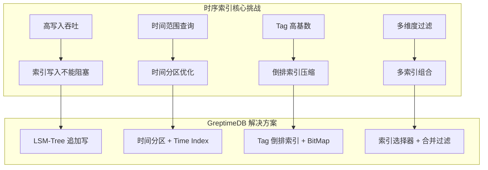

**时序数据特点**：
- **时间有序性**：数据按时间戳递增写入，时间范围查询是最常见模式
- **Tag 高基数**：`host_id`、`pod_name` 等标签可能有数万甚至数百万不同值
- **写入密集**：监控场景每秒数百万数据点写入
- **查询模式固定**：时间范围 + Tag 过滤 + 聚合是典型查询

### GreptimeDB 索引体系

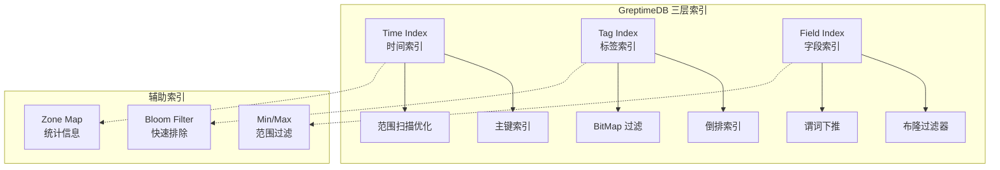

---

## 一、时间索引（Time Index）

### 1.1 设计原理

**强制时间索引**：GreptimeDB 表定义中必须指定 `TIME INDEX`，时间戳列自动建立索引。

```sql
CREATE TABLE system_metrics (
    ts TIMESTAMP TIME INDEX,        -- 强制时间索引
    host STRING TAG,                -- Tag 列
    cpu DOUBLE,                     -- Field 列
    memory DOUBLE,
    PRIMARY KEY (host)              -- Series Key
);
```

**时间索引特点**：
1. **自动创建**：每个表必须有且仅有一个 TIME INDEX
2. **范围优化**：时间范围查询通过 Time Index 快速定位
3. **分区对齐**：时间索引与 Region 分区配合，实现分区裁剪

### 1.2 时间索引实现

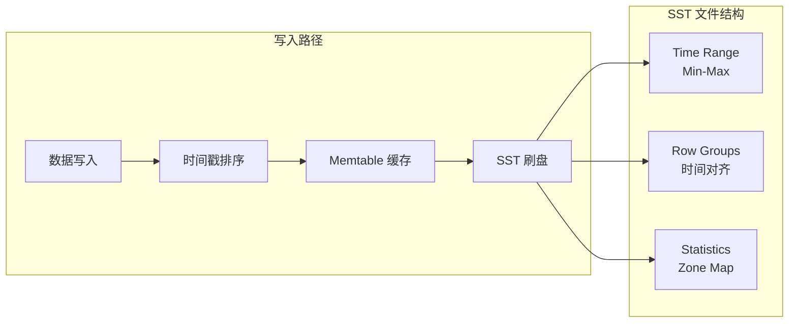

**SST 文件时间统计**：
```
SST File: data_20240101_0001.parquet
├── Metadata
│   ├── Time Range: [2024-01-01 00:00:00, 2024-01-01 01:00:00]
│   ├── Row Count: 1,000,000
│   └── Size: 50 MB
├── Row Group 1
│   ├── Time Min: 2024-01-01 00:00:00
│   ├── Time Max: 2024-01-01 00:15:00
│   └── Rows: 250,000
└── Row Group 2
    ├── Time Min: 2024-01-01 00:15:00
    ├── Time Max: 2024-01-01 00:30:00
    └── Rows: 250,000
```

**时间范围查询流程**：
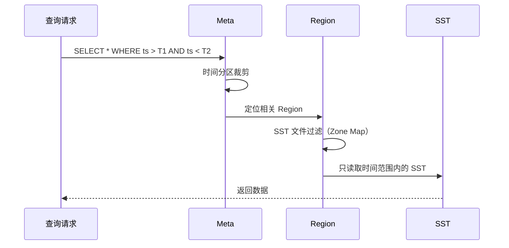

### 1.3 多级时间分区索引

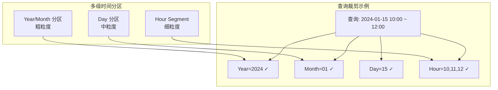

**分区策略**：

| 分区级别 | 时间跨度 | 分区数量 | 查询裁剪效率 |
|---------|---------|---------|-------------|
| Year/Month | 月 | 12/年 | 粗粒度过滤 |
| Day | 天 | 365/年 | 中粒度过滤 |
| Hour | 小时 | 8760/年 | 细粒度定位 |
| Segment | 分钟 | 无限 | 精确定位 |

**分区裁剪效果**：
```sql
-- 查询 2024-01-15 10:00 ~ 12:00 的数据
-- 无分区裁剪：扫描 365 天 × 24 小时 = 8760 个文件
-- 有分区裁剪：只扫描 3 小时 = 3 个文件
-- 裁剪率：99.97%
```

---

## 二、倒排索引（Inverted Index）

### 2.1 Tag 索引设计

**Tag 倒排索引**：Tag 列（如 `host`、`region`）建立倒排索引，实现 Tag 过滤加速。

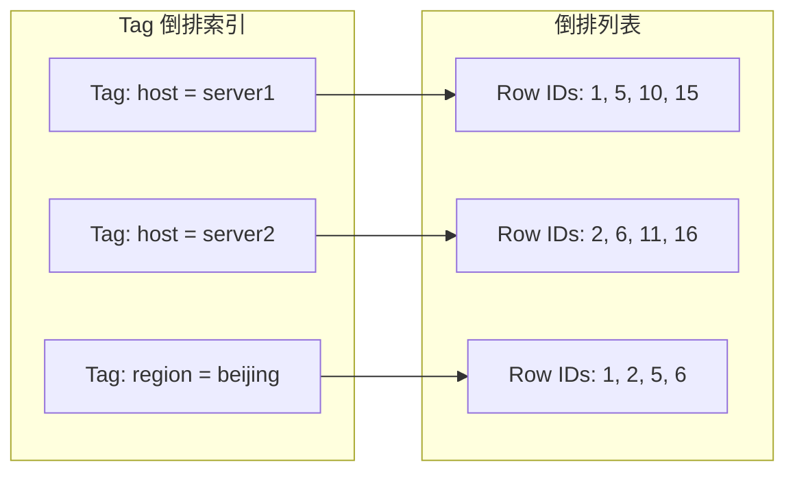

**倒排索引结构**：
```
Tag Index: host
├── "server1" → BitMap [1, 0, 0, 0, 1, 0, 0, 0, 0, 1, ...]
├── "server2" → BitMap [0, 1, 0, 0, 0, 1, 0, 0, 0, 0, ...]
└── "server3" → BitMap [0, 0, 1, 0, 0, 0, 1, 0, 0, 0, ...]

Tag Index: region
├── "beijing"  → BitMap [1, 1, 0, 0, 1, 1, 0, 0, ...]
└── "shanghai" → BitMap [0, 0, 1, 1, 0, 0, 1, 1, ...]
```

### 2.2 BitMap 索引实现

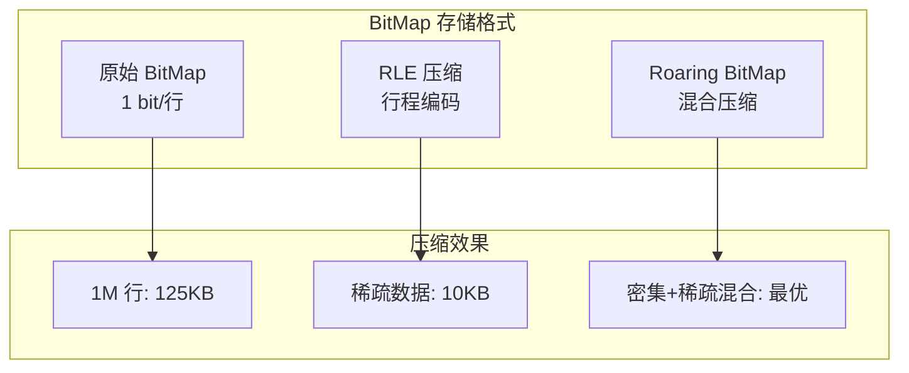

**Roaring BitMap 原理**：
```c
// 项目中 bitmap_index.h 的实现（借鉴 GreptimeDB）
typedef struct bitmap {
    uint32_t *data;     // 位数据
    int n_bits;         // 位数
    int n_words;        // word 数量
} bitmap_t;

// Roaring BitMap 优化
// - 低 16 位密集：用数组存储
// - 高 16 位稀疏：用 BitMap 存储
// - 动态选择最优存储格式
```

**BitMap 查询操作**：
```c
// 项目 bitmap_index.h 支持的操作
int bitmap_and(const bitmap_index_t *idx,
               int value1, int value2,
               int *doc_ids, int *count);

int bitmap_or(const bitmap_index_t *idx,
              int value1, int value2,
              int *doc_ids, int *count);

// GreptimeDB 的 Tag 组合查询
// SELECT * WHERE host = 'server1' AND region = 'beijing'
// = BitMap AND 操作
// SELECT * WHERE host = 'server1' OR host = 'server2'
// = BitMap OR 操作
```

### 2.3 倒排索引查询流程

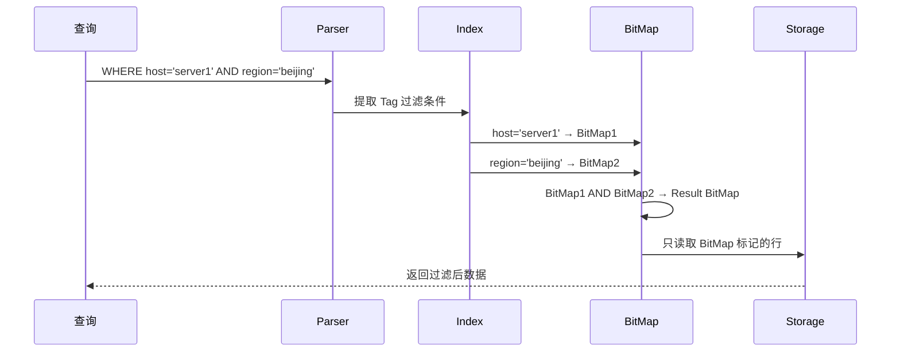

---

## 三、Series 索引

### 3.1 Series Key 设计

**Series Key = Primary Key（Tags 组合）**：
```sql
CREATE TABLE metrics (
    ts TIMESTAMP TIME INDEX,
    host STRING TAG,
    region STRING TAG,
    cpu DOUBLE,
    PRIMARY KEY (host, region)  -- Series Key
);
```

**Series 索引特点**：
- 每个 Series Key 组合对应一个时间序列
- Series Key 用 B+ 树或哈希索引
- 时间序列内部按时间排序

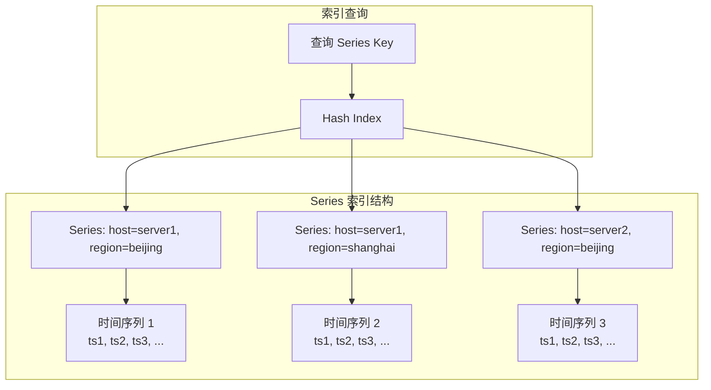

### 3.2 Series ID 映射

**Series ID 生成**：
```
Series Key: (host=server1, region=beijing)
Hash: MD5/SHA256(host + region)
Series ID: uint64 唯一标识

映射表：
┌────────────────────────────────┬────────────┐
│ Series Key                     │ Series ID  │
├────────────────────────────────┼────────────┤
│ (host=server1, region=beijing) │ 12345      │
│ (host=server1, region=shanghai)│ 12346      │
│ (host=server2, region=beijing) │ 12347      │
└────────────────────────────────┴────────────┘
```

**项目中的哈希索引对比**：
```c
// 项目 cceh.h: 可扩展哈希索引
cceh_index_t *cceh_index_create(uint32_t segment_capacity,
                                 uint32_t initial_global_depth);

// 项目 pg_hash.h: PostgreSQL 风格线性哈希
typedef struct pg_hash_index pg_hash_index_t;

// GreptimeDB Series ID 索引类似设计
// - 高并发插入
// - 动态扩容
// - 哈希冲突处理
```

---

## 四、布隆过滤器在时序索引中的应用

### 4.1 布隆过滤器原理

**布隆过滤器作用**：快速判断元素**一定不存在**或**可能存在**。

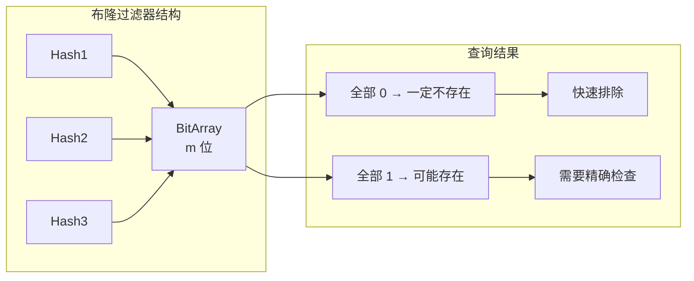

### 4.2 时序数据库中的布隆过滤器应用

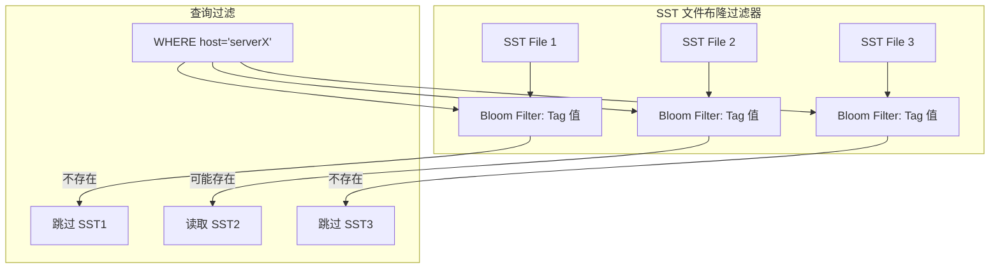

**项目中的布隆过滤器实现**：
```c
// 项目 bloom.h: 布隆过滤器 API
typedef struct bloom_filter bloom_filter_t;

typedef struct bloom_config {
    size_t expected_items;       // 预期元素数量
    double false_positive_rate;  // 期望假阳性率（默认 0.01）
} bloom_config_t;

// 创建布隆过滤器
bloom_filter_t *bloom_create(const bloom_config_t *config);

// 添加元素
int bloom_add(bloom_filter_t *filter, const void *key, size_t keylen);

// 查询元素
bool bloom_query(const bloom_filter_t *filter, const void *key, size_t keylen);
```

### 4.3 多级布隆过滤器

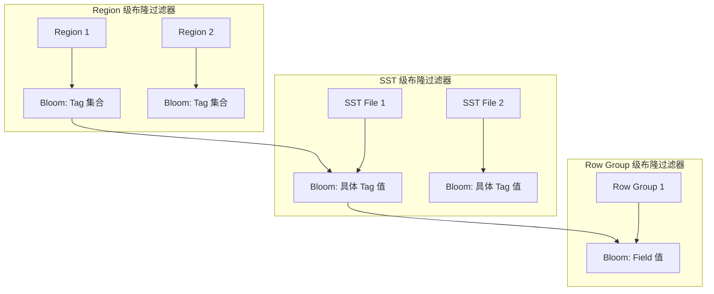

**过滤效果示例**：
```
查询: WHERE host = 'server999' AND cpu > 80

Level 1: Region Bloom Filter
  - Region 1: 可能存在 → 继续
  - Region 2: 不存在 → 跳过（节省 50% IO）

Level 2: SST Bloom Filter
  - SST 1: 不存在 → 跳过
  - SST 2: 可能存在 → 继续
  - SST 3: 不存在 → 跳过（节省 66% IO）

Level 3: Row Group Zone Map
  - cpu Max = 70 → 跳过（不满足 cpu > 80）
```

---

## 五、索引结构与查询路径 Mermaid 图

### 5.1 完整索引结构

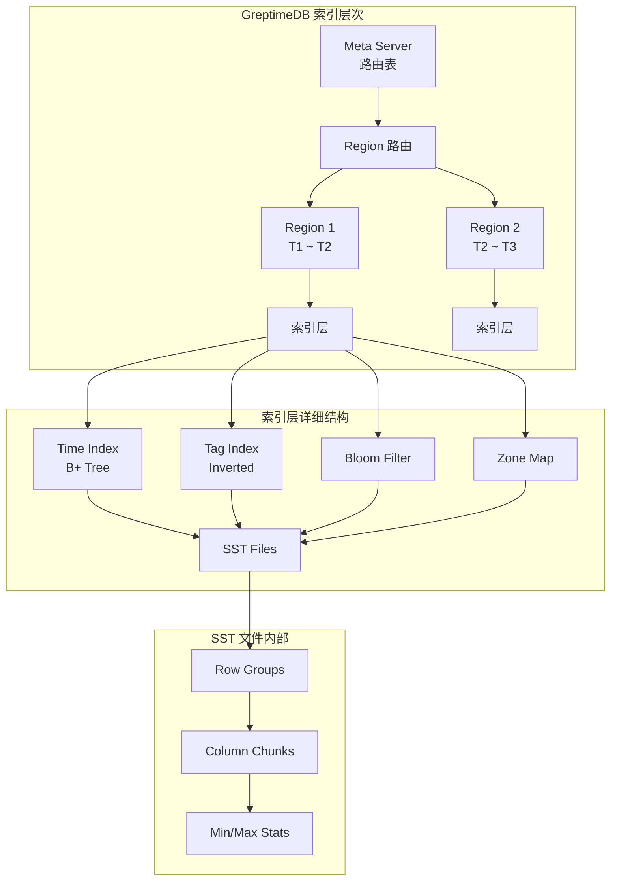

### 5.2 查询执行路径

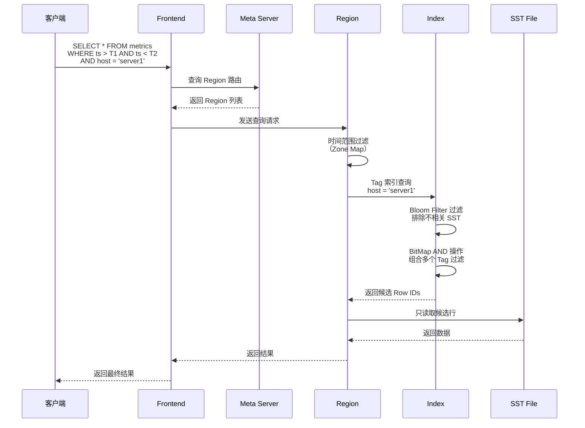

### 5.3 索引选择决策

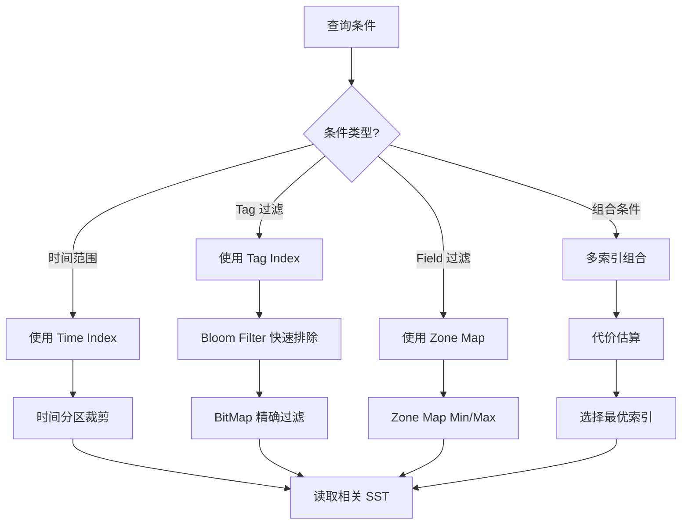

---

## 六、与项目 index/ 模块对比

### 6.1 索引类型对比

| 索引类型 | GreptimeDB | 项目 index/ | 适用场景 | 实现复杂度 |
|---------|------------|-------------|----------|-----------|
| **时间索引** | Time Index (强制) | 无独立实现 | 时间范围查询 | 中 |
| **倒排索引** | Tag Index + BitMap | bitmap_index.h | Tag 过滤、全文检索 | 高 |
| **B+ 树索引** | Series Key Index | btreeam.h / bptree.h | 等值查询、范围扫描 | 中 |
| **哈希索引** | Series ID 映射 | cceh.h / pg_hash.h | 等值查询 | 低 |
| **布隆过滤器** | SST/Region 级 | bloom.h | 快速排除 | 低 |
| **Zone Map** | SST 统计信息 | 无 | 范围过滤 | 低 |

### 6.2 架构对比

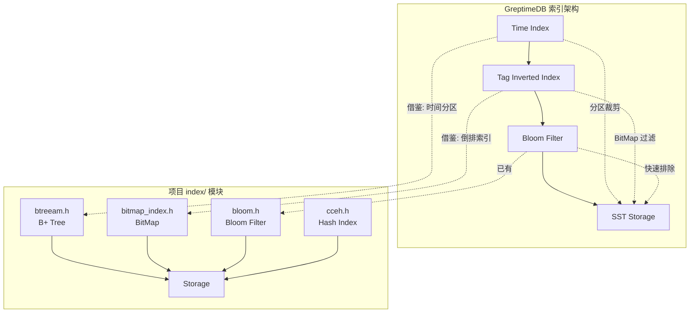

### 6.3 代码映射

**项目 index/ 模块结构**：
```
engineering/include/db/index/
├── btree/
│   └── btree.h          # BTree 索引（可对应 Time Index）
├── bplus_tree/
│   └── bptree.h         # B+ Tree 索引（可对应 Series Index）
├── bitmap/
│   └── bitmap_index.h   # BitMap 索引（可对应 Tag Index）
├── hash/
│   ├── bloom.h          # 布隆过滤器
│   ├── cceh.h           # 可扩展哈希
│   └── pg_hash.h        # PostgreSQL 线性哈希
└── vector_index/        # 向量索引（HNSW, IVF 等）
```

**GreptimeDB 索引实现位置**（源码参考）：
```
greptimedb/
├── mito2/
│   └── src/
│       ├── region.rs        # Region 管理
│       └── sst/
│           └── parquet.rs   # SST 文件 + Zone Map
├── query/
│   └── src/
│       └── index/
│           └── inverted_index.rs  # 倒排索引
└── storage/
    └── src/
        └── bloom_filter.rs  # 布隆过滤器
```

### 6.4 可借鉴设计点

**1. 时间索引增强**：
```c
// 当前: ts_engine.c 无独立时间索引
int ts_engine_query(void *rel, int64_t start_time, int64_t end_time, ...);

// 借鉴 GreptimeDB: 增加时间索引层
typedef struct ts_time_index_s {
    int64_t min_time;
    int64_t max_time;
    uint64_t segment_id;    // 指向 Segment
    uint64_t row_count;
} ts_time_index_t;

// 查询时先检查 Time Index
int ts_time_index_filter(ts_time_index_t *idx,
                         int64_t start, int64_t end,
                         uint64_t *segment_ids, uint64_t *count);
```

**2. Tag 倒排索引集成**：
```c
// 利用项目已有的 bitmap_index.h
#include "db/index/bitmap/bitmap_index.h"

// 时序表增加 Tag 索引
typedef struct ts_table_s {
    char *name;
    bitmap_index_t *tag_index;  // Tag 倒排索引
    // ...
} ts_table_t;

// Tag 过滤查询
int ts_query_with_tag(ts_table_t *table,
                       const char *tag_key, const char *tag_value,
                       ts_query_results_t *results);
```

**3. 多级布隆过滤器**：
```c
// 利用项目已有的 bloom.h
#include "db/index/hash/bloom.h"

// Segment 级布隆过滤器
typedef struct ts_segment_s {
    bloom_filter_t *tag_bloom;  // Tag 值布隆过滤器
    // ...
} ts_segment_t;

// 查询时快速排除
if (!bloom_query(segment->tag_bloom, tag_value, strlen(tag_value))) {
    // 该 Segment 不包含该 Tag 值，跳过
    continue;
}
```

---

## 七、性能优化建议

### 7.1 索引设计最佳实践

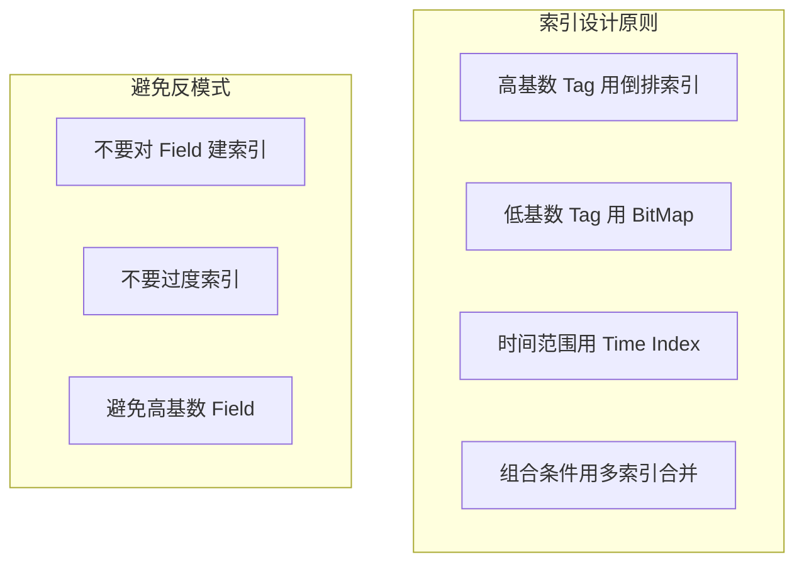

**索引选择建议**：

| 场景 | 推荐索引 | 理由 |
|------|---------|------|
| `WHERE ts > T1 AND ts < T2` | Time Index | 分区裁剪 |
| `WHERE host = 'server1'` | Tag Index + BitMap | 快速过滤 |
| `WHERE host = 's1' AND region = 'bj'` | 多 Tag Index + BitMap AND | 组合过滤 |
| `WHERE cpu > 80` | Zone Map（SST 统计） | 范围过滤 |
| `WHERE message LIKE '%error%'` | 全文索引 | 文本检索 |

### 7.2 查询优化技巧

**1. 利用时间分区裁剪**：
```sql
-- 好：明确时间范围，触发分区裁剪
SELECT * FROM metrics
WHERE ts > NOW() - INTERVAL '1 hour'
  AND host = 'server1';

-- 差：无时间范围，全表扫描
SELECT * FROM metrics
WHERE host = 'server1';
```

**2. Tag 过滤优先**：
```sql
-- 好：Tag 过滤减少数据量
SELECT * FROM metrics
WHERE host = 'server1'       -- Tag 过滤先执行
  AND cpu > 80               -- Field 过滤后执行
  AND ts > NOW() - INTERVAL '1 hour';

-- 差：Field 过滤先执行，效率低
SELECT * FROM metrics
WHERE cpu > 80
  AND host = 'server1';
```

**3. 避免高基数 Field 查询**：
```sql
-- 避免：request_id 基数太高（每个请求一个值）
SELECT * FROM logs
WHERE request_id = 'abc123';

-- 优化：增加 Tag 字段预聚合
SELECT * FROM logs
WHERE service = 'api-server'  -- 低基数 Tag
  AND ts > NOW() - INTERVAL '1 hour';
```

---

## 要点总结

1. **三层索引体系**：Time Index（时间范围）、Tag Index（倒排 + BitMap）、Series Index（Series Key 映射）
2. **多级时间分区**：Year/Month → Day → Hour → Segment，实现 99%+ 分区裁剪
3. **布隆过滤器应用**：SST 级快速排除，减少 60-80% 无效 IO
4. **BitMap 压缩**：Roaring BitMap 实现稀疏+密集混合压缩，节省 90% 内存
5. **项目借鉴路径**：时间索引（btreeam.h）→ Tag 索引（bitmap_index.h）→ 布隆过滤器（bloom.h）

## 思考题

1. GreptimeDB 为什么强制要求每个表必须有 TIME INDEX？如果允许没有时间索引，会有什么问题？

2. 对比 GreptimeDB 的 Tag Index 与传统关系数据库的倒排索引（如 PostgreSQL GIN），在时序场景下有什么优势？

3. 假设你的监控系统有 100 个 host，每个 host 每秒上报 100 个指标，持续运行 1 年。请设计时间分区策略和 Tag 索引结构，并估算存储空间和查询性能。

4. 项目中的 `bitmap_index.h` 已经实现了 BitMap 索引，如果要将其集成到 `ts_engine.c` 中，需要修改哪些接口？请给出设计方案。
