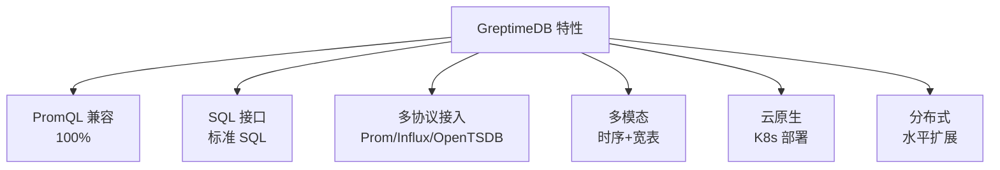

# GreptimeDB 关键特性

## 特性总览



## PromQL 兼容

```promql
-- 基础查询
http_requests_total{job="api"}

-- 聚合
sum(rate(http_requests_total[5m])) by (job)

-- 函数
rate(http_requests_total[5m])
increase(cpu_usage[1h])
predict_linear(node_memory_MemAvailable_bytes[1h], 3600)
```

## SQL 接口

```sql
-- 创建表
CREATE TABLE monitor (
    ts TIMESTAMP TIME INDEX,
    host STRING TAG,
    cpu DOUBLE,
    memory DOUBLE
) WITH (
    'append_mode' = 'true',
    'ttl' = '7d'
);

-- 范围查询
SELECT
    ts,
    host,
    avg(cpu) OVER (
        PARTITION BY host
        ORDER BY ts
        RANGE BETWEEN INTERVAL '5 minute' PRECEDING AND CURRENT ROW
    ) AS avg_cpu_5m
FROM monitor
WHERE ts > NOW() - INTERVAL '1 hour';
```

## 要点总结

- PromQL 100% 兼容
- SQL + PromQL 双接口
- 多协议统一存储
- 云原生 Kubernetes 部署