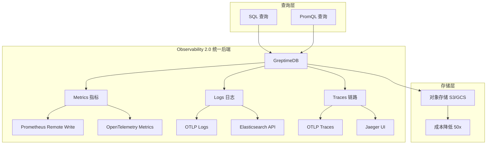
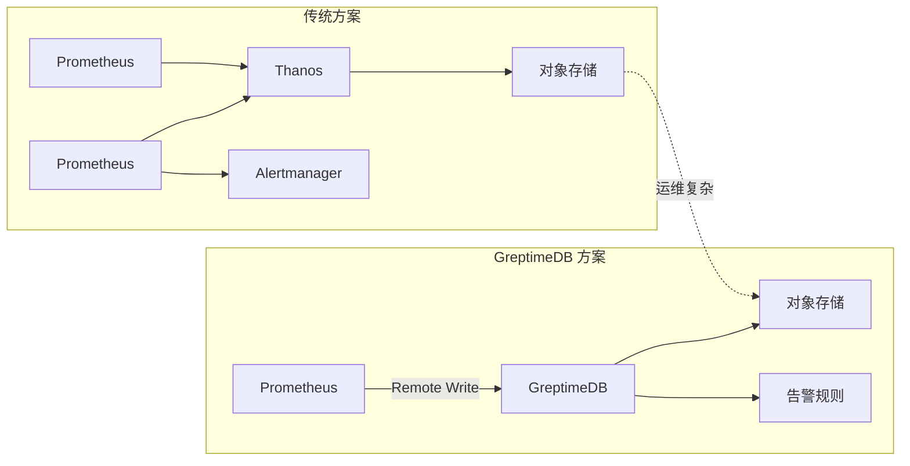
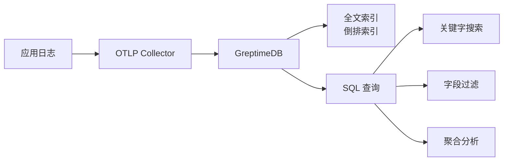
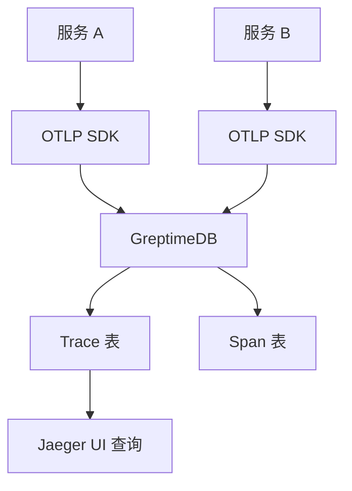
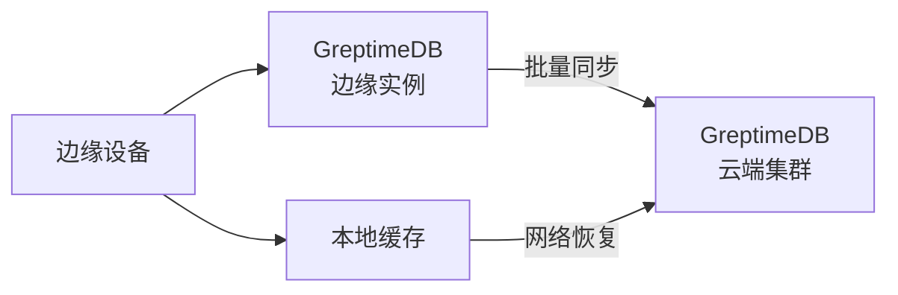
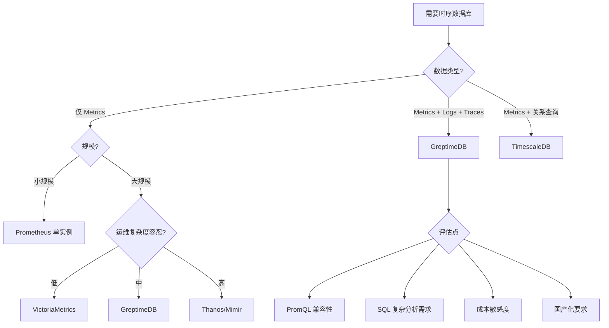

# GreptimeDB 使用场景与选型对比

## 学习目标

- 理解 GreptimeDB 在 Observability 2.0 架构中的核心定位
- 掌握监控告警、日志分析、链路追踪三大场景的具体应用
- 能够根据实际需求进行时序数据库选型决策

## 核心概念

- **Observability 2.0**：将 Metrics、Logs、Traces 统一为 Wide Events 模型，而非三套独立系统
- **Wide Events**：带时间戳的宽事件模型，每条记录包含时间戳、标签和字段
- **计算存储分离**：无状态 Frontend 可水平扩展，Datanode 独立扩展

## GreptimeDB 适用场景



### 场景 1：监控系统替代 Prometheus + Thanos/Mimir



**核心优势**：
- 无需 Thanos/Mimir 多组件运维
- 原生对象存储，无需额外配置
- PromQL 100% 兼容，Grafana 无缝对接
- 高基数（High Cardinality）场景支持更好

```sql
-- 创建指标表
CREATE TABLE system_metrics (
    ts TIMESTAMP TIME INDEX,
    host STRING TAG,
    cpu_usage DOUBLE,
    memory_usage DOUBLE,
    disk_io DOUBLE
) WITH (
    'append_mode' = 'true',
    'ttl' = '30d'
);

-- 范围查询 + 聚合
SELECT
    time_bucket('5m', ts) AS bucket,
    host,
    avg(cpu_usage) AS avg_cpu,
    max(cpu_usage) AS max_cpu
FROM system_metrics
WHERE ts > NOW() - INTERVAL '1 hour'
GROUP BY bucket, host
ORDER BY bucket DESC;
```

### 场景 2：日志存储替代 Elasticsearch/Loki



**核心优势**：
- 统一存储：日志和指标在同一库，可 JOIN 分析
- 低成本：对象存储 + 列式压缩，比 ES 低 60%
- 高性能：Rust 实现，列式扫描 + 索引加速

```sql
-- 日志表设计
CREATE TABLE app_logs (
    ts TIMESTAMP TIME INDEX,
    service STRING TAG,
    level STRING TAG,
    message STRING FULLTEXT,
    trace_id STRING,
    duration_ms INT
) WITH (
    'append_mode' = 'true',
    'ttl' = '7d'
);

-- 全文搜索 + 时间范围
SELECT ts, service, message
FROM app_logs
WHERE MATCH_ANY(message) AGAINST ('error timeout')
  AND ts > NOW() - INTERVAL '1 hour'
ORDER BY ts DESC
LIMIT 100;

-- 关联指标分析
SELECT 
    l.service,
    COUNT(*) AS error_count,
    avg(m.cpu_usage) AS avg_cpu
FROM app_logs l
JOIN system_metrics m 
  ON l.host = m.host 
  AND time_bucket('1m', l.ts) = time_bucket('1m', m.ts)
WHERE l.level = 'ERROR'
  AND l.ts > NOW() - INTERVAL '1 hour'
GROUP BY l.service;
```

### 场景 3：链路追踪替代 Jaeger + Tempo



```sql
-- Trace 表设计
CREATE TABLE traces (
    trace_id STRING,
    span_id STRING,
    parent_span_id STRING,
    ts TIMESTAMP TIME INDEX,
    service STRING TAG,
    operation STRING,
    duration_ns INT64,
    status_code INT
) WITH (
    'append_mode' = 'true',
    'ttl' = '3d'
);

-- 慢 Trace 分析
SELECT 
    trace_id,
    service,
    operation,
    duration_ns / 1000000 AS duration_ms
FROM traces
WHERE parent_span_id = ''  -- 根 Span
  AND duration_ns > 100000000  -- > 100ms
  AND ts > NOW() - INTERVAL '1 hour'
ORDER BY duration_ns DESC
LIMIT 20;
```

### 场景 4：IoT 传感器数据采集



```sql
-- IoT 表设计
CREATE TABLE sensor_readings (
    ts TIMESTAMP TIME INDEX,
    device_id STRING TAG,
    location STRING TAG,
    temperature DOUBLE,
    humidity DOUBLE,
    pressure DOUBLE
) WITH (
    'append_mode' = 'true',
    'ttl' = '90d'
);

-- 降采样聚合
SELECT 
    time_bucket('1h', ts) AS hour,
    device_id,
    avg(temperature) AS avg_temp,
    min(temperature) AS min_temp,
    max(temperature) AS max_temp,
    count(*) AS readings
FROM sensor_readings
WHERE ts > NOW() - INTERVAL '24 hour'
GROUP BY hour, device_id;
```

## 时序数据库对比

### 功能对比

| 特性 | GreptimeDB | Prometheus/Thanos | VictoriaMetrics | Elasticsearch | TimescaleDB |
|------|------------|-------------------|-----------------|---------------|-------------|
| 数据模型 | Metrics + Logs + Traces | Metrics only | Metrics only | Logs + Traces | 时序 + 关系 |
| 查询语言 | SQL + PromQL | PromQL | PromQL + MetricsQL | Query DSL | SQL |
| 存储架构 | 对象存储优先 | 本地 + 对象存储 | 自研存储 | 本地磁盘 | PostgreSQL |
| 分布式 | 原生云原生 | Thanos 组件 | 单实例为主 | 分片架构 | 超表分区 |
| 开源协议 | Apache 2.0 | Apache 2.0 | Apache 2.0 | SSPL | Apache/TSL |
| 语言 | Rust | Go | Go | Java | C |

### 性能对比

| 场景 | GreptimeDB | VictoriaMetrics | TimescaleDB |
|------|------------|-----------------|-------------|
| 写入吞吐 | 高 | 极高 | 中 |
| 范围查询 | 快 | 快 | 快 |
| 高基数支持 | 优秀 | 良好 | 一般 |
| 压缩比 | 10x | 10x | 40-90% |
| 对象存储 | 原生 | 原生 | 需配置 |

### 选型决策流程



### 选型建议矩阵

| 场景特征 | 推荐方案 | 理由 |
|---------|---------|------|
| Prometheus 迁移 + 成本敏感 | GreptimeDB | PromQL 100% 兼容，对象存储降本 |
| 已有 PostgreSQL 技术栈 | TimescaleDB | 无需引入新组件 |
| 单实例极高吞吐 | VictoriaMetrics | 性能最优 |
| 日志分析 + 全文检索 | GreptimeDB / ES | 统一存储 / 成熟生态 |
| 国产化 + 云原生 | GreptimeDB | Apache 2.0，国产开源 |

## 要点总结

1. **GreptimeDB 核心定位**：Observability 2.0 统一后端，替代 Prometheus + Loki + Elasticsearch 三件套
2. **三大场景**：监控指标（PromQL 兼容）、日志存储（全文索引）、链路追踪（Jaeger 集成）
3. **选型关键**：数据类型统一性、查询复杂度、成本敏感度、运维复杂度
4. **成本优势**：对象存储原生支持，相比 Elasticsearch 可降低 60% 存储成本

## 思考题

1. GreptimeDB 的 Observability 2.0 架构与传统三件套（Prometheus + Loki + Jaeger）相比，各有什么优劣势？
2. 如果你的监控系统已经有 Prometheus + Thanos，迁移到 GreptimeDB 的成本和风险如何评估？
3. GreptimeDB 的 SQL + PromQL 双查询接口，在什么场景下应该优先使用 SQL？
4. 对比 GreptimeDB 与 VictoriaMetrics 在高基数场景下的性能差异，可能的原因是什么？