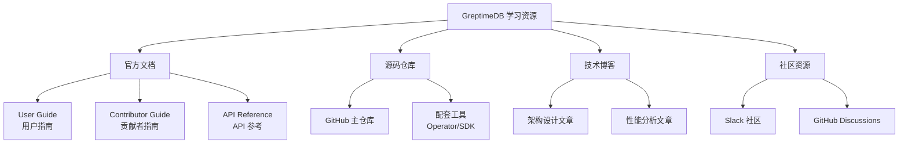
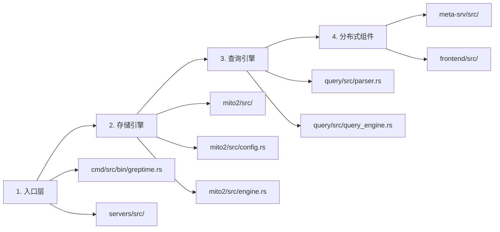
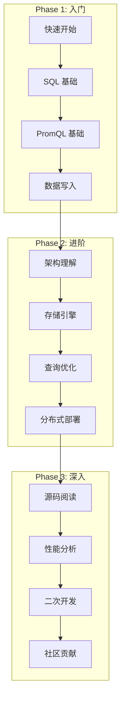

# GreptimeDB 学习资源

## 学习目标

- 掌握 GreptimeDB 官方文档的使用方法
- 建立从入门到深入的源码阅读路径
- 了解 GreptimeDB 的设计论文和核心算法

## 官方资源



## 官方文档链接

| 资源 | 链接 | 说明 |
|------|------|------|
| 官方文档 | [docs.greptime.com](https://docs.greptime.com/) | 完整用户指南 + API 参考 |
| GitHub | [GreptimeTeam/greptimedb](https://github.com/GreptimeTeam/greptimedb) | 源码仓库，约 5k+ Stars |
| API 文档 | [greptimedb.rs](https://greptimedb.rs/) | Rust API 文档 |
| 博客 | [greptime.com/blogs](https://greptime.com/blogs/) | 技术博客和用户案例 |
| Slack | [greptime.com/slack](https://greptime.com/slack) | 社区讨论 |

## 源码研读路径

### 核心目录结构

```
greptimedb/
├── src/
│   ├── api/              # gRPC API 定义
│   ├── catalog/          # 元数据管理
│   ├── client/           # 客户端 SDK
│   ├── cmd/              # 命令行入口
│   ├── common/           # 公共库
│   ├── datanode/         # 数据节点
│   ├── frontend/         # 前端节点
│   ├── meta-srv/         # 元数据服务
│   ├── mito2/            # 核心存储引擎 ⭐
│   ├── query/            # 查询引擎
│   ├── servers/          # 协议服务器
│   └── sql/              # SQL 解析
├── config/               # 配置文件示例
├── tests/                # 集成测试
└── docs/                 # RFC 设计文档
```

### 源码阅读顺序



### 重点模块详解

#### 1. 存储引擎 mito2

```rust
// mito2/src/config.rs - 存储配置
pub struct MitoConfig {
    pub wal_dir: String,           // WAL 目录
    pub s3_bucket: Option<String>, // S3 存储桶
    pub memtable_size: usize,      // Memtable 大小
    pub cache_size: usize,         // 缓存大小
}

// mito2/src/engine.rs - 引擎核心
pub struct MitoEngine {
    memtable: Memtable,            // 内存表
    sst_writer: SstWriter,         // SST 写入器
    compactor: Compactor,          // 压缩器
}
```

**阅读重点**：
- `mito2/src/engine.rs`：引擎初始化和核心接口
- `mito2/src/sst/`：SST 文件格式和 Parquet 写入
- `mito2/src/memtable/`：Memtable 实现（跳表/LSM）
- `mito2/src/compaction/`：Compaction 策略

#### 2. 查询引擎

```rust
// query/src/query_engine.rs
pub struct QueryEngine {
    catalog_manager: Arc<dyn CatalogManager>,
    state: Arc<QueryEngineState>,
}

// query/src/parser.rs - SQL/ PromQL 解析
pub fn parse_sql(sql: &str) -> Result<Statement>
pub fn parse_promql(query: &str) -> Result<PromExpr>
```

**阅读重点**：
- `query/src/parser.rs`：SQL 和 PromQL 解析
- `query/src/query_engine.rs`：查询执行
- DataFusion 集成（Arrow 内存模型）

#### 3. 分布式组件

```rust
// meta-srv/src/metasrv.rs - 元数据服务
pub struct Metasrv {
    kv_backend: Arc<dyn KvBackend>,
    procedure_manager: ProcedureManager,
}

// frontend/src/instance/ - 前端实例
pub struct FrontendInstance {
    meta_client: MetaClient,
    datanode_clients: DatanodeClients,
}
```

**阅读重点**：
- `meta-srv/src/metasrv.rs`：元数据服务核心
- `frontend/src/instance/`：查询路由和分布式执行
- Region 分片策略

## 学习路径规划



### 阶段 1：入门（1-2 周）

1. **快速开始**
   ```bash
   docker run -p 4000-4003:4000-4003 greptime/greptimedb:latest standalone start
   ```
   - 完成官方 Quick Start
   - 使用 MySQL 客户端连接（端口 4002）

2. **SQL 基础**
   - 创建时序表（TIME INDEX）
   - 数据插入和查询
   - 窗口聚合（time_bucket）

3. **PromQL 基础**
   - 通过 HTTP API 执行 PromQL
   - rate/increase/histogram 函数
   - Grafana 集成

### 阶段 2：进阶（2-4 周）

1. **架构理解**
   - 阅读 [architecture doc](https://docs.greptime.com/contributor-guide/overview/#architecture)
   - 理解 Frontend/Datanode/Metasrv 三组件
   - Region 分片机制

2. **存储引擎**
   - LSM-Tree 架构（WAL → Memtable → SST）
   - Parquet 列式存储
   - Compaction 策略

3. **查询优化**
   - 索引使用（Tag 索引、全文索引）
   - 查询计划分析
   - 并行扫描

### 阶段 3：深入（持续）

1. **源码阅读**
   - 从 `cmd/src/bin/greptime.rs` 入口开始
   - 跟踪一次完整写入流程
   - 跟踪一次查询执行

2. **RFC 设计文档**
   - `docs/rfcs/` 目录下的设计文档
   - 重点：metric-engine, distributed-planner, procedure-framework

## 相关论文与参考资料

### 时序数据库论文

| 论文 | 说明 | 链接 |
|------|------|------|
| Gorilla: A Fast, Scalable, In-Memory Time Series Database | Facebook 时序压缩算法 | VLDB 2015 |
| BTrDB: Optimizing Storage System Design for Timeseries Databases | 时序存储优化 | USENIX 2016 |
| TimescaleDB: Making SQL Scale for Time-Series Data | 超表分区设计 | SIGMOD 2022 |

### LSM-Tree 相关

| 论文 | 说明 |
|------|------|
| The Log-Structured Merge-Tree (LSM-Tree) | LSM-Tree 原始论文 |
| WiscKey: Separating Keys from Values in SSD-Conscious Storage | KV 分离优化 |
| Monkey: Optimal Navigable Key-Store | LSM 优化理论 |

### GreptimeDB 设计文档

```
docs/rfcs/
├── 2023-07-10-metric-engine.md     # 指标引擎设计
├── 2023-05-09-distributed-planner.md # 分布式查询规划
├── 2023-01-03-procedure-framework.md # 过程框架
├── 2023-02-01-table-compaction.md   # 表压缩策略
└── 2022-12-20-promql-in-rust/       # PromQL Rust 实现
```

## 配套工具与生态

### SDK 和客户端

| 语言 | 仓库 | 说明 |
|------|------|------|
| Go | [greptimedb-ingester-go](https://github.com/GreptimeTeam/greptimedb-ingester-go) | gRPC 高速写入 |
| Java | [greptimedb-ingester-java](https://github.com/GreptimeTeam/greptimedb-ingester-java) | Java SDK |
| Python | 内置 HTTP API | RESTful 接口 |
| Rust | 内置 gRPC | 原生支持 |

### 运维工具

| 工具 | 说明 |
|------|------|
| GreptimeDB Operator | Kubernetes 部署 |
| Helm Charts | 快速部署模板 |
| Dashboard | Web 管理界面 |
| Grafana Data Source | 可视化插件 |

### 性能基准测试

```bash
# TSBS 基准测试
cd docs/benchmarks/tsbs
./run_benchmark.sh

# JSONBench 测试
cd docs/benchmarks/log
```

## 社区资源

- **Slack**：[greptime.com/slack](https://greptime.com/slack) — 中文社区支持
- **GitHub Discussions**：问题讨论和 RFC 提议
- **Twitter/X**：[@greptime](https://twitter.com/greptime)
- **LinkedIn**：[Greptime](https://www.linkedin.com/company/greptime/)
- **YouTube**：技术分享视频

## 要点总结

1. **官方文档是首要资源**：docs.greptime.com 覆盖用户指南和 API 参考
2. **源码核心在 mito2**：存储引擎是理解 GreptimeDB 的关键
3. **RFC 文档理解设计决策**：docs/rfcs/ 记录了核心设计理念
4. **社区活跃**：Slack 中文支持，GitHub Issues 响应及时

## 思考题

1. GreptimeDB 的 mito2 存储引擎与传统 LSM-Tree（如 RocksDB）有什么区别？
2. 为什么 GreptimeDB 选择 Rust 作为实现语言？与其他 Go 实现的时序库（VictoriaMetrics）相比有什么优劣？
3. 阅读 `mito2/src/engine.rs`，理解一次写入从 WAL 到 SST 的完整流程
4. DataFusion 查询引擎如何与 GreptimeDB 的存储层集成？