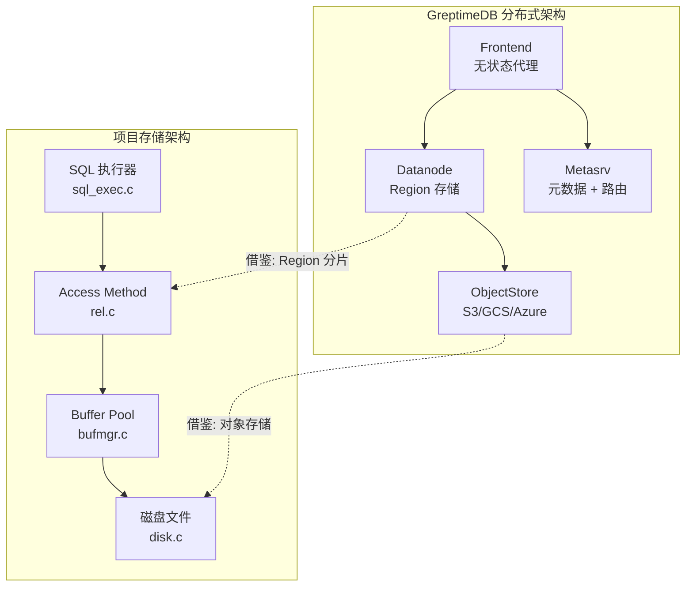
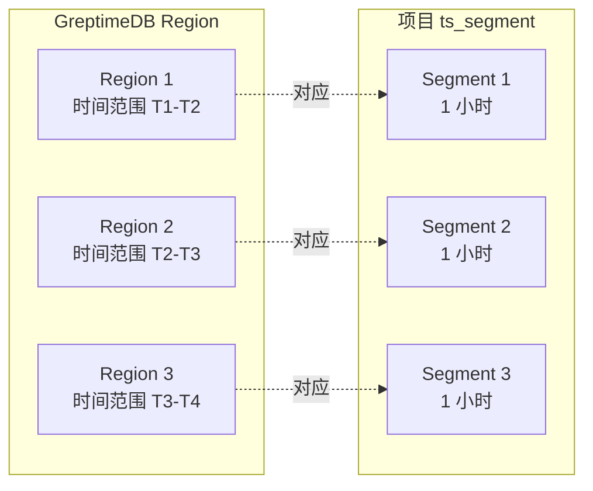
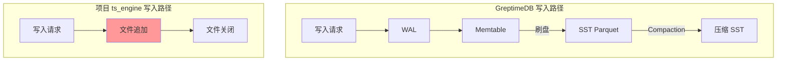
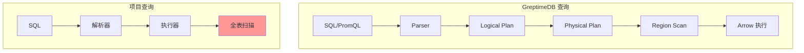
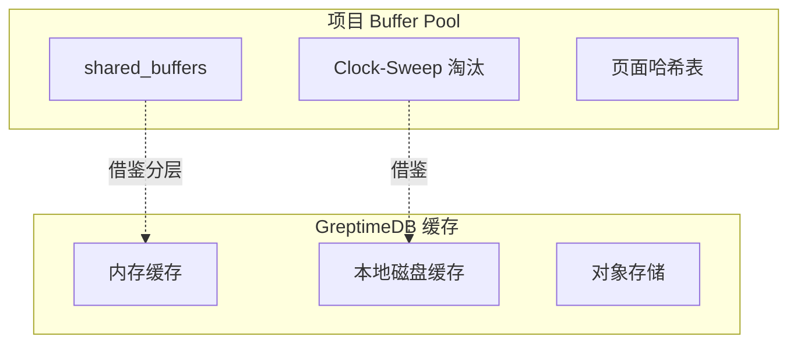
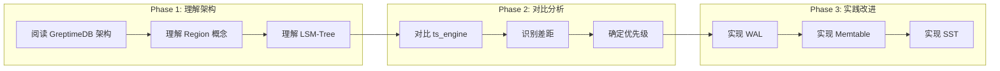

# GreptimeDB 与项目关联

## 学习目标

- 理解 GreptimeDB 架构对项目存储引擎的启发
- 找出项目中时序引擎（ts_engine）可借鉴的设计点
- 规划学习路径，将 GreptimeDB 设计理念应用到项目改进

## 架构对比



## 核心设计借鉴

### 1. 时序数据模型设计

| GreptimeDB 设计 | 项目对应 | 可借鉴点 |
|----------------|---------|----------|
| TIME INDEX 强制索引 | ts_engine.c 时间戳索引 | 时间分区对齐 |
| TAG 自动索引 | 项目 Tag 索引未实现 | Tag 倒排索引 |
| 列式存储（Parquet） | 项目行式存储 | 列式压缩优化 |
| SST + Memtable | 项目文件追加写 | Memtable 缓冲 |

**项目改进方向**：
```c
// 当前: ts_engine.c 简单文件追加
typedef struct ts_record_s {
    int64_t timestamp;
    double value;
} ts_record_t;

// 借鉴 GreptimeDB: 增加 Tag 索引
typedef struct ts_record_v2_s {
    int64_t timestamp;      // TIME INDEX
    char **tags;            // Tag 值数组
    int num_tags;           // Tag 数量
    double *fields;         // Field 值数组
    int num_fields;         // Field 数量
} ts_record_v2_t;

// 倒排索引结构
typedef struct ts_tag_index_s {
    char *tag_key;
    char *tag_value;
    uint64_t *record_ids;   // 记录 ID 列表
    uint64_t count;
} ts_tag_index_t;
```

### 2. 时间分区与 Segment 管理



**当前实现（ts_segment.c）**：
```c
// 项目已实现时间分段
typedef struct ts_segment_s {
    char path[512];
    int64_t start_time;
    int64_t end_time;
    uint32_t max_points;
    uint32_t num_points;
} ts_segment_t;

// 分段查询
int ts_segment_query(ts_segment_index_t *idx,
                     int64_t start_time, int64_t end_time,
                     ts_segment_results_t *results, uint32_t max_results);
```

**可借鉴 GreptimeDB Region 设计**：
- Region 级别的 Compaction 独立执行
- Region 元数据持久化（类似 manifest）
- Region 级别的 TTL 管理

### 3. 存储引擎架构对比

| 维度 | GreptimeDB | 项目 ts_engine | 差距分析 |
|------|------------|---------------|----------|
| WAL | 有（Raft Log） | 无 | 需要增加 |
| Memtable | 跳表 + 刷盘 | 无，直接写文件 | 性能瓶颈 |
| SST | Parquet 列式 | 原始二进制 | 压缩比差距 |
| Compaction | 后台异步 | 同步压缩 | 阻塞写入 |
| 缓存 | 分层缓存 | 无 | 读性能差距 |



**改进路径**：
```c
// Phase 1: 增加 WAL
int ts_wal_init(const char *path);
int ts_wal_append(ts_wal_t *wal, const void *data, size_t len);
int ts_wal_recover(ts_wal_t *wal);

// Phase 2: 增加 Memtable
typedef struct ts_memtable_s {
    ts_record_t *records;
    uint64_t capacity;
    uint64_t count;
    pthread_mutex_t lock;
} ts_memtable_t;

// Phase 3: SST 写入
int ts_flush_to_sst(ts_memtable_t *mem, const char *path);
int ts_compact_segments(ts_segment_index_t *idx);
```

### 4. 查询引擎对比



**GreptimeDB 的优势**：
- DataFusion 查询引擎（Arrow 内存模型）
- 向量化执行（SIMD）
- 查询下推到 Region

**项目可借鉴**：
```c
// 当前: 全文件扫描
int ts_engine_query(void *rel, int64_t start_time, int64_t end_time,
                    ts_granularity_t granularity, ts_aggregate_func_t func,
                    ts_query_results_t *results);

// 改进: 索引加速
int ts_query_with_index(void *rel, 
                         ts_query_spec_t *spec,  // 查询规格
                         ts_index_t *index,      // 索引
                         ts_query_results_t *results);

// 窗口聚合下推
int ts_window_aggregate_pushdown(void *rel,
                                  int64_t bucket_size,
                                  ts_aggregate_func_t func,
                                  ts_query_results_t *results);
```

## 与项目模块关联

### 关联 1：ts_engine 与 mito2

```
项目模块                          GreptimeDB 对应
├── ts_engine.c                   mito2/src/engine.rs
├── ts_compress.c                 mito2/src/compaction/
├── ts_segment.c                  mito2/src/region/
└── ts_retention.c                mito2/src/ttl/
```

**具体借鉴点**：
1. `ts_compress.c` → 学习 GreptimeDB 的 Delta-of-Delta 编码
2. `ts_segment.c` → 学习 Region 分片的元数据管理
3. `ts_retention.c` → 学习后台 TTL 清理任务

### 关联 2：Buffer Pool 与缓存



**改进思路**：
```c
// 分层缓存设计
typedef struct ts_cache_config_s {
    size_t memory_cache_size;    // 内存缓存大小
    size_t disk_cache_size;      // 磁盘缓存大小
    char disk_cache_dir[512];    // 磁盘缓存目录
} ts_cache_config_t;

// 缓存层级
typedef struct ts_cache_layer_s {
    void *upper;  // 上层缓存（内存）
    void *lower;  // 下层缓存（磁盘）
} ts_cache_layer_t;
```

### 关联 3：index 模块

```c
// 项目 index 模块结构
engineering/src/index/
├── hnsw/           // HNSW 向量索引
├── btree/          // B+ 树索引
├── hash/           // 哈希索引
└── inverted/       // 倒排索引（待实现）

// GreptimeDB 索引类型
- Tag 索引（倒排）
- 时间索引（B+ 树）
- 全文索引（倒排 + 分词）
- 向量索引（Faiss 集成）
```

**借鉴点**：
- Tag 倒排索引设计（类似 GreptimeDB 的 Tag Index）
- 多索引组合查询

## 学习与实践路径



### Phase 1：理解架构（1-2 周）

1. 阅读 GreptimeDB architecture 文档
2. 理解 Region、Time Index、Tag 等核心概念
3. 运行 GreptimeDB Standalone，体验完整流程

### Phase 2：对比分析（1 周）

1. 阅读 `ts_engine.c` 源码
2. 对比 GreptimeDB mito2 实现
3. 列出具体改进点（WAL、Memtable、SST、Compaction）

### Phase 3：实践改进（持续）

**优先级排序**：
1. **高优先级**：Memtable 缓冲（写入性能提升最明显）
2. **中优先级**：WAL（数据可靠性）
3. **低优先级**：SST 列式压缩（复杂度高）

**具体任务**：
```c
// Task 1: 实现 Memtable
// 1. 设计内存结构（跳表/数组）
// 2. 实现刷盘逻辑
// 3. 实现查询接口

// Task 2: 实现 WAL
// 1. 设计日志格式
// 2. 实现写入和刷盘
// 3. 实现恢复逻辑

// Task 3: 实现 SST
// 1. 设计文件格式（列式）
// 2. 实现 Parquet 写入
// 3. 实现压缩算法
```

## 预期收获

1. **架构理解**：掌握现代时序数据库的设计理念
2. **实现能力**：能够实现 Memtable、WAL、SST 等核心组件
3. **性能优化**：理解列式存储、压缩、索引加速的原理
4. **工程实践**：学习 Rust 生态的工程化方法（测试、文档、CI）

## 要点总结

1. **架构借鉴**：GreptimeDB 的 Region 分片、LSM-Tree 架构对 ts_engine 有直接参考价值
2. **关键差距**：WAL、Memtable、SST、Compaction 是项目需要重点补齐的能力
3. **优先级**：建议先实现 Memtable 缓冲，再逐步增加 WAL 和 SST
4. **学习路径**：先理解架构，再对比差距，最后逐步实践改进

## 思考题

1. 项目中的 `ts_engine.c` 与 GreptimeDB 的 mito2 存储引擎相比，最大的性能瓶颈在哪里？
2. 如果要在项目中实现类似 GreptimeDB 的 Region 分片，需要修改哪些模块？
3. Memtable 的刷盘策略应该考虑哪些因素？（内存大小、写入频率、查询模式）
4. 项目中的 Buffer Pool（`bufmgr.c`）能否复用到 ts_engine？需要做哪些适配？