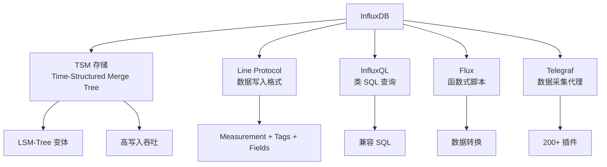

# InfluxDB 项目概览

## 学习目标

- 了解 InfluxDB 作为时序数据库的定位
- 掌握 InfluxDB 的数据模型和 Line Protocol

## 项目定位

> InfluxDB 是一个专为时序数据设计的开源数据库，具有高写入吞吐和强大的查询能力。

**基本信息**：
- 开发方：InfluxData Inc.
- 首次发布：2013 年
- 开源协议：MIT
- GitHub Stars：约 28k

## 核心设计



## 数据模型

```influx
# Line Protocol 格式
# measurement,tag1=value1,tag2=value2 field1=value1,field2=value2 timestamp

# 示例
temperature,sensor_id=1,location=beijing value=22.5 1700000000000000000
humidity,sensor_id=1,location=beijing value=60.0 1700000000000000000

# 说明
# measurement: 表名
# tags: 索引列（字符串，低基数）
# fields: 数据列（数值，高基数）
# timestamp: 纳秒级时间戳
```

## 要点总结

- TSM 存储引擎基于 LSM-Tree
- Line Protocol 简洁高效
- InfluxQL 类 SQL 易学
- Telegraf 提供丰富数据源

## 思考题

1. InfluxDB 的 TSM 与标准 LSM-Tree 有何不同？
2. Tags 和 Fields 在存储和查询上有何区别？
3. InfluxDB 的连续查询与 TimescaleDB 的连续聚合有何异同？