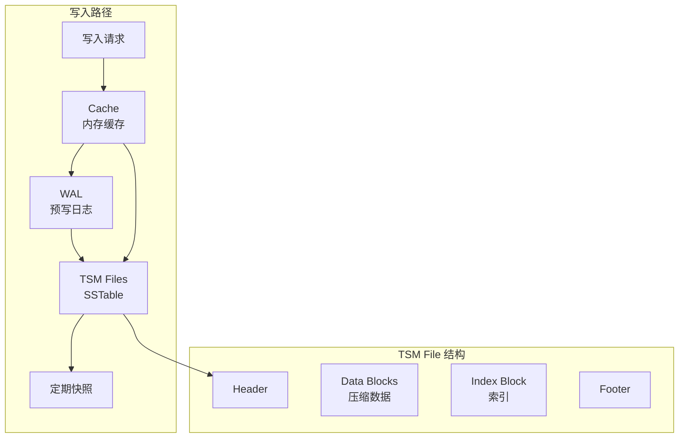
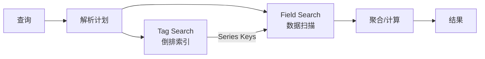

# InfluxDB 架构设计

## 学习目标

- 理解 InfluxDB 的 TSM 存储引擎
- 掌握 InfluxDB 的写入和查询流程

## TSM 存储引擎



## TSM vs LSM-Tree

| 特性 | LSM-Tree | TSM |
|------|----------|-----|
| 索引 | 行键索引 | Series Key 索引 |
| 数据块 | 按行组织 | 按时间块组织 |
| 压缩 | 通用压缩 | 时间序列专用压缩 |
| 删除 | 墓碑标记 | 批处理删除 |

## 查询执行



## 连续查询

```sql
-- 创建连续查询
CREATE CONTINUOUS QUERY "cpu_avg" ON "mydb"
BEGIN
    SELECT mean(cpu) INTO "cpu_avg"
    FROM "cpu"
    GROUP BY time(1m), host
END;

-- 效果：每分钟自动计算平均值
```

## 要点总结

- TSM 是 LSM-Tree 的时序优化变体
- Cache + WAL 保证写入持久性
- 倒排索引加速 Tag 查询
- 连续查询自动数据聚合