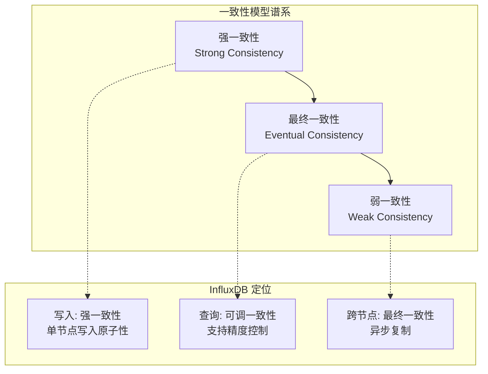
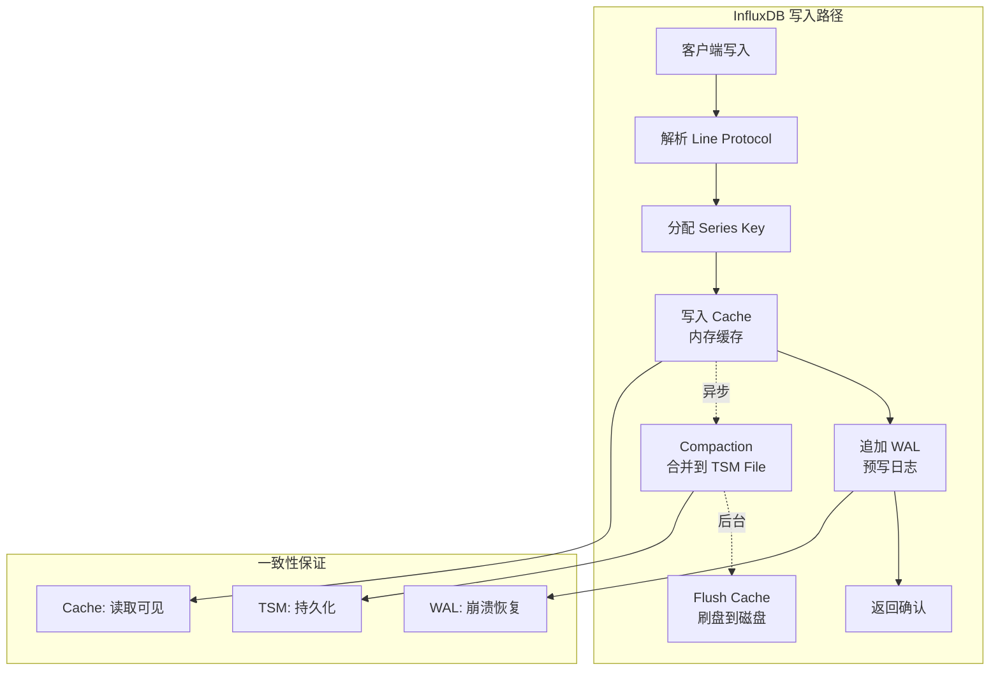
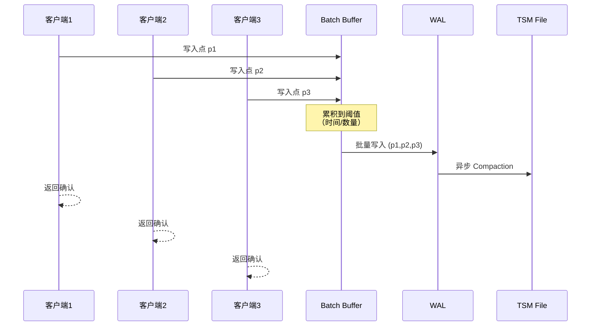
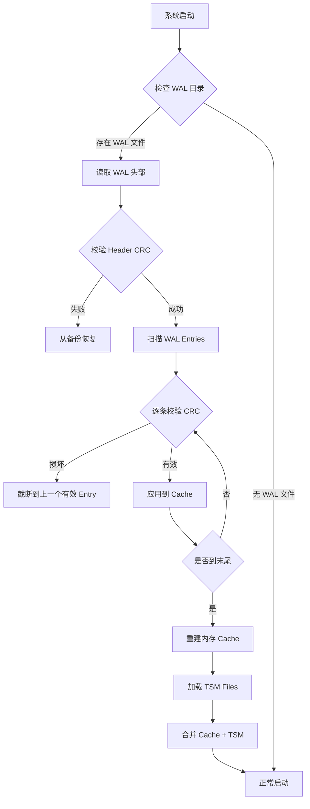

# InfluxDB 事务与一致性模型

## 学习目标

- 理解时序数据库的一致性模型特点
- 掌握 InfluxDB 的写入一致性保证机制
- 了解 WAL 与数据完整性保障
- 关联项目 `wal.c`/`wal_buf.c` 模块设计

## 时序数据库的一致性模型

时序数据库的特殊性决定了其一致性模型与传统关系数据库有显著差异。

### 一致性模型分类



### 三种一致性模型对比

| 特性 | 弱一致性 | 最终一致性 | 强一致性 |
|------|----------|------------|----------|
| **读取可见性** | 立即可见 | 延迟可见 | 立即可见 |
| **写入延迟** | 最低 | 中等 | 较高 |
| **写入可用性** | 最高 | 高 | 较低 |
| **数据完整性** | 最低 | 中等 | 最高 |
| **适用场景** | 监控告警 | 离线分析 | 金融交易 |
| **InfluxDB 支持** | 配置可选 | 默认行为 | 单节点保证 |

### InfluxDB 的一致性权衡

**时序场景的特点**：
1. **写入密集**：每秒百万级数据点写入
2. **时间有序**：数据按时间戳严格递增
3. **查询模式**：范围查询 + 聚合分析
4. **容错优先**：允许少量数据丢失换取写入吞吐

**InfluxDB 的设计选择**：

```
写入优先级：吞吐 > 一致性 > 延迟

理由：
- 监控场景下，丢失 1% 数据不影响趋势分析
- 时间序列天然有序，冲突检测简单
- 批量写入减少 I/O 次数，提升吞吐
```

## 写入一致性

### 写入路径与一致性保证



### Quorum 写入机制

InfluxDB 在集群模式下支持 Quorum 写入配置：

```
# 写入一致性级别
# any: 写入 WAL 即返回（最快，可能丢失）
# one: 写入至少一个节点（默认）
# quorum: 写入多数节点（需要副本数 N/2+1）
# all: 写入所有节点（最慢，最安全）

WRITE CONSISTENCY=quorum
```

**Quorum 计算公式**：

```
W + R > N

其中：
- W = 写入副本数
- R = 读取副本数
- N = 总副本数

例如 N=3, W=2, R=2：
- 写入需要 2 个节点确认
- 读取需要 2 个节点响应
- 保证读取到最新写入
```

### 批量提交优化

InfluxDB 采用批量提交策略提升吞吐：



**批量提交参数**：

```toml
# influxdb.conf

[data]
  # 批量大小阈值
  batch-size = 5000

  # 批量超时时间（毫秒）
  batch-timeout = 100

  # 缓存大小上限
  cache-max-memory-size = "1g"

  # WAL 刷盘策略
  wal-fsync-delay = "0s"  # 0 表示立即刷盘
```

### 写入原子性保证

InfluxDB 保证单个批次的写入原子性：

```
原子性保证：
1. 单批次内的所有点要么全部写入成功，要么全部失败
2. 失败时返回错误码，客户端可重试
3. WAL 记录保证崩溃恢复后的数据完整性

非原子性场景：
- 跨批次不保证原子性
- 跨 Measurement 不保证事务性
- 跨节点复制是异步的
```

## 数据完整性保证

### WAL 预写日志

InfluxDB 的 WAL 是数据完整性的核心保障：

```mermaid
graph TB
    subgraph "WAL 结构"
        A[WAL File] --> B[Entry 1<br/>Type|CRC|Data]
        A --> C[Entry 2<br/>Type|CRC|Data]
        A --> D[Entry N<br/>Type|CRC|Data]
    end

    subgraph "Entry 类型"
        E[write: 数据写入]
        F[delete: 删除标记]
        G[range-delete: 范围删除]
        H[checkpoint: 检查点]
    end

    B --> E
    C --> F
    D --> G
```

### Checksum 校验机制

每条 WAL 记录包含 CRC32 校验和：

```
WAL Entry 结构：
┌─────────────────────────────────────────┐
│ Type (1 byte)                           │
├─────────────────────────────────────────┤
│ Length (4 bytes, varint)                │
├─────────────────────────────────────────┤
│ Data (变长)                              │
├─────────────────────────────────────────┤
│ CRC32 (4 bytes)                         │
└─────────────────────────────────────────┘

校验流程：
1. 写入时：计算 Data 的 CRC32，追加到 Entry
2. 读取时：重新计算 CRC32，与存储值比对
3. 不匹配时：Entry 损坏，从上一个 Checkpoint 恢复
```

### TSM 文件完整性

TSM 文件的完整性保障：

```
TSM File 结构：
┌─────────────────────────────────────────┐
│ Header (4 bytes magic + 4 bytes version)│
├─────────────────────────────────────────┤
│ Data Blocks (压缩)                       │
│   - 每块包含 CRC 校验                    │
│   - 块内数据 XOR 压缩                    │
├─────────────────────────────────────────┤
│ Index Block (索引)                       │
│   - Series Key → Block 偏移             │
├─────────────────────────────────────────┤
│ Footer                                   │
│   - Index 偏移                           │
│   - CRC32 整体校验                       │
└─────────────────────────────────────────┘
```

### 崩溃恢复流程



## 与项目 wal.c/wal_buf.c 的关联

### 架构对比

| 维度 | InfluxDB WAL | 项目 wal.c |
|------|--------------|------------|
| **文件格式** | 自定义 Entry 序列 | 统一 Header + Record 结构 |
| **校验机制** | CRC32 | CRC32（`checksum` 字段） |
| **日志类型** | write/delete/checkpoint | UPDATE/INSERT/DELETE/COMMIT 等 7 种 |
| **恢复机制** | 重放 WAL 重建 Cache | `wal_redo()` + `wal_undo()` |
| **协调层** | 内置于 TSM Engine | 独立 `wal_buf.c` 模块 |

### 核心设计相似点

**1. 预写日志协议（Write-Ahead Logging）**

```c
// 项目 wal.h 的设计原则
// 与 InfluxDB 一致：日志先于数据刷盘

/**
 * @brief 事务提交前刷日志
 * @note 确保事务的所有日志都已刷到磁盘
 */
int wal_buf_commit(wal_buf_t *wb, uint32_t txn_id);
```

**2. LSN 日志序列号**

```c
// 项目 wal.h 的 LSN 设计

typedef struct wal_record_header_s {
    uint64_t lsn;            /**< 日志序列号（与 InfluxDB 类似） */
    uint32_t txn_id;         /**< 事务ID */
    uint32_t prev_lsn;       /**< 上一条日志的 LSN（链表结构） */
    uint32_t checksum;       /**< 记录校验和（CRC32） */
} wal_record_header_t;

// InfluxDB 同样使用 LSN 实现日志顺序性和恢复点定位
```

**3. 检查点机制**

```c
// 项目 wal.h 的检查点设计

/**
 * @brief 写入检查点日志
 * @param dirty_pages 脏页列表（与 InfluxDB 的 checkpoint 类似）
 */
uint64_t wal_write_checkpoint(wal_t *wal,
                               const uint32_t *dirty_pages,
                               size_t num_pages);

// InfluxDB 的 checkpoint 同样记录恢复起点
```

### 项目可借鉴的设计

**1. 批量写入优化**

```c
// 项目当前：单条写入
uint64_t wal_write_insert(wal_t *wal, uint32_t txn_id, ...);

// 可借鉴 InfluxDB：批量写入
typedef struct wal_batch_entry_s {
    wal_log_type_t type;
    void          *key;
    size_t         key_len;
    void          *value;
    size_t         value_len;
} wal_batch_entry_t;

/**
 * @brief 批量写入日志（减少 I/O 次数）
 */
uint64_t wal_write_batch(wal_t *wal, uint32_t txn_id,
                         const wal_batch_entry_t *entries,
                         size_t num_entries);
```

**2. WAL 文件轮转**

```c
// InfluxDB：按大小和时间轮转 WAL 文件
// 项目可借鉴：

#define WAL_MAX_FILE_SIZE (64 * 1024 * 1024)  // 已有定义
#define WAL_MAX_AGE_MS (10 * 60 * 1000)       // 新增：文件最大年龄

typedef struct wal_rotation_config_s {
    uint64_t max_file_size;    // 最大文件大小
    uint64_t max_age_ms;       // 最大文件年龄
    uint32_t keep_files;       // 保留的历史文件数
} wal_rotation_config_t;
```

**3. 缓冲层协调**

```c
// 项目 wal_buf.h 已实现类似 InfluxDB 的 Cache-WAL 协调

struct wal_buf_s {
    wal_t      *wal;               /**< WAL 句柄 */
    void       *buffer_pool;       /**< Buffer Pool 指针 */

    /* 脏页追踪（类似 InfluxDB 的 dirty entries 追踪） */
    uint32_t    dirty_count;
    uint32_t   *dirty_pages;

    /* LSN 追踪（类似 InfluxDB 的 wal-segment-index） */
    uint64_t    last_flush_lsn;
    uint64_t    oldest_dirty_lsn;
};
```

### 设计差异与改进空间

| 方面 | 项目现状 | InfluxDB 做法 | 改进建议 |
|------|----------|--------------|----------|
| **写入批次** | 单条写入 | 批量聚合 | 增加 `wal_write_batch()` |
| **压缩算法** | 无压缩 | XOR/Snappy | 为时序数据增加专用压缩 |
| **WAL 轮转** | 手动管理 | 自动轮转 | 增加轮转配置和自动管理 |
| **恢复粒度** | 全量恢复 | 增量恢复 | 增加 segment-level 恢复 |

## 要点总结

1. **时序数据库一致性权衡**：吞吐优先，允许弱一致性换取高写入性能
2. **InfluxDB 写入一致性**：单节点强一致，跨节点最终一致，支持 Quorum 配置
3. **WAL 是完整性基石**：Checksum 校验 + 批量提交 + 崩溃恢复保证数据不丢失
4. **项目关联**：`wal.c` 的 LSN/Checksum/Checkpoint 设计与 InfluxDB 高度一致
5. **改进空间**：批量写入、专用压缩、自动轮转可借鉴 InfluxDB 优化

## 思考题

1. 为什么时序数据库通常选择最终一致性而非强一致性？这种选择在什么场景下不合适？
2. InfluxDB 的 Quorum 写入机制（W + R > N）与 CAP 理论有什么关系？
3. 项目的 `wal_buf.c` 中的 `wal_buf_commit()` 为什么要确保"日志先于数据刷盘"？
4. 如果要在项目中实现 InfluxDB 风格的批量写入优化，需要修改哪些接口？可能带来什么问题？
5. 对比项目的 WAL 恢复流程（`wal_redo`/`wal_undo`）与 InfluxDB 的崩溃恢复，哪种设计更适合时序场景？