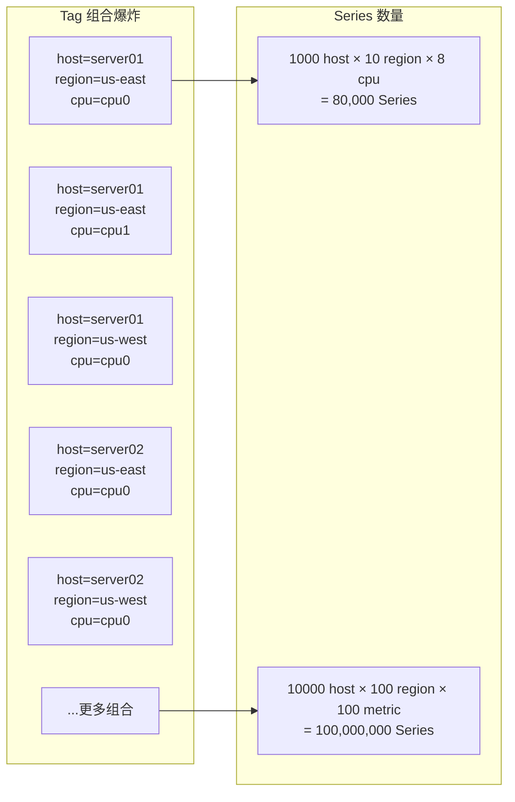
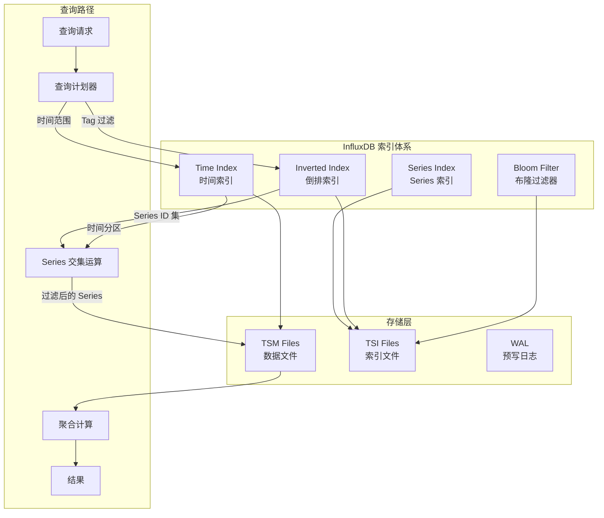
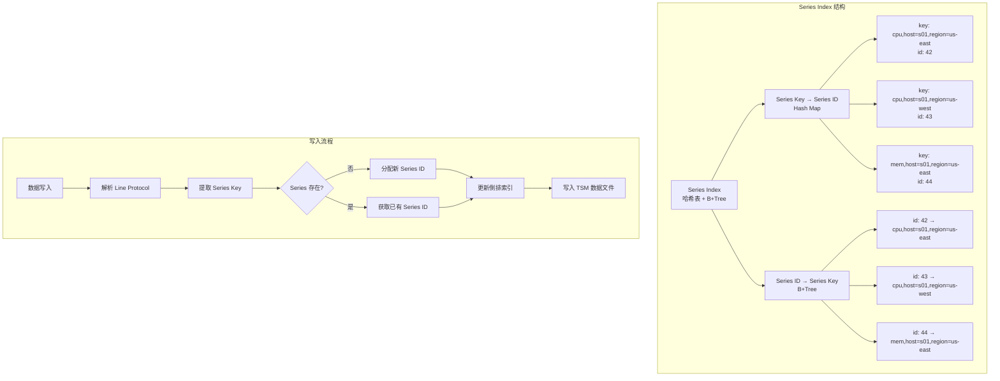
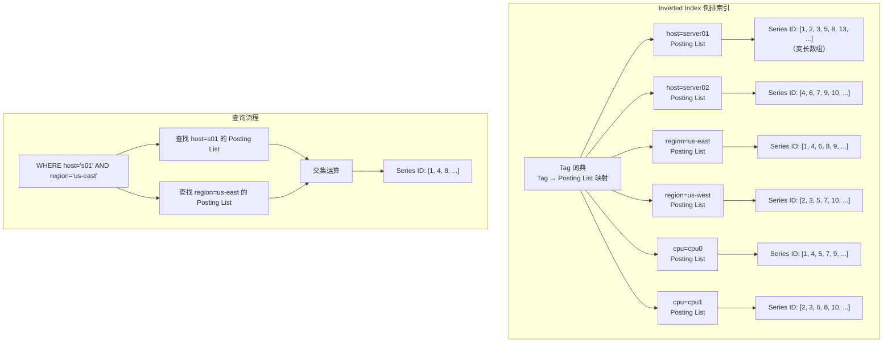
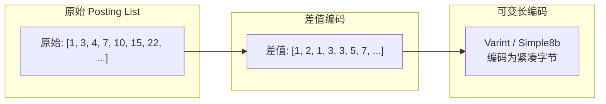
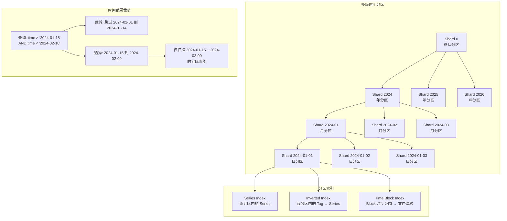
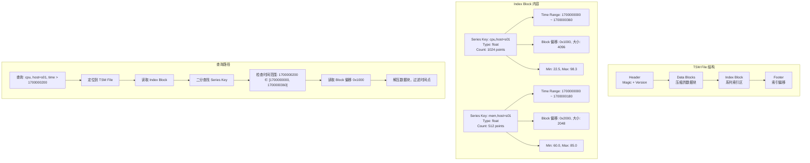
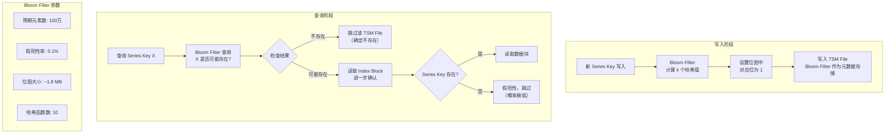
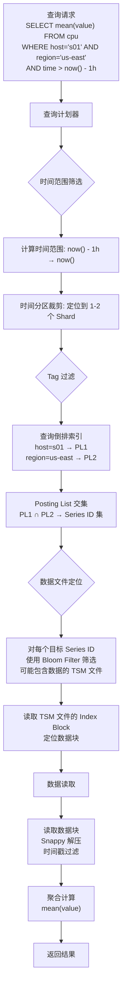

# InfluxDB 索引策略

## 学习目标

- 理解时序数据库索引设计的核心挑战与独特需求
- 掌握 InfluxDB 的时间索引、倒排索引和 Series 索引体系
- 了解多级时间分区索引的层次结构与查询路径
- 学习布隆过滤器在时序索引中的应用场景
- 对比项目 index/ 模块（BTree / Hash / Bitmap）与 InfluxDB 索引的异同

## 核心概念

- **Series（时间序列）**：由 measurement + tags + field key 唯一标识的数据流，是 InfluxDB 索引的基本单元
- **Series Key**：唯一标识一个时间序列的字符串，格式为 `measurement,tag1=val1,tag2=val2`，是倒排索引的文档 ID
- **倒排索引（Inverted Index）**：以 Tag 为词条，映射到包含该 Tag 的 Series Key 列表，用于加速 Tag 过滤查询
- **时间分区索引（Time Partition Index）**：按时间范围对数据进行分片，每个分区内维护独立的索引结构，缩小查询范围
- **Series 索引（Series Index）**：维护所有活跃 Series Key 的全局字典，用于写入时快速确定 Series ID
- **布隆过滤器（Bloom Filter）**：概率性数据结构，用于快速判断 Series Key 是否存在，减少不必要的磁盘 I/O

## 时序数据库索引设计的核心挑战

### 1. 高基数问题

时序数据的 Tag 组合爆炸导致 Series 数量巨大（百万级甚至亿级），传统 B+Tree 索引无法高效管理。



### 2. 时间维度优先

时序查询的核心模式是以时间范围为第一过滤条件，索引必须支持高效的时间范围裁剪。

### 3. 写入密集

时序数据以追加写入为主，索引必须支持高吞吐写入，避免写入放大。

### 4. 查询模式多样

| 查询类型 | 示例 | 索引需求 |
|----------|------|----------|
| 时间范围查询 | `WHERE time > now() - 1h` | 时间分区裁剪 |
| Tag 过滤 | `WHERE host = 'server01'` | 倒排索引 |
| 混合查询 | `WHERE time > 1h AND host = 's1'` | 倒排 + 时间裁剪 |
| 聚合查询 | `SELECT mean(value) GROUP BY region` | Series 分组 |
| 最新值查询 | `SELECT last(value) FROM cpu` | 反向时间索引 |

## InfluxDB 索引体系

### 整体架构



### 1. Series 索引

Series 索引维护所有活跃 Series Key 的全局字典，负责 Series Key 到 Series ID 的映射。

**Series Key 格式**：

```
# 完整格式
measurement,tag1=val1,tag2=val2 field_key

# 示例
cpu,host=server01,region=us-east usage_user
```

**Series 索引结构**：



**Series 索引的特点**：

- 使用哈希表实现 Series Key → Series ID 的快速查找（O(1)）
- 使用 B+Tree 实现 Series ID → Series Key 的范围查询
- 新 Series 首次写入时自动注册，无需 DDL 操作
- 支持 Series 的创建和删除，删除后标记为已删除

### 2. 倒排索引（Tag 索引）

倒排索引以 Tag Key:Value 为词条，映射到包含该 Tag 的 Series ID 列表，用于加速 Tag 过滤查询。

**倒排索引结构**：



**倒排索引的存储格式**：

| 组件 | 存储结构 | 说明 |
|------|----------|------|
| Tag 词典 | 哈希表或 B+Tree | Tag Key:Value 到 Posting List 位置的映射 |
| Posting List | 变长数组（Snappy 压缩） | 存储 Series ID 列表，按 ID 升序排列 |
| 跳表索引 | 在 Posting List 上建立 | 加速 Posting List 内的二分查找和交集运算 |

**Posting List 压缩**：



**多点查询的交集运算**：

```mermaid
flowchart TD
    Q["Tag 条件: host='s01' AND region='us-east' AND cpu='cpu0'"]
    Q --> L1["加载 PL(host=s01): [1, 3, 5, 7, 9, 11, ...]"]
    Q --> L2["加载 PL(region=us-east): [1, 4, 6, 8, 9, 12, ...]"]
    Q --> L3["加载 PL(cpu=cpu0): [1, 2, 5, 8, 9, 10, ...]"]
    
    L1 --> S1{"选择最短的 PL<br/>作为驱动表"}
    L2 --> S1
    L3 --> S1
    
    S1 -->|PL(host=s01) 最短| S2["驱动: PL(host=s01)<br/>遍历检查是否在<br/>其他 PL 中"]
    S2 --> S3["遍历 PL(host=s01):<br/>1 → 在 PL(cpu) 中? 在 PL(region) 中?<br/>→ 加入结果集"]
    S3 --> S4["下一个: 3 → 不在 PL(region) 中? 跳过"]
    S4 --> S5["下一个: 5 → 在 PL(cpu) 中? 在 PL(region) 中?<br/>→ 加入结果集"]
    S5 --> R["最终 Series ID 集: [1, 5, 9, ...]"]
```

### 3. 多级时间分区索引

时序数据按时间分区，每个分区内维护独立的索引，实现查询时的时间范围裁剪。

**时间分区层次**：



**TSM 文件内部的时间索引**：



### 4. 布隆过滤器在时序索引中的应用

布隆过滤器用于快速判断 Series Key 是否存在于某个数据文件中，避免不必要的文件读取。

**布隆过滤器在写入和查询中的位置**：



**InfluxDB 中 Bloom Filter 的存储位置**：

| 位置 | 用途 | 粒度 |
|------|------|------|
| TSM File 头部 | 存储该文件包含的所有 Series Key 的 Bloom Filter | 文件级 |
| TSI File 头部 | 存储该索引文件包含的所有 Tag 的 Bloom Filter | 文件级 |
| WAL 缓存 | 内存中的 Bloom Filter，防止重复写入 | 内存级 |

**布隆过滤器 vs 精确索引**：

| 特性 | Bloom Filter | 精确索引（B+Tree / Hash） |
|------|-------------|--------------------------|
| 空间占用 | 位图，约 1.8 MB/100万元素 | 树/哈希表，约 10-50 MB/100万元素 |
| 查询速度 | O(k)，常数级 | O(log n) 或 O(1) 平均值 |
| 确定性 | 概率性（有假阳性） | 确定性 |
| 删除支持 | 不支持（标准 Bloom Filter） | 支持 |
| 适用场景 | 快速排除不存在的元素 | 精确查找和范围查询 |

### 5. 查询路径全流程



## 与项目 index/ 模块的对比

本项目 index/ 模块（位于 `engineering/include/db/index/`）包含丰富的索引实现，下表从时序场景角度对比 InfluxDB 的索引策略与项目中的索引类型。

### 核心索引对比

| 维度 | InfluxDB 索引 | 项目 BTree (`db/index/btree`) | 项目 Hash (`db/index/hash`) | 项目 Bitmap (`db/index/bitmap`) |
|------|--------------|-------------------------------|-----------------------------|-------------------------------|
| 数据结构 | 倒排索引 + 哈希表 + B+Tree | B-Tree（有序键值对） | 哈希表（扩展哈希/Cuckoo/CCEH） | 位图索引 |
| 用途 | Series Key 映射 + Tag 过滤 | 通用有序索引 | 等值查找 | 集合运算 |
| 有序性 | 部分有序（时间分区内） | 全有序 | 无序 | 无序 |
| 时间范围查询 | 直接支持（时间分区裁剪） | 支持（范围扫描） | 不支持 | 不支持 |
| 多标签联合查询 | 倒排索引交集运算 | 复合索引前缀匹配 | 多键查询需多次查找 | 位图 AND/OR 运算 |
| 写入性能 | 高（追加写入 + 批量合并） | 中等（随机插入可能分裂） | 高（O(1) 插入） | 中等（位图更新） |
| 压缩 | Snappy + 差值编码 | 无/页级压缩 | 无 | 位图压缩（WAH/RLB） |
| 高基数支持 | 优秀（Posting List 压缩） | 差（树膨胀） | 中等（哈希冲突） | 差（位图稀疏） |

### 索引类型用途匹配

| 项目场景 | 推荐索引类型 | 对应 InfluxDB 索引 |
|----------|-------------|-------------------|
| Series Key → Series ID 映射 | **Hash**（CCEH / PG_Hash） | Series Index 哈希表 |
| Series ID → Series Key 排序 | **BTree** | Series Index B+Tree |
| Tag:Value → Series 列表 | **倒排索引**（`db/index/fulltext`） | Inverted Index |
| 时间分块内数据定位 | **BTree**（时间戳有序） | Time Index |
| 快速排除不存在文件 | **Bloom Filter**（`db/index/hash/bloom`） | TSM File Bloom Filter |
| 时间范围裁剪 | **BTree** 范围扫描 | Time Partition Index |
| 多标签集合运算 | **Bitmap**（位图 AND/OR） | Posting List 交集 |
| 空间索引（地理 Tag） | **RTree** | 不支持（需外部扩展） |

### 与项目 Bloom Filter 的对比

项目中的 Bloom Filter（`db/index/hash/bloom.h`）与 InfluxDB 使用的 Bloom Filter 在本质上是同一数据结构，但应用场景存在差异：

| 维度 | 项目 Bloom Filter | InfluxDB 中的 Bloom Filter |
|------|------------------|---------------------------|
| 配置参数 | `expected_items` + `false_positive_rate` | 同上，基于 TSM 文件大小自动计算 |
| 存储位置 | 内存使用 | 持久化到 TSM/TSI 文件头部 |
| 粒度 | 用户自定义 | 文件级（每个 TSM 文件一个） |
| 哈希函数 | 内部实现（k 个独立哈希） | 基于 MurmurHash3 的变体 |
| 主要用途 | 通用存在性判断 | 加速 Series Key 查找排除 |

### 对比总结

**InfluxDB 的优势**：
- 倒排索引天然支持多 Tag 组合查询，无需预定义复合索引
- 时间分区索引实现自动的时间范围裁剪，对时序查询友好
- Posting List 的差值编码 + 可变长压缩极大降低了高基数场景的索引空间

**项目 index/ 模块的优势**：
- BTree 支持更通用的有序键值存储和范围查询
- Hash 索引（CCEH、Cuckoo、PG_Hash）在等值查找场景性能优于倒排索引
- Bitmap 索引在低基数、确定性集合运算场景效率更高
- 支持更多索引类型（RTree、GIN、GiST、TTree、Skip List 等），覆盖更广泛的应用场景

## 要点总结

- InfluxDB 的索引体系由 **Series Index**（Series Key 映射）、**倒排索引**（Tag 过滤）和**时间分区索引**（时间范围裁剪）三部分组成
- **Series Index** 使用哈希表实现 Series Key → Series ID 的 O(1) 查找，B+Tree 实现反向映射
- **倒排索引**以 Tag Key:Value 为词条构建 Posting List，支持多 Tag 联合查询的交集运算
- Posting List 使用**差值编码 + 可变长压缩**，大幅降低高基数场景的存储空间
- **多级时间分区**（年/月/日）实现自动的时间范围裁剪，缩小查询范围
- **布隆过滤器**用于快速排除不存在的 Series Key，避免不必要的文件读取
- 项目 index/ 模块的 BTree、Hash、Bitmap 等索引类型与 InfluxDB 的索引体系各有侧重，可相互补充
- 时序数据库的索引设计核心挑战是**高基数 + 时间维度优先 + 写入密集**，InfluxDB 的倒排索引 + 时间分区方案为此提供了成熟的参考实现

## 思考题

1. InfluxDB 使用倒排索引而非 B+Tree 作为 Tag 索引，为什么在高基数场景下倒排索引优于 B+Tree？请从存储空间和查询效率两个角度分析。

2. 布隆过滤器存在假阳性率，InfluxDB 如何处理假阳性带来的误判？如果 Series Key 数量超过 Bloom Filter 的预期容量，会发生什么？

3. 在多级时间分区中，如何选择分区粒度（年/月/日/小时）？过粗和过细的分区各有什么优缺点？

4. InfluxDB 的 Posting List 交集运算使用"最短驱动表"策略，这种策略在什么情况下可能不优？能否结合项目中的 Bitmap 索引进行优化？

5. 本项目中的 Bloom Filter 实现（`db/index/hash/bloom.h`）能否直接用于加速 InfluxDB 风格的 TSM 文件查询？需要做哪些适配？