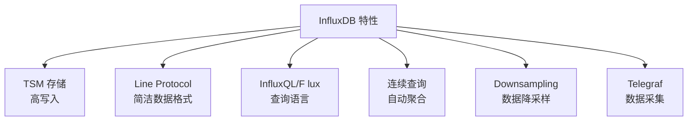

# InfluxDB 关键特性

## 特性总览



## Line Protocol

```influx
# 格式
# measurement,tag_key=tag_value field_key=field_value timestamp

# 示例
temperature,sensor_id=1,location=beijing value=22.5 1700000000000000000

# 多个字段
weather,sensor_id=1 temp=22.5,humidity=60,pressure=1013 1700000000000000000

# 精度
# 默认纳秒，可指定: s/ms/u/µ/ns
temperature,sensor_id=1 value=22.5 1700000000s
```

## InfluxQL 查询

```sql
-- 基础查询
SELECT * FROM temperature WHERE time > now() - 1h;

-- 聚合
SELECT mean(value), max(value), min(value)
FROM temperature
WHERE time > now() - 1d
GROUP BY sensor_id, time(1h);

-- 滑动窗口
SELECT mean(value)
FROM temperature
WHERE time > now() - 1h
GROUP BY sensor_id, time(5m, 2m);  -- 2m 偏移
```

## 要点总结

- TSM 存储引擎高写入吞吐
- Line Protocol 简洁高效
- InfluxQL 类 SQL 易学
- Telegraf 提供 200+ 数据源