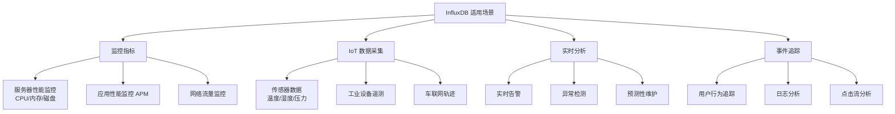
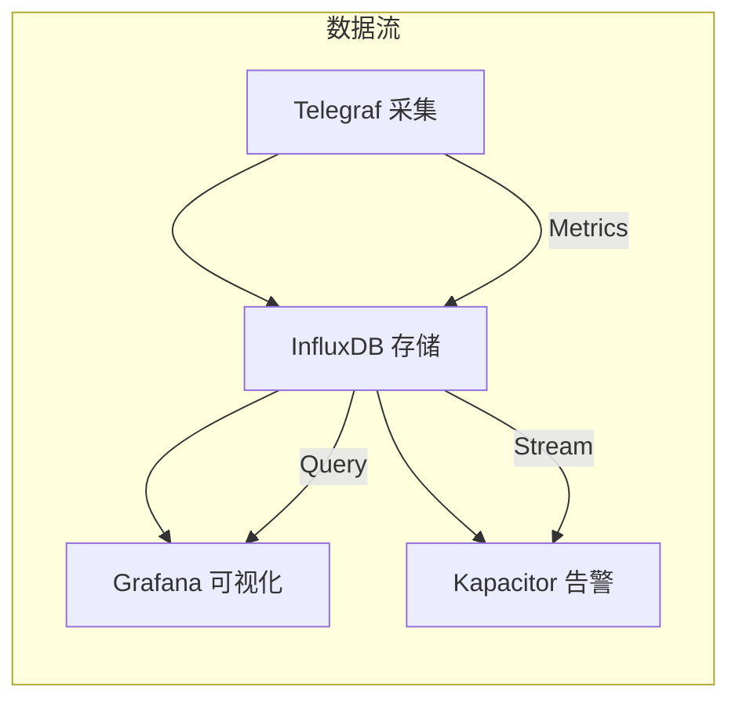
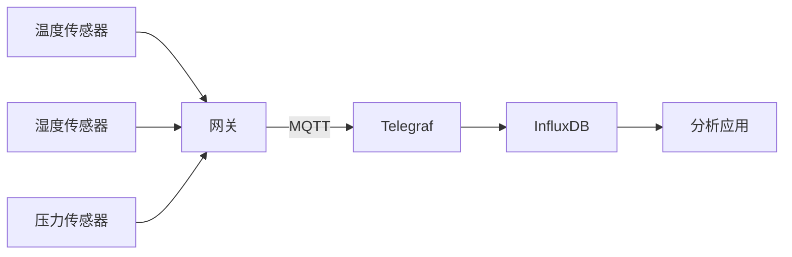
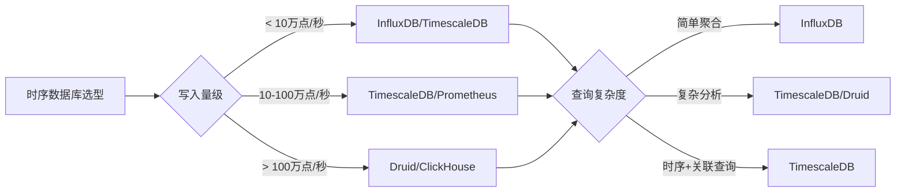
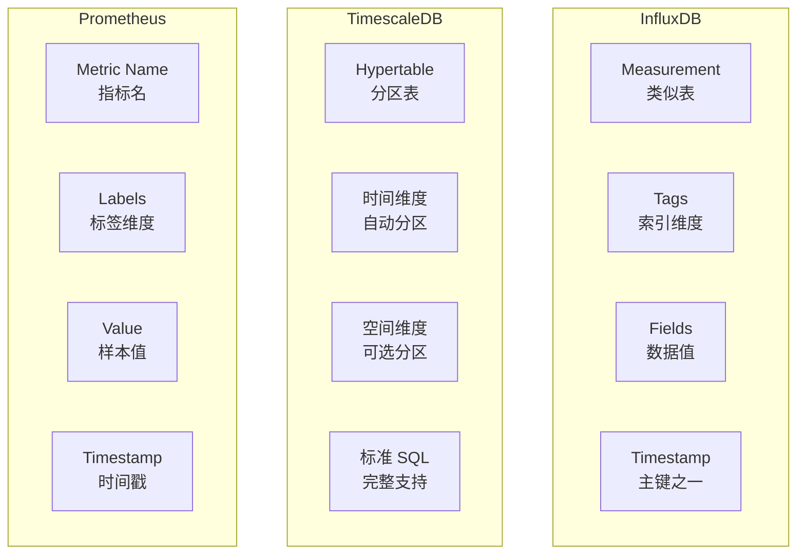
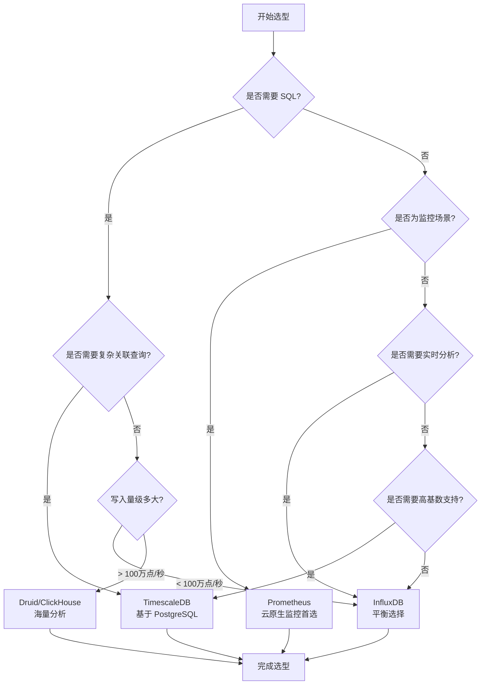

# InfluxDB 使用场景与选型对比

## 学习目标

- 理解 InfluxDB 的典型应用场景
- 掌握 InfluxDB 与其他时序数据库的选型决策
- 了解不同场景下的最佳实践

## 适用场景总览



## 场景详解

### 1. 监控指标场景



**典型架构**：TICK Stack（Telegraf + InfluxDB + Chronograf + Kapacitor）

```yaml
# telegraf.conf 示例
[[inputs.cpu]]
  percpu = true
  totalcpu = true
  collect_cpu_time = false

[[inputs.mem]]

[[outputs.influxdb]]
  urls = ["http://localhost:8086"]
  database = "monitoring"
```

**写入特点**：
- 写入频率：每 10-60 秒一次
- 数据量：每主机每秒 10-100 个指标点
- 保留策略：原始数据 7 天，降采样数据 1 年

### 2. IoT 数据采集场景



**Line Protocol 格式**：

```influx
# 温度数据
temperature,sensor_id=S001,location=workshop_a value=25.5 1700000000000000000

# 多字段记录
sensor,sensor_id=S001 temp=25.5,humidity=60,pressure=1013 1700000000000000000

# 批量写入（提升吞吐）
temperature,sensor_id=S001 value=25.0 1700000000000000000
temperature,sensor_id=S002 value=26.0 1700000000000000000
temperature,sensor_id=S003 value=24.5 1700000000000000000
```

**高基数问题应对**：

| 问题 | 影响 | 解决方案 |
|------|------|----------|
| Tag 值过多 | 索引膨胀 | 使用 Fields 存储高基数数据 |
| Series 过多 | 内存压力 | 分桶策略、限制 Tag 组合 |
| 写入瓶颈 | 吞吐下降 | 批量写入、调整 shard duration |

### 3. 实时分析场景

```sql
-- 实时聚合查询（滑动窗口）
SELECT 
    mean("cpu_usage") AS "avg_cpu",
    max("cpu_usage") AS "max_cpu",
    min("cpu_usage") AS "min_cpu"
FROM "metrics"
WHERE time > now() - 1h
GROUP BY time(5m), "host"
FILL(null)

-- 连续查询自动预聚合
CREATE CONTINUOUS QUERY "cq_5m_avg" ON "monitoring"
BEGIN
    SELECT mean(*) INTO "downsample_5m" 
    FROM "metrics" 
    GROUP BY time(5m), *
END
```

## 时序数据库对比



### 功能对比表

| 特性 | InfluxDB | TimescaleDB | Prometheus | Druid |
|------|----------|-------------|------------|-------|
| **存储引擎** | TSM | PostgreSQL 分区 | TSDB | Segment + Index |
| **查询语言** | InfluxQL/Flux | SQL | PromQL | SQL-like |
| **写入吞吐** | 高 | 高 | 中 | 极高 |
| **高基数支持** | 差 | 好 | 差 | 好 |
| **分布式** | 企业版 | 需扩展 | 需联邦 | 原生 |
| **生态** | TICK Stack | PG 生态 | Prometheus 生态 | Hadoop 生态 |
| **适用场景** | 监控/IoT | 复杂分析 | 监控告警 | 大规模分析 |
| **学习曲线** | 中 | 低（SQL） | 中 | 高 |

### 存储模型对比



## 选型决策流程



## 最佳实践

### 1. 数据模型设计

```influx
# 推荐：Tags 用于索引，Fields 用于数据
# 好的设计
measurement,tag1=value1,tag2=value2 field1=1.0,field2=2.0 timestamp

# 避免：高基数 Tag
# 错误：user_id 作为 Tag（百万用户导致 Series 爆炸）
event,user_id=U12345 action=click 1700000000
# 正确：user_id 作为 Field
event action=click,user_id="U12345" 1700000000
```

### 2. 保留策略配置

```sql
-- 创建保留策略
CREATE RETENTION POLICY "one_week" ON "monitoring" 
    DURATION 7d 
    REPLICATION 1 
    DEFAULT;

-- 降采样保留策略
CREATE RETENTION POLICY "one_year" ON "monitoring" 
    DURATION 52w 
    REPLICATION 1;

-- 连续查询自动降采样
CREATE CONTINUOUS QUERY "cq_downsample" ON "monitoring"
BEGIN
    SELECT mean(*) INTO "one_year"."downsample" 
    FROM "one_week"."metrics" 
    GROUP BY time(1h), *
END
```

### 3. 查询优化

```sql
-- 避免全表扫描
-- 差：无时间范围
SELECT * FROM "metrics";

-- 好：限定时间范围
SELECT * FROM "metrics" 
WHERE time > now() - 1h;

-- 利用 Tag 索引
SELECT mean("value") FROM "metrics"
WHERE time > now() - 1h
    AND "host" = 'server01'  -- Tag 过滤
    AND "region" = 'beijing'; -- Tag 过滤
```

## 要点总结

- InfluxDB 最适合监控、IoT、实时分析场景
- Tags 用于索引（低基数），Fields 用于数据（高基数）
- 高基数问题是 InfluxDB 的主要瓶颈，TimescaleDB 更适合此类场景
- TICK Stack 提供完整解决方案（采集、存储、可视化、告警）
- 选型核心：SQL 需求 → TimescaleDB；监控场景 → Prometheus；平衡选择 → InfluxDB

## 思考题

1. 某物联网项目有 100 万设备，每设备每分钟上报 10 个指标，应该选择 InfluxDB 还是 TimescaleDB？
2. 如何设计 Line Protocol 的 Tags 和 Fields 来避免高基数问题？
3. InfluxDB 的连续查询与 TimescaleDB 的连续聚合在实现上有什么本质区别？
